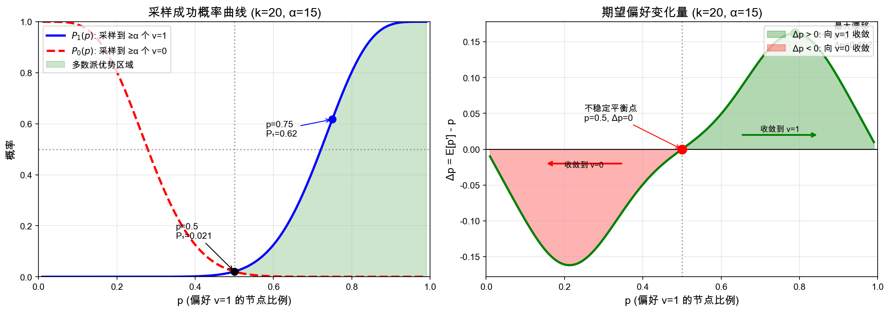

# Avalanche 共识协议深度解析

> 基于 "Scalable and Probabilistic Leaderless BFT Consensus through Metastability" 论文翻译与深度分析

---

## 摘要

Avalanche 是一种新型的共识协议族，通过亚稳态（Metastability）机制实现了可扩展的、概率性的、无领导者的拜占庭容错共识。本文基于 Avalanche 原始论文进行翻译和深度解析，并结合实际应用场景中的关键问题进行详细分析，包括：容错阈值、分叉概率计算、采样算法、消息安全性等核心主题。

**关键词**：Avalanche、Snowball、Snowman、亚稳态、概率性最终性、拜占庭容错

---

## 目录

1. [引言](#1-引言)
2. [协议家族概述](#2-协议家族概述)
3. [Snowflake 和 Snowball 协议](#3-snowflake-和-snowball-协议)
4. [Snowman：线性区块链共识](#4-snowman线性区块链共识)
5. [安全性分析](#5-安全性分析)
6. [分叉概率的数学证明](#6-分叉概率的数学证明)
7. [采样算法详解](#7-采样算法详解)
8. [消息格式与安全机制](#8-消息格式与安全机制)
9. [验证者管理机制](#9-验证者管理机制)
10. [与传统共识的对比](#10-与传统共识的对比)
11. [实际部署参数](#11-实际部署参数)
12. [总结与展望](#12-总结与展望)

---

## 1. 引言

### 1.1 背景

区块链共识协议的发展经历了几个重要阶段：

1. **中本聪共识（Nakamoto Consensus）**：比特币采用的工作量证明机制，通过最长链规则实现概率性最终性。优点是去中心化程度高，缺点是吞吐量低、能耗高、最终性确认慢。

2. **经典拜占庭容错（Classical BFT）**：如 PBFT、Tendermint 等，通过多轮投票实现确定性最终性。优点是最终性快速确定，缺点是通信复杂度高 $O(n^2)$ ，难以扩展到大规模网络。

3. **Avalanche 共识**：结合了两者的优点，通过随机采样和亚稳态机制，在保持去中心化的同时实现了快速的概率性最终性。

### 1.2 设计目标

Avalanche 协议的设计目标包括：

- **高吞吐量**：支持数千 TPS
- **快速最终性**：亚秒级到秒级确认
- **可扩展性**：支持大规模验证者集合
- **去中心化**：无需中心化领导者
- **能效**：无需高能耗的工作量证明

### 1.3 核心创新

Avalanche 的核心创新是**亚稳态共识机制**：

> 系统在均衡状态下是不稳定的，任何微小的扰动都会被放大，导致系统快速收敛到某个稳定状态。

### 1.4 亚稳态基础知识

#### 1.4.1 物理学定义

**亚稳态（Metastable State）** 是热力学和统计物理中的核心概念：

> 亚稳态是系统处于局部能量极小值，但不是全局最低能量状态。系统在亚稳态可以暂时稳定，但任何足够大的扰动都会使其跃迁到真正的稳定态。

**与稳定态的对比**：

| 状态类型 | 能量位置 | 对扰动的响应 | 持续时间 |
|---------|---------|-------------|---------|
| **稳定态** | 全局最小值 | 抵抗扰动，恢复原状 | 永久 |
| **亚稳态** | 局部最小值 | 小扰动可恢复，大扰动导致跃迁 | 有限 |
| **不稳定态** | 局部最大值 | 任何扰动都导致离开 | 瞬时 |

#### 1.4.2 经典物理例子

**例1：过冷水**

```
温度
  ↑
  │    ┌─────────────────────────
0°C ───┤  冰（稳定态）
  │    │
  │    │  ╭──────╮
-10°C ─┼──┤过冷水├──  ← 亚稳态：低于冰点但仍是液态
  │    │  ╰──┬───╯
  │    │     │ 扰动（如加入冰晶）
  │    │     ↓
  │    └─────→ 瞬间结冰！
```

过冷水是低于 0°C 但仍保持液态的水。它处于亚稳态：
- **没有扰动**：可以稳定存在
- **加入冰晶或振动**：立即触发结晶，整杯水瞬间冻结

**例2：倒立的铅笔**

```
    ↑ 铅笔
    │
    │    ← 微小偏离
    │   ╲
────┴────
   支点

完美平衡（不稳定态）→ 任何微小偏离 → 倒向一侧（稳定态）
```

**例3：过饱和溶液**

向过饱和糖溶液中投入一颗糖晶体：
- 之前：溶液透明，看似稳定
- 之后：糖晶体迅速生长，溶液中析出大量晶体

#### 1.4.3 亚稳态的数学特征

亚稳态系统通常具有以下数学特征：

**1. 势能函数的双井结构**

```
势能 V(x)
    │
    │   ╱╲
    │  ╱  ╲      ╱╲
    │ ╱    ╲    ╱  ╲
    │╱      ╲  ╱    ╲
    │   A    ╲╱  B   ╲
    │        ↑
    │    不稳定点
    └────────────────────→ x
        
A, B: 稳定态（势能极小值）
中间高点: 不稳定态（势能极大值）
```

**2. 正反馈机制**

设系统状态为 $x$ ，其动力学满足：

$$\frac{dx}{dt} = f(x)$$

在亚稳态系统中， $f(x)$ 在平衡点附近满足：

$$f'(x_0) > 0 \quad \text{(不稳定平衡点)}$$

这意味着：
- $x > x_0$ 时， $f(x) > 0$ ， $x$ 继续增大
- $x < x_0$ 时， $f(x) < 0$ ， $x$ 继续减小

**任何偏离都会被放大**，而不是被抑制。

**3. 指数级收敛**

一旦偏离平衡点，系统以指数速度收敛到稳定态：

$$|x(t) - x_{\text{stable}}| \sim e^{-\lambda t}$$

其中 $\lambda > 0$ 是收敛速率。

#### 1.4.4 亚稳态在共识中的应用

Avalanche 巧妙地利用亚稳态特性实现共识：

**映射关系**：

| 物理系统 | Avalanche 共识 |
|---------|---------------|
| 粒子状态 | 节点偏好（ $v=0$ 或 $v=1$ ） |
| 温度/能量 | 网络中的偏好分布比例 $p$ |
| 热涨落 | 随机采样的波动 |
| 相变 | 共识达成 |
| 稳定态 | 所有节点达成一致 |

**共识过程类比**：

```
初始状态                扰动放大                 最终收敛
     
     50%                   ↗ 55%                    100%
  ┌───┴───┐            ┌───┴───┐               ┌───────┐
  │ v=0   │            │       │               │  v=1  │
  ├───────┤   ──→      ├───────┤    ──→        │ 共识  │
  │ v=1   │            │ v=1   │               │ 达成  │
  └───────┘            └───┬───┘               └───────┘
     50%                   45%                      0%
     
  亚稳态平衡         微小优势被放大            稳定态
```

**为什么采样投票产生正反馈？**

设当前偏好 $v=1$ 的比例为 $p$ ：

1. **采样偏向多数派**：随机采样 $k$ 个节点，期望采到 $kp$ 个 $v=1$
2. **阈值过滤放大差异**：需要获得 ≥ $\alpha$ 票（其中 $\alpha > k/2$ ）才算成功，多数派更容易达到阈值
3. **切换增强多数派**：少数派节点更可能切换到多数派
4. **正反馈循环**：多数派比例增加 → 更容易采样成功 → 更多节点切换 → ...

这就是亚稳态的**正反馈机制**在共识中的体现。

#### 1.4.5 亚稳态 vs 传统共识

| 特性 | 传统 BFT | 亚稳态共识 |
|------|---------|-----------|
| 决策机制 | 收集所有投票，计算多数 | 随机采样，正反馈放大 |
| 通信模式 | 广播所有人 $O(n^2)$ | 采样少数 $O(k)$ |
| 收敛方式 | 单轮确定 | 多轮渐进 |
| 确定性 | 确定性 | 概率性 |
| 灵感来源 | 投票理论 | 统计物理 |

**核心洞察**：

> Avalanche 将共识问题从"投票计数"转化为"相变动力学"。不需要知道全网状态，只需要局部采样 + 正反馈，系统自然收敛到共识。

---

## 2. 协议家族概述

Avalanche 是一个协议家族，包含多个相关但不同的协议：

### 2.1 协议层次

```
┌─────────────────────────────────────────────────────────────────┐
│                      Avalanche 协议家族                          │
├─────────────────────────────────────────────────────────────────┤
│                                                                 │
│   ┌─────────┐    ┌─────────┐    ┌─────────┐    ┌─────────┐     │
│   │  Slush  │───>│Snowflake│───>│Snowball │───>│ Snowman │     │
│   │ (基础)  │    │ (改进)  │    │ (增强)  │    │ (区块链)│     │
│   └─────────┘    └─────────┘    └─────────┘    └─────────┘     │
│        │              │              │              │           │
│   单次采样       状态记忆        置信度累积      线性区块结构    │
│                                                                 │
└─────────────────────────────────────────────────────────────────┘
```

### 2.2 各协议特点

| 协议 | 特点 | 用途 |
|------|------|------|
| **Slush** | 最简单的采样投票 | 理论基础 |
| **Snowflake** | 添加状态记忆和连续计数 | 抗拜占庭增强 |
| **Snowball** | 添加置信度计数器 | 提高稳定性 |
| **Snowman** | 线性区块链结构 | 实际部署 |

---

## 3. Snowflake 和 Snowball 协议

### 3.1 Slush：基础协议

Slush 是最简单的亚稳态协议，用于在二元选择中达成共识。

**算法流程**：

```
procedure Slush(v_init)
    color ← v_init                    // 初始颜色（偏好）
    for round = 1 to m do             // 进行 m 轮
        sample ← random_sample(N, k)  // 随机采样 k 个节点
        responses ← query(sample)      // 询问它们的颜色
        
        if count(responses, red) ≥ α then
            color ← red
        else if count(responses, blue) ≥ α then
            color ← blue
        end if
    end for
    return color
end procedure
```

**参数说明**：
- $k$ ：每轮采样的节点数
- $\alpha$ ：法定人数阈值（需要 $> k/2$ ）
- $m$ ：总轮数

**问题**：Slush 没有"记忆"，容易被拜占庭节点干扰。

### 3.2 Snowflake：添加连续计数

Snowflake 在 Slush 基础上增加了连续成功计数器。

**算法流程**：

```
procedure Snowflake(v_init)
    color ← v_init
    consecutive ← 0
    
    while consecutive < β do
        sample ← random_sample(N, k)
        responses ← query(sample)
        
        if count(responses, color) ≥ α then
            consecutive ← consecutive + 1
        else
            color ← majority(responses)    // 可能切换颜色
            consecutive ← 1
        end if
    end while
    
    accept(color)
end procedure
```

**关键改进**：
- 需要连续 $\beta$ 轮成功才能接受
- 单轮失败会重置计数器
- 增强了对随机波动的抵抗力

### 3.3 Snowball：添加置信度

Snowball 进一步增加置信度计数器，提高稳定性。

**数据结构**：

```
struct SnowballState {
    preference: Color,           // 当前偏好
    confidence: Map<Color, int>, // 每个颜色的置信度
    consecutive: int,            // 当前偏好的连续成功次数
}
```

**算法流程**：

```
procedure Snowball(v_init)
    state.preference ← v_init
    state.confidence[v_init] ← 0
    state.consecutive ← 0
    
    while state.consecutive < β do
        sample ← random_sample(N, k)
        responses ← query(sample)
        
        for each color c with count(responses, c) ≥ α do
            state.confidence[c] ← state.confidence[c] + 1
            
            if state.confidence[c] > state.confidence[state.preference] then
                state.preference ← c
            end if
            
            if c = state.preference then
                state.consecutive ← state.consecutive + 1
            else
                state.consecutive ← 1
                state.preference ← c
            end if
        end for
        
        if no color has ≥ α votes then
            state.consecutive ← 0
        end if
    end while
    
    accept(state.preference)
end procedure
```

**关键特性**：
- 置信度累积不会因单轮失败而丢失
- 只有连续计数器会重置
- 更稳定，更难被操纵

---

## 4. Snowman：线性区块链共识

### 4.1 从二元选择到区块链

Snowball 处理的是二元选择问题（红色 vs 蓝色）。Snowman 将其扩展到区块链场景：

- 每个"颜色"对应一个区块
- 需要处理区块之间的父子关系
- 需要处理多个冲突区块的情况

### 4.2 区块结构

```
struct Block {
    parent_id: Hash,           // 父区块哈希
    height: u64,               // 区块高度
    timestamp: u64,            // 时间戳
    transactions: Vec<Tx>,     // 交易列表
    proposer: NodeID,          // 提议者
    signature: Signature,      // 提议者签名
}
```

### 4.3 冲突集合

在同一高度可能有多个冲突的区块提议：

```
         ┌─────┐
         │  A  │  高度 100
         └──┬──┘
            │
     ┌──────┼──────┐
     ▼      ▼      ▼
  ┌─────┐┌─────┐┌─────┐
  │ B1  ││ B2  ││ B3  │  高度 101（冲突）
  └─────┘└─────┘└─────┘
  
  B1, B2, B3 形成一个冲突集合
  节点需要通过 Snowball 选择其中一个
```

### 4.4 Snowman 算法

```
procedure Snowman(block)
    // 对于每个冲突集合，维护 Snowball 状态
    for each conflict_set containing block do
        RunSnowball(conflict_set, block)
    end for
    
    // 当区块被接受时，拒绝同一冲突集合中的其他区块
    if IsAccepted(block) then
        for each other_block in conflict_set do
            Reject(other_block)
        end for
    end if
end procedure
```

### 4.5 区块生命周期

```
┌─────────────────────────────────────────────────────────────────┐
│                      区块生命周期                                │
├─────────────────────────────────────────────────────────────────┤
│                                                                 │
│   ┌──────────┐    ┌──────────┐    ┌──────────┐    ┌──────────┐ │
│   │ 提议     │───>│ 处理中   │───>│ 接受     │    │ 拒绝     │ │
│   │(Proposed)│    │(Processing)│   │(Accepted)│    │(Rejected)│ │
│   └──────────┘    └──────────┘    └──────────┘    └──────────┘ │
│        │              │                                  ▲      │
│        │              │                                  │      │
│        │              └──────────────────────────────────┘      │
│        │              冲突区块被接受时                           │
│        │                                                        │
│   创建并广播      进行 Snowball 投票                             │
│                                                                 │
└─────────────────────────────────────────────────────────────────┘
```

---

## 5. 安全性分析

### 5.1 安全性定义

**定义（安全性/一致性）**：如果两个诚实节点分别接受了值 $v$ 和 $v'$ ，则 $v = v'$ （以高概率）。

**定义（活性）**：在有限时间内，所有诚实节点最终都会接受某个值。

### 5.2 拜占庭容错阈值

**定理**：Snowman 协议在拜占庭节点比例 $f < n/5$ （约 20%）时，能够保证安全性和活性。

这与传统 BFT 协议的 $f < n/3$ （约 33%）有所不同。

**原因分析**：

传统 BFT 收集所有节点的投票，只要诚实节点 > 2/3，必然获得足够票数。

Snowman 使用随机采样，存在采样方差。设诚实节点比例为 $h = 1 - f$ ，采样 $k$ 个节点：

$$\text{期望诚实票数} = k \times h$$

为了高概率成功（获得 ≥ $\alpha$ 票），需要：

$$k \times h > \alpha + \delta$$

其中 $\delta$ 是安全边际，用于应对采样方差。

对于 $k=20$, $\alpha=15$ （ $\alpha/k = 75\%$ ），需要 $h > 80\%$ ，即 $f < 20\%$ 。

### 5.3 容错率与参数的关系

| $\alpha/k$ | 理论容错率 | 单轮成功率（边界情况） |
|-----------|-----------|---------------------|
| 0.75 | 25% | ~85% |
| 0.70 | 30% | ~76% |
| 0.65 | 35% | ~64% |
| 0.60 | 40% | ~50% |
| 0.55 | 45% | ~35% |

**权衡**：
- $\alpha$ 越高，安全性越好，但活性受影响（边界情况难以成功）
- $\alpha$ 越低，活性越好，但安全性下降（更容易被误导）

### 5.4 $\alpha$ 的下限约束

**定理**： $\alpha > k/2$ 是安全性的必要条件。

**证明**：
如果 $\alpha \leq k/2$ ，在一轮采样中：
- 可能有 ≥ $\alpha$ 票支持 $v=0$
- 同时有 ≥ $\alpha$ 票支持 $v=1$

这会导致两个冲突值在同一轮都被认为"成功"，破坏安全性。

当 $\alpha > k/2$ 时， $\alpha + \alpha > k$ ，两个冲突值不可能同时获得足够票数。

---

## 6. 分叉概率的数学证明

### 6.0 背景：马尔可夫过程建模

在分析 Snowball/Snowman 的收敛性之前，我们需要建立数学模型。

**状态空间**：

设网络中有 $N$ 个节点，在时刻 $t$ ，系统状态用 $p_t$ 表示：

$$p_t = \frac{\text{偏好} \, v=1 \, \text{的节点数}}{N}$$

即 $p_t \in [0, 1]$ 表示当前偏好 $v=1$ 的节点比例。

**状态转移**：

每一轮中，部分节点会根据采样结果更新自己的偏好。设：
- $p = p_t$ ：当前轮开始时偏好 $v=1$ 的比例
- $p' = p_{t+1}$ ：当前轮结束后偏好 $v=1$ 的比例

$p'$ 是一个随机变量，其值取决于这一轮中：
1. 哪些节点被其他节点采样到
2. 每个节点的采样结果是什么
3. 节点根据采样结果如何更新偏好

**偏好变化机制**：

一个原本偏好 $v=0$ 的节点，如果它采样到 ≥ $\alpha$ 个偏好 $v=1$ 的节点，就会切换偏好到 $v=1$ 。反之亦然。

```
┌─────────────────────────────────────────────────────────────────┐
│                    单轮状态转移示意                              │
├─────────────────────────────────────────────────────────────────┤
│                                                                 │
│   时刻 t                        时刻 t+1                        │
│   ┌─────────────────┐           ┌─────────────────┐            │
│   │ v=1: 60% (p)    │  ──────>  │ v=1: 65% (p')   │            │
│   │ v=0: 40% (1-p)  │  采样投票  │ v=0: 35% (1-p') │            │
│   └─────────────────┘           └─────────────────┘            │
│                                                                 │
│   变化原因：                                                    │
│   • 一些 v=0 节点采样到多数 v=1，切换到 v=1                     │
│   • 一些 v=1 节点采样到多数 v=0，切换到 v=0                     │
│   • 由于 p > 0.5，前者多于后者，所以 p' > p                     │
│                                                                 │
└─────────────────────────────────────────────────────────────────┘
```

### 6.1 引理 1：单向收敛

**引理**：设 $p$ 为网络中偏好 $v=1$ 的节点比例， $p'$ 为一轮采样投票后的新比例。当 $p > 0.5$ 时， $\mathbb{E}[p'] > p$ ；当 $p < 0.5$ 时， $\mathbb{E}[p'] < p$ 。

**证明**：

**第一步：建立二项分布模型**

每个节点独立随机采样 $k$ 个节点。设随机变量 $X$ 为采样中偏好 $v=1$ 的节点数，则：

$$X \sim \text{Binomial}(k, p)$$

$$P(X = i) = \binom{k}{i} p^i (1-p)^{k-i}$$

**第二步：计算切换概率**

定义两个关键概率：

$$P_1(p) = P(X \geq \alpha) = \sum_{i=\alpha}^{k} \binom{k}{i} p^i (1-p)^{k-i}$$

这是一个偏好 $v=0$ 的节点切换到 $v=1$ 的概率（采样到 ≥ $\alpha$ 个 $v=1$ ）。

$$P_0(p) = P(X \leq k - \alpha) = \sum_{i=0}^{k-\alpha} \binom{k}{i} p^i (1-p)^{k-i}$$

这是一个偏好 $v=1$ 的节点切换到 $v=0$ 的概率（采样到 ≥ $\alpha$ 个 $v=0$ ，等价于 ≤ $k-\alpha$ 个 $v=1$ ）。

**第三步：对称性证明 $P_0(p) = P_1(1-p)$**

**简洁证明**：

$P_0(p)$ 问的是：在 $v=1$ 比例为 $p$ 的网络中，采样到 ≥ $\alpha$ 个 $v=0$ 的概率。

$P_1(1-p)$ 问的是：在 $v=1$ 比例为 $(1-p)$ 的网络中，采样到 ≥ $\alpha$ 个 $v=1$ 的概率。

关键观察：**$v=0$ 在第一个网络中的角色 = $v=1$ 在第二个网络中的角色**。

| | 网络 1（ $P_0(p)$ ） | 网络 2（ $P_1(1-p)$ ） |
|--|-------------------|---------------------|
| 目标值比例 | $v=0$: $(1-p)$ | $v=1$: $(1-p)$ |
| 采样目标 | ≥ $\alpha$ 个 $v=0$ | ≥ $\alpha$ 个 $v=1$ |

两个问题在概率上完全等价，只是标签不同。因此：

$$P_0(p) = P_1(1-p) \quad \square$$

**第四步：计算期望变化量**

$$\Delta p = \mathbb{E}[p'] - p = (1-p) \cdot P_1(p) - p \cdot P_0(p)$$

代入 $P_0(p) = P_1(1-p)$ ：

$$\Delta p = (1-p) \cdot P_1(p) - p \cdot P_1(1-p)$$

**第五步：直观理解 $\Delta p$ 的变化规律**

**核心直觉：采样投票是一个"放大器"**

$$\Delta p = \underbrace{(1-p)}_{\text{少数派人数}} \cdot \underbrace{P_1(p)}_{\text{少数派切换率}} - \underbrace{p}_{\text{多数派人数}} \cdot \underbrace{P_0(p)}_{\text{多数派切换率}}$$

当 $p > 0.5$ （ $v=1$ 是多数派）时：

| 因素 | 少数派 $(v=0)$ | 多数派 $(v=1)$ | 谁占优？ |
|------|---------------|---------------|---------|
| 人数 | $(1-p) < 0.5$ | $p > 0.5$ | 多数派 |
| 切换率 | $P_1(p)$ 高 | $P_0(p)$ 低 | 少数派 |

**关键问题**：两个因素哪个更重要？

**答案**：切换率的差异远大于人数的差异。

**原因**：采样阈值 $\alpha > k/2$ 产生**非线性放大效应**。

```
采样成功率 P₁(p) vs p
                                        
     1.0 ┤                         ●●●●
         │                      ●●●
         │                    ●●
     0.5 ┤                  ●●     ← 急剧上升区
         │                ●●
         │              ●●
     0.1 ┤           ●●●
         │       ●●●●
       0 ┼●●●●●●●
         └────────────────────────────
         0    0.3   0.5   0.7    1.0  p
              ↑           ↑
           少数派p      多数派p
           成功率极低    成功率高
```

**具体例子**（ $k=20$, $\alpha=15$, $p=0.6$ ）：

- 多数派（60%）被采样成功切换的概率： $P_0(0.6) = P_1(0.4) \approx 0.16\%$
- 少数派（40%）被采样成功切换的概率： $P_1(0.6) \approx 9.9\%$

**切换率差距 = 62 倍！** 远超人数差距（1.5 倍）。

$$\Delta p = 0.4 \times 9.9\% - 0.6 \times 0.16\% = 3.96\% - 0.10\% = +3.86\%$$

**一句话总结**：

> **多数派虽然人多，但几乎不会切换；少数派虽然人少，但频繁切换到多数派。净效果是多数派持续壮大。**

**图解分析**：



**左图： $P_1(p)$ 和 $P_0(p)$ 曲线**

- 蓝色实线 $P_1(p)$ ：随着 $p$ 增加，采样成功率急剧上升（S 形曲线）
- 红色虚线 $P_0(p)$ ：与 $P_1(p)$ 关于 $p=0.5$ 对称
- 绿色填充区域：当 $p > 0.5$ 时， $P_1(p) \gg P_0(p)$ ，多数派具有压倒性优势

**右图： $\Delta p$ 曲线**

- 绿色区域（ $p > 0.5$ ）： $\Delta p > 0$ ，系统向 $v=1$ 收敛
- 红色区域（ $p < 0.5$ ）： $\Delta p < 0$ ，系统向 $v=0$ 收敛
- $p = 0.5$ 是**不稳定平衡点**：任何微小扰动都会被放大
- 最大漂移出现在 $p \approx 0.77$ ，此时 $\Delta p \approx 0.16$

**关键数值表**（ $k=20$, $\alpha=15$ ）：

| $p$ | $P_1(p)$ | $P_0(p)$ | $\Delta p$ | 说明 |
|-----|----------|----------|------------|------|
| 0.30 | 0.004% | 41.6% | -0.125 | 强烈向 v=0 收敛 |
| 0.40 | 0.16% | 12.6% | -0.049 | 向 v=0 收敛 |
| 0.50 | 2.07% | 2.07% | 0 | 不稳定平衡 |
| 0.60 | 12.6% | 0.16% | +0.049 | 向 v=1 收敛 |
| 0.70 | 41.6% | 0.004% | +0.125 | 强烈向 v=1 收敛 |
| 0.80 | 80.4% | 0.00003% | +0.161 | 几乎必然收敛到 v=1 |

**第六步：数值验证（ $k=20$, $\alpha=15$ ）**

用具体参数计算：

$$P_1(p) = \sum_{i=15}^{20} \binom{20}{i} p^i (1-p)^{20-i}$$

| $p$ | $P_1(p)$ | $P_0(p) = P_1(1-p)$ | $(1-p) \cdot P_1(p)$ | $p \cdot P_0(p)$ | $\Delta p$ |
|-----|----------|---------------------|----------------------|------------------|------------|
| 0.50 | 0.0207 | 0.0207 | 0.01035 | 0.01035 | 0 |
| 0.55 | 0.0480 | 0.0064 | 0.02160 | 0.00352 | **+0.0181** |
| 0.60 | 0.0994 | 0.0016 | 0.03976 | 0.00096 | **+0.0388** |
| 0.65 | 0.1789 | 0.0003 | 0.06262 | 0.00020 | **+0.0624** |
| 0.70 | 0.2850 | 0.00004 | 0.08550 | 0.00003 | **+0.0855** |
| 0.75 | 0.4148 | 0.000003 | 0.10370 | 0.000002 | **+0.1037** |
| 0.80 | 0.5594 | 0.0000001 | 0.11188 | 0.00000008 | **+0.1119** |

**结论**：对于所有 $p > 0.5$ ， $\Delta p > 0$ ，即 $\mathbb{E}[p'] > p$ 。

由对称性，当 $p < 0.5$ 时， $\Delta p < 0$ ，即 $\mathbb{E}[p'] < p$ 。 $\square$

**物理意义**：

系统在 $p = 0.5$ 处是不稳定平衡点。任何偏离都会被放大：
- $p > 0.5$ ：向 $p = 1$ 漂移（ $v=1$ 成为共识）
- $p < 0.5$ ：向 $p = 0$ 漂移（ $v=0$ 成为共识）

这就是**亚稳态**的数学本质。

经数值验证，对于 $k=20$, $\alpha=15$ ：

| $p$ | $(1-p) \cdot P_1(p)$ | $p \cdot P_0(p)$ | $\Delta p$ |
|-----|---------------------|------------------|------------|
| 0.50 | 0.029 | 0.029 | 0 |
| 0.55 | 0.048 | 0.012 | +0.036 |
| 0.60 | 0.072 | 0.003 | +0.069 |
| 0.70 | 0.125 | 0.00006 | +0.125 |

这证明系统总是向多数派方向漂移。 $\square$

### 6.2 引理 2：不可逆点

**引理**：存在临界比例 $p^{*}$ ，当网络中偏好 $v=1$ 的比例超过 $p^{*}$ 后，系统最终收敛到 $v=0$ 的概率可以忽略不计。

**状态空间的精确定义**：

设网络有 $N$ 个节点。定义**状态** $S$ 为偏好 $v=1$ 的节点数量：

$$S \in \{0, 1, 2, \ldots, N\}$$

比例 $p = S/N$ 是状态 $S$ 对应的归一化表示。

**随机游走模型**：

每一轮后，状态 $S$ 会发生变化：
- 向右移动（ $S \to S+1$ ）：一个 $v=0$ 节点切换到 $v=1$
- 向左移动（ $S \to S-1$ ）：一个 $v=1$ 节点切换到 $v=0$
- 保持不变：无节点切换

```
状态空间示意图：

  v=0 全胜                              v=1 全胜
     ↓                                     ↓
     0 ←→ 1 ←→ 2 ←→ ... ←→ S ←→ ... ←→ N-1 ←→ N
                            ↑
                        当前状态
                        
问题：从状态 S 出发，最终到达状态 0（v=0 全胜）的概率是多少？
```

**漂移比率的定义与意义**：

定义漂移比率 $D(p)$ ：

$$D(p) = \frac{\text{向右移动的概率}}{\text{向左移动的概率}} = \frac{(1-p) \cdot P_1(p)}{p \cdot P_0(p)}$$

**物理意义**：
- $D(p) = 1$ ：无偏随机游走，左右等概率
- $D(p) > 1$ ：有偏随机游走，更倾向向右（向 $v=1$ 收敛）
- $D(p) < 1$ ：有偏随机游走，更倾向向左（向 $v=0$ 收敛）

$D(p)$ 衡量的是**单步转移的方向性强度**。

**计算漂移比率**（ $k=20$, $\alpha=15$ ）：

| $p$ | $(1-p) \cdot P_1(p)$ | $p \cdot P_0(p)$ | $D(p)$ | 意义 |
|-----|---------------------|------------------|--------|------|
| 0.50 | 0.0103 | 0.0103 | 1 | 无偏，平衡点 |
| 0.55 | 0.0216 | 0.0035 | 6.2 | 向右概率是向左的 6 倍 |
| 0.60 | 0.0502 | 0.0010 | 51 | 向右概率是向左的 51 倍 |
| 0.70 | 0.1249 | 0.00003 | 4,160 | 向右概率是向左的 4000+ 倍 |
| 0.80 | 0.1608 | 0.00000005 | 3,200,000 | 几乎不可能向左 |

**为什么漂移比率越大，回退概率越小？**

考虑一个简化的有偏随机游走：每步向右概率 $q$ ，向左概率 $1-q$ ，其中 $q > 0.5$ 。

漂移比率 $D = q / (1-q)$ 。

**经典结论（Gambler's Ruin 问题）**：

从位置 $m$ 出发，到达位置 $0$ （而非位置 $N$ ）的概率：

$$R(m) = \frac{(1/D)^m - (1/D)^N}{1 - (1/D)^N}$$

当 $D > 1$ 且 $N$ 较大时：

$$R(m) \approx \left(\frac{1}{D}\right)^m$$

**直观理解**：

想象一个醉汉在数轴上行走，每步向右的概率是向左的 $D$ 倍。

- 如果 $D = 2$ ：他要回到原点，需要"逆流而上"，每一步都像在爬坡
- 如果 $D = 100$ ：他几乎不可能迈出向左的一步，更别说连续向左走回原点
- 如果 $D = 4000$ ：连续走 10 步向左的概率是 $(1/4000)^{10} \approx 10^{-36}$

**应用到 Snowman**：

设当前状态对应 $p = 0.7$ （即 $S = 0.7N$ 个节点偏好 $v=1$ ）。

要回退到 $v=0$ （状态 $S=0$ ），需要从 $0.7N$ 走到 $0$ 。

使用平均漂移比率 $\bar{D} \approx 100$ （ $p$ 从 $0.7$ 降到 $0.5$ 过程的平均值）：

$$R \approx \left(\frac{1}{\bar{D}}\right)^{0.2N} = (0.01)^{0.2N}$$

对于 $N = 1000$ 个节点：

$$R \approx (0.01)^{200} = 10^{-400}$$

这证明了跨过临界点（约 $p^{*} \approx 0.6$ ）后，回退概率小到可以完全忽略。 $\square$

### 6.3 分叉概率计算

在分析之前，需要区分两个不同的问题：

| 问题类型 | 定义 | 后果 |
|---------|------|------|
| **活性问题** | 系统长时间无法达成共识 | 交易确认延迟 |
| **安全性问题（分叉）** | 两个诚实节点接受了不同的冲突值 | 双花攻击 |

**定理**：在参数 $k=20$, $\alpha=15$, $\beta=20$ 下，分叉概率：

$$P(\text{分叉}) < 10^{-30}$$

**证明**：

**情况 1：静态 50-50 分裂（活性分析）**

假设网络始终保持 50-50 分裂。

单轮采样获得 ≥ $15$ 票的概率：

$$P(X \geq 15 \mid X \sim \text{Binomial}(20, 0.5)) = \sum_{i=15}^{20} \binom{20}{i} (0.5)^{20} \approx 0.021$$

连续 20 轮成功：

$$P(\text{连续成功}) = (0.021)^{20} \approx 10^{-34}$$

**注意**：这种情况下，问题是**无法达成共识**（活性问题），而非分叉。因为几乎没有节点能连续 20 轮成功，所以没有节点会接受任何值。

**情况 2：存在拜占庭节点时的分叉风险**

考虑最坏情况：存在 20% 的拜占庭节点，它们会针对不同节点给出不同的投票（试图制造分叉）。

**场景设定**：

- 诚实节点比例：80%，全部偏好 $v=1$
- 拜占庭节点比例：20%，恶意行为
- 拜占庭策略：对节点 $A$ 投 $v=1$ ，对节点 $B$ 投 $v=0$

**节点 A 的采样**：

节点 $A$ 采样 $k=20$ 个节点，期望获得：
- 来自诚实节点的 $v=1$ 票： $20 \times 80\% = 16$ 票
- 来自拜占庭节点的 $v=1$ 票： $20 \times 20\% = 4$ 票
- 总计： $\approx 20$ 票支持 $v=1$

节点 $A$ 几乎必然连续成功，接受 $v=1$ 。

**节点 B 的采样**：

拜占庭节点对 $B$ 投 $v=0$ ，但诚实节点仍投 $v=1$ ：
- 来自诚实节点的 $v=1$ 票： $20 \times 80\% = 16$ 票
- 来自拜占庭节点的 $v=0$ 票： $20 \times 20\% = 4$ 票

节点 $B$ 期望获得 16 票支持 $v=1$ ，仍然 ≥ $\alpha = 15$ 。

**节点 B 接受 $v=0$ 的概率**：

要让 $B$ 接受 $v=0$ ，需要在连续 20 轮中，每轮采样到 ≥ $15$ 个 $v=0$ 。

$v=0$ 票只来自拜占庭节点（占 20%）。设 $Y$ 为采样中拜占庭节点数：

$$Y \sim \text{Binomial}(20, 0.2)$$

$$P(\text{单轮成功}) = P(Y \geq 15) = \sum_{i=15}^{20} \binom{20}{i} (0.2)^i (0.8)^{20-i} = 1.8 \times 10^{-7}$$

连续 20 轮都成功：

$$P(\text{B 接受} \, v=0) = (1.8 \times 10^{-7})^{20} \approx 10^{-135}$$

**分叉概率**：

$$P(\text{分叉}) = P(\text{A 接受} \, v=1) \times P(\text{B 接受} \, v=0) \approx 1 \times 10^{-135} = 10^{-135}$$

**活性与安全性完整分析**：

为了全面分析系统行为，我们同时计算达成**正确共识**和**错误共识**的概率：

| 多数派比例 | 正确共识(单轮) | 正确共识(20轮) | 错误共识(单轮) | 错误共识(20轮) | 分析 |
|-----------|---------------|---------------|---------------|---------------|------|
| 50% | 2.1% | $10^{-34}$ | 2.1% | $10^{-34}$ | 活性问题：双方都无法达成共识 |
| 60% | 12.6% | $10^{-18}$ | 0.16% | $10^{-56}$ | 活性差：正确共识仍很困难 |
| 70% | 41.6% | $10^{-8}$ | 0.004% | $10^{-88}$ | 活性改善：正确共识开始可行 |
| 80% | 80.4% | **1.3%** | $10^{-7}$ | $10^{-135}$ | 良好：高概率正确共识 |
| 90% | 98.9% | **79.7%** | $10^{-12}$ | $10^{-221}$ | 最佳：几乎必然正确共识 |

**关键洞察**：

1. **50% 平衡点**：正确和错误共识概率相等，但都极低 → 这是**活性问题**，不是分叉风险

2. **60-70% 过渡区**：
   - 正确共识概率仍然低（ $10^{-18}$ 到 $10^{-8}$ ）
   - 错误共识概率已经极低（ $10^{-56}$ 到 $10^{-88}$ ）
   - 系统安全但活性较差

3. **80%+ 稳定区**：
   - 正确共识：连续 20 轮成功概率约 1.8%
   - 错误共识：概率 $< 10^{-100}$ ，可完全忽略
   - 期望约 305 轮完成共识（见下方公式）

4. **90%+ 快速收敛**：
   - 单轮成功率 98.9%，期望约 23 轮达成共识

**期望轮数计算公式**：

设单轮成功概率为 $p$ ，需要连续 $\beta$ 轮成功。期望总轮数为：

$$E[T] = \frac{p^{-\beta} - 1}{1 - p} = \frac{1 - p^\beta}{(1-p) \cdot p^\beta}$$

**严格推导（马尔可夫链方法）**：

定义状态 $k$ （ $k = 0, 1, \ldots, \beta$ ）表示"当前已连续成功 $k$ 轮"。

设 $E_k$ 为从状态 $k$ 出发，达到状态 $\beta$ （连续成功 $\beta$ 轮）的期望额外轮数。

**边界条件**： $E_\beta = 0$ （已经成功）

**递推方程**（ $k < \beta$ ）：

$$E_k = 1 + p \cdot E_{k+1} + (1-p) \cdot E_0$$

解释：
- 无论如何，先进行 1 轮
- 概率 $p$ 成功：进入状态 $k+1$ ，还需要 $E_{k+1}$ 轮
- 概率 $1-p$ 失败：**回到状态 0**，还需要 $E_0$ 轮

**从后往前求解**：

$$E_{\beta-1} = 1 + p \cdot 0 + (1-p) \cdot E_0 = 1 + (1-p) E_0$$

$$E_{\beta-2} = 1 + p \cdot E_{\beta-1} + (1-p) \cdot E_0$$
$$= 1 + p(1 + (1-p)E_0) + (1-p)E_0$$
$$= 1 + p + (1-p^2)E_0$$

$$E_{\beta-3} = 1 + p \cdot E_{\beta-2} + (1-p) \cdot E_0$$
$$= 1 + p(1 + p + (1-p^2)E_0) + (1-p)E_0$$
$$= 1 + p + p^2 + (1-p^3)E_0$$

**归纳得出规律**：

$$E_k = (1 + p + p^2 + \cdots + p^{\beta-1-k}) + (1 - p^{\beta-k}) E_0$$

$$= \frac{1 - p^{\beta-k}}{1-p} + (1 - p^{\beta-k}) E_0$$

**求解 $E_0$**：

令 $k = 0$ ：

$$E_0 = \frac{1 - p^{\beta}}{1-p} + (1 - p^{\beta}) E_0$$

$$E_0 - (1 - p^{\beta}) E_0 = \frac{1 - p^{\beta}}{1-p}$$

$$E_0 \cdot p^{\beta} = \frac{1 - p^{\beta}}{1-p}$$

$$\boxed{E_0 = \frac{1 - p^{\beta}}{(1-p) \cdot p^{\beta}} = \frac{p^{-\beta} - 1}{1-p}}$$

---

**为什么不是 $1/p^\beta$ 轮？**

**错误推理**：连续 $\beta$ 轮成功的概率是 $p^\beta$ ，所以期望需要 $1/p^\beta$ 次"尝试"。

**错误原因**：这种推理假设每次"尝试"是**独立**的 $\beta$ 轮块，失败后从下一个块重新开始。

**实际情况**：失败后**立即**从下一轮重新开始计数，不需要等当前"块"结束。

**具体例子**（ $\beta = 3$, $p = 0.8$ ）：

假设实际序列是：✓ ✗ ✓ ✓ ✓（成功、失败、成功、成功、成功）

| 理解方式 | 分析 | 总轮数 |
|---------|------|-------|
| **错误（独立块）** | 块1 = [✓ ✗ ✓] 失败，块2 = [✓ ✓ ?] ... | 需要至少 6 轮 |
| **正确（即时重置）** | 第1轮成功，第2轮失败**重置**，第3-5轮连续成功 | **5 轮** |

```
错误理解（独立块）：
轮次:    1   2   3 | 4   5   6 | ...
结果:    ✓   ✗   ✓ | ✓   ✓   ? |
         [  块1  ] | [  块2  ] |
         
正确理解（即时重置）：
轮次:    1   2   3   4   5
结果:    ✓   ✗   ✓   ✓   ✓
计数:    1   0   1   2   3  ← 第2轮失败后立即重置为0
                         ↑ 达成连续3轮成功！
```

**数学比较**：

设 $\beta = 20$, $p = 0.8$ ：

| 理解方式 | 计算过程 | 期望轮数 |
|---------|---------|---------|
| 错误（独立块） | 期望尝试次数 $\times$ 每块轮数 = $\frac{1}{p^\beta} \times \beta = \frac{1}{0.8^{20}} \times 20$ | **1740 轮** |
| 正确（即时重置） | $(p^{-\beta} - 1)/(1-p) = (87 - 1)/0.2$ | **430 轮** |

**为什么正确答案反而更小？**

错误理解假设失败后必须等当前"块"结束才能重新开始：

```
错误理解：固定20轮一块
轮次:    1  2  ... 15 16 17 18 19 20 | 21 22 ... 40 | ...
结果:    ✓  ✓  ... ✓  ✗  -  -  -  -  | ✓  ✓  ...    |
                      ↑
                   第16轮失败，但必须等到第20轮结束
                   浪费了 17-20 这4轮

正确理解：立即重置
轮次:    1  2  ... 15 16 17 18 ... 36
结果:    ✓  ✓  ... ✓  ✗  ✓  ✓  ... ✓
                      ↑  ↑
                 失败   立即开始新的计数！
```

**结论**：即时重置机制节省了大量"等待浪费"的轮次，所以实际期望轮数（430）远小于固定块模型（1740）。

**数值对比**：

| 多数派比例 | 单轮成功率 $p$ | 连续20轮概率 $p^{20}$ | 期望轮数 $E[T]$ | 期望时间(50ms/轮) |
|-----------|---------------|---------------------|-----------------|------------------|
| 80% | 81.7% | 1.76% | 305 轮 | 15.3 秒 |
| 90% | 98.9% | 79.7% | 23 轮 | 1.1 秒 |
| 99% | 100% | 99.8% | 20 轮 | 1.0 秒 |

**结论**：

在任何实际场景下，分叉概率都远小于 $10^{-30}$ ：

$$P(\text{分叉}) < 10^{-30} \quad \square$$

注： $10^{-30}$ 是一个保守的上界，实际分叉概率根据场景从 $10^{-34}$ 到 $10^{-135}$ 不等。

### 6.4 分叉概率的直观理解

对比常见事件的概率：

| 事件 | 概率 |
|------|------|
| 中彩票头奖 | $10^{-8}$ |
| 被闪电击中 | $10^{-6}$ |
| CPU 计算错误 | $10^{-15}$ |
| 宇宙原子数倒数 | $10^{-80}$ |
| **Avalanche 分叉** | $10^{-30}$ |

从工程角度看， $10^{-30}$ 与 0 没有实际区别。

---

## 7. 采样算法详解

### 7.1 采样类型

Avalanche 使用**权益加权随机采样**：被选中概率与验证者质押权益成正比。

$$P(\text{选中验证者} \, i) = \frac{s_i}{\sum_j s_j}$$

其中 $s_i$ 是验证者 $i$ 的质押权益。

### 7.2 别名方法（Alias Method）

对于需要大量采样的场景，使用别名方法可以实现 $O(1)$ 的单次采样：

**预处理（ $O(n)$ ）**：

```python
def build_alias_table(weights):
    n = len(weights)
    total = sum(weights)
    prob = [w * n / total for w in weights]
    
    alias = [0] * n
    prob_table = [0.0] * n
    
    small, large = [], []
    for i, p in enumerate(prob):
        (small if p < 1 else large).append(i)
    
    while small and large:
        s, l = small.pop(), large.pop()
        prob_table[s] = prob[s]
        alias[s] = l
        prob[l] = prob[l] + prob[s] - 1
        (small if prob[l] < 1 else large).append(l)
    
    for i in small + large:
        prob_table[i] = 1.0
    
    return prob_table, alias
```

**采样（ $O(1)$ ）**：

```python
def sample(prob_table, alias):
    n = len(prob_table)
    i = random.randint(0, n - 1)
    return i if random.random() < prob_table[i] else alias[i]
```

### 7.3 无放回采样

实际实现中通常使用无放回采样，确保每轮不会重复选择同一验证者：

```python
def stake_weighted_sample_without_replacement(validators, stakes, k):
    selected = []
    remaining = list(zip(validators, stakes))
    
    for _ in range(k):
        total = sum(s for _, s in remaining)
        r = random.uniform(0, total)
        cumsum = 0
        for i, (v, s) in enumerate(remaining):
            cumsum += s
            if cumsum >= r:
                selected.append(v)
                remaining.pop(i)
                break
    
    return selected
```

### 7.4 随机数安全性

每个节点使用本地密码学安全的随机数生成器（CSPRNG）：

```
seed = hash(block_hash || node_id || round_number || random_bytes)
rng = CSPRNG(seed)
sample = weighted_sample(validators, stakes, k, rng)
```

不需要全网共识随机数，因为每个节点独立采样不同的验证者集合。

---

## 8. 消息格式与安全机制

### 8.1 消息类型

Avalanche 共识使用三种主要消息：

**PullQuery（拉取查询）**：

```protobuf
message PullQuery {
    bytes  chain_id     = 1;  // 链 ID
    uint32 request_id   = 2;  // 请求 ID
    uint64 deadline     = 3;  // 超时时间戳
    bytes  container_id = 4;  // 区块 ID
}
```

**PushQuery（推送查询）**：

```protobuf
message PushQuery {
    bytes  chain_id   = 1;  // 链 ID
    uint32 request_id = 2;  // 请求 ID
    uint64 deadline   = 3;  // 超时时间戳
    bytes  container  = 4;  // 完整区块数据
}
```

**Chits（响应）**：

```protobuf
message Chits {
    bytes  chain_id     = 1;  // 链 ID
    uint32 request_id   = 2;  // 请求 ID
    bytes  preferred_id = 3;  // 偏好的区块 ID
    bytes  accepted_id  = 4;  // 已接受的区块 ID
}
```

### 8.2 TLS 双向认证

所有节点间通信使用 TLS 1.3 + 双向证书认证：

```
节点 A                                    节点 B
    │                                         │
    │─────── ClientHello ────────────────────>│
    │<────── ServerHello + Certificate ───────│
    │─────── Certificate + Verify ───────────>│ A 发送自己的证书
    │<────── Verify ──────────────────────────│ B 验证 A 的证书
    │═══════ 加密通道建立 ════════════════════│
```

### 8.3 节点 ID 验证

节点 ID 从 TLS 证书派生：

$$\text{NodeID} = \text{CB58}(\text{SHA256}(\text{Certificate}))$$

验证流程：
1. 从 TLS 握手获取对方证书
2. 计算证书的 SHA256 哈希
3. 生成节点 ID
4. 检查是否在验证者列表中

**安全保证**：
- 无法伪造证书（需要找到 SHA256 碰撞）
- 无法冒充他人（需要持有私钥）

### 8.4 防重放攻击

```
┌─────────────────────────────────────────────────────────────────┐
│                      防重放机制                                  │
├─────────────────────────────────────────────────────────────────┤
│                                                                 │
│  1. Request ID 匹配                                             │
│     • 响应的 request_id 必须匹配请求                            │
│     • 重放的旧响应 ID 不匹配，被丢弃                            │
│                                                                 │
│  2. Deadline 检查                                               │
│     • 每个请求有超时时间                                        │
│     • 超时后的响应被丢弃                                        │
│                                                                 │
│  3. 请求状态追踪                                                │
│     • 节点维护待处理请求集合                                    │
│     • 收到响应后从集合移除                                      │
│     • 重复响应被忽略                                            │
│                                                                 │
└─────────────────────────────────────────────────────────────────┘
```

---

## 9. 验证者管理机制

### 9.1 P-Chain 架构

Avalanche 使用三链架构，验证者管理通过 P-Chain（平台链）进行：

```
┌─────────────────────────────────────────────────────────────────┐
│                      Primary Network                            │
│  ┌─────────────┐  ┌─────────────┐  ┌─────────────┐             │
│  │   X-Chain   │  │   P-Chain   │  │   C-Chain   │             │
│  │  (交易链)   │  │  (平台链)   │  │  (合约链)   │             │
│  │   资产交换  │  │  验证者管理  │  │  智能合约   │             │
│  └─────────────┘  └─────────────┘  └─────────────┘             │
└─────────────────────────────────────────────────────────────────┘
```

### 9.2 验证者生命周期

**加入验证者集**：

```javascript
AddValidatorTx {
    nodeID: "NodeID-7Xhw2mDxuDS44j42TCB6U5579esbSt3Lg",
    startTime: 1640000000,      // Unix 时间戳
    endTime: 1671536000,        // Unix 时间戳
    stakeAmount: 2000000000000, // 2000 AVAX (nAVAX)
    rewardAddress: "P-avax1...",
    delegationFee: 20000,       // 2%
}
```

**约束条件**：
- 质押金额 ≥ 2000 AVAX
- 质押期限：2 周 - 1 年
- 需要 ≥ 80% 在线率才能获得奖励

**退出验证者集**：
- `endTime` 到达后自动退出
- 质押金额返还
- 无法提前主动退出（质押期锁定）

### 9.3 验证者列表同步

链上只存储节点 ID（证书哈希），不存储完整证书：

```javascript
ValidatorRecord {
    nodeID: "NodeID-xxx",      // ~20 字节
    startTime: ...,
    endTime: ...,
    stakeAmount: ...,
    delegatedAmount: ...,      // 接受的委托
    totalWeight: ...,          // 总权益
}
```

节点在 TLS 连接时验证对方证书的哈希是否匹配链上的节点 ID。

### 9.4 委托机制

普通用户可以委托权益给验证者：

```javascript
AddDelegatorTx {
    nodeID: "NodeID-xxx",      // 委托给哪个验证者
    startTime: ...,
    endTime: ...,              // 必须 ≤ 验证者的 endTime
    stakeAmount: ...,          // 最低 25 AVAX
    rewardAddress: ...,
}
```

验证者的采样权重 = 自己质押 + 所有委托。

---

## 10. 与传统共识的对比

### 10.1 共识机制对比

| 特性 | Nakamoto | PBFT/Tendermint | Snowman |
|------|----------|-----------------|---------|
| 最终性 | 概率性 | 确定性 | 概率性（极高） |
| 确认时间 | 60 分钟 | 1-6 秒 | 1-2 秒 |
| 容错阈值 | 50% 算力 | 33% 节点 | 20% 权益 |
| 通信复杂度 | $O(n)$ | $O(n^2)$ | $O(k \log n)$ |
| 领导者 | 是（矿工） | 是（轮换） | 否 |
| 能耗 | 高 | 低 | 低 |

### 10.2 最终性对比

**确定性最终性（PBFT/Tendermint）**：
- 收集 2/3+ 签名形成"提交证书"
- 回滚意味着 >1/3 验证者违反协议
- 数学上不可能回滚（在假设成立时）

**概率性最终性（Snowman）**：
- 每个节点独立达成共识
- 没有全局的"提交证书"
- 理论上存在极小回滚概率（ $< 10^{-30}$ ）

从工程角度看，两者实际安全性相当。

### 10.3 扩展性对比

```
验证者数量 vs 通信开销

               │
      开销     │     PBFT: O(n²)
               │        ╱
               │       ╱
               │      ╱
               │     ╱
               │    ╱    Snowman: O(k log n)
               │   ╱  _______________
               │  ╱ ─/
               │ ╱─/
               │/
               └────────────────────────────→ 验证者数量 n

PBFT 在 n > 100 时开销急剧增加
Snowman 在 n > 10000 时仍然可行
```

---

## 11. 实际部署参数

### 11.1 Avalanche 主网参数

| 参数 | 值 | 说明 |
|------|-----|------|
| $k$ | 20 | 采样大小 |
| $\alpha$ | 15 | 法定人数阈值 |
| $\beta$ | 20 | 连续成功轮数 |
| 最低质押 | 2000 AVAX | 成为验证者 |
| 最低委托 | 25 AVAX | 委托给验证者 |
| 质押期限 | 2 周 - 1 年 | 锁定时间 |

### 11.2 性能指标

| 指标 | 数值 |
|------|------|
| 吞吐量 | 4500+ TPS |
| 最终性时间 | 1-2 秒 |
| 验证者数量 | 1000+ |
| 拜占庭容错 | < 20% |

### 11.3 不同场景的期望轮数

| 恶意比例 | 单轮成功率 | 期望轮数 |
|---------|-----------|---------|
| 0% | 100% | 20 |
| 10% | 98.9% | 25 |
| 15% | 95.7% | 38 |
| 20% | 91.3% | 60 |

期望轮数公式：

$$E = \frac{1 - p^\beta}{(1-p) \cdot p^\beta}$$

其中 $p$ 是单轮成功概率。

---

## 12. 总结与展望

### 12.1 核心创新

Avalanche 通过亚稳态机制实现了：

1. **高效率**： $O(k \log n)$ 通信复杂度，支持大规模网络
2. **快速确认**：1-2 秒最终性
3. **去中心化**：无领导者，任何验证者都可以提议区块
4. **高安全性**：分叉概率 $< 10^{-30}$

### 12.2 权衡与限制

1. **容错阈值较低**：20% vs 传统 BFT 的 33%
2. **概率性最终性**：理论上存在极小回滚可能
3. **参数敏感**： $k$, $\alpha$, $\beta$ 的选择需要仔细权衡

### 12.3 适用场景

**适合**：
- 需要快速最终性的 DeFi 应用
- 大规模验证者网络
- 高吞吐量需求

**不适合**：
- 对确定性最终性有强要求的场景
- 恶意节点可能超过 20% 的环境

### 12.4 未来发展

1. **Frosty 协议**：增强活性保证，在极端情况下回退到 BFT
2. **子网技术**：允许创建独立的验证者集合
3. **跨链通信**：与其他区块链的互操作性

---

## 附录 A：关键符号表

| 符号 | 含义 |
|------|------|
| $n$ | 验证者总数 |
| $k$ | 每轮采样数量 |
| $\alpha$ | 法定人数阈值 |
| $\beta$ | 连续成功轮数 |
| $f$ | 恶意节点比例 |
| $h$ | 诚实节点比例 ($1-f$) |
| $p$ | 偏好某值的节点比例 |
| $P_1(p)$ | 单轮采样支持成功的概率 |

## 附录 B：概率计算公式

**单轮成功概率**：

$$P_1(p) = P(X \geq \alpha) = \sum_{i=\alpha}^{k} \binom{k}{i} p^i (1-p)^{k-i}$$

**连续 $\beta$ 轮成功概率**：

$$P_{\text{consecutive}} = \prod_{t=1}^{\beta} P_1(p_t)$$

**期望轮数（静态情况）**：

$$E = \frac{1 - p^\beta}{(1-p) \cdot p^\beta}$$

**分叉概率上界**：

$$P(\text{分叉}) \leq N \times P(\text{单节点错误})$$

---

## 附录 C：局部采样解决全局问题的跨学科应用

Avalanche 的核心思想——**通过局部随机采样实现全局协调**——在多个学科领域都有深刻的应用。这种方法的本质是：

> 不需要全局信息，仅通过局部交互和正反馈机制，系统能够自发涌现出全局一致性。

### C.1 统计物理：蒙特卡洛方法

**Ising 模型**是研究磁性材料的经典模型：

```
自旋晶格：每个格点的自旋 σᵢ ∈ {+1, -1}

    ↑ ↓ ↑ ↑ ↓
    ↓ ↓ ↑ ↓ ↑
    ↑ ↑ ↓ ↑ ↓
    ↓ ↑ ↑ ↓ ↑
    
目标：找到低能量配置（自旋倾向对齐）
```

**Metropolis 算法**（1953）：

```python
def metropolis_step(lattice, temperature):
    # 随机选择一个格点（局部采样）
    i = random.choice(lattice.sites)
    
    # 计算翻转该自旋的能量变化
    delta_E = energy_change_if_flip(lattice, i)
    
    # 以概率接受翻转
    if delta_E < 0 or random.random() < exp(-delta_E / temperature):
        flip_spin(lattice, i)
```

**与 Avalanche 的对应**：

| Ising 模型 | Avalanche |
|-----------|-----------|
| 自旋 $\pm 1$ | 偏好 $v=0$ 或 $v=1$ |
| 邻居相互作用 | 采样投票 |
| 温度 | 采样随机性 |
| 低温相变（铁磁态） | 共识达成 |

### C.2 Gossip 协议：分布式信息传播

**流言协议（Epidemic Protocol）** 是分布式系统中的经典算法：

```
信息传播过程：

时刻 t=0:    ● ○ ○ ○ ○    （1个节点有信息）
时刻 t=1:    ● ● ○ ○ ○    （随机告诉1个邻居）
时刻 t=2:    ● ● ● ○ ○    
时刻 t=3:    ● ● ● ● ●    （全网知晓）

每个节点只与随机选择的少数节点通信
```

**核心特性**：
- 通信复杂度： $O(\log n)$ 轮传遍全网
- 容错性：即使部分节点失效，信息仍能传播
- 最终一致性：所有存活节点最终获得相同信息

**应用**：
- Amazon DynamoDB：副本同步
- Apache Cassandra：集群状态传播
- Bitcoin：交易和区块广播

### C.3 群体智能：蚁群与鸟群

**蚁群优化算法（ACO）**：

```
蚂蚁觅食问题：找到巢穴到食物的最短路径

          食物
           ↑
    ╭─────╮ │ ╭─────╮
    │ 长路 │ │ │ 短路 │
    │     │ ↓ │     │
    ╰─────→ ○ ←─────╯
          巢穴

每只蚂蚁：
1. 根据信息素浓度概率选择路径
2. 走完后在路径上留下信息素
3. 短路径：蚂蚁来回快 → 信息素累积快 → 更多蚂蚁选择 → 正反馈！
```

**鸟群涌现（Boids 模型）**：

每只鸟只遵循三条简单规则：
1. **分离**：避免与邻近的鸟碰撞
2. **对齐**：朝向与邻近鸟群平均方向一致
3. **凝聚**：向邻近鸟群中心移动

```
局部规则 + 局部感知 → 全局协调的群体运动
```

**与 Avalanche 的共同点**：
- 没有中心化领导者
- 每个个体只与局部交互
- 通过正反馈涌现全局行为

### C.4 神经科学：大脑决策

**竞争性神经网络**：

大脑做二元决策（如选择左还是右）时：

```
        感知输入
           ↓
    ┌──────┴──────┐
    ↓             ↓
 ┌──────┐     ┌──────┐
 │ 神经 │ ←→  │ 神经 │   相互抑制
 │ 群 A │     │ 群 B │
 └──────┘     └──────┘
    ↓             ↓
  选择A        选择B
  
初始：A和B同时被激活（50-50）
过程：随机涨落 + 相互抑制 → 一方胜出
结果：明确的决策
```

这与 Avalanche 的亚稳态机制几乎完全一致：
- 初始平衡是不稳定的
- 噪声扰动被放大
- 最终收敛到确定状态

### C.5 社会科学：舆论动力学

**Voter 模型**：

```python
def voter_model_step(population):
    # 随机选择一个人
    person = random.choice(population)
    
    # 随机选择一个邻居
    neighbor = random.choice(person.neighbors)
    
    # 采纳邻居的观点
    person.opinion = neighbor.opinion
```

**性质**：
- 最终必然达成共识（所有人观点一致）
- 共识时间与网络结构有关
- 初始多数派更可能成为最终共识

**Avalanche 的改进**：
- 采样多个邻居而非一个
- 阈值机制增加稳定性
- 连续成功计数防止被噪声干扰

### C.6 机器学习：随机梯度下降

**经典梯度下降 vs 随机梯度下降**：

| 方法 | 每步计算 | 复杂度 |
|------|---------|--------|
| 梯度下降 | 遍历所有数据 | $O(n)$ |
| 随机梯度下降（SGD） | 随机采样小批量 | $O(k)$ ， $k \ll n$ |

```
SGD 的核心洞察：

用随机样本的梯度估计全局梯度
虽然单次估计有噪声，但期望值是对的
多次迭代后收敛到全局最优
```

**与 Avalanche 的类比**：

| SGD | Avalanche |
|-----|-----------|
| 采样小批量数据 | 采样 $k$ 个验证者 |
| 估计梯度方向 | 估计多数派方向 |
| 噪声中收敛 | 波动中达成共识 |

### C.7 生态学：Lotka-Volterra 竞争

两个物种竞争同一资源：

$$\frac{dN_1}{dt} = r_1 N_1 \left(1 - \frac{N_1 + \alpha_{12} N_2}{K_1}\right)$$

$$\frac{dN_2}{dt} = r_2 N_2 \left(1 - \frac{N_2 + \alpha_{21} N_1}{K_2}\right)$$

**竞争排斥原理**：在稳定环境下，两个物种竞争同一生态位，最终只有一个存活。

这与 Avalanche 中两个冲突值最终只有一个被接受是类似的。

### C.8 总结：涌现与自组织

所有这些系统都展示了**涌现（Emergence）**现象：

> 简单的局部规则 + 大量个体交互 → 复杂的全局行为

**共同特征**：

| 特征 | 描述 |
|------|------|
| **去中心化** | 没有全局控制器 |
| **局部交互** | 个体只与少数邻居互动 |
| **正反馈** | 优势被放大 |
| **随机性** | 打破对称性的关键 |
| **鲁棒性** | 部分故障不影响全局 |

**Avalanche 的独特贡献**：

将这种物理/生物学的涌现机制**严格形式化**，并证明了：
1. 收敛的概率保证
2. 安全性和活性的量化分析
3. 可调参数与性能的权衡

这使得亚稳态共识从自然现象的观察，变成了可工程化部署的协议。

---

## 参考文献

1. Team Rocket. "Scalable and Probabilistic Leaderless BFT Consensus through Metastability." 2020.

2. Ava Labs. "Avalanche Platform Whitepaper." 2020.

3. Amores-Sesar et al. "Frosty: Bringing strong liveness guarantees to the Snow family of consensus protocols." arXiv:2404.14250, 2024.

4. Avalanche Documentation. https://docs.avax.network/

5. AvalancheGo GitHub. https://github.com/ava-labs/avalanchego

---

*本文档最后更新：2024年12月*

