# JAM (Join-Accumulate Machine) 实现原理

## 一、JAM 概述

### 1.1 什么是 JAM

JAM 是 Polkadot 的下一代协议，由 Gavin Wood 在 2024 年提出。JAM 将替代当前的中继链架构，提供更通用、更高效的多链计算平台。

**JAM = Join-Accumulate Machine（连接-累积机器）**

### 1.2 从 Polkadot 到 JAM

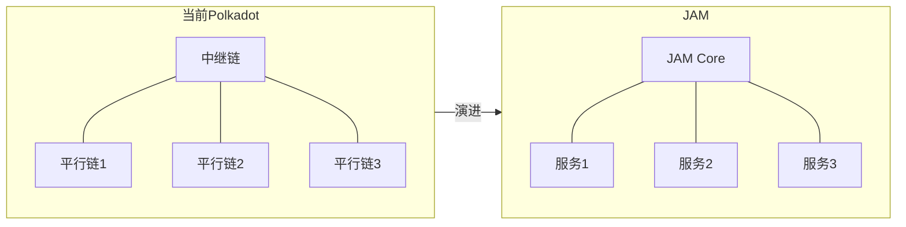

### 1.3 核心变化

| 对比项 | Polkadot 1.0 | JAM |
|--------|-------------|-----|
| **核心** | 中继链 (Relay Chain) | JAM Core |
| **应用** | 平行链 (Parachain) | 服务 (Service) |
| **插槽** | 需要竞拍 | 按需付费 |
| **灵活性** | 固定架构 | 高度通用 |

---

## 二、JAM 架构

### 2.1 三层架构

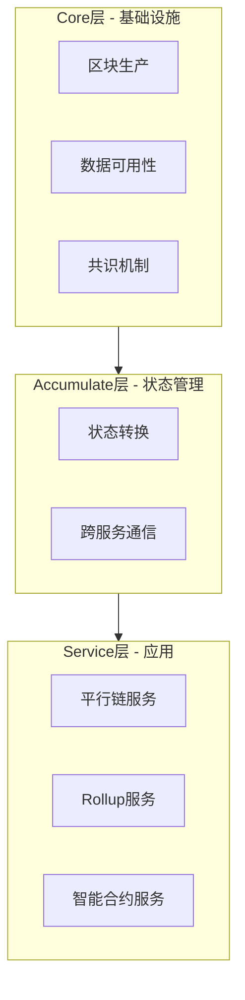

### 2.2 组件职责

| 层级 | 组件 | 职责 |
|------|------|------|
| **Core** | 区块生产 | SAFROLE 算法选举出块者 |
| **Core** | 数据可用性 | 纠删码分片存储 |
| **Core** | 共识 | GRANDPA 最终性确认 |
| **Accumulate** | 状态转换 | 执行服务的状态变更 |
| **Accumulate** | 跨服务通信 | 处理服务间消息传递 |
| **Service** | 应用逻辑 | 具体业务实现 |

---

## 三、核心执行模型

### 3.1 三阶段流程：Refine → Join → Accumulate

这是 JAM 最核心的创新。

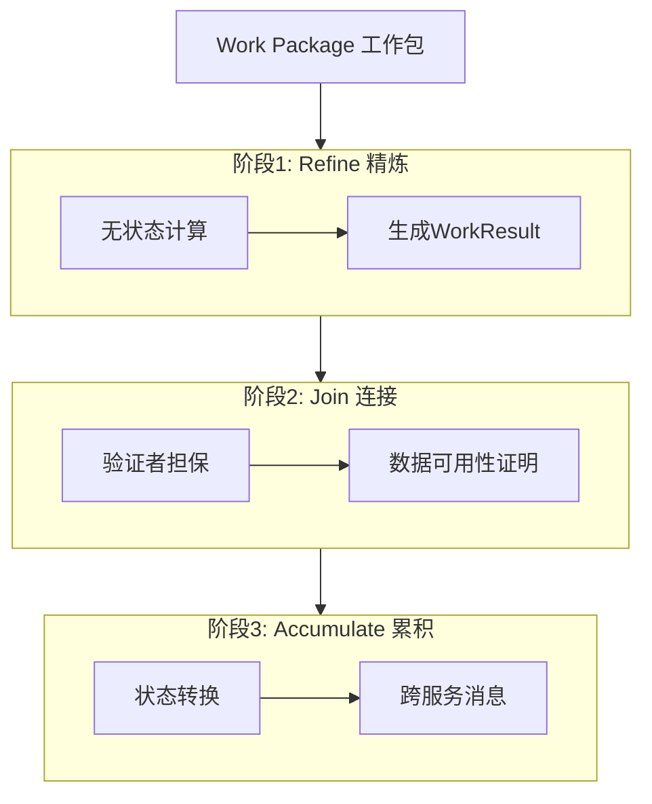

### 3.2 各阶段详解

#### 阶段 1: Refine（精炼）

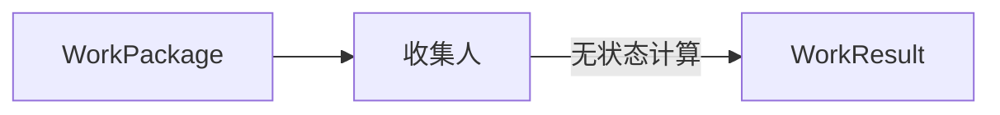

**特点：**
- 在链下执行（收集人节点）
- 纯函数，无状态依赖
- 可并行执行
- 输出确定性的 Work Result

**代码示例：**
```rust
fn refine(package: WorkPackage) -> WorkResult {
    // 纯计算，不访问任何外部状态
    let result = compute(package.data);
    WorkResult { output: result }
}
```

#### 阶段 2: Join（连接）

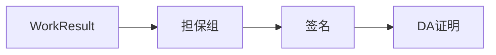

**特点：**
- 验证者组担保 Work Result 的正确性
- 生成数据可用性证明
- 确保数据可被重建

#### 阶段 3: Accumulate（累积）

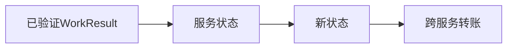

**特点：**
- 有状态执行
- 修改服务的持久化状态
- 处理跨服务消息
- 产生新的跨服务转账

**代码示例：**
```rust
fn accumulate(
    results: Vec<WorkResult>,
    incoming_transfers: Vec<Transfer>,
    state: &mut ServiceState,
) -> Vec<Transfer> {
    // 1. 处理工作结果
    for result in results {
        state.apply(result);
    }
    
    // 2. 处理收到的转账
    for transfer in incoming_transfers {
        state.credit(transfer.amount);
        state.process_data(transfer.data);
    }
    
    // 3. 返回要发出的转账
    state.pending_outgoing_transfers()
}
```

---

## 四、跨服务通信

### 4.1 通信模型

JAM 的跨服务通信是**原生的**，不需要外部桥接。

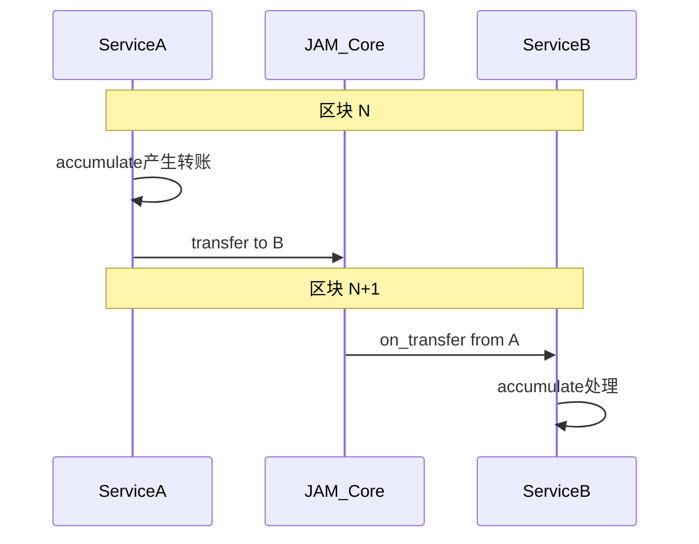

### 4.2 Transfer 结构

```rust
struct Transfer {
    source: ServiceId,      // 源服务
    destination: ServiceId, // 目标服务
    amount: Balance,        // 转账金额(用于gas)
    data: Vec<u8>,          // 携带数据
    gas_limit: Gas,         // gas限制
}
```

### 4.3 跨服务转账流程

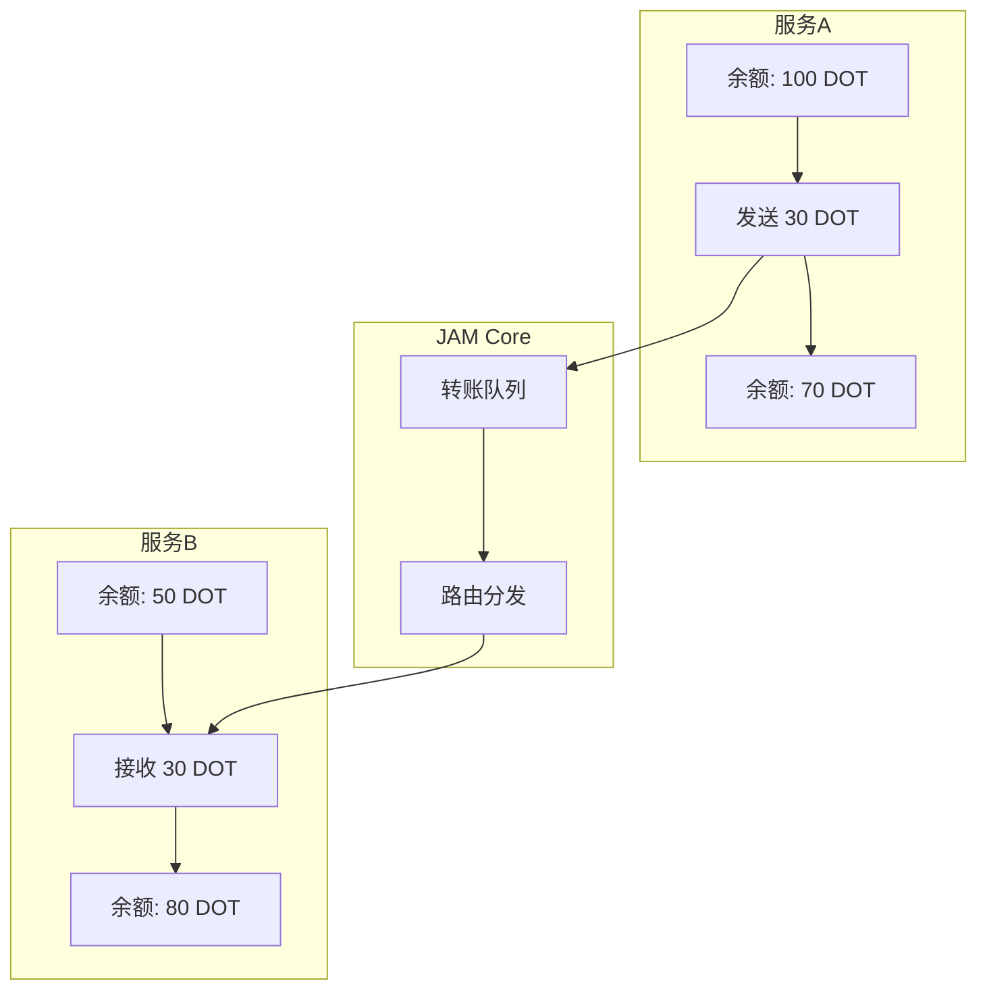

### 4.4 原子性保证

| 场景 | 处理方式 |
|------|---------|
| 转账成功 | 源扣款，目标加款，同一区块完成 |
| 目标服务处理失败 | 资金退回源服务（下一区块）|
| gas 不足 | 转账回退 |

---

## 五、数据可用性

### 5.1 纠删码机制

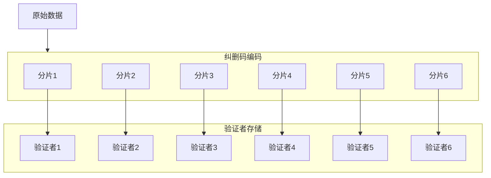

### 5.2 重建数据

**关键特性：** 只需 1/3 验证者响应即可重建完整数据

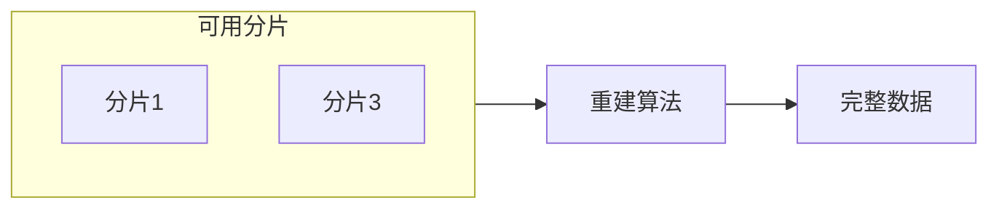

---

## 六、共识机制

### 6.1 混合共识

JAM 使用 **SAFROLE + GRANDPA** 混合共识：

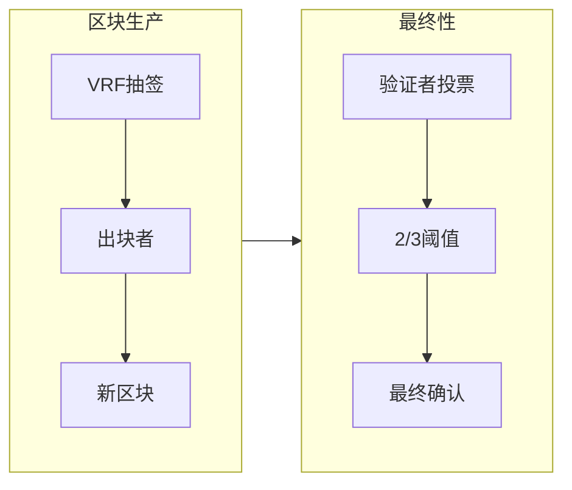

### 6.2 SAFROLE

**S**eal **A**nd **F**inalize via **R**andom **O**racle **L**eader **E**lection

- 基于 VRF 的随机领导者选举
- 抗 MEV（矿工可提取价值）
- 区块时间：6 秒

### 6.3 GRANDPA

- 拜占庭容错最终性协议
- 需要 2/3+ 验证者签名
- 一旦确认不可逆转

---

## 七、安全模型

### 7.1 安全架构

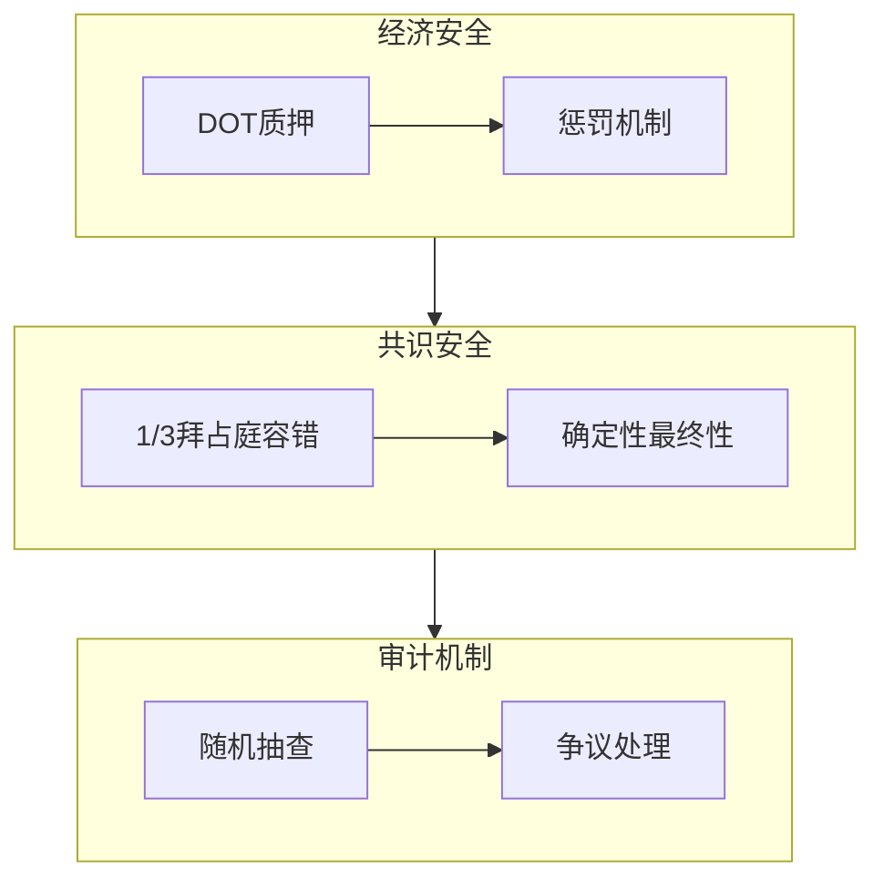

### 7.2 安全假设

| 假设 | 描述 |
|------|------|
| **诚实多数** | 至少 2/3 验证者诚实 |
| **经济理性** | 作恶成本 > 收益 |
| **数据可用** | 至少 1/3 验证者在线 |

### 7.3 攻击防护

| 攻击类型 | 防护措施 |
|---------|---------|
| 双花攻击 | GRANDPA 最终性 |
| 长程攻击 | 检查点机制 |
| 数据扣留 | 纠删码 + 随机抽查 |
| 验证者串谋 | 随机分组 + 惩罚 |

---

## 八、服务接口规范

### 8.1 完整服务接口

```rust
trait Service {
    /// 服务标识
    const SERVICE_ID: ServiceId;
    
    /// 阶段1: Refine - 无状态计算
    fn refine(
        package: WorkPackage,
        context: RefinementContext,
    ) -> Result<WorkResult, RefineError>;
    
    /// 阶段3: Accumulate - 状态转换
    fn accumulate(
        results: Vec<WorkResult>,
        transfers_in: Vec<Transfer>,
        state: &mut State,
    ) -> Vec<Transfer>;
    
    /// 接收跨服务转账
    fn on_transfer(
        source: ServiceId,
        amount: Balance,
        data: Vec<u8>,
        state: &mut State,
    ) -> Result<(), TransferError>;
}
```

### 8.2 Work Package 结构

```rust
struct WorkPackage {
    /// 服务ID
    service: ServiceId,
    /// 工作项列表
    work_items: Vec<WorkItem>,
    /// 引用的先前工作
    prerequisites: Vec<WorkResultHash>,
}

struct WorkItem {
    /// 输入数据
    input: Vec<u8>,
    /// gas限制
    gas_limit: Gas,
}
```

---

## 九、与传统跨链桥对比

### 9.1 架构对比

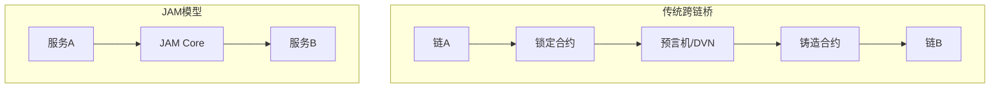

### 9.2 详细对比

| 维度 | 传统跨链桥 | JAM |
|------|-----------|-----|
| **本质** | 连接独立链的桥 | 同一系统内通信 |
| **信任模型** | 信任桥验证者 | 信任Polkadot共识 |
| **安全性** | 桥的安全性 | 共享Polkadot安全 |
| **原子性** | 需额外机制 | 原生原子性 |
| **资产模型** | 锁定-铸造 | 原生转移 |
| **延迟** | 分钟级 | 秒级 |
| **成本** | 跨链费用 | 内部转账费用 |
| **适用范围** | 任意链 | JAM服务之间 |

---

## 十、总结

### 10.1 JAM 核心要点

```
┌─────────────────────────────────────────────────────────────────┐
│                        JAM 核心要点                              │
├─────────────────────────────────────────────────────────────────┤
│                                                                 │
│  1. 三阶段模型                                                   │
│     Refine(无状态) → Join(担保) → Accumulate(状态转换)           │
│                                                                 │
│  2. 共享安全                                                     │
│     所有服务共享 Polkadot 验证者集的安全性                        │
│                                                                 │
│  3. 原生互操作                                                   │
│     跨服务通信是协议原生功能，不需要外部桥                        │
│                                                                 │
│  4. 原子性保证                                                   │
│     跨服务转账由共识层保证原子执行                                │
│                                                                 │
│  5. 数据可用性                                                   │
│     纠删码 + 验证者分片存储，1/3可重建                           │
│                                                                 │
│  6. 混合共识                                                     │
│     SAFROLE(出块) + GRANDPA(最终性)                              │
│                                                                 │
│  7. 通用计算                                                     │
│     不仅是跨链，更是通用的分布式计算平台                          │
│                                                                 │
└─────────────────────────────────────────────────────────────────┘
```

### 10.2 JAM 的意义

**JAM 重新定义了"跨链"：**

- 传统方式：在独立链之间建桥
- JAM 方式：在统一平台上运行多个服务

这从根本上消除了跨链桥的信任假设问题，因为根本不存在"桥"——所有服务都是同一个系统的一部分。

---

## 参考资料

- [JAM Gray Paper](https://graypaper.com/) - Gavin Wood
- [Polkadot Wiki](https://wiki.polkadot.network/)
- [JAM Implementer's Prize](https://jam.web3.foundation/)

