# JAM (Join-Accumulate Machine) 实现原理

## 一、JAM 概述

### 1.1 什么是 JAM

JAM 是 Polkadot 的下一代协议，由 Gavin Wood 在 2024 年提出。JAM 将替代当前的中继链架构，提供更通用、更高效的多链计算平台。

**JAM = Join-Accumulate Machine（连接-累积机器）**

### 1.2 从 Polkadot 到 JAM

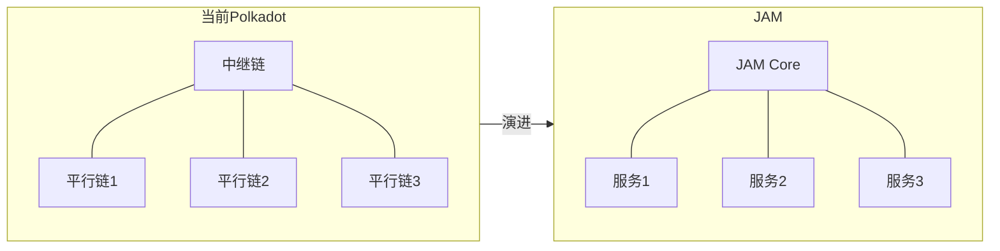

### 1.3 核心变化

| 对比项 | Polkadot 1.0 | JAM |
|--------|-------------|-----|
| **核心** | 中继链 (Relay Chain) | JAM Core |
| **应用** | 平行链 (Parachain) | 服务 (Service) |
| **插槽** | 需要竞拍 | 按需付费 |
| **灵活性** | 固定架构 | 高度通用 |

### 1.4 区块链扩展方案对比

根据 [JAM Gray Paper](https://graypaper.com/) 的分析，区块链技术面临五大核心驱动因素，而各方案在这些维度上的权衡决定了其设计取向。

#### 1.4.1 Web3 五大驱动因素

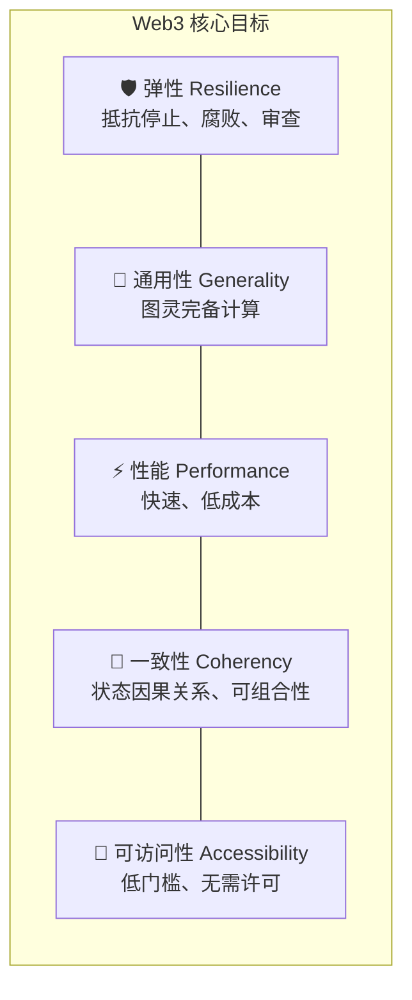

| 驱动因素 | 描述 | 挑战 |
|---------|------|------|
| **弹性** | 系统应该"不可阻挡"，无论任何经济主体的意愿、财富或权力 | 需要去中心化，牺牲效率 |
| **通用性** | 图灵完备的规则集，支持任意复杂逻辑 | Bitcoin 做到了弹性但缺乏通用性 |
| **性能** | 快速执行、低交易成本 | 与去中心化存在张力 |
| **一致性** | 状态元素间的因果关系，应用可组合 | 与扩展性存在根本对立 |
| **可访问性** | 创新门槛低：简单、快速、便宜、无需许可 | 复杂系统难以保持简单 |

#### 1.4.2 规模-一致性对立原理（Size-Coherency Antagonism）

Gray Paper 提出了一个关键原理：**随着系统状态空间增长，系统必然变得不那么一致**。

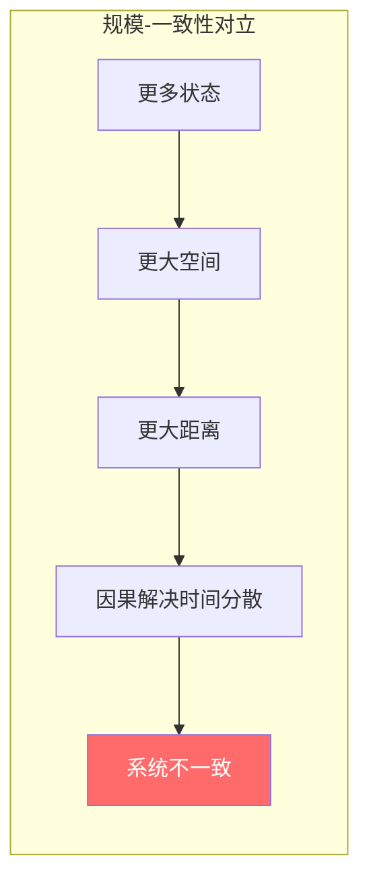

**核心论点：**

```
┌─────────────────────────────────────────────────────────────────────────┐
│                     规模-一致性对立 (Size-Coherency Antagonism)          │
├─────────────────────────────────────────────────────────────────────────┤
│                                                                         │
│  因果关系受速度限制（物理极限是光速 C）                                   │
│                                                                         │
│  1. 系统使用的状态越多 → 状态占用的空间越大                              │
│  2. 空间越大 → 状态组件之间的平均距离和方差越大                          │
│  3. 距离增加 → 因果解决时间（事件的所有正确影响被感知）变得分散           │
│  4. 时间分散 → 系统出现不一致                                            │
│                                                                         │
│  结论：性能（规模）与一致性是天然对立的                                   │
│                                                                         │
└─────────────────────────────────────────────────────────────────────────┘
```

#### 1.4.3 主流区块链方案对比

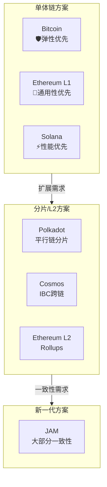

#### 1.4.4 各方案详细对比

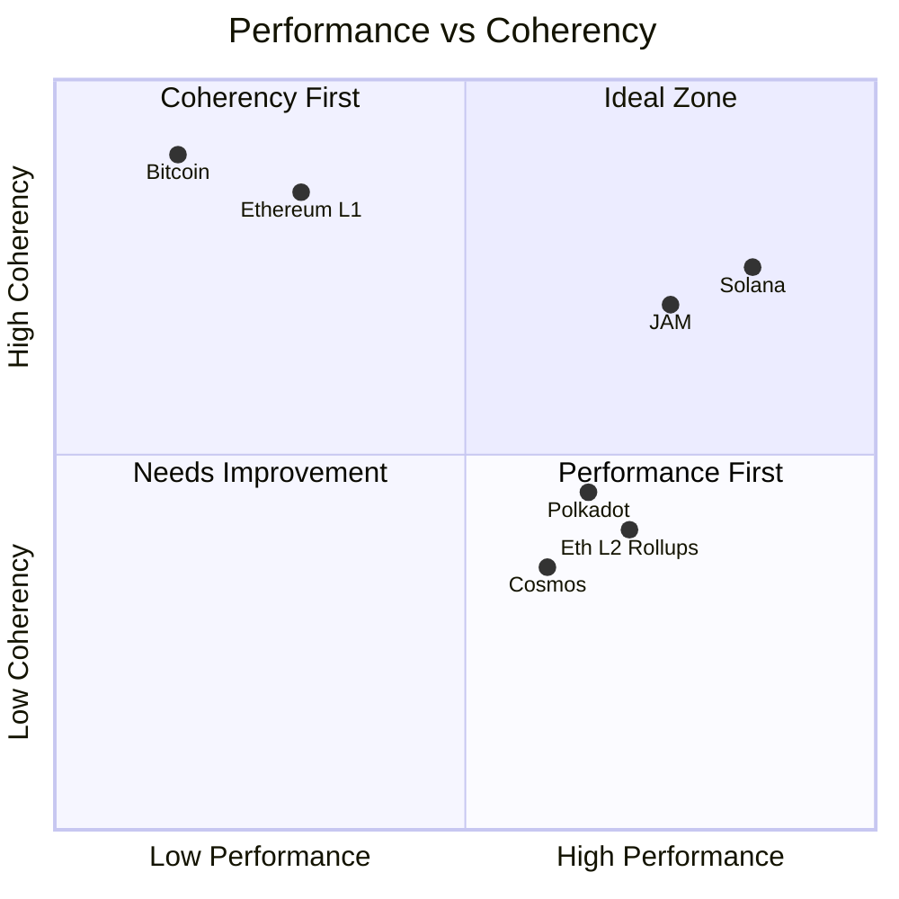

**图表说明：**
- **X轴**：低性能 → 高性能
- **Y轴**：低一致性 → 高一致性
- **右上象限（Ideal Zone）**：理想区域，JAM 的目标位置

| 方案 | 弹性 | 通用性 | 性能 | 一致性 | 可访问性 | 核心取舍 |
|------|:----:|:------:|:----:|:------:|:--------:|----------|
| **Bitcoin** | ⭐⭐⭐⭐⭐ | ⭐ | ⭐ | ⭐⭐⭐⭐⭐ | ⭐⭐ | 牺牲通用性换取极致弹性 |
| **Ethereum L1** | ⭐⭐⭐⭐ | ⭐⭐⭐⭐⭐ | ⭐⭐ | ⭐⭐⭐⭐⭐ | ⭐⭐⭐⭐ | 牺牲性能换取完全一致性 |
| **Solana** | ⭐⭐ | ⭐⭐⭐⭐ | ⭐⭐⭐⭐⭐ | ⭐⭐⭐⭐ | ⭐⭐⭐ | 牺牲去中心化换取高性能 |
| **Polkadot** | ⭐⭐⭐⭐ | ⭐⭐⭐⭐ | ⭐⭐⭐⭐ | ⭐⭐ | ⭐⭐⭐ | 分片扩展，牺牲跨链一致性 |
| **Cosmos** | ⭐⭐⭐ | ⭐⭐⭐⭐ | ⭐⭐⭐⭐ | ⭐⭐ | ⭐⭐⭐⭐ | 独立链+IBC，弱一致性 |
| **Eth L2 Rollups** | ⭐⭐⭐ | ⭐⭐⭐⭐ | ⭐⭐⭐⭐ | ⭐⭐ | ⭐⭐⭐ | 依赖L1安全，跨L2不一致 |
| **JAM** | ⭐⭐⭐⭐ | ⭐⭐⭐⭐⭐ | ⭐⭐⭐⭐ | ⭐⭐⭐⭐ | ⭐⭐⭐⭐ | 大部分一致性，平衡取舍 |

#### 1.4.5 各方案架构图解

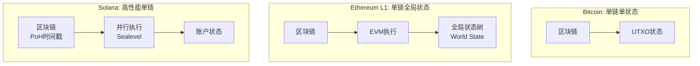

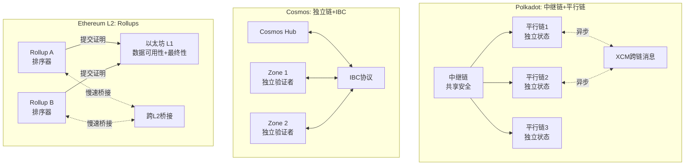

#### 1.4.6 JAM 的创新：大部分一致性（Mostly Coherent）

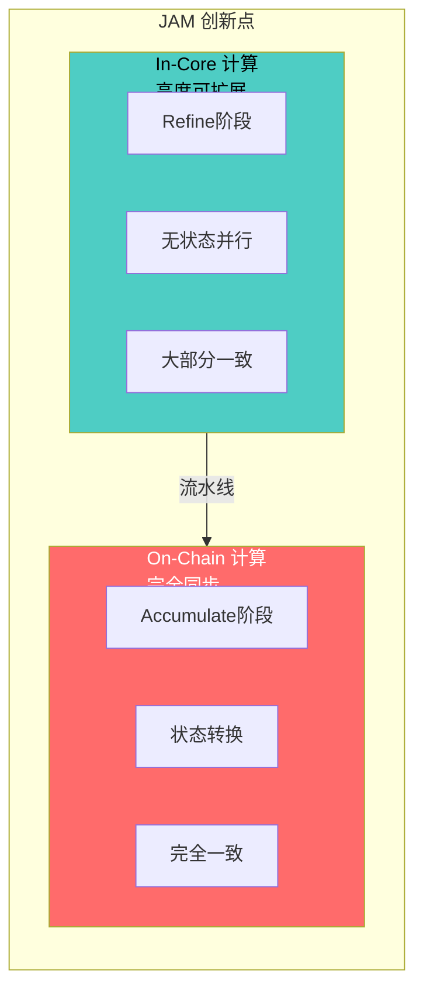

**JAM 的关键创新：**

```
┌─────────────────────────────────────────────────────────────────────────┐
│                    JAM: Mostly Coherent（大部分一致性）                  │
├─────────────────────────────────────────────────────────────────────────┤
│                                                                         │
│  传统分片方案（Polkadot/Cosmos/Eth L2）：                                │
│    - 将系统分割成因果独立的子系统                                        │
│    - 每个子系统内部一致，跨子系统完全不一致                              │
│    - 类似细菌分裂：要么小而一致，要么大而分裂                            │
│                                                                         │
│  JAM 的中间路线：                                                        │
│    - 不持久分割状态空间                                                  │
│    - 引入 In-Core/On-Chain 二元计算模型                                  │
│    - In-Core: 高度可扩展的"大部分一致"计算                              │
│    - On-Chain: 完全同步的一致性计算                                      │
│    - 异步性被限制在流水线长度内                                          │
│    - 用"缓存亲和性"替代粗暴的分区                                       │
│                                                                         │
│  优势：                                                                  │
│    ✅ 不依赖 SNARK（低成本、高性能）                                     │
│    ✅ 避免中心化倾向                                                     │
│    ✅ 保持应用可组合性                                                   │
│                                                                         │
└─────────────────────────────────────────────────────────────────────────┘
```

#### 1.4.7 各方案问题总结

| 方案 | 主要问题 | Gray Paper 引用 |
|------|---------|----------------|
| **Bitcoin** | 规则集有限，只支持固定发行代币和简单脚本 | "Bitcoin's rules allowed for an initial use-case, namely a fixed-issuance token" |
| **Ethereum L1** | 单链扩展受限，gas 费用高昂 | 需要 L2 扩展方案 |
| **Solana** | 客户端多样性不足，多次宕机，硬件要求高 | "Solana outage raises questions about client diversity" |
| **Polkadot 1.0** | 跨平行链通信异步，一致性弱 | 分片导致因果关系断裂 |
| **Cosmos** | 安全性独立，IBC 跨链延迟高 | 每条链需要自己的验证者集 |
| **Eth L2 Rollups** | 排序器中心化，跨 L2 桥接慢且不安全 | "Ethereum's Rollups are Centralized" |

---

## 二、JAM 架构

### 2.1 三层架构

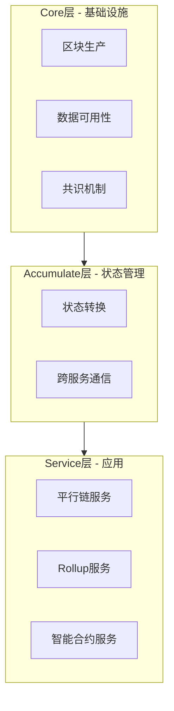

### 2.2 组件职责

| 层级 | 组件 | 职责 |
|------|------|------|
| **Core** | 区块生产 | SAFROLE 算法选举出块者 |
| **Core** | 数据可用性 | 纠删码分片存储 |
| **Core** | 共识 | GRANDPA 最终性确认 |
| **Accumulate** | 状态转换 | 执行服务的状态变更 |
| **Accumulate** | 跨服务通信 | 处理服务间消息传递 |
| **Service** | 应用逻辑 | 具体业务实现 |

---

## 三、核心执行模型

### 3.1 三阶段流程：Refine → Join → Accumulate

这是 JAM 最核心的创新。

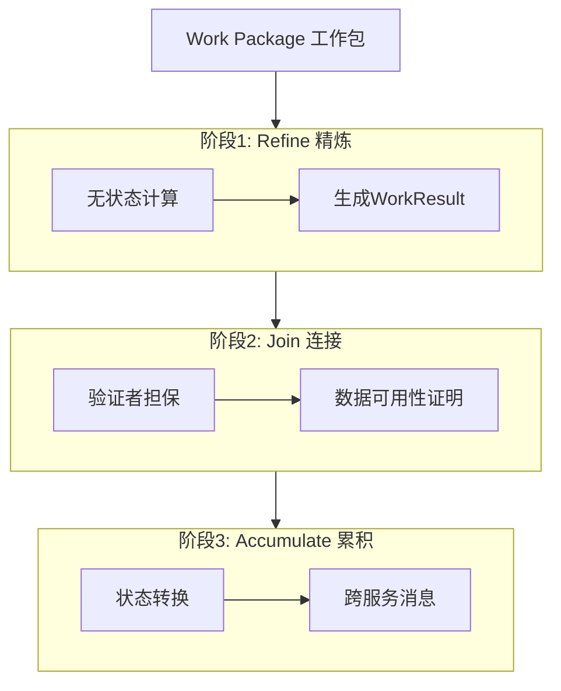

### 3.2 各阶段详解

#### 阶段 1: Refine（精炼）

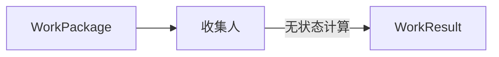

**特点：**
- 在链下执行（收集人节点）
- 纯函数，无状态依赖
- 可并行执行
- 输出确定性的 Work Result

**代码示例：**
```rust
fn refine(package: WorkPackage) -> WorkResult {
    // 纯计算，不访问任何外部状态
    let result = compute(package.data);
    WorkResult { output: result }
}
```

#### 阶段 2: Join（连接）

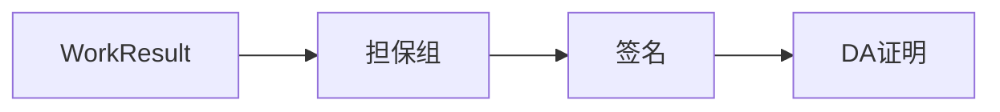

**特点：**
- 验证者组担保 Work Result 的正确性
- 生成数据可用性证明
- 确保数据可被重建

#### 阶段 3: Accumulate（累积）


**特点：**
- 有状态执行
- 修改服务的持久化状态
- 处理跨服务消息
- 产生新的跨服务转账

**代码示例：**
```rust
fn accumulate(
    results: Vec<WorkResult>,
    incoming_transfers: Vec<Transfer>,
    state: &mut ServiceState,
) -> Vec<Transfer> {
    // 1. 处理工作结果
    for result in results {
        state.apply(result);
    }
    
    // 2. 处理收到的转账
    for transfer in incoming_transfers {
        state.credit(transfer.amount);
        state.process_data(transfer.data);
    }
    
    // 3. 返回要发出的转账
    state.pending_outgoing_transfers()
}
```

---

## 四、跨服务通信

### 4.1 通信模型

JAM 的跨服务通信是**原生的**，不需要外部桥接。

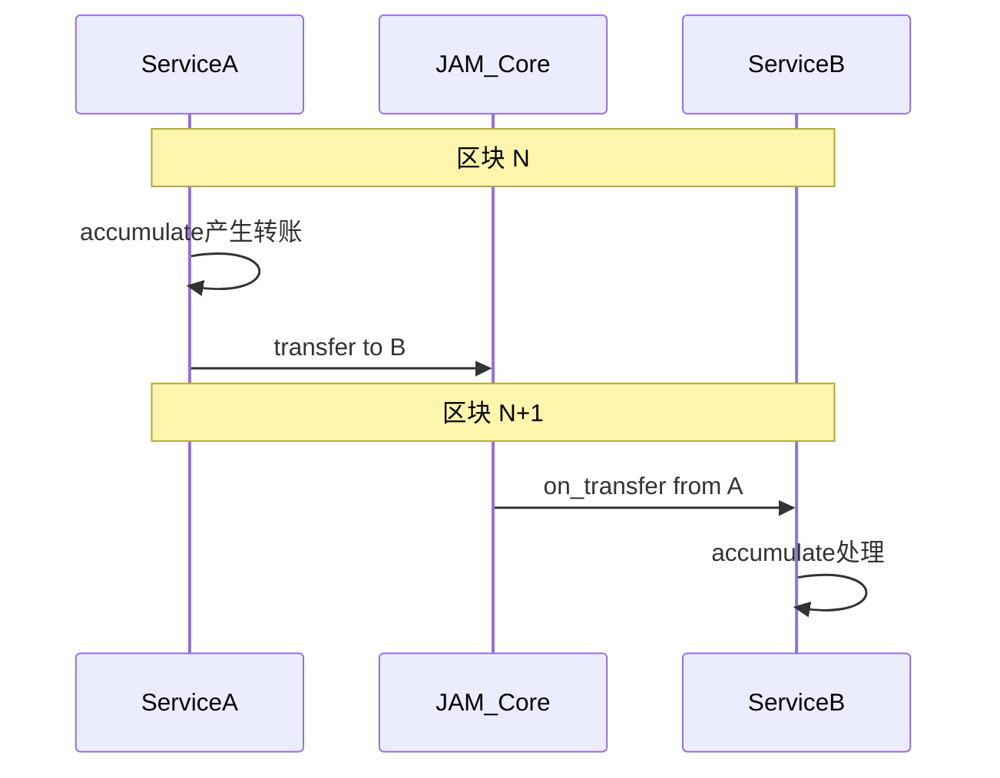

### 4.2 Transfer 结构

```rust
struct Transfer {
    source: ServiceId,      // 源服务
    destination: ServiceId, // 目标服务
    amount: Balance,        // 转账金额(用于gas)
    data: Vec<u8>,          // 携带数据
    gas_limit: Gas,         // gas限制
}
```

### 4.3 跨服务转账流程

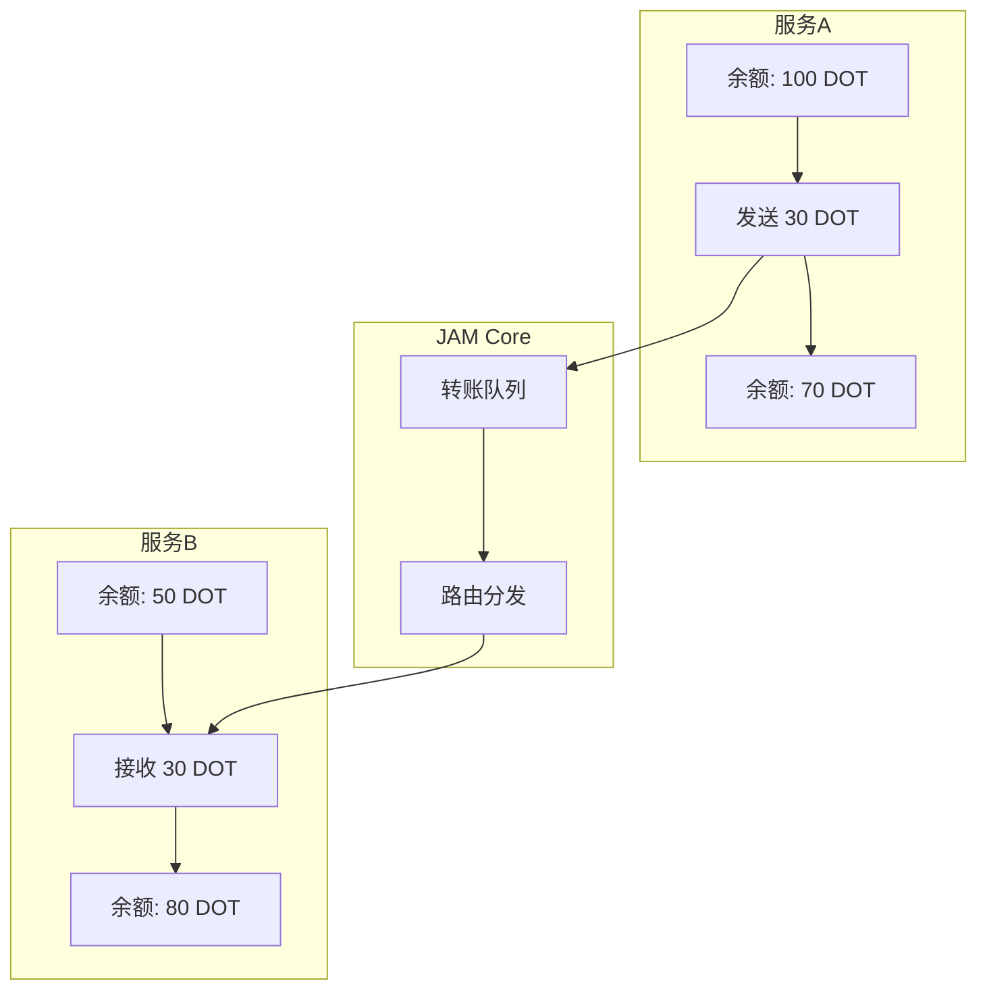

### 4.4 原子性保证

| 场景 | 处理方式 |
|------|---------|
| 转账成功 | 源扣款，目标加款，同一区块完成 |
| 目标服务处理失败 | 资金退回源服务（下一区块）|
| gas 不足 | 转账回退 |

---

## 五、状态管理模型

### 5.1 状态架构概述

JAM 采用**分离式服务状态**模型，与以太坊的单一全局状态树有本质区别。

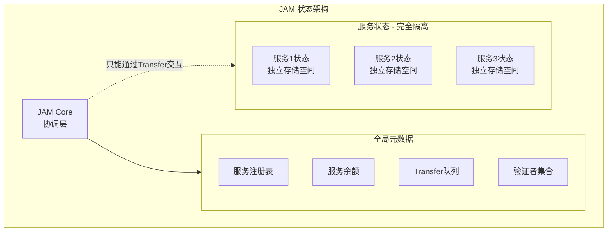

### 5.2 与以太坊状态模型对比

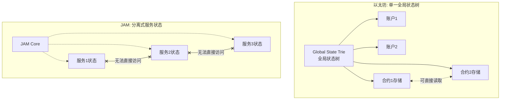

| 特性 | 以太坊 | JAM |
|------|--------|-----|
| **状态结构** | 单一 Merkle Patricia Trie | 每个服务独立状态空间 |
| **状态根** | 单一全局状态根 | 每个服务有独立状态根 |
| **跨合约/服务访问** | 合约可 `SLOAD` 读取其他合约存储 | 服务完全无法访问其他服务状态 |
| **状态可见性** | 全局可见 | 仅服务内部可见 |
| **并行执行** | 受全局状态锁限制 | 不同服务可完全并行 |
| **状态证明** | 统一的 Merkle 证明 | 分离的服务状态证明 |

### 5.3 JAM 状态分层

```rust
// JAM Core 维护的全局状态
struct JAMCoreState {
    /// 服务注册表
    services: HashMap<ServiceId, ServiceMetadata>,
    
    /// 服务余额 (用于支付 gas)
    balances: HashMap<ServiceId, Balance>,
    
    /// 待处理的跨服务转账队列
    pending_transfers: Vec<Transfer>,
    
    /// 验证者集合
    validators: ValidatorSet,
    
    /// 共识状态
    consensus: ConsensusState,
}

// 每个服务独立维护的状态
struct ServiceState {
    /// 服务自定义的状态数据
    /// 完全由服务自己定义和管理
    data: Vec<u8>,  // 或任意序列化格式
    
    /// 状态根哈希
    state_root: Hash,
}
```

### 5.4 状态访问规则

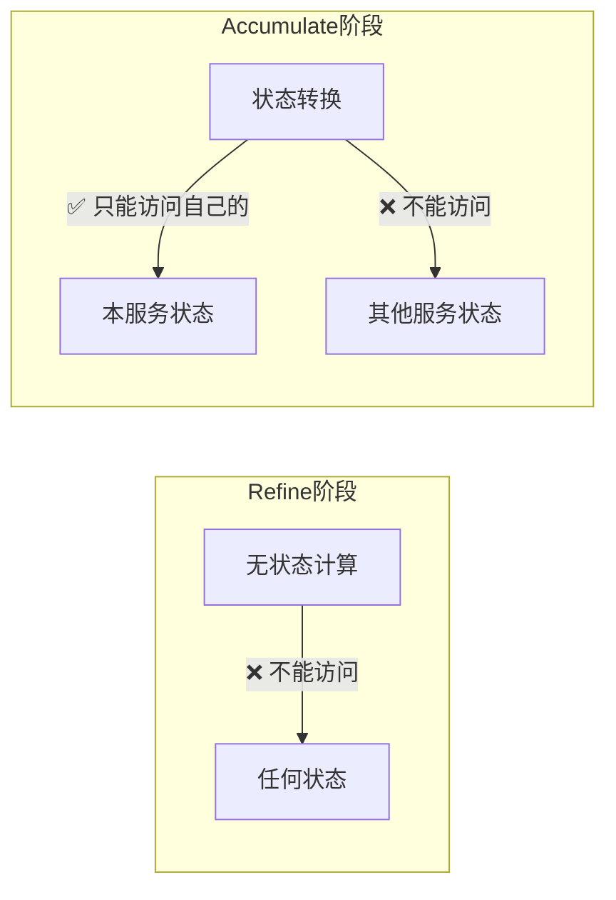

**关键规则：**

| 阶段 | 状态访问权限 |
|------|-------------|
| **Refine** | 完全无状态，不能读取任何状态 |
| **Accumulate** | 只能读写**本服务**的状态 |
| **跨服务** | 必须通过 Transfer 消息异步通信 |

### 5.5 状态持久化机制

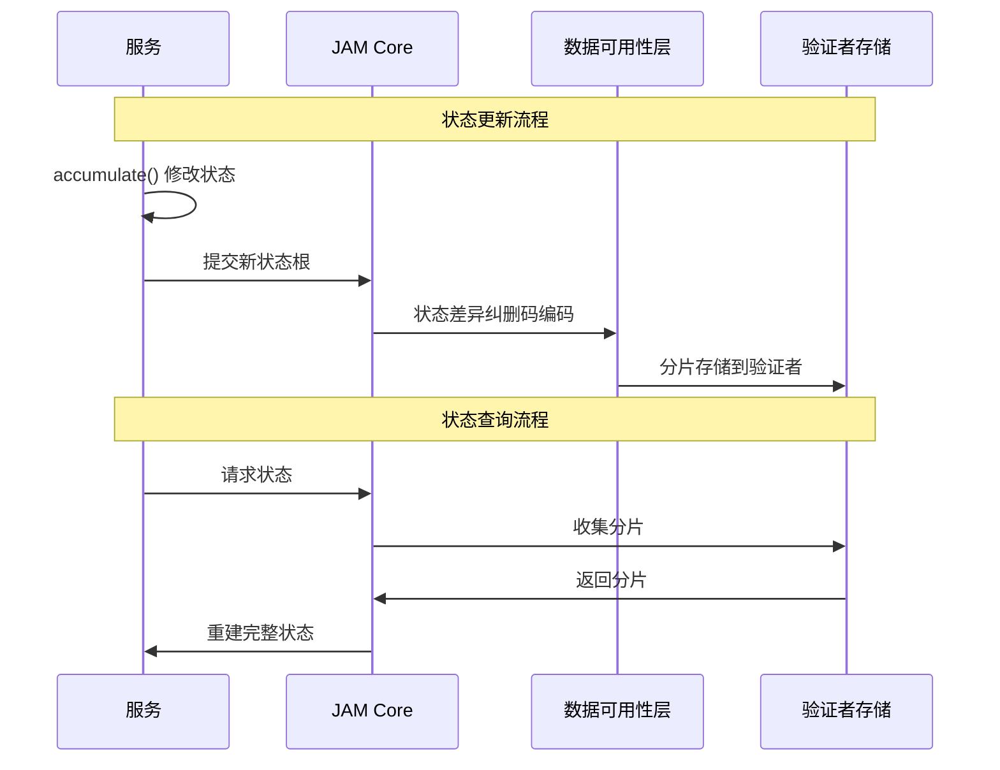

---

## 六、与微服务架构对比

JAM 的设计理念与传统微服务架构有很多相似之处，但也有关键的区别。

### 6.1 架构对比图

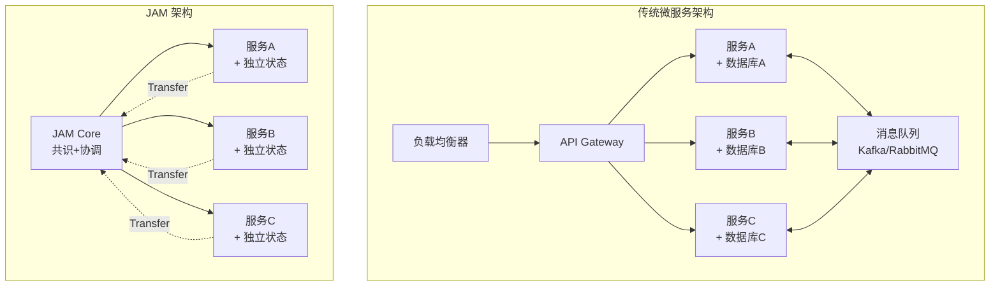

### 6.2 相似之处

| 特性 | 微服务 | JAM | 说明 |
|------|--------|-----|------|
| **服务隔离** | ✅ 每个服务独立进程 | ✅ 每个服务独立状态空间 | 故障隔离，一个服务崩溃不影响其他服务 |
| **独立数据存储** | ✅ 每个服务有自己的数据库 | ✅ 每个服务有独立状态 | 数据自治，避免共享数据库的耦合 |
| **异步通信** | ✅ 消息队列/事件驱动 | ✅ Transfer 消息传递 | 松耦合，服务间不直接调用 |
| **独立部署** | ✅ 可单独部署服务 | ✅ 可单独升级服务代码 | 灵活迭代，不影响整体系统 |
| **技术栈自由** | ✅ 每个服务可用不同语言 | ⚠️ 必须编译为 PVM (类似WASM) | JAM 有执行环境约束 |
| **水平扩展** | ✅ 按服务扩展实例 | ✅ 按服务分配计算资源 | 根据负载独立扩展 |

### 6.3 关键差异

```mermaid
flowchart TB
    subgraph Diff1[差异1: 共识机制]
        MS1_No[微服务: ❌ 无全局共识]
        JAM1_Yes[JAM: ✅ SAFROLE+GRANDPA全局共识]
    end
    
    subgraph Diff2[差异2: 一致性保证]
        MS2[微服务: 最终一致性<br/>需要Saga模式]
        JAM2[JAM: 强一致性<br/>共识层原子保证]
    end
    
    subgraph Diff3[差异3: 安全模型]
        MS3[微服务: 认证授权<br/>网络安全]
        JAM3[JAM: 经济安全<br/>质押+惩罚]
    end
    
    subgraph Diff4[差异4: 执行确定性]
        MS4[微服务: 非确定性<br/>依赖外部状态]
        JAM4[JAM: 确定性执行<br/>相同输入=相同输出]
    end
```

| 维度 | 微服务 | JAM |
|------|--------|-----|
| **共识机制** | 无全局共识，依赖各服务自身逻辑 | SAFROLE+GRANDPA 全局共识 |
| **一致性模型** | 最终一致性 (Eventually Consistent) | 强一致性 (由共识保证) |
| **事务处理** | Saga 模式 / 2PC / TCC | 协议层原子性保证 |
| **消息可靠性** | 依赖 MQ 配置 (at-least-once等) | 协议保证 exactly-once |
| **安全模型** | 认证、授权、网络隔离 | 经济安全 (质押+Slashing) |
| **信任假设** | 信任基础设施和运维 | 信任密码学和经济激励 |
| **故障处理** | 熔断、重试、降级 | 验证者冗余 + 纠删码 |
| **执行环境** | 任意 (JVM, Node, Go...) | 确定性 PVM (Polkadot VM) |
| **状态可审计** | 困难，需要额外日志 | 原生支持，所有状态上链 |
| **不可篡改性** | ❌ 管理员可修改数据库 | ✅ 共识确认后不可篡改 |

### 6.4 跨服务事务对比

#### 微服务: Saga 模式

```mermaid
sequenceDiagram
    participant O as 订单服务
    participant P as 支付服务
    participant I as 库存服务
    
    O->>O: 1. 创建订单
    O->>P: 2. 扣款请求
    P->>P: 执行扣款
    P-->>O: 扣款成功
    O->>I: 3. 扣减库存
    I->>I: 执行扣减
    I-->>O: 扣减失败!
    
    Note over O,I: 补偿事务
    O->>P: 4. 退款请求
    P->>P: 执行退款
    O->>O: 5. 取消订单
```

**问题：** 需要手动编写补偿逻辑，存在中间状态

#### JAM: 原生原子性

```mermaid
sequenceDiagram
    participant O as 订单服务
    participant Core as JAM Core
    participant P as 支付服务
    participant I as 库存服务
    
    Note over O,I: 区块 N
    O->>Core: Transfer(扣款, 扣库存)
    
    Note over O,I: 区块 N+1
    Core->>P: on_transfer(扣款)
    Core->>I: on_transfer(扣库存)
    
    alt 全部成功
        P-->>Core: ✅ 成功
        I-->>Core: ✅ 成功
        Core->>O: 确认完成
    else 任一失败
        Core->>Core: 自动回滚
        Core->>O: Transfer 退回
    end
```

**优势：** 协议层保证原子性，无需补偿逻辑

### 6.5 设计理念对比

```
┌─────────────────────────────────────────────────────────────────────────┐
│                        设计理念对比                                      │
├──────────────────────────────┬──────────────────────────────────────────┤
│          微服务               │                 JAM                      │
├──────────────────────────────┼──────────────────────────────────────────┤
│                              │                                          │
│  🎯 目标: 应对复杂业务         │  🎯 目标: 去中心化通用计算                │
│                              │                                          │
│  📦 部署: 容器/K8s            │  📦 部署: 链上服务注册                    │
│                              │                                          │
│  🔒 信任: 运维团队            │  🔒 信任: 密码学 + 经济激励               │
│                              │                                          │
│  💾 存储: 各自数据库          │  💾 存储: 验证者分片存储                  │
│                              │                                          │
│  📡 通信: HTTP/gRPC/MQ       │  📡 通信: Transfer 消息                   │
│                              │                                          │
│  ⚡ 扩展: 水平扩展实例         │  ⚡ 扩展: 购买更多 Core Time              │
│                              │                                          │
│  🛡️ 容错: 熔断/重试           │  🛡️ 容错: 共识冗余                       │
│                              │                                          │
│  👁️ 可见性: 需要日志/监控     │  👁️ 可见性: 链上透明可审计               │
│                              │                                          │
└──────────────────────────────┴──────────────────────────────────────────┘
```

### 6.6 何时选择哪种架构

| 场景 | 推荐架构 | 原因 |
|------|---------|------|
| 企业内部系统 | 微服务 | 信任内部运维，无需去中心化 |
| 需要快速迭代 | 微服务 | 部署更灵活，迭代更快 |
| 高吞吐量场景 | 微服务 | 无共识开销 |
| 需要去信任化 | JAM | 经济安全，无需信任第三方 |
| 跨组织协作 | JAM | 共识保证各方利益 |
| 资产/金融类应用 | JAM | 不可篡改，可审计 |
| 需要原子性跨服务事务 | JAM | 协议层原生支持 |

---

## 七、数据可用性

### 7.1 纠删码机制

```mermaid
flowchart TB
    Data[原始数据]
    
    subgraph Erasure[纠删码编码]
        C1[分片1]
        C2[分片2]
        C3[分片3]
        C4[分片4]
        C5[分片5]
        C6[分片6]
    end
    
    subgraph Validators[验证者存储]
        V1[验证者1]
        V2[验证者2]
        V3[验证者3]
        V4[验证者4]
        V5[验证者5]
        V6[验证者6]
    end
    
    Data --> Erasure
    C1 --> V1
    C2 --> V2
    C3 --> V3
    C4 --> V4
    C5 --> V5
    C6 --> V6
```

### 7.2 重建数据

**关键特性：** 只需 1/3 验证者响应即可重建完整数据

```mermaid
flowchart LR
    subgraph Available[可用分片]
        C1[分片1]
        C3[分片3]
    end
    
    Reconstruct[重建算法]
    FullData[完整数据]
    
    Available --> Reconstruct
    Reconstruct --> FullData
```

---

## 八、共识机制

### 8.1 混合共识

JAM 使用 **SAFROLE + GRANDPA** 混合共识：

```mermaid
flowchart LR
    subgraph Production[区块生产]
        VRF[VRF抽签]
        Leader[出块者]
        Block[新区块]
        VRF --> Leader --> Block
    end
    
    subgraph Finality[最终性]
        Vote[验证者投票]
        Threshold[2/3阈值]
        Final[最终确认]
        Vote --> Threshold --> Final
    end
    
    Production --> Finality
```

### 8.2 SAFROLE

**S**eal **A**nd **F**inalize via **R**andom **O**racle **L**eader **E**lection

- 基于 VRF 的随机领导者选举
- 抗 MEV（矿工可提取价值）
- 区块时间：6 秒

### 8.3 GRANDPA

- 拜占庭容错最终性协议
- 需要 2/3+ 验证者签名
- 一旦确认不可逆转

---

## 九、安全模型

### 9.1 安全架构

```mermaid
flowchart TB
    subgraph Economic[经济安全]
        Stake[DOT质押]
        Slash[惩罚机制]
        Stake --> Slash
    end
    
    subgraph Consensus[共识安全]
        BFT[1/3拜占庭容错]
        Finality[确定性最终性]
        BFT --> Finality
    end
    
    subgraph Audit[审计机制]
        Random[随机抽查]
        Dispute[争议处理]
        Random --> Dispute
    end
    
    Economic --> Consensus
    Consensus --> Audit
```

### 9.2 安全假设

| 假设 | 描述 |
|------|------|
| **诚实多数** | 至少 2/3 验证者诚实 |
| **经济理性** | 作恶成本 > 收益 |
| **数据可用** | 至少 1/3 验证者在线 |

### 9.3 攻击防护

| 攻击类型 | 防护措施 |
|---------|---------|
| 双花攻击 | GRANDPA 最终性 |
| 长程攻击 | 检查点机制 |
| 数据扣留 | 纠删码 + 随机抽查 |
| 验证者串谋 | 随机分组 + 惩罚 |

---

## 十、服务接口规范

### 10.1 完整服务接口

```rust
trait Service {
    /// 服务标识
    const SERVICE_ID: ServiceId;
    
    /// 阶段1: Refine - 无状态计算
    fn refine(
        package: WorkPackage,
        context: RefinementContext,
    ) -> Result<WorkResult, RefineError>;
    
    /// 阶段3: Accumulate - 状态转换
    fn accumulate(
        results: Vec<WorkResult>,
        transfers_in: Vec<Transfer>,
        state: &mut State,
    ) -> Vec<Transfer>;
    
    /// 接收跨服务转账
    fn on_transfer(
        source: ServiceId,
        amount: Balance,
        data: Vec<u8>,
        state: &mut State,
    ) -> Result<(), TransferError>;
}
```

### 10.2 Work Package 结构

```rust
struct WorkPackage {
    /// 服务ID
    service: ServiceId,
    /// 工作项列表
    work_items: Vec<WorkItem>,
    /// 引用的先前工作
    prerequisites: Vec<WorkResultHash>,
}

struct WorkItem {
    /// 输入数据
    input: Vec<u8>,
    /// gas限制
    gas_limit: Gas,
}
```

---

## 十一、与传统跨链桥对比

### 11.1 架构对比

```mermaid
flowchart TB
    subgraph Bridge[传统跨链桥]
        BA[链A]
        Lock[锁定合约]
        Oracle[预言机/DVN]
        Mint[铸造合约]
        BB[链B]
        
        BA --> Lock
        Lock --> Oracle
        Oracle --> Mint
        Mint --> BB
    end
    
    subgraph JAM_Model[JAM模型]
        SA[服务A]
        JC[JAM Core]
        SB[服务B]
        
        SA --> JC
        JC --> SB
    end
```

### 11.2 详细对比

| 维度 | 传统跨链桥 | JAM |
|------|-----------|-----|
| **本质** | 连接独立链的桥 | 同一系统内通信 |
| **信任模型** | 信任桥验证者 | 信任Polkadot共识 |
| **安全性** | 桥的安全性 | 共享Polkadot安全 |
| **原子性** | 需额外机制 | 原生原子性 |
| **资产模型** | 锁定-铸造 | 原生转移 |
| **延迟** | 分钟级 | 秒级 |
| **成本** | 跨链费用 | 内部转账费用 |
| **适用范围** | 任意链 | JAM服务之间 |

---

## 十二、总结

### 12.1 JAM 核心要点

```
┌─────────────────────────────────────────────────────────────────┐
│                        JAM 核心要点                              │
├─────────────────────────────────────────────────────────────────┤
│                                                                 │
│  1. 三阶段模型                                                   │
│     Refine(无状态) → Join(担保) → Accumulate(状态转换)           │
│                                                                 │
│  2. 共享安全                                                     │
│     所有服务共享 Polkadot 验证者集的安全性                        │
│                                                                 │
│  3. 原生互操作                                                   │
│     跨服务通信是协议原生功能，不需要外部桥                        │
│                                                                 │
│  4. 原子性保证                                                   │
│     跨服务转账由共识层保证原子执行                                │
│                                                                 │
│  5. 数据可用性                                                   │
│     纠删码 + 验证者分片存储，1/3可重建                           │
│                                                                 │
│  6. 混合共识                                                     │
│     SAFROLE(出块) + GRANDPA(最终性)                              │
│                                                                 │
│  7. 通用计算                                                     │
│     不仅是跨链，更是通用的分布式计算平台                          │
│                                                                 │
└─────────────────────────────────────────────────────────────────┘
```

### 12.2 JAM 的意义

**JAM 重新定义了"跨链"：**

- 传统方式：在独立链之间建桥
- JAM 方式：在统一平台上运行多个服务

这从根本上消除了跨链桥的信任假设问题，因为根本不存在"桥"——所有服务都是同一个系统的一部分。

---

## 参考资料

- [JAM Gray Paper](https://graypaper.com/) - Gavin Wood
- [Polkadot Wiki](https://wiki.polkadot.network/)
- [JAM Implementer's Prize](https://jam.web3.foundation/)

