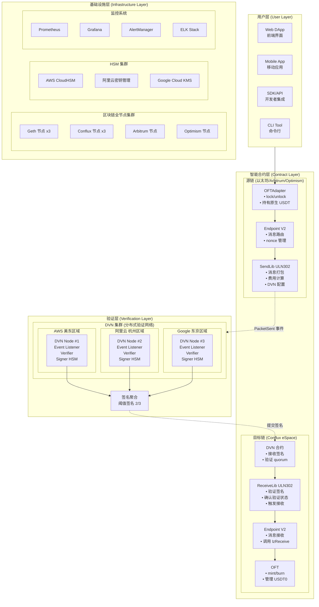
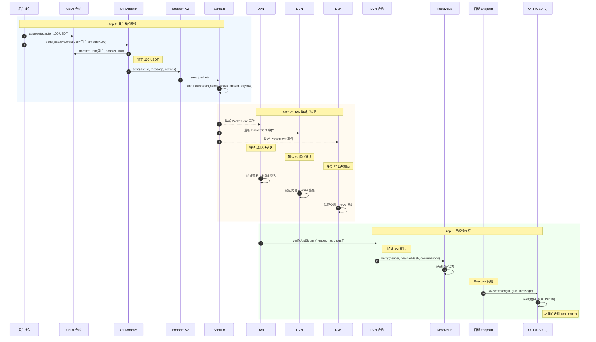
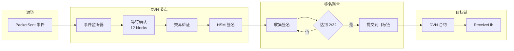
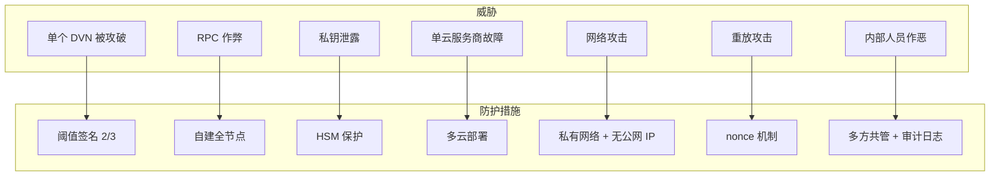
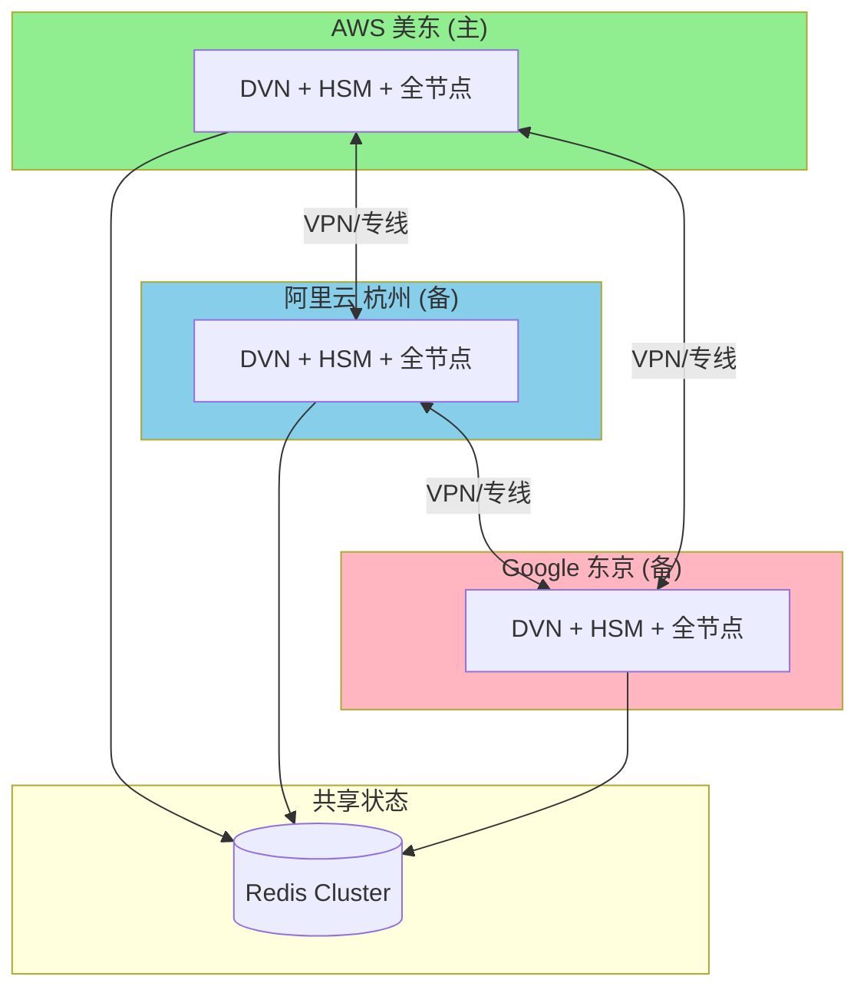
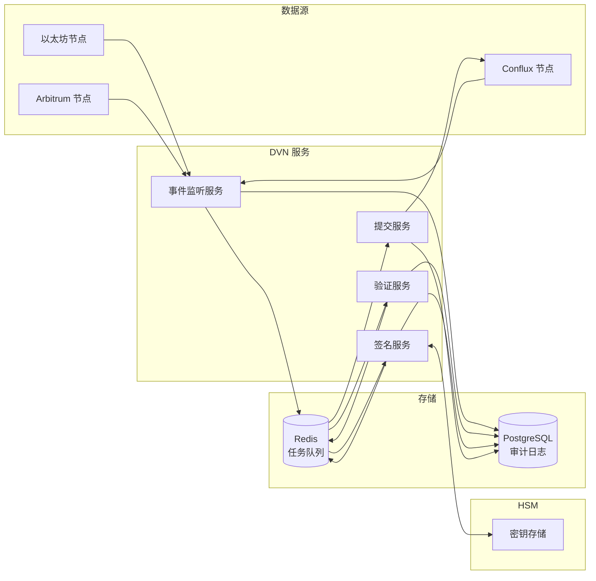

# 1. 架构概述

## 1.1 系统架构图

---

## 1.2 跨链消息流程

### 1.2.1 完整跨链流程 (以太坊 → Conflux)

### 1.2.2 DVN 验证详细流程

---

## 1.3 组件职责

| 组件 | 部署位置 | 职责 |
|------|---------|------|
| **OFTAdapter** | 源链 | 锁定/解锁原生代币 |
| **OFT** | 目标链 | 铸造/销毁包装代币 |
| **Endpoint** | 所有链 | 消息路由、nonce 管理 |
| **SendLib** | 源链 | 打包消息、触发事件 |
| **ReceiveLib** | 目标链 | 验证签名、确认消息 |
| **DVN 合约** | 目标链 | 接收并验证 DVN 签名 |
| **DVN 节点** | 链下 | 监听事件、签名验证 |
| **区块链节点** | 链下 | 提供可信数据源 |
| **HSM** | 链下 | 安全存储签名密钥 |

---

## 1.4 安全模型

### 信任假设

| 假设 | 描述 |
|------|------|
| DVN 诚实性 | 至少 2/3 的 DVN 节点是诚实的 |
| 云服务商隔离 | 各云服务商不会同时被攻破 |
| HSM 安全性 | HSM 硬件是安全的 |
| 数据可信性 | 自建区块链节点数据是可信的 |

---

## 1.5 高可用设计

### 故障转移策略

| 场景 | 处理方式 |
|------|---------|
| 单个区域故障 | 其他 2 个区域继续运行，满足 2/3 阈值 |
| 单个 DVN 节点故障 | 自动切换到健康节点 |
| HSM 故障 | 使用其他区域 HSM 签名 |
| 区块链节点故障 | 自动切换到备用节点 |

---

## 1.6 数据流架构

