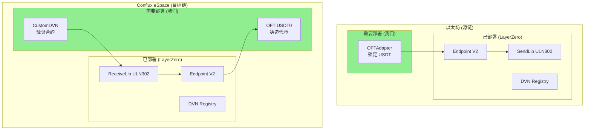
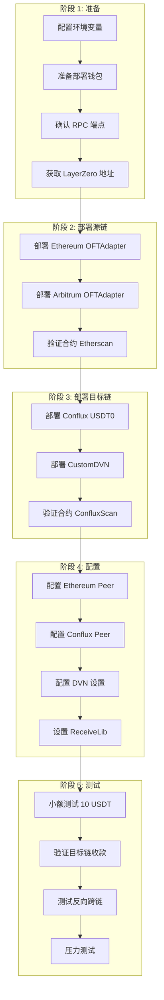

# 2. 智能合约部署

## 2.1 合约架构



---

## 2.2 项目结构

```bash
contracts/
├── src/
│   ├── OFTAdapter.sol          # 源链适配器
│   ├── OFT.sol                 # 目标链代币
│   ├── CustomDVN.sol           # 自定义 DVN 合约
│   └── interfaces/
│       ├── ILayerZeroEndpointV2.sol
│       ├── IReceiveLib.sol
│       └── ISendLib.sol
├── script/
│   ├── DeployEthereum.s.sol    # 以太坊部署脚本
│   ├── DeployConflux.s.sol     # Conflux 部署脚本
│   └── ConfigureOApp.s.sol     # 配置脚本
├── test/
│   └── OFT.t.sol
├── foundry.toml
└── hardhat.config.ts
```

---

## 2.3 OFTAdapter 合约 (源链)

```solidity
// SPDX-License-Identifier: MIT
pragma solidity ^0.8.20;

import { OFTAdapter } from "@layerzerolabs/oft-evm/contracts/OFTAdapter.sol";
import { Ownable } from "@openzeppelin/contracts/access/Ownable.sol";

/**
 * @title USDTOFTAdapter
 * @notice 源链 USDT 锁定合约
 * @dev 锁定原生 USDT，通过 LayerZero 发送跨链消息
 */
contract USDTOFTAdapter is OFTAdapter {
    
    // 每日跨链限额
    uint256 public dailyLimit;
    uint256 public dailyTransferred;
    uint256 public lastResetTime;
    
    // 单笔最大/最小限额
    uint256 public minAmount;
    uint256 public maxAmount;
    
    // 暂停状态
    bool public paused;
    
    // 白名单（可选）
    mapping(address => bool) public whitelist;
    bool public whitelistEnabled;
    
    event DailyLimitUpdated(uint256 oldLimit, uint256 newLimit);
    event Paused(address account);
    event Unpaused(address account);
    
    error TransferPaused();
    error ExceedsDailyLimit();
    error AmountTooSmall();
    error AmountTooLarge();
    error NotWhitelisted();
    
    constructor(
        address _token,           // USDT 地址
        address _lzEndpoint,      // LayerZero Endpoint
        address _delegate         // 管理员
    ) OFTAdapter(_token, _lzEndpoint, _delegate) Ownable(_delegate) {
        dailyLimit = 1_000_000 * 1e6;  // 100万 USDT
        minAmount = 10 * 1e6;           // 最小 10 USDT
        maxAmount = 100_000 * 1e6;      // 最大 10万 USDT
        lastResetTime = block.timestamp;
    }
    
    /**
     * @notice 重写 _debit 以添加限额检查
     */
    function _debit(
        address _from,
        uint256 _amountLD,
        uint256 _minAmountLD,
        uint32 _dstEid
    ) internal virtual override returns (uint256 amountSentLD, uint256 amountReceivedLD) {
        // 暂停检查
        if (paused) revert TransferPaused();
        
        // 白名单检查
        if (whitelistEnabled && !whitelist[_from]) revert NotWhitelisted();
        
        // 金额检查
        if (_amountLD < minAmount) revert AmountTooSmall();
        if (_amountLD > maxAmount) revert AmountTooLarge();
        
        // 每日限额检查
        _checkAndUpdateDailyLimit(_amountLD);
        
        // 调用父合约逻辑
        return super._debit(_from, _amountLD, _minAmountLD, _dstEid);
    }
    
    function _checkAndUpdateDailyLimit(uint256 _amount) internal {
        // 重置每日计数
        if (block.timestamp >= lastResetTime + 1 days) {
            dailyTransferred = 0;
            lastResetTime = block.timestamp;
        }
        
        if (dailyTransferred + _amount > dailyLimit) {
            revert ExceedsDailyLimit();
        }
        
        dailyTransferred += _amount;
    }
    
    // ============ 管理函数 ============
    
    function setDailyLimit(uint256 _limit) external onlyOwner {
        emit DailyLimitUpdated(dailyLimit, _limit);
        dailyLimit = _limit;
    }
    
    function setAmountLimits(uint256 _min, uint256 _max) external onlyOwner {
        minAmount = _min;
        maxAmount = _max;
    }
    
    function pause() external onlyOwner {
        paused = true;
        emit Paused(msg.sender);
    }
    
    function unpause() external onlyOwner {
        paused = false;
        emit Unpaused(msg.sender);
    }
    
    function setWhitelist(address _user, bool _status) external onlyOwner {
        whitelist[_user] = _status;
    }
    
    function setWhitelistEnabled(bool _enabled) external onlyOwner {
        whitelistEnabled = _enabled;
    }
    
    /**
     * @notice 紧急提取（多签控制）
     */
    function emergencyWithdraw(
        address _token,
        address _to,
        uint256 _amount
    ) external onlyOwner {
        IERC20(_token).transfer(_to, _amount);
    }
}
```

---

## 2.4 OFT 合约 (目标链)

```solidity
// SPDX-License-Identifier: MIT
pragma solidity ^0.8.20;

import { OFT } from "@layerzerolabs/oft-evm/contracts/OFT.sol";
import { Ownable } from "@openzeppelin/contracts/access/Ownable.sol";

/**
 * @title USDT0
 * @notice Conflux 上的 USDT 包装代币
 */
contract USDT0 is OFT {
    
    uint256 public maxTotalSupply;
    bool public paused;
    
    error MintPaused();
    error ExceedsMaxSupply();
    
    constructor(
        string memory _name,
        string memory _symbol,
        address _lzEndpoint,
        address _delegate
    ) OFT(_name, _symbol, _lzEndpoint, _delegate) Ownable(_delegate) {
        maxTotalSupply = 1_000_000_000 * 1e6;  // 10亿上限
    }
    
    function decimals() public pure override returns (uint8) {
        return 6;
    }
    
    function _credit(
        address _to,
        uint256 _amountLD,
        uint32 _srcEid
    ) internal virtual override returns (uint256 amountReceivedLD) {
        if (paused) revert MintPaused();
        if (totalSupply() + _amountLD > maxTotalSupply) revert ExceedsMaxSupply();
        return super._credit(_to, _amountLD, _srcEid);
    }
    
    function setMaxTotalSupply(uint256 _max) external onlyOwner {
        maxTotalSupply = _max;
    }
    
    function pause() external onlyOwner { paused = true; }
    function unpause() external onlyOwner { paused = false; }
}
```

---

## 2.5 自定义 DVN 合约

```solidity
// SPDX-License-Identifier: MIT
pragma solidity ^0.8.20;

import { ECDSA } from "@openzeppelin/contracts/utils/cryptography/ECDSA.sol";
import { Ownable } from "@openzeppelin/contracts/access/Ownable.sol";

interface IReceiveLib {
    function verify(
        bytes calldata _packetHeader,
        bytes32 _payloadHash,
        uint64 _confirmations
    ) external;
}

/**
 * @title CustomDVN
 * @notice 自定义 DVN 验证合约
 */
contract CustomDVN is Ownable {
    using ECDSA for bytes32;
    
    mapping(address => bool) public signers;
    address[] public signerList;
    uint256 public quorum;
    mapping(uint32 => address) public receiveLibs;
    mapping(bytes32 => bool) public processedMessages;
    mapping(uint32 => uint64) public requiredConfirmations;
    
    event SignerAdded(address indexed signer);
    event SignerRemoved(address indexed signer);
    event QuorumUpdated(uint256 oldQuorum, uint256 newQuorum);
    event VerificationSubmitted(bytes32 indexed messageHash, uint32 srcEid, uint64 nonce);
    
    error InvalidSignature();
    error InsufficientSignatures();
    error MessageAlreadyProcessed();
    error InvalidReceiveLib();
    error DuplicateSigner();
    error InvalidQuorum();
    
    constructor(
        address[] memory _initialSigners,
        uint256 _quorum,
        address _owner
    ) Ownable(_owner) {
        require(_quorum <= _initialSigners.length && _quorum > 0, "Invalid quorum");
        
        for (uint256 i = 0; i < _initialSigners.length; i++) {
            signers[_initialSigners[i]] = true;
            signerList.push(_initialSigners[i]);
            emit SignerAdded(_initialSigners[i]);
        }
        quorum = _quorum;
    }
    
    function verifyAndSubmit(
        bytes calldata _packetHeader,
        bytes32 _payloadHash,
        uint64 _confirmations,
        bytes[] calldata _signatures
    ) external {
        bytes32 messageHash = keccak256(abi.encodePacked(
            _packetHeader, _payloadHash, _confirmations
        ));
        
        if (processedMessages[messageHash]) revert MessageAlreadyProcessed();
        _verifySignatures(messageHash, _signatures);
        processedMessages[messageHash] = true;
        
        uint32 srcEid = _parseSrcEid(_packetHeader);
        address receiveLib = receiveLibs[srcEid];
        if (receiveLib == address(0)) revert InvalidReceiveLib();
        
        IReceiveLib(receiveLib).verify(_packetHeader, _payloadHash, _confirmations);
        emit VerificationSubmitted(messageHash, srcEid, _parseNonce(_packetHeader));
    }
    
    function _verifySignatures(bytes32 _messageHash, bytes[] calldata _signatures) internal view {
        if (_signatures.length < quorum) revert InsufficientSignatures();
        
        bytes32 ethSignedHash = _messageHash.toEthSignedMessageHash();
        address lastSigner = address(0);
        
        for (uint256 i = 0; i < _signatures.length; i++) {
            address signer = ethSignedHash.recover(_signatures[i]);
            if (!signers[signer]) revert InvalidSignature();
            if (signer <= lastSigner) revert DuplicateSigner();
            lastSigner = signer;
        }
    }
    
    function _parseSrcEid(bytes calldata _packetHeader) internal pure returns (uint32) {
        return uint32(bytes4(_packetHeader[9:13]));
    }
    
    function _parseNonce(bytes calldata _packetHeader) internal pure returns (uint64) {
        return uint64(bytes8(_packetHeader[1:9]));
    }
    
    // 管理函数
    function addSigner(address _signer) external onlyOwner {
        if (signers[_signer]) revert DuplicateSigner();
        signers[_signer] = true;
        signerList.push(_signer);
        emit SignerAdded(_signer);
    }
    
    function setQuorum(uint256 _quorum) external onlyOwner {
        if (_quorum > signerList.length || _quorum == 0) revert InvalidQuorum();
        emit QuorumUpdated(quorum, _quorum);
        quorum = _quorum;
    }
    
    function setReceiveLib(uint32 _srcEid, address _receiveLib) external onlyOwner {
        receiveLibs[_srcEid] = _receiveLib;
    }
    
    function getSignerCount() external view returns (uint256) { return signerList.length; }
    function getAllSigners() external view returns (address[] memory) { return signerList; }
}
```

---

## 2.6 部署流程



---

## 2.7 Hardhat 配置

```typescript
// hardhat.config.ts
import { HardhatUserConfig } from "hardhat/config";
import "@nomicfoundation/hardhat-toolbox";

const config: HardhatUserConfig = {
  solidity: {
    version: "0.8.20",
    settings: { optimizer: { enabled: true, runs: 200 } },
  },
  networks: {
    ethereum: {
      url: process.env.ETH_RPC_URL,
      accounts: [process.env.DEPLOYER_PRIVATE_KEY!],
      chainId: 1,
    },
    conflux: {
      url: process.env.CFX_RPC_URL,
      accounts: [process.env.DEPLOYER_PRIVATE_KEY!],
      chainId: 1030,
    },
    arbitrum: {
      url: process.env.ARB_RPC_URL,
      accounts: [process.env.DEPLOYER_PRIVATE_KEY!],
      chainId: 42161,
    },
  },
};

export default config;
```

---

## 2.8 部署脚本

```typescript
// scripts/deploy.ts
import { ethers } from "hardhat";

const LZ_ENDPOINTS = {
  ethereum: "0x1a44076050125825900e736c501f859c50fE728c",
  conflux: "0x...",
  arbitrum: "0x1a44076050125825900e736c501f859c50fE728c",
};

const EID = {
  ethereum: 30101,
  conflux: 30250,
  arbitrum: 30110,
};

const USDT_ADDRESS = {
  ethereum: "0xdAC17F958D2ee523a2206206994597C13D831ec7",
  arbitrum: "0xFd086bC7CD5C481DCC9C85ebE478A1C0b69FCbb9",
};

async function main() {
  const [deployer] = await ethers.getSigners();
  console.log("Deploying with:", deployer.address);

  const network = process.env.NETWORK || "ethereum";
  
  if (network === "ethereum" || network === "arbitrum") {
    await deployOFTAdapter(network, deployer);
  } else if (network === "conflux") {
    await deployConfluxContracts(deployer);
  }
}

async function deployOFTAdapter(network: string, deployer: any) {
  const OFTAdapter = await ethers.getContractFactory("USDTOFTAdapter");
  const adapter = await OFTAdapter.deploy(
    USDT_ADDRESS[network],
    LZ_ENDPOINTS[network],
    deployer.address
  );
  await adapter.waitForDeployment();
  console.log("OFTAdapter:", await adapter.getAddress());
}

async function deployConfluxContracts(deployer: any) {
  // 部署 OFT
  const OFT = await ethers.getContractFactory("USDT0");
  const oft = await OFT.deploy("USDT0", "USDT0", LZ_ENDPOINTS.conflux, deployer.address);
  await oft.waitForDeployment();
  console.log("USDT0:", await oft.getAddress());
  
  // 部署 DVN
  const dvnSigners = [
    process.env.DVN_SIGNER_1!,
    process.env.DVN_SIGNER_2!,
    process.env.DVN_SIGNER_3!,
  ];
  
  const CustomDVN = await ethers.getContractFactory("CustomDVN");
  const dvn = await CustomDVN.deploy(dvnSigners, 2, deployer.address);
  await dvn.waitForDeployment();
  console.log("CustomDVN:", await dvn.getAddress());
}

main().catch(console.error);
```

---

## 2.9 合约地址汇总

| 网络 | 合约 | 地址 |
|------|------|------|
| Ethereum | OFTAdapter | `0x...` |
| Ethereum | Endpoint | `0x1a44076050125825900e736c501f859c50fE728c` |
| Arbitrum | OFTAdapter | `0x...` |
| Conflux | USDT0 | `0x...` |
| Conflux | CustomDVN | `0x...` |
| Conflux | Endpoint | `0x...` |
