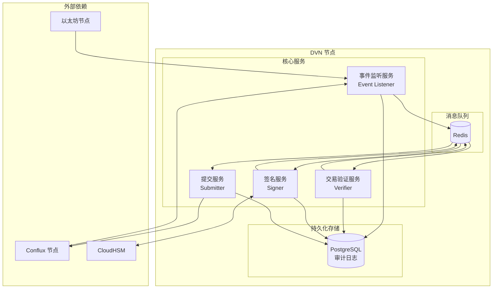
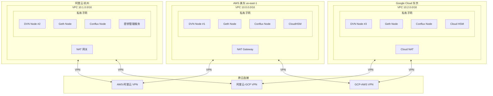
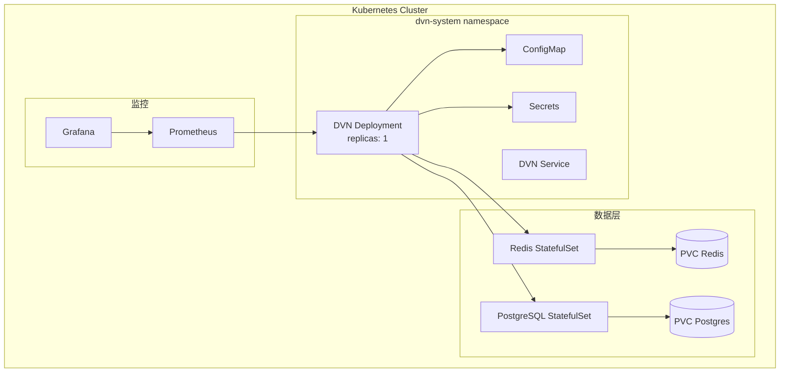

# 3. DVN 节点部署

## 3.1 DVN 节点架构



---

## 3.2 多区域部署架构



---

## 3.3 DVN 服务实现

### 3.3.1 项目结构

```bash
dvn-service/
├── cmd/
│   └── dvn/
│       └── main.go
├── internal/
│   ├── listener/
│   │   └── listener.go
│   ├── verifier/
│   │   └── verifier.go
│   ├── signer/
│   │   └── signer.go
│   ├── submitter/
│   │   └── submitter.go
│   └── config/
│       └── config.go
├── pkg/
│   ├── hsm/
│   │   ├── aws.go
│   │   ├── aliyun.go
│   │   └── gcp.go
│   └── ethereum/
│       └── client.go
├── docker-compose.yml
├── Dockerfile
└── config.yaml
```

### 3.3.2 配置文件

```yaml
# config.yaml
service:
  name: dvn-node-1
  region: aws-us-east-1
  log_level: info

# 源链配置
source_chains:
  ethereum:
    chain_id: 1
    eid: 30101
    rpc_url: "http://10.0.2.100:8545"  # 内网 Geth 节点
    confirmations: 12
    block_time: 12s
    contracts:
      endpoint: "0x1a44076050125825900e736c501f859c50fE728c"
      send_lib: "0x..."
      
  arbitrum:
    chain_id: 42161
    eid: 30110
    rpc_url: "http://10.0.2.101:8545"
    confirmations: 64
    block_time: 250ms

# 目标链配置
target_chains:
  conflux:
    chain_id: 1030
    eid: 30250
    rpc_url: "http://10.0.2.102:8545"  # 内网 Conflux 节点
    contracts:
      endpoint: "0x..."
      receive_lib: "0x..."
      dvn: "0x..."

# HSM 配置
hsm:
  provider: aws  # aws | aliyun | gcp
  aws:
    cluster_id: "cluster-xxx"
    hsm_ip: "10.0.2.200"
    key_label: "dvn-signing-key"
    pin_env: "HSM_PIN"
  aliyun:
    region: "cn-hangzhou"
    key_id: "key-xxx"
  gcp:
    project: "your-project"
    location: "asia-northeast1"
    key_ring: "dvn-keyring"
    key_name: "signing-key"

# Redis 配置
redis:
  addr: "10.0.2.50:6379"
  password_env: "REDIS_PASSWORD"
  db: 0

# PostgreSQL 配置
postgres:
  host: "10.0.2.51"
  port: 5432
  database: "dvn"
  user: "dvn"
  password_env: "POSTGRES_PASSWORD"

# 签名配置
signing:
  quorum: 2
  total_signers: 3
  timeout: 30s
```

### 3.3.3 事件监听器

```go
// internal/listener/listener.go
package listener

import (
    "context"
    "log"
    "math/big"
    
    "github.com/ethereum/go-ethereum"
    "github.com/ethereum/go-ethereum/common"
    "github.com/ethereum/go-ethereum/core/types"
    "github.com/ethereum/go-ethereum/ethclient"
)

type PacketSentEvent struct {
    Nonce       uint64
    SrcEid      uint32
    Sender      common.Address
    DstEid      uint32
    Receiver    common.Address
    Guid        [32]byte
    Message     []byte
    PayloadHash [32]byte
    BlockNumber uint64
    TxHash      common.Hash
}

type Listener struct {
    client       *ethclient.Client
    sendLibAddr  common.Address
    confirmations uint64
    eventChan    chan *PacketSentEvent
}

func NewListener(rpcURL string, sendLibAddr string, confirmations uint64) (*Listener, error) {
    client, err := ethclient.Dial(rpcURL)
    if err != nil {
        return nil, err
    }
    
    return &Listener{
        client:        client,
        sendLibAddr:   common.HexToAddress(sendLibAddr),
        confirmations: confirmations,
        eventChan:     make(chan *PacketSentEvent, 1000),
    }, nil
}

func (l *Listener) Start(ctx context.Context) error {
    // PacketSent 事件签名
    packetSentTopic := common.HexToHash("0x...")
    
    query := ethereum.FilterQuery{
        Addresses: []common.Address{l.sendLibAddr},
        Topics:    [][]common.Hash{{packetSentTopic}},
    }
    
    logs := make(chan types.Log)
    sub, err := l.client.SubscribeFilterLogs(ctx, query, logs)
    if err != nil {
        return err
    }
    
    go func() {
        for {
            select {
            case <-ctx.Done():
                return
            case err := <-sub.Err():
                log.Printf("Subscription error: %v", err)
            case vLog := <-logs:
                l.handleLog(ctx, vLog)
            }
        }
    }()
    
    return nil
}

func (l *Listener) handleLog(ctx context.Context, vLog types.Log) {
    // 等待确认
    for {
        currentBlock, err := l.client.BlockNumber(ctx)
        if err != nil {
            continue
        }
        
        if currentBlock >= vLog.BlockNumber + l.confirmations {
            break
        }
        
        time.Sleep(time.Second)
    }
    
    // 解析事件
    event, err := l.parsePacketSentEvent(vLog)
    if err != nil {
        log.Printf("Failed to parse event: %v", err)
        return
    }
    
    l.eventChan <- event
}

func (l *Listener) Events() <-chan *PacketSentEvent {
    return l.eventChan
}
```

### 3.3.4 签名服务 (HSM)

```go
// internal/signer/signer.go
package signer

import (
    "context"
    "crypto/ecdsa"
    
    "github.com/miekg/pkcs11"
)

type HSMSigner struct {
    ctx      *pkcs11.Ctx
    session  pkcs11.SessionHandle
    keyHandle pkcs11.ObjectHandle
}

func NewHSMSigner(libraryPath, pin, keyLabel string) (*HSMSigner, error) {
    ctx := pkcs11.New(libraryPath)
    if err := ctx.Initialize(); err != nil {
        return nil, err
    }
    
    slots, err := ctx.GetSlotList(true)
    if err != nil {
        return nil, err
    }
    
    session, err := ctx.OpenSession(slots[0], pkcs11.CKF_SERIAL_SESSION|pkcs11.CKF_RW_SESSION)
    if err != nil {
        return nil, err
    }
    
    if err := ctx.Login(session, pkcs11.CKU_USER, pin); err != nil {
        return nil, err
    }
    
    // 查找密钥
    template := []*pkcs11.Attribute{
        pkcs11.NewAttribute(pkcs11.CKA_CLASS, pkcs11.CKO_PRIVATE_KEY),
        pkcs11.NewAttribute(pkcs11.CKA_LABEL, keyLabel),
    }
    
    if err := ctx.FindObjectsInit(session, template); err != nil {
        return nil, err
    }
    
    objs, _, err := ctx.FindObjects(session, 1)
    if err != nil {
        return nil, err
    }
    ctx.FindObjectsFinal(session)
    
    return &HSMSigner{
        ctx:       ctx,
        session:   session,
        keyHandle: objs[0],
    }, nil
}

func (s *HSMSigner) Sign(data []byte) ([]byte, error) {
    mechanism := []*pkcs11.Mechanism{
        pkcs11.NewMechanism(pkcs11.CKM_ECDSA, nil),
    }
    
    if err := s.ctx.SignInit(s.session, mechanism, s.keyHandle); err != nil {
        return nil, err
    }
    
    // 对数据进行 keccak256 哈希
    hash := crypto.Keccak256(data)
    
    signature, err := s.ctx.Sign(s.session, hash)
    if err != nil {
        return nil, err
    }
    
    // 转换为以太坊签名格式 (r, s, v)
    return formatEthereumSignature(signature, hash)
}

func (s *HSMSigner) GetPublicKey() ([]byte, error) {
    // 获取对应的公钥
    template := []*pkcs11.Attribute{
        pkcs11.NewAttribute(pkcs11.CKA_CLASS, pkcs11.CKO_PUBLIC_KEY),
        pkcs11.NewAttribute(pkcs11.CKA_LABEL, keyLabel),
    }
    
    // ... 获取公钥逻辑
    return publicKey, nil
}

func (s *HSMSigner) Close() error {
    s.ctx.Logout(s.session)
    s.ctx.CloseSession(s.session)
    s.ctx.Finalize()
    return nil
}
```

### 3.3.5 提交服务

```go
// internal/submitter/submitter.go
package submitter

import (
    "context"
    "math/big"
    
    "github.com/ethereum/go-ethereum/accounts/abi/bind"
    "github.com/ethereum/go-ethereum/common"
    "github.com/ethereum/go-ethereum/ethclient"
)

type Submitter struct {
    client     *ethclient.Client
    dvnContract *DVNContract
    auth       *bind.TransactOpts
}

func NewSubmitter(rpcURL, dvnAddr, privateKey string) (*Submitter, error) {
    client, err := ethclient.Dial(rpcURL)
    if err != nil {
        return nil, err
    }
    
    dvn, err := NewDVNContract(common.HexToAddress(dvnAddr), client)
    if err != nil {
        return nil, err
    }
    
    // 创建交易选项 (使用 HSM 签名)
    auth, err := createTransactOpts(client, privateKey)
    if err != nil {
        return nil, err
    }
    
    return &Submitter{
        client:     client,
        dvnContract: dvn,
        auth:       auth,
    }, nil
}

func (s *Submitter) Submit(ctx context.Context, verification *Verification) error {
    // 准备签名数组
    signatures := make([][]byte, len(verification.Signatures))
    for i, sig := range verification.Signatures {
        signatures[i] = sig
    }
    
    // 调用合约
    tx, err := s.dvnContract.VerifyAndSubmit(
        s.auth,
        verification.PacketHeader,
        verification.PayloadHash,
        verification.Confirmations,
        signatures,
    )
    if err != nil {
        return err
    }
    
    // 等待确认
    receipt, err := bind.WaitMined(ctx, s.client, tx)
    if err != nil {
        return err
    }
    
    if receipt.Status != 1 {
        return fmt.Errorf("transaction failed")
    }
    
    log.Printf("Verification submitted: %s", tx.Hash().Hex())
    return nil
}
```

---

## 3.4 Docker 部署

### 3.4.1 Dockerfile

```dockerfile
# Dockerfile
FROM golang:1.21-alpine AS builder

WORKDIR /app
COPY go.mod go.sum ./
RUN go mod download

COPY . .
RUN CGO_ENABLED=0 GOOS=linux go build -o dvn ./cmd/dvn

FROM alpine:3.18

# 安装 CloudHSM 客户端
RUN apk add --no-cache ca-certificates

WORKDIR /app
COPY --from=builder /app/dvn .
COPY config.yaml .

# CloudHSM PKCS#11 库
COPY --from=cloudhsm /opt/cloudhsm/lib/libcloudhsm_pkcs11.so /opt/cloudhsm/lib/

ENV CLOUDHSM_PKCS11_LIBRARY=/opt/cloudhsm/lib/libcloudhsm_pkcs11.so

ENTRYPOINT ["./dvn"]
```

### 3.4.2 Docker Compose

```yaml
# docker-compose.yml
version: '3.8'

services:
  dvn:
    build: .
    container_name: dvn-node
    restart: unless-stopped
    environment:
      - HSM_PIN=${HSM_PIN}
      - REDIS_PASSWORD=${REDIS_PASSWORD}
      - POSTGRES_PASSWORD=${POSTGRES_PASSWORD}
    volumes:
      - ./config.yaml:/app/config.yaml:ro
      - /opt/cloudhsm:/opt/cloudhsm:ro
    networks:
      - dvn-network
    depends_on:
      - redis
      - postgres
    logging:
      driver: json-file
      options:
        max-size: "100m"
        max-file: "5"

  redis:
    image: redis:7-alpine
    container_name: dvn-redis
    restart: unless-stopped
    command: redis-server --requirepass ${REDIS_PASSWORD}
    volumes:
      - redis-data:/data
    networks:
      - dvn-network

  postgres:
    image: postgres:15-alpine
    container_name: dvn-postgres
    restart: unless-stopped
    environment:
      - POSTGRES_USER=dvn
      - POSTGRES_PASSWORD=${POSTGRES_PASSWORD}
      - POSTGRES_DB=dvn
    volumes:
      - postgres-data:/var/lib/postgresql/data
    networks:
      - dvn-network

networks:
  dvn-network:
    driver: bridge

volumes:
  redis-data:
  postgres-data:
```

---

## 3.5 Kubernetes 部署

### 3.5.1 部署架构



### 3.5.2 Kubernetes 清单

```yaml
# k8s/deployment.yaml
apiVersion: apps/v1
kind: Deployment
metadata:
  name: dvn-node
  namespace: dvn-system
spec:
  replicas: 1
  selector:
    matchLabels:
      app: dvn-node
  template:
    metadata:
      labels:
        app: dvn-node
    spec:
      serviceAccountName: dvn-sa
      containers:
      - name: dvn
        image: your-registry/dvn-node:latest
        ports:
        - containerPort: 8080
          name: metrics
        env:
        - name: HSM_PIN
          valueFrom:
            secretKeyRef:
              name: dvn-secrets
              key: hsm-pin
        - name: REDIS_PASSWORD
          valueFrom:
            secretKeyRef:
              name: dvn-secrets
              key: redis-password
        volumeMounts:
        - name: config
          mountPath: /app/config.yaml
          subPath: config.yaml
        - name: cloudhsm
          mountPath: /opt/cloudhsm
        resources:
          requests:
            cpu: "500m"
            memory: "1Gi"
          limits:
            cpu: "2"
            memory: "4Gi"
        livenessProbe:
          httpGet:
            path: /health
            port: 8080
          initialDelaySeconds: 30
          periodSeconds: 10
        readinessProbe:
          httpGet:
            path: /ready
            port: 8080
          initialDelaySeconds: 5
          periodSeconds: 5
      volumes:
      - name: config
        configMap:
          name: dvn-config
      - name: cloudhsm
        hostPath:
          path: /opt/cloudhsm
          type: Directory
---
apiVersion: v1
kind: Service
metadata:
  name: dvn-node
  namespace: dvn-system
spec:
  selector:
    app: dvn-node
  ports:
  - port: 8080
    targetPort: 8080
    name: metrics
```

---

## 3.6 启动脚本

```bash
#!/bin/bash
# deploy_dvn.sh

set -e

echo "============================================"
echo "部署 DVN 节点"
echo "============================================"

# 检查环境变量
required_vars=("HSM_PIN" "REDIS_PASSWORD" "POSTGRES_PASSWORD")
for var in "${required_vars[@]}"; do
    if [ -z "${!var}" ]; then
        echo "Error: $var is not set"
        exit 1
    fi
done

# 创建必要目录
mkdir -p /opt/dvn/logs
mkdir -p /opt/dvn/data

# 启动服务
echo "Starting DVN services..."
docker-compose up -d

# 等待服务启动
echo "Waiting for services to start..."
sleep 10

# 检查健康状态
echo "Checking health..."
curl -f http://localhost:8080/health || {
    echo "Health check failed"
    docker-compose logs
    exit 1
}

echo "============================================"
echo "DVN 节点部署完成"
echo "============================================"
```

---

## 3.7 监控指标

```go
// 关键监控指标
var (
    eventsReceived = prometheus.NewCounterVec(
        prometheus.CounterOpts{
            Name: "dvn_events_received_total",
            Help: "Total number of events received",
        },
        []string{"chain", "status"},
    )
    
    verificationLatency = prometheus.NewHistogramVec(
        prometheus.HistogramOpts{
            Name:    "dvn_verification_latency_seconds",
            Help:    "Verification latency in seconds",
            Buckets: prometheus.DefBuckets,
        },
        []string{"chain"},
    )
    
    signingErrors = prometheus.NewCounterVec(
        prometheus.CounterOpts{
            Name: "dvn_signing_errors_total",
            Help: "Total number of signing errors",
        },
        []string{"chain", "error_type"},
    )
    
    submissionSuccess = prometheus.NewCounterVec(
        prometheus.CounterOpts{
            Name: "dvn_submission_success_total",
            Help: "Total successful submissions",
        },
        []string{"target_chain"},
    )
)
```

