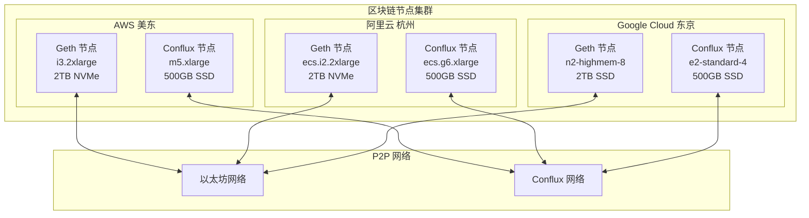
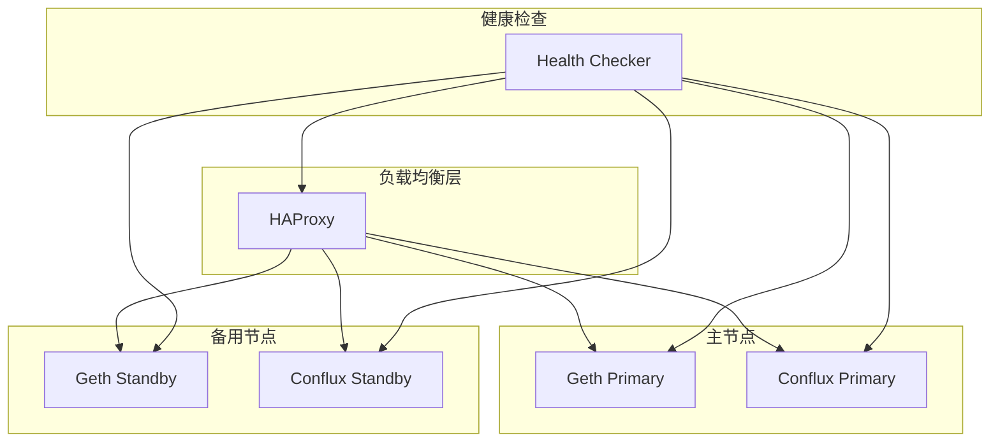
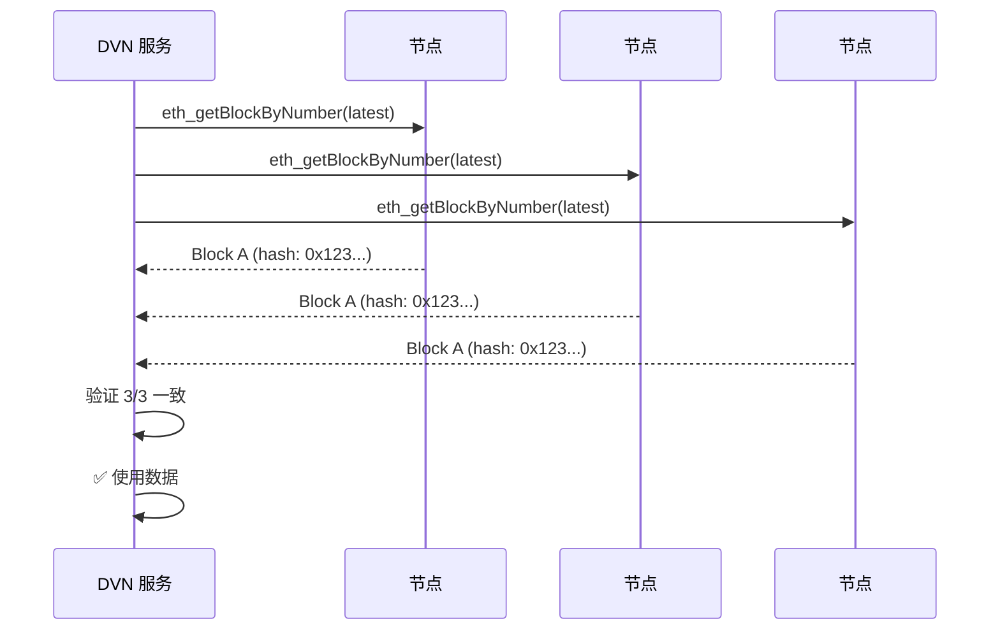

# 4. 区块链节点部署

## 4.1 节点部署架构



---

## 4.2 硬件要求

### 以太坊节点

| 配置项 | 最低要求 | 推荐配置 |
|--------|---------|---------|
| CPU | 4 核 | 8 核 |
| 内存 | 16 GB | 32 GB |
| 存储 | 1 TB SSD | 2 TB NVMe |
| IOPS | 10,000 | 16,000+ |
| 带宽 | 25 Mbps | 100 Mbps |
| 同步时间 | 3-5 天 | 1-2 天 |

### Conflux 节点

| 配置项 | 最低要求 | 推荐配置 |
|--------|---------|---------|
| CPU | 4 核 | 8 核 |
| 内存 | 8 GB | 16 GB |
| 存储 | 200 GB SSD | 500 GB SSD |
| 带宽 | 10 Mbps | 50 Mbps |
| 同步时间 | 6-12 小时 | 3-6 小时 |

---

## 4.3 以太坊节点部署

### 4.3.1 AWS 部署脚本

```bash
#!/bin/bash
# deploy_geth_aws.sh

set -e

# 配置
INSTANCE_TYPE="i3.2xlarge"
AMI_ID="ami-0c55b159cbfafe1f0"  # Amazon Linux 2
KEY_NAME="dvn-key"
SECURITY_GROUP="sg-xxx"
SUBNET_ID="subnet-xxx"

echo "创建 EC2 实例..."

INSTANCE_ID=$(aws ec2 run-instances \
    --image-id $AMI_ID \
    --instance-type $INSTANCE_TYPE \
    --key-name $KEY_NAME \
    --security-group-ids $SECURITY_GROUP \
    --subnet-id $SUBNET_ID \
    --block-device-mappings '[
        {
            "DeviceName": "/dev/xvda",
            "Ebs": {
                "VolumeSize": 100,
                "VolumeType": "gp3"
            }
        }
    ]' \
    --tag-specifications 'ResourceType=instance,Tags=[{Key=Name,Value=geth-node}]' \
    --query 'Instances[0].InstanceId' \
    --output text)

echo "实例 ID: $INSTANCE_ID"

# 等待实例运行
aws ec2 wait instance-running --instance-ids $INSTANCE_ID

# 获取私有 IP
PRIVATE_IP=$(aws ec2 describe-instances \
    --instance-ids $INSTANCE_ID \
    --query 'Reservations[0].Instances[0].PrivateIpAddress' \
    --output text)

echo "私有 IP: $PRIVATE_IP"
echo "RPC 端点: http://$PRIVATE_IP:8545"
```

### 4.3.2 Geth 安装脚本

```bash
#!/bin/bash
# setup_geth.sh

set -e

echo "============================================"
echo "安装 Geth 以太坊节点"
echo "============================================"

# 安装依赖
sudo yum update -y
sudo yum install -y golang git

# 安装 Geth
cd /tmp
git clone https://github.com/ethereum/go-ethereum.git
cd go-ethereum
git checkout v1.13.5
make geth

sudo cp build/bin/geth /usr/local/bin/

# 创建用户和目录
sudo useradd --no-create-home --shell /bin/false geth
sudo mkdir -p /data/ethereum
sudo chown geth:geth /data/ethereum

# 挂载 NVMe 磁盘 (i3 实例)
NVME_DEVICE=$(lsblk -d -o NAME,SIZE | grep nvme | head -1 | awk '{print $1}')
if [ ! -z "$NVME_DEVICE" ]; then
    sudo mkfs.xfs /dev/$NVME_DEVICE
    sudo mount /dev/$NVME_DEVICE /data/ethereum
    echo "/dev/$NVME_DEVICE /data/ethereum xfs defaults,nofail 0 2" | sudo tee -a /etc/fstab
    sudo chown geth:geth /data/ethereum
fi

# 创建配置文件
sudo cat > /etc/geth/config.toml << 'EOF'
[Eth]
NetworkId = 1
SyncMode = "snap"
NoPruning = false
NoPrefetch = false
TxLookupLimit = 2350000

[Eth.TxPool]
Locals = []
NoLocals = false
Journal = "transactions.rlp"
Rejournal = 3600000000000
PriceLimit = 1
PriceBump = 10
AccountSlots = 16
GlobalSlots = 5120
AccountQueue = 64
GlobalQueue = 1024
Lifetime = 10800000000000

[Node]
DataDir = "/data/ethereum"
IPCPath = "geth.ipc"
HTTPHost = "0.0.0.0"
HTTPPort = 8545
HTTPCors = ["*"]
HTTPVirtualHosts = ["*"]
HTTPModules = ["eth", "net", "web3", "txpool"]
WSHost = "0.0.0.0"
WSPort = 8546
WSOrigins = ["*"]
WSModules = ["eth", "net", "web3"]

[Node.P2P]
MaxPeers = 50
NoDiscovery = false
ListenAddr = ":30303"
EOF

# 创建 systemd 服务
sudo cat > /etc/systemd/system/geth.service << 'EOF'
[Unit]
Description=Geth Ethereum Node
After=network.target
Wants=network.target

[Service]
User=geth
Group=geth
Type=simple
Restart=always
RestartSec=5
ExecStart=/usr/local/bin/geth \
    --config /etc/geth/config.toml \
    --cache 8192 \
    --maxpeers 50

[Install]
WantedBy=multi-user.target
EOF

# 启动服务
sudo systemctl daemon-reload
sudo systemctl enable geth
sudo systemctl start geth

echo "Geth 节点启动成功"
echo "查看日志: sudo journalctl -u geth -f"
```

### 4.3.3 同步状态检查

```bash
#!/bin/bash
# check_sync.sh

check_geth_sync() {
    local RPC_URL=$1
    
    SYNC_STATUS=$(curl -s -X POST \
        -H "Content-Type: application/json" \
        --data '{"jsonrpc":"2.0","method":"eth_syncing","params":[],"id":1}' \
        $RPC_URL)
    
    if echo "$SYNC_STATUS" | grep -q '"result":false'; then
        echo "✅ 节点已完全同步"
        
        # 获取最新区块
        BLOCK=$(curl -s -X POST \
            -H "Content-Type: application/json" \
            --data '{"jsonrpc":"2.0","method":"eth_blockNumber","params":[],"id":1}' \
            $RPC_URL | jq -r '.result')
        
        echo "最新区块: $((16#${BLOCK:2}))"
    else
        echo "⏳ 节点正在同步..."
        echo "$SYNC_STATUS" | jq '.result'
    fi
}

# 检查所有节点
echo "=== AWS 节点 ==="
check_geth_sync "http://10.0.2.100:8545"

echo ""
echo "=== 阿里云节点 ==="
check_geth_sync "http://10.1.2.100:8545"

echo ""
echo "=== GCP 节点 ==="
check_geth_sync "http://10.2.2.100:8545"
```

---

## 4.4 Conflux 节点部署

### 4.4.1 安装脚本

```bash
#!/bin/bash
# setup_conflux.sh

set -e

echo "============================================"
echo "安装 Conflux 节点"
echo "============================================"

# 安装依赖
sudo yum install -y cmake gcc g++ clang libssl-dev pkg-config

# 下载 Conflux
VERSION="2.3.0"
cd /tmp
wget https://github.com/Conflux-Chain/conflux-rust/releases/download/v${VERSION}/conflux_linux_v${VERSION}.tar.gz
tar -xzf conflux_linux_v${VERSION}.tar.gz

sudo mv conflux_linux_v${VERSION}/conflux /usr/local/bin/
sudo chmod +x /usr/local/bin/conflux

# 创建用户和目录
sudo useradd --no-create-home --shell /bin/false conflux
sudo mkdir -p /data/conflux
sudo chown conflux:conflux /data/conflux

# 创建配置文件
sudo mkdir -p /etc/conflux
sudo cat > /etc/conflux/conflux.toml << 'EOF'
# 基本配置
mode = "archive"
public_rpc_apis = "cfx,debug,pubsub,pos,trace"

# 数据目录
conflux_data_dir = "/data/conflux"

# 网络配置
chain_id = 1030
bootnodes = [
    "cfxnode://...",  # 官方引导节点
]

# JSON-RPC
jsonrpc_http_port = 12537
jsonrpc_ws_port = 12535
jsonrpc_local_http_port = 12539

# 日志
log_level = "info"

# 性能优化
tx_pool_size = 500000
tx_pool_min_native_tx_gas_price = 1000000000
EOF

# 创建 systemd 服务
sudo cat > /etc/systemd/system/conflux.service << 'EOF'
[Unit]
Description=Conflux Node
After=network.target

[Service]
User=conflux
Group=conflux
Type=simple
Restart=always
RestartSec=5
ExecStart=/usr/local/bin/conflux --config /etc/conflux/conflux.toml

[Install]
WantedBy=multi-user.target
EOF

# 启动服务
sudo systemctl daemon-reload
sudo systemctl enable conflux
sudo systemctl start conflux

echo "Conflux 节点启动成功"
echo "查看日志: sudo journalctl -u conflux -f"
```

---

## 4.5 节点高可用配置



### HAProxy 配置

```bash
# /etc/haproxy/haproxy.cfg

global
    log /dev/log local0
    maxconn 4096
    user haproxy
    group haproxy
    daemon

defaults
    log global
    mode http
    option httplog
    option dontlognull
    timeout connect 5000
    timeout client  50000
    timeout server  50000

# 以太坊 RPC
frontend eth_rpc
    bind *:8545
    default_backend eth_nodes

backend eth_nodes
    balance roundrobin
    option httpchk POST /
    http-check send hdr Content-Type application/json meth POST body '{"jsonrpc":"2.0","method":"eth_blockNumber","params":[],"id":1}'
    http-check expect status 200
    
    server eth1 10.0.2.100:8545 check inter 5s fall 3 rise 2
    server eth2 10.0.2.101:8545 check inter 5s fall 3 rise 2 backup

# Conflux RPC
frontend cfx_rpc
    bind *:12537
    default_backend cfx_nodes

backend cfx_nodes
    balance roundrobin
    option httpchk POST /
    http-check send hdr Content-Type application/json meth POST body '{"jsonrpc":"2.0","method":"cfx_epochNumber","params":[],"id":1}'
    http-check expect status 200
    
    server cfx1 10.0.2.110:12537 check inter 5s fall 3 rise 2
    server cfx2 10.0.2.111:12537 check inter 5s fall 3 rise 2 backup

# 监控页面
listen stats
    bind *:8404
    stats enable
    stats uri /stats
    stats refresh 10s
```

---

## 4.6 多节点一致性验证



### 验证脚本

```python
# verify_nodes.py
import asyncio
import aiohttp
from typing import List, Dict

async def get_block(session: aiohttp.ClientSession, url: str, block: str = "latest") -> Dict:
    payload = {
        "jsonrpc": "2.0",
        "method": "eth_getBlockByNumber",
        "params": [block, False],
        "id": 1
    }
    async with session.post(url, json=payload) as resp:
        data = await resp.json()
        return data.get("result", {})

async def verify_nodes(nodes: List[str]) -> bool:
    async with aiohttp.ClientSession() as session:
        tasks = [get_block(session, node) for node in nodes]
        results = await asyncio.gather(*tasks, return_exceptions=True)
        
        valid_results = [r for r in results if isinstance(r, dict) and r.get("hash")]
        
        if len(valid_results) < 2:
            print("❌ 有效响应不足")
            return False
        
        hashes = [r["hash"] for r in valid_results]
        if len(set(hashes)) == 1:
            print(f"✅ 所有节点一致: {hashes[0]}")
            return True
        else:
            print(f"❌ 节点不一致: {hashes}")
            return False

if __name__ == "__main__":
    nodes = [
        "http://10.0.2.100:8545",
        "http://10.1.2.100:8545",
        "http://10.2.2.100:8545",
    ]
    asyncio.run(verify_nodes(nodes))
```

---

## 4.7 监控指标

| 指标 | 描述 | 告警阈值 |
|------|------|---------|
| `node_sync_status` | 同步状态 | syncing = true |
| `node_block_height` | 区块高度 | 落后 > 10 块 |
| `node_peer_count` | 对等节点数 | < 5 |
| `node_disk_usage` | 磁盘使用率 | > 85% |
| `node_rpc_latency` | RPC 延迟 | > 500ms |
| `node_rpc_errors` | RPC 错误数 | > 10/分钟 |

