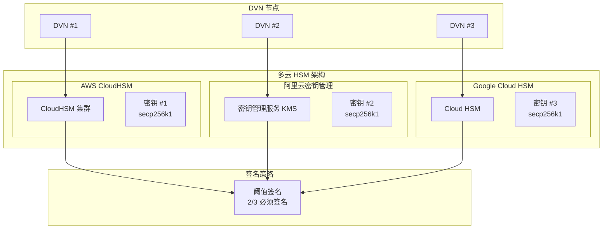
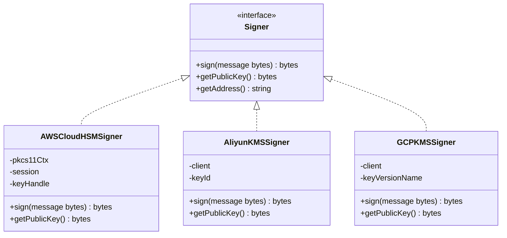
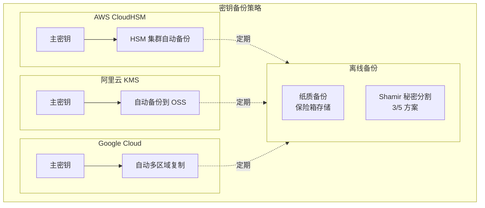
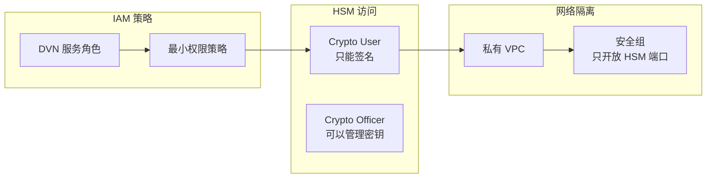
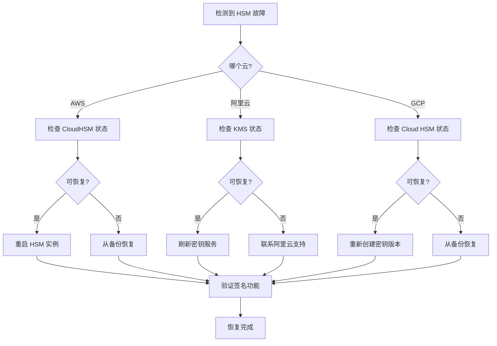

# 5. HSM 多云部署

## 5.1 多云 HSM 架构



---

## 5.2 AWS CloudHSM 部署

### 5.2.1 创建 HSM 集群

```bash
#!/bin/bash
# create_aws_hsm.sh

set -e

# 配置
VPC_ID="vpc-xxx"
SUBNET_ID="subnet-xxx"
REGION="us-east-1"

echo "创建 CloudHSM 集群..."

# 创建集群
CLUSTER_ID=$(aws cloudhsmv2 create-cluster \
    --hsm-type hsm1.medium \
    --subnet-ids $SUBNET_ID \
    --region $REGION \
    --query 'Cluster.ClusterId' \
    --output text)

echo "集群 ID: $CLUSTER_ID"

# 等待集群创建完成
echo "等待集群初始化..."
aws cloudhsmv2 wait cluster-active \
    --cluster-id $CLUSTER_ID \
    --region $REGION

# 创建 HSM
echo "创建 HSM 实例..."
HSM_ID=$(aws cloudhsmv2 create-hsm \
    --cluster-id $CLUSTER_ID \
    --availability-zone ${REGION}a \
    --region $REGION \
    --query 'Hsm.HsmId' \
    --output text)

echo "HSM ID: $HSM_ID"

# 等待 HSM 激活
aws cloudhsmv2 wait hsm-available \
    --hsm-id $HSM_ID \
    --region $REGION

# 获取 HSM IP
HSM_IP=$(aws cloudhsmv2 describe-clusters \
    --cluster-ids $CLUSTER_ID \
    --region $REGION \
    --query 'Clusters[0].Hsms[0].EniIp' \
    --output text)

echo "HSM IP: $HSM_IP"
echo "============================================"
echo "CloudHSM 集群创建完成"
echo "集群 ID: $CLUSTER_ID"
echo "HSM ID: $HSM_ID"
echo "HSM IP: $HSM_IP"
echo "============================================"
```

### 5.2.2 初始化 HSM

```bash
#!/bin/bash
# init_aws_hsm.sh

set -e

CLUSTER_ID="cluster-xxx"

# 1. 获取 CSR
echo "获取证书签名请求..."
aws cloudhsmv2 describe-clusters \
    --cluster-ids $CLUSTER_ID \
    --query 'Clusters[0].Certificates.ClusterCsr' \
    --output text > cluster.csr

# 2. 创建自签名 CA
echo "创建 CA..."
openssl genrsa -out customerCA.key 4096
openssl req -new -x509 -days 3652 \
    -key customerCA.key \
    -out customerCA.crt \
    -subj "/CN=DVN-CloudHSM-CA"

# 3. 签发集群证书
echo "签发集群证书..."
openssl x509 -req -days 3652 \
    -in cluster.csr \
    -CA customerCA.crt \
    -CAkey customerCA.key \
    -CAcreateserial \
    -out cluster.crt

# 4. 初始化集群
echo "初始化集群..."
aws cloudhsmv2 initialize-cluster \
    --cluster-id $CLUSTER_ID \
    --signed-cert file://cluster.crt \
    --trust-anchor file://customerCA.crt

# 5. 安装客户端
echo "安装 CloudHSM 客户端..."
wget https://s3.amazonaws.com/cloudhsmv2-software/CloudHsmClient/EL7/cloudhsm-cli-latest.el7.x86_64.rpm
sudo yum install -y ./cloudhsm-cli-latest.el7.x86_64.rpm

# 6. 配置客户端
echo "配置客户端..."
sudo /opt/cloudhsm/bin/configure-cli -a $HSM_IP

# 7. 激活集群
echo "激活集群..."
/opt/cloudhsm/bin/cloudhsm-cli cluster activate

echo "输入 Crypto Officer 密码创建用户..."
```

### 5.2.3 生成密钥

```bash
#!/bin/bash
# generate_key_aws.sh

# 登录 HSM
/opt/cloudhsm/bin/cloudhsm-cli interactive

# 在交互模式中执行：
# login --username co --role crypto-officer
# <输入密码>

# 生成 ECDSA 密钥对 (secp256k1)
# key generate-asymmetric-pair --key-type ec \
#     --curve secp256k1 \
#     --label dvn-signing-key \
#     --extractable false

# 查看密钥
# key list

# 退出
# logout
# quit
```

---

## 5.3 阿里云密钥管理部署

### 5.3.1 创建密钥

```bash
#!/bin/bash
# create_aliyun_kms.sh

set -e

# 配置
REGION="cn-hangzhou"
KEY_SPEC="EC_P256"  # 阿里云暂不支持 secp256k1，使用 P256

echo "创建阿里云 KMS 密钥..."

# 创建密钥
aliyun kms CreateKey \
    --region $REGION \
    --KeySpec $KEY_SPEC \
    --KeyUsage SIGN/VERIFY \
    --Description "DVN Signing Key" \
    --ProtectionLevel HSM \
    --Origin Aliyun_KMS

# 获取密钥 ID
KEY_ID=$(aliyun kms ListKeys \
    --region $REGION \
    --query 'Keys.Key[0].KeyId' \
    --output text)

echo "密钥 ID: $KEY_ID"

# 创建别名
aliyun kms CreateAlias \
    --region $REGION \
    --KeyId $KEY_ID \
    --AliasName alias/dvn-signing-key

echo "阿里云 KMS 密钥创建完成"
```

### 5.3.2 签名接口封装

```python
# aliyun_signer.py
from aliyunsdkcore.client import AcsClient
from aliyunsdkkms.request.v20160120 import AsymmetricSignRequest
import base64
import hashlib

class AliyunKMSSigner:
    def __init__(self, access_key_id: str, access_key_secret: str, 
                 region: str, key_id: str):
        self.client = AcsClient(access_key_id, access_key_secret, region)
        self.key_id = key_id
    
    def sign(self, message: bytes) -> bytes:
        # 计算消息哈希
        digest = hashlib.sha256(message).digest()
        digest_b64 = base64.b64encode(digest).decode('utf-8')
        
        # 调用签名 API
        request = AsymmetricSignRequest.AsymmetricSignRequest()
        request.set_KeyId(self.key_id)
        request.set_Algorithm("ECDSA_SHA_256")
        request.set_Digest(digest_b64)
        
        response = self.client.do_action_with_exception(request)
        result = json.loads(response)
        
        signature_b64 = result['Value']
        signature = base64.b64decode(signature_b64)
        
        return signature
    
    def get_public_key(self) -> bytes:
        request = GetPublicKeyRequest.GetPublicKeyRequest()
        request.set_KeyId(self.key_id)
        
        response = self.client.do_action_with_exception(request)
        result = json.loads(response)
        
        return base64.b64decode(result['PublicKey'])
```

---

## 5.4 Google Cloud HSM 部署

### 5.4.1 创建密钥环和密钥

```bash
#!/bin/bash
# create_gcp_hsm.sh

set -e

# 配置
PROJECT_ID="your-project"
LOCATION="asia-northeast1"
KEYRING_NAME="dvn-keyring"
KEY_NAME="dvn-signing-key"

echo "创建 Google Cloud HSM 密钥..."

# 创建密钥环
gcloud kms keyrings create $KEYRING_NAME \
    --project=$PROJECT_ID \
    --location=$LOCATION

# 创建 HSM 密钥
gcloud kms keys create $KEY_NAME \
    --project=$PROJECT_ID \
    --location=$LOCATION \
    --keyring=$KEYRING_NAME \
    --purpose=asymmetric-signing \
    --default-algorithm=ec-sign-secp256k1-sha256 \
    --protection-level=hsm

echo "密钥创建完成"
echo "密钥路径: projects/$PROJECT_ID/locations/$LOCATION/keyRings/$KEYRING_NAME/cryptoKeys/$KEY_NAME"
```

### 5.4.2 签名接口封装

```python
# gcp_signer.py
from google.cloud import kms
import hashlib

class GCPKMSSigner:
    def __init__(self, project_id: str, location: str, 
                 keyring: str, key_name: str, key_version: str = "1"):
        self.client = kms.KeyManagementServiceClient()
        self.key_version_name = self.client.crypto_key_version_path(
            project_id, location, keyring, key_name, key_version
        )
    
    def sign(self, message: bytes) -> bytes:
        # 计算消息哈希 (secp256k1 使用 keccak256)
        digest = hashlib.sha256(message).digest()
        
        # 调用签名 API
        response = self.client.asymmetric_sign(
            request={
                "name": self.key_version_name,
                "digest": {"sha256": digest},
            }
        )
        
        return response.signature
    
    def get_public_key(self) -> bytes:
        response = self.client.get_public_key(
            request={"name": self.key_version_name}
        )
        return response.pem.encode()
```

---

## 5.5 统一签名接口



### 统一接口实现

```go
// pkg/hsm/signer.go
package hsm

import "errors"

type Signer interface {
    Sign(message []byte) ([]byte, error)
    GetPublicKey() ([]byte, error)
    GetAddress() (string, error)
    Close() error
}

type SignerConfig struct {
    Provider string // aws, aliyun, gcp
    
    // AWS
    AWSClusterID string
    AWSHSMIP     string
    AWSKeyLabel  string
    AWSPin       string
    
    // Aliyun
    AliyunRegion    string
    AliyunKeyID     string
    AliyunAccessKey string
    AliyunSecretKey string
    
    // GCP
    GCPProject  string
    GCPLocation string
    GCPKeyring  string
    GCPKeyName  string
}

func NewSigner(config *SignerConfig) (Signer, error) {
    switch config.Provider {
    case "aws":
        return NewAWSCloudHSMSigner(
            config.AWSHSMIP,
            config.AWSPin,
            config.AWSKeyLabel,
        )
    case "aliyun":
        return NewAliyunKMSSigner(
            config.AliyunAccessKey,
            config.AliyunSecretKey,
            config.AliyunRegion,
            config.AliyunKeyID,
        )
    case "gcp":
        return NewGCPKMSSigner(
            config.GCPProject,
            config.GCPLocation,
            config.GCPKeyring,
            config.GCPKeyName,
        )
    default:
        return nil, errors.New("unsupported HSM provider")
    }
}
```

---

## 5.6 密钥备份策略



### 备份检查清单

| 项目 | AWS | 阿里云 | GCP |
|------|:---:|:------:|:---:|
| 自动备份 | ✅ | ✅ | ✅ |
| 跨区域复制 | ✅ | ✅ | ✅ |
| 备份加密 | ✅ | ✅ | ✅ |
| 备份验证 | 每月 | 每月 | 每月 |
| 恢复演练 | 每季度 | 每季度 | 每季度 |

---

## 5.7 安全最佳实践

### 5.7.1 访问控制



### 5.7.2 审计日志

```yaml
# 审计日志配置
audit:
  enabled: true
  
  # 记录所有签名操作
  sign_operations:
    - timestamp
    - message_hash
    - signature
    - signer_address
    - result
    
  # 保留策略
  retention:
    hot: 30d    # 热存储
    cold: 365d  # 冷存储
    
  # 告警规则
  alerts:
    - name: high_sign_rate
      condition: "rate(sign_count[5m]) > 100"
      severity: warning
      
    - name: sign_failure
      condition: "sign_errors > 0"
      severity: critical
```

---

## 5.8 故障恢复流程



