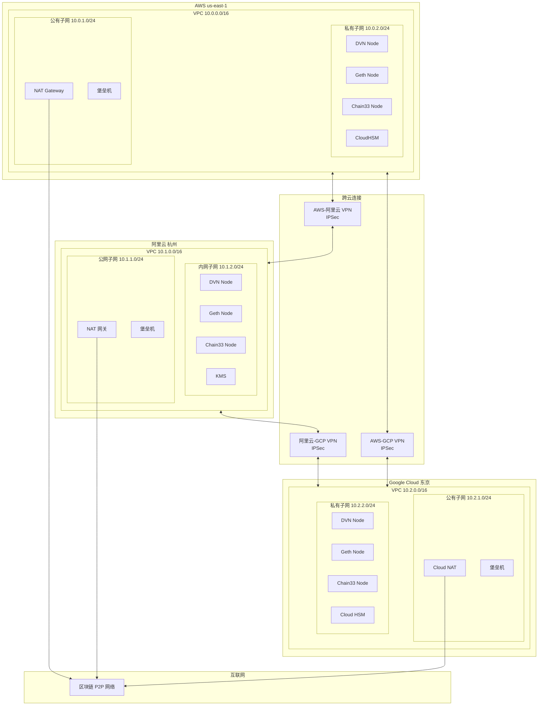
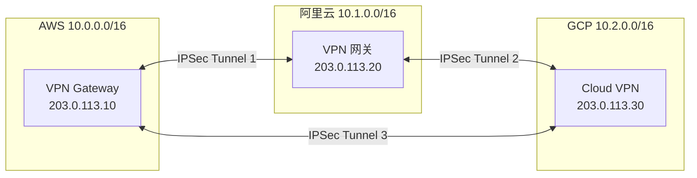
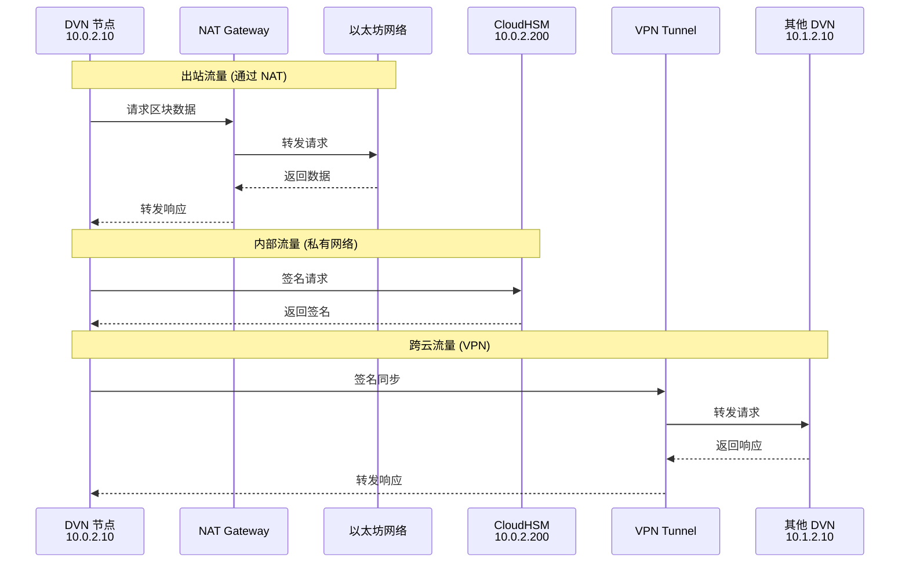
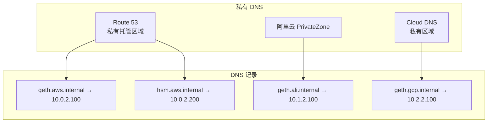

# 6. 网络架构

## 6.1 整体网络架构



---

## 6.2 AWS VPC 配置

### 6.2.1 Terraform 配置

```hcl
# aws/vpc.tf

provider "aws" {
  region = "us-east-1"
}

# VPC
resource "aws_vpc" "dvn" {
  cidr_block           = "10.0.0.0/16"
  enable_dns_hostnames = true
  enable_dns_support   = true

  tags = {
    Name = "dvn-vpc"
  }
}

# 公有子网
resource "aws_subnet" "public" {
  vpc_id                  = aws_vpc.dvn.id
  cidr_block              = "10.0.1.0/24"
  availability_zone       = "us-east-1a"
  map_public_ip_on_launch = true

  tags = {
    Name = "dvn-public-subnet"
  }
}

# 私有子网
resource "aws_subnet" "private" {
  vpc_id            = aws_vpc.dvn.id
  cidr_block        = "10.0.2.0/24"
  availability_zone = "us-east-1a"

  tags = {
    Name = "dvn-private-subnet"
  }
}

# Internet Gateway
resource "aws_internet_gateway" "main" {
  vpc_id = aws_vpc.dvn.id

  tags = {
    Name = "dvn-igw"
  }
}

# Elastic IP for NAT Gateway
resource "aws_eip" "nat" {
  domain = "vpc"

  tags = {
    Name = "dvn-nat-eip"
  }
}

# NAT Gateway
resource "aws_nat_gateway" "main" {
  allocation_id = aws_eip.nat.id
  subnet_id     = aws_subnet.public.id

  tags = {
    Name = "dvn-nat"
  }
}

# 公有子网路由表
resource "aws_route_table" "public" {
  vpc_id = aws_vpc.dvn.id

  route {
    cidr_block = "0.0.0.0/0"
    gateway_id = aws_internet_gateway.main.id
  }

  # 到阿里云的路由
  route {
    cidr_block         = "10.1.0.0/16"
    vpn_gateway_id     = aws_vpn_gateway.to_aliyun.id
  }

  # 到 GCP 的路由
  route {
    cidr_block         = "10.2.0.0/16"
    vpn_gateway_id     = aws_vpn_gateway.to_gcp.id
  }

  tags = {
    Name = "dvn-public-rt"
  }
}

# 私有子网路由表
resource "aws_route_table" "private" {
  vpc_id = aws_vpc.dvn.id

  route {
    cidr_block     = "0.0.0.0/0"
    nat_gateway_id = aws_nat_gateway.main.id
  }

  route {
    cidr_block         = "10.1.0.0/16"
    vpn_gateway_id     = aws_vpn_gateway.to_aliyun.id
  }

  route {
    cidr_block         = "10.2.0.0/16"
    vpn_gateway_id     = aws_vpn_gateway.to_gcp.id
  }

  tags = {
    Name = "dvn-private-rt"
  }
}

resource "aws_route_table_association" "public" {
  subnet_id      = aws_subnet.public.id
  route_table_id = aws_route_table.public.id
}

resource "aws_route_table_association" "private" {
  subnet_id      = aws_subnet.private.id
  route_table_id = aws_route_table.private.id
}
```

### 6.2.2 安全组配置

```hcl
# aws/security_groups.tf

# DVN 节点安全组
resource "aws_security_group" "dvn" {
  name        = "dvn-node-sg"
  description = "Security group for DVN nodes"
  vpc_id      = aws_vpc.dvn.id

  # 禁止所有入站流量（除了内网）
  ingress {
    from_port   = 0
    to_port     = 0
    protocol    = "-1"
    cidr_blocks = ["10.0.0.0/8"]  # 只允许内网
    description = "Allow internal traffic"
  }

  # 允许所有出站流量
  egress {
    from_port   = 0
    to_port     = 0
    protocol    = "-1"
    cidr_blocks = ["0.0.0.0/0"]
  }

  tags = {
    Name = "dvn-node-sg"
  }
}

# 区块链节点安全组
resource "aws_security_group" "blockchain" {
  name        = "blockchain-node-sg"
  description = "Security group for blockchain nodes"
  vpc_id      = aws_vpc.dvn.id

  # RPC 端口 (只允许内网)
  ingress {
    from_port       = 8545
    to_port         = 8545
    protocol        = "tcp"
    security_groups = [aws_security_group.dvn.id]
    description     = "ETH RPC from DVN"
  }

  ingress {
    from_port       = 12537
    to_port         = 12537
    protocol        = "tcp"
    security_groups = [aws_security_group.dvn.id]
    description     = "Coin33 RPC from DVN"
  }

  # P2P 端口
  ingress {
    from_port   = 30303
    to_port     = 30303
    protocol    = "tcp"
    cidr_blocks = ["0.0.0.0/0"]
    description = "ETH P2P"
  }

  ingress {
    from_port   = 30303
    to_port     = 30303
    protocol    = "udp"
    cidr_blocks = ["0.0.0.0/0"]
    description = "ETH P2P UDP"
  }

  egress {
    from_port   = 0
    to_port     = 0
    protocol    = "-1"
    cidr_blocks = ["0.0.0.0/0"]
  }

  tags = {
    Name = "blockchain-node-sg"
  }
}

# CloudHSM 安全组
resource "aws_security_group" "hsm" {
  name        = "cloudhsm-sg"
  description = "Security group for CloudHSM"
  vpc_id      = aws_vpc.dvn.id

  # HSM 端口 (只允许 DVN 节点)
  ingress {
    from_port       = 2223
    to_port         = 2225
    protocol        = "tcp"
    security_groups = [aws_security_group.dvn.id]
    description     = "CloudHSM from DVN"
  }

  egress {
    from_port   = 0
    to_port     = 0
    protocol    = "-1"
    cidr_blocks = ["0.0.0.0/0"]
  }

  tags = {
    Name = "cloudhsm-sg"
  }
}

# 堡垒机安全组
resource "aws_security_group" "bastion" {
  name        = "bastion-sg"
  description = "Security group for bastion host"
  vpc_id      = aws_vpc.dvn.id

  ingress {
    from_port   = 22
    to_port     = 22
    protocol    = "tcp"
    cidr_blocks = ["YOUR_IP/32"]  # 替换为管理员 IP
    description = "SSH from admin"
  }

  egress {
    from_port   = 0
    to_port     = 0
    protocol    = "-1"
    cidr_blocks = ["0.0.0.0/0"]
  }

  tags = {
    Name = "bastion-sg"
  }
}
```

---

## 6.3 跨云 VPN 配置

### 6.3.1 网络拓扑



### 6.3.2 AWS VPN 配置

```hcl
# aws/vpn.tf

# VPN Gateway
resource "aws_vpn_gateway" "to_aliyun" {
  vpc_id = aws_vpc.dvn.id

  tags = {
    Name = "dvn-vpn-to-aliyun"
  }
}

# Customer Gateway (阿里云)
resource "aws_customer_gateway" "aliyun" {
  bgp_asn    = 65000
  ip_address = "203.0.113.20"  # 阿里云 VPN 网关公网 IP
  type       = "ipsec.1"

  tags = {
    Name = "aliyun-customer-gateway"
  }
}

# VPN Connection
resource "aws_vpn_connection" "to_aliyun" {
  vpn_gateway_id      = aws_vpn_gateway.to_aliyun.id
  customer_gateway_id = aws_customer_gateway.aliyun.id
  type                = "ipsec.1"
  static_routes_only  = true

  tags = {
    Name = "vpn-to-aliyun"
  }
}

# 静态路由
resource "aws_vpn_connection_route" "aliyun" {
  destination_cidr_block = "10.1.0.0/16"
  vpn_connection_id      = aws_vpn_connection.to_aliyun.id
}
```

### 6.3.3 阿里云 VPN 配置

```bash
#!/bin/bash
# aliyun/create_vpn.sh

# 创建 VPN 网关
aliyun vpc CreateVpnGateway \
    --RegionId cn-hangzhou \
    --VpcId vpc-xxx \
    --Bandwidth 10 \
    --Name dvn-vpn-gateway

# 创建用户网关 (AWS)
aliyun vpc CreateCustomerGateway \
    --RegionId cn-hangzhou \
    --IpAddress 203.0.113.10 \
    --Name aws-customer-gateway

# 创建 IPSec 连接
aliyun vpc CreateVpnConnection \
    --RegionId cn-hangzhou \
    --VpnGatewayId vpn-xxx \
    --CustomerGatewayId cgw-xxx \
    --LocalSubnet 10.1.0.0/16 \
    --RemoteSubnet 10.0.0.0/16 \
    --Name vpn-to-aws \
    --IpsecConfig '{"IpsecAuthAlg":"sha1","IpsecEncAlg":"aes","IpsecLifetime":86400,"IpsecPfs":"group2"}' \
    --IkeConfig '{"IkeAuthAlg":"sha1","IkeEncAlg":"aes","IkeLifetime":86400,"IkeMode":"main","IkePfs":"group2","IkeVersion":"ikev2","Psk":"YOUR_PSK"}'
```

---

## 6.4 流量示意图



---

## 6.5 网络安全检查清单

| 检查项 | 状态 | 说明 |
|--------|:----:|------|
| DVN 节点无公网 IP | ✅ | 部署在私有子网 |
| 入站流量限制 | ✅ | 只允许内网访问 |
| HSM 访问限制 | ✅ | 只允许 DVN 安全组 |
| RPC 端口限制 | ✅ | 只允许 DVN 安全组 |
| VPN 加密 | ✅ | IPSec AES-256 |
| 堡垒机访问限制 | ✅ | 只允许管理员 IP |
| 流量日志 | ✅ | VPC Flow Logs 启用 |

---

## 6.6 IP 地址规划

| 区域 | 网段 | 用途 |
|------|------|------|
| **AWS** | 10.0.0.0/16 | |
| | 10.0.1.0/24 | 公有子网 (NAT, 堡垒机) |
| | 10.0.2.0/24 | 私有子网 (DVN, 节点, HSM) |
| **阿里云** | 10.1.0.0/16 | |
| | 10.1.1.0/24 | 公网子网 |
| | 10.1.2.0/24 | 内网子网 |
| **GCP** | 10.2.0.0/16 | |
| | 10.2.1.0/24 | 公有子网 |
| | 10.2.2.0/24 | 私有子网 |

### 具体 IP 分配

| 服务 | AWS | 阿里云 | GCP |
|------|-----|-------|-----|
| DVN 节点 | 10.0.2.10 | 10.1.2.10 | 10.2.2.10 |
| Geth 节点 | 10.0.2.100 | 10.1.2.100 | 10.2.2.100 |
| Chain33 节点 | 10.0.2.110 | 10.1.2.110 | 10.2.2.110 |
| HSM | 10.0.2.200 | - | 10.2.2.200 |
| Redis | 10.0.2.50 | 10.1.2.50 | 10.2.2.50 |
| PostgreSQL | 10.0.2.51 | 10.1.2.51 | 10.2.2.51 |

---

## 6.7 DNS 配置



### Route 53 私有托管区域

```hcl
# aws/dns.tf

resource "aws_route53_zone" "private" {
  name = "dvn.internal"

  vpc {
    vpc_id = aws_vpc.dvn.id
  }

  tags = {
    Name = "dvn-private-zone"
  }
}

resource "aws_route53_record" "geth" {
  zone_id = aws_route53_zone.private.zone_id
  name    = "geth.dvn.internal"
  type    = "A"
  ttl     = 300
  records = ["10.0.2.100"]
}

resource "aws_route53_record" "conflux" {
  zone_id = aws_route53_zone.private.zone_id
  name    = "conflux.dvn.internal"
  type    = "A"
  ttl     = 300
  records = ["10.0.2.110"]
}

resource "aws_route53_record" "hsm" {
  zone_id = aws_route53_zone.private.zone_id
  name    = "hsm.dvn.internal"
  type    = "A"
  ttl     = 300
  records = ["10.0.2.200"]
}
```

