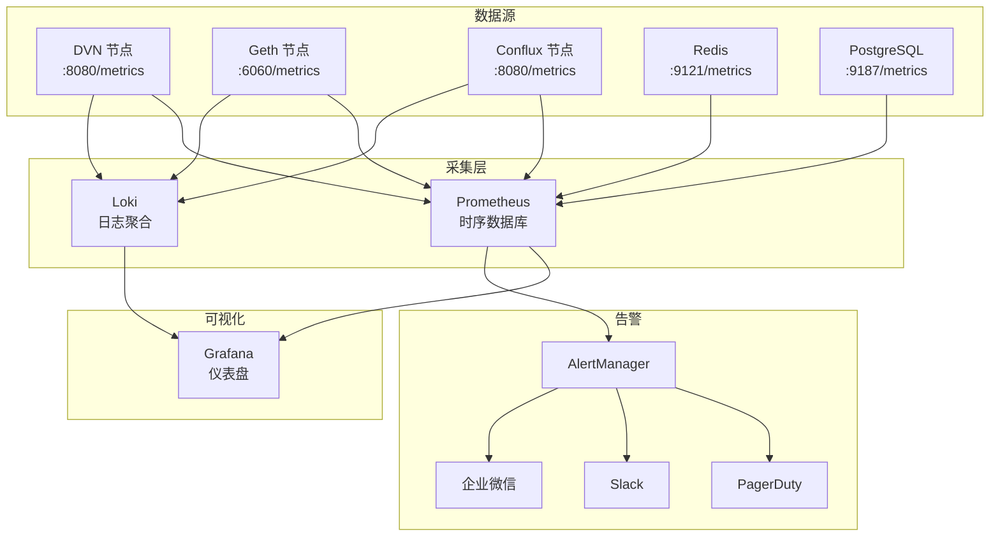
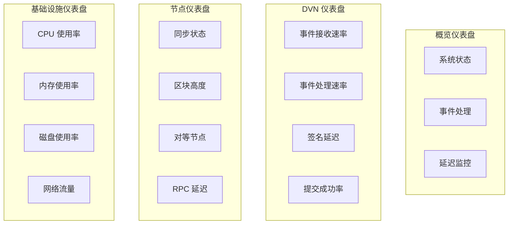
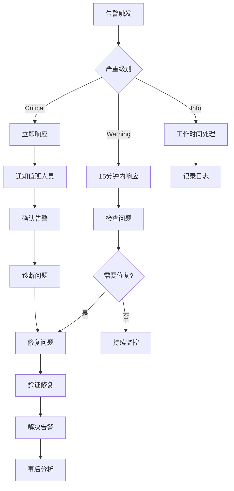

# 7. 监控告警

## 7.1 监控架构



---

## 7.2 核心监控指标

### 7.2.1 DVN 服务指标

| 指标名称 | 类型 | 描述 | 告警阈值 |
|---------|------|------|---------|
| `dvn_events_received_total` | Counter | 接收的事件总数 | - |
| `dvn_events_processed_total` | Counter | 处理的事件总数 | - |
| `dvn_events_pending` | Gauge | 待处理事件数 | > 100 |
| `dvn_verification_latency_seconds` | Histogram | 验证延迟 | p99 > 30s |
| `dvn_signing_duration_seconds` | Histogram | 签名耗时 | p99 > 5s |
| `dvn_signing_errors_total` | Counter | 签名错误数 | > 0 |
| `dvn_submission_success_total` | Counter | 成功提交数 | - |
| `dvn_submission_failed_total` | Counter | 失败提交数 | > 0 |

### 7.2.2 区块链节点指标

| 指标名称 | 描述 | 告警阈值 |
|---------|------|---------|
| `eth_syncing` | 同步状态 | true |
| `eth_block_number` | 当前区块高度 | 落后 > 10 块 |
| `eth_peer_count` | 对等节点数 | < 5 |
| `eth_rpc_latency_seconds` | RPC 延迟 | > 500ms |
| `eth_rpc_errors_total` | RPC 错误数 | > 10/min |

### 7.2.3 HSM 指标

| 指标名称 | 描述 | 告警阈值 |
|---------|------|---------|
| `hsm_connection_status` | 连接状态 | disconnected |
| `hsm_sign_operations_total` | 签名操作数 | - |
| `hsm_sign_latency_seconds` | 签名延迟 | > 1s |
| `hsm_errors_total` | 错误数 | > 0 |

---

## 7.3 Prometheus 配置

```yaml
# prometheus/prometheus.yml
global:
  scrape_interval: 15s
  evaluation_interval: 15s

alerting:
  alertmanagers:
    - static_configs:
        - targets:
            - alertmanager:9093

rule_files:
  - /etc/prometheus/rules/*.yml

scrape_configs:
  # DVN 节点
  - job_name: 'dvn'
    static_configs:
      - targets:
          - 'dvn-aws:8080'
          - 'dvn-aliyun:8080'
          - 'dvn-gcp:8080'
    relabel_configs:
      - source_labels: [__address__]
        regex: 'dvn-(.+):8080'
        target_label: region
        replacement: '$1'

  # Geth 节点
  - job_name: 'geth'
    static_configs:
      - targets:
          - 'geth-aws:6060'
          - 'geth-aliyun:6060'
          - 'geth-gcp:6060'
    metrics_path: /debug/metrics/prometheus

  # Conflux 节点
  - job_name: 'conflux'
    static_configs:
      - targets:
          - 'conflux-aws:8080'
          - 'conflux-aliyun:8080'
          - 'conflux-gcp:8080'

  # Redis
  - job_name: 'redis'
    static_configs:
      - targets:
          - 'redis-exporter:9121'

  # PostgreSQL
  - job_name: 'postgres'
    static_configs:
      - targets:
          - 'postgres-exporter:9187'

  # Node Exporter (系统指标)
  - job_name: 'node'
    static_configs:
      - targets:
          - 'dvn-aws:9100'
          - 'dvn-aliyun:9100'
          - 'dvn-gcp:9100'
          - 'geth-aws:9100'
          - 'geth-aliyun:9100'
          - 'geth-gcp:9100'
```

---

## 7.4 告警规则

```yaml
# prometheus/rules/dvn.yml
groups:
  - name: dvn
    rules:
      # DVN 事件积压
      - alert: DVNEventBacklog
        expr: dvn_events_pending > 100
        for: 5m
        labels:
          severity: warning
        annotations:
          summary: "DVN 事件积压"
          description: "{{ $labels.instance }} 有 {{ $value }} 个待处理事件"

      # DVN 签名错误
      - alert: DVNSigningError
        expr: increase(dvn_signing_errors_total[5m]) > 0
        for: 1m
        labels:
          severity: critical
        annotations:
          summary: "DVN 签名错误"
          description: "{{ $labels.instance }} 发生签名错误"

      # DVN 提交失败
      - alert: DVNSubmissionFailed
        expr: increase(dvn_submission_failed_total[5m]) > 0
        for: 1m
        labels:
          severity: critical
        annotations:
          summary: "DVN 提交失败"
          description: "{{ $labels.instance }} 验证提交失败"

      # DVN 服务不可用
      - alert: DVNDown
        expr: up{job="dvn"} == 0
        for: 1m
        labels:
          severity: critical
        annotations:
          summary: "DVN 服务不可用"
          description: "{{ $labels.instance }} 无法访问"

  - name: blockchain
    rules:
      # 节点同步中
      - alert: NodeSyncing
        expr: eth_syncing == 1
        for: 30m
        labels:
          severity: warning
        annotations:
          summary: "节点正在同步"
          description: "{{ $labels.instance }} 正在同步超过 30 分钟"

      # 节点落后
      - alert: NodeBehind
        expr: eth_block_number < (max(eth_block_number) - 10)
        for: 5m
        labels:
          severity: warning
        annotations:
          summary: "节点区块落后"
          description: "{{ $labels.instance }} 落后 {{ $value }} 个区块"

      # 对等节点过少
      - alert: LowPeerCount
        expr: eth_peer_count < 5
        for: 10m
        labels:
          severity: warning
        annotations:
          summary: "对等节点过少"
          description: "{{ $labels.instance }} 只有 {{ $value }} 个对等节点"

  - name: hsm
    rules:
      # HSM 连接断开
      - alert: HSMDisconnected
        expr: hsm_connection_status == 0
        for: 1m
        labels:
          severity: critical
        annotations:
          summary: "HSM 连接断开"
          description: "{{ $labels.instance }} HSM 连接丢失"

      # HSM 签名延迟高
      - alert: HSMHighLatency
        expr: histogram_quantile(0.99, hsm_sign_latency_seconds_bucket) > 1
        for: 5m
        labels:
          severity: warning
        annotations:
          summary: "HSM 签名延迟高"
          description: "{{ $labels.instance }} HSM 签名 p99 延迟 {{ $value }}s"

  - name: infrastructure
    rules:
      # CPU 使用率高
      - alert: HighCPUUsage
        expr: 100 - (avg by(instance) (irate(node_cpu_seconds_total{mode="idle"}[5m])) * 100) > 80
        for: 10m
        labels:
          severity: warning
        annotations:
          summary: "CPU 使用率高"
          description: "{{ $labels.instance }} CPU 使用率 {{ $value }}%"

      # 内存使用率高
      - alert: HighMemoryUsage
        expr: (1 - node_memory_MemAvailable_bytes / node_memory_MemTotal_bytes) * 100 > 85
        for: 10m
        labels:
          severity: warning
        annotations:
          summary: "内存使用率高"
          description: "{{ $labels.instance }} 内存使用率 {{ $value }}%"

      # 磁盘使用率高
      - alert: HighDiskUsage
        expr: (1 - node_filesystem_avail_bytes{mountpoint="/"} / node_filesystem_size_bytes{mountpoint="/"}) * 100 > 85
        for: 10m
        labels:
          severity: warning
        annotations:
          summary: "磁盘使用率高"
          description: "{{ $labels.instance }} 磁盘使用率 {{ $value }}%"
```

---

## 7.5 Grafana 仪表盘

### 7.5.1 仪表盘概览



### 7.5.2 仪表盘 JSON

```json
{
  "dashboard": {
    "title": "DVN 监控概览",
    "panels": [
      {
        "title": "DVN 服务状态",
        "type": "stat",
        "targets": [
          {
            "expr": "sum(up{job='dvn'})",
            "legendFormat": "运行中"
          }
        ],
        "fieldConfig": {
          "defaults": {
            "thresholds": {
              "steps": [
                {"color": "red", "value": 0},
                {"color": "yellow", "value": 2},
                {"color": "green", "value": 3}
              ]
            }
          }
        }
      },
      {
        "title": "事件处理速率",
        "type": "graph",
        "targets": [
          {
            "expr": "sum(rate(dvn_events_processed_total[5m]))",
            "legendFormat": "处理速率"
          },
          {
            "expr": "sum(rate(dvn_events_received_total[5m]))",
            "legendFormat": "接收速率"
          }
        ]
      },
      {
        "title": "签名延迟 (p99)",
        "type": "graph",
        "targets": [
          {
            "expr": "histogram_quantile(0.99, sum(rate(dvn_signing_duration_seconds_bucket[5m])) by (le, region))",
            "legendFormat": "{{region}}"
          }
        ]
      },
      {
        "title": "提交成功率",
        "type": "gauge",
        "targets": [
          {
            "expr": "sum(rate(dvn_submission_success_total[1h])) / (sum(rate(dvn_submission_success_total[1h])) + sum(rate(dvn_submission_failed_total[1h]))) * 100",
            "legendFormat": "成功率"
          }
        ],
        "fieldConfig": {
          "defaults": {
            "max": 100,
            "thresholds": {
              "steps": [
                {"color": "red", "value": 0},
                {"color": "yellow", "value": 95},
                {"color": "green", "value": 99}
              ]
            }
          }
        }
      }
    ]
  }
}
```

---

## 7.6 AlertManager 配置

```yaml
# alertmanager/alertmanager.yml
global:
  resolve_timeout: 5m
  slack_api_url: 'https://hooks.slack.com/services/xxx'

route:
  group_by: ['alertname', 'severity']
  group_wait: 30s
  group_interval: 5m
  repeat_interval: 4h
  receiver: 'default'
  routes:
    # Critical 告警 - 立即通知
    - match:
        severity: critical
      receiver: 'critical'
      group_wait: 10s
      repeat_interval: 1h
    
    # Warning 告警
    - match:
        severity: warning
      receiver: 'warning'
      repeat_interval: 4h

receivers:
  - name: 'default'
    slack_configs:
      - channel: '#dvn-alerts'
        send_resolved: true

  - name: 'critical'
    slack_configs:
      - channel: '#dvn-critical'
        send_resolved: true
    pagerduty_configs:
      - service_key: 'xxx'
    webhook_configs:
      - url: 'https://qyapi.weixin.qq.com/cgi-bin/webhook/send?key=xxx'

  - name: 'warning'
    slack_configs:
      - channel: '#dvn-alerts'
        send_resolved: true

templates:
  - '/etc/alertmanager/templates/*.tmpl'
```

---

## 7.7 日志收集

### Loki 配置

```yaml
# loki/loki.yml
auth_enabled: false

server:
  http_listen_port: 3100

ingester:
  lifecycler:
    ring:
      kvstore:
        store: inmemory
      replication_factor: 1
  chunk_idle_period: 5m
  chunk_retain_period: 30s

schema_config:
  configs:
    - from: 2024-01-01
      store: boltdb
      object_store: filesystem
      schema: v11
      index:
        prefix: index_
        period: 24h

storage_config:
  boltdb:
    directory: /loki/index
  filesystem:
    directory: /loki/chunks
```

### Promtail 配置

```yaml
# promtail/promtail.yml
server:
  http_listen_port: 9080

positions:
  filename: /tmp/positions.yaml

clients:
  - url: http://loki:3100/loki/api/v1/push

scrape_configs:
  - job_name: dvn
    static_configs:
      - targets:
          - localhost
        labels:
          job: dvn
          __path__: /var/log/dvn/*.log
    pipeline_stages:
      - json:
          expressions:
            level: level
            msg: msg
            timestamp: ts
      - labels:
          level:
      - timestamp:
          source: timestamp
          format: RFC3339

  - job_name: geth
    static_configs:
      - targets:
          - localhost
        labels:
          job: geth
          __path__: /var/log/geth/*.log
```

---

## 7.8 告警响应流程



### 值班表

| 周 | 主值班 | 备值班 |
|---|-------|-------|
| 周一 - 周三 | 工程师 A | 工程师 B |
| 周四 - 周日 | 工程师 B | 工程师 A |

