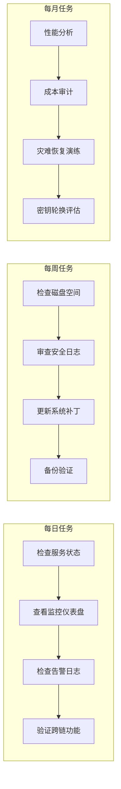
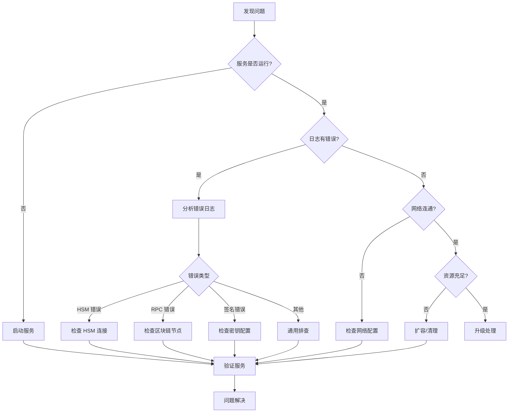
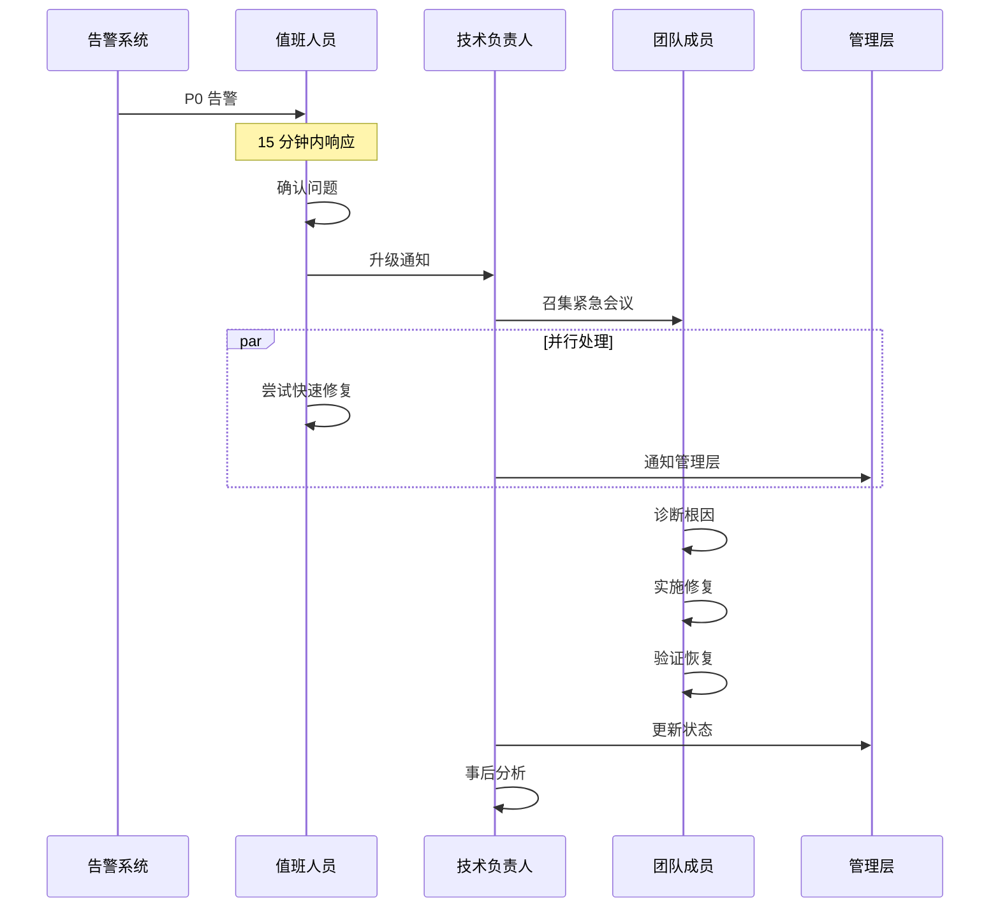
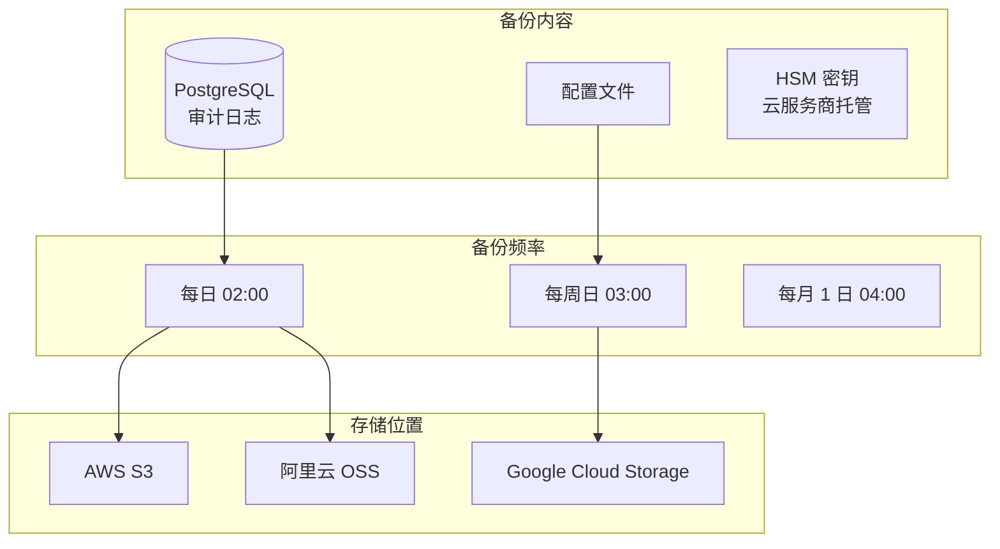
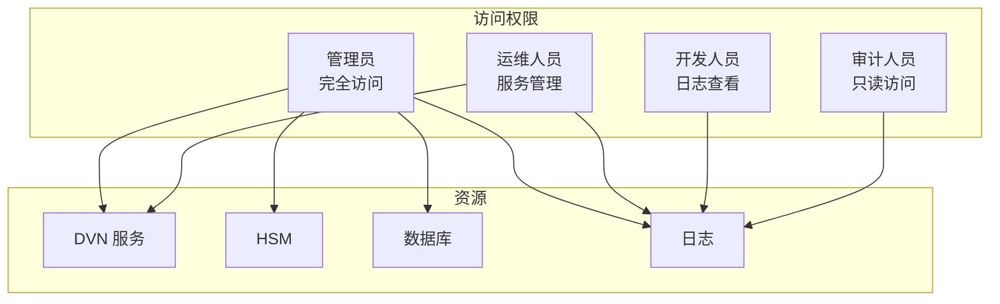

# 8. 运维手册

## 8.1 日常运维流程



---

## 8.2 服务管理命令

### 8.2.1 DVN 服务

```bash
# 查看服务状态
docker-compose ps

# 查看日志
docker-compose logs -f dvn

# 重启服务
docker-compose restart dvn

# 停止服务
docker-compose stop dvn

# 启动服务
docker-compose start dvn

# 完全重建
docker-compose down && docker-compose up -d

# 进入容器
docker exec -it dvn-node /bin/sh

# 查看资源使用
docker stats dvn-node
```

### 8.2.2 区块链节点

```bash
# Geth 命令
# 查看同步状态
curl -s -X POST -H "Content-Type: application/json" \
    --data '{"jsonrpc":"2.0","method":"eth_syncing","params":[],"id":1}' \
    http://localhost:8545 | jq

# 查看区块高度
curl -s -X POST -H "Content-Type: application/json" \
    --data '{"jsonrpc":"2.0","method":"eth_blockNumber","params":[],"id":1}' \
    http://localhost:8545 | jq

# 查看对等节点
curl -s -X POST -H "Content-Type: application/json" \
    --data '{"jsonrpc":"2.0","method":"net_peerCount","params":[],"id":1}' \
    http://localhost:8545 | jq

# 服务管理
sudo systemctl status geth
sudo systemctl restart geth
sudo journalctl -u geth -f

# Conflux 命令
curl -s -X POST -H "Content-Type: application/json" \
    --data '{"jsonrpc":"2.0","method":"cfx_epochNumber","params":[],"id":1}' \
    http://localhost:12537 | jq

sudo systemctl status conflux
sudo systemctl restart conflux
sudo journalctl -u conflux -f
```

### 8.2.3 HSM 管理

```bash
# AWS CloudHSM
# 检查连接状态
/opt/cloudhsm/bin/cloudhsm-cli cluster describe

# 列出密钥
/opt/cloudhsm/bin/cloudhsm-cli interactive
# > login --username co --role crypto-officer
# > key list
# > quit

# 检查 HSM 状态
aws cloudhsmv2 describe-clusters --cluster-ids cluster-xxx

# 阿里云 KMS
aliyun kms DescribeKey --KeyId key-xxx

# GCP Cloud HSM
gcloud kms keys describe dvn-signing-key \
    --keyring dvn-keyring \
    --location asia-northeast1
```

---

## 8.3 故障排查流程

### 8.3.1 故障排查决策树



### 8.3.2 常见问题排查

#### DVN 服务无法启动

```bash
# 1. 检查容器日志
docker logs dvn-node --tail 100

# 2. 检查配置文件
cat /opt/dvn/config.yaml

# 3. 检查环境变量
docker exec dvn-node env | grep -E "HSM|REDIS|POSTGRES"

# 4. 检查依赖服务
docker-compose ps redis postgres

# 5. 手动启动调试
docker-compose run --rm dvn ./dvn --config /app/config.yaml --debug
```

#### HSM 连接失败

```bash
# 1. 检查网络连通性
ping 10.0.2.200
nc -zv 10.0.2.200 2223

# 2. 检查 CloudHSM 客户端
/opt/cloudhsm/bin/configure-cli -a 10.0.2.200
/opt/cloudhsm/bin/cloudhsm-cli cluster describe

# 3. 检查安全组
aws ec2 describe-security-groups --group-ids sg-xxx

# 4. 验证 HSM 状态
aws cloudhsmv2 describe-clusters --cluster-ids cluster-xxx

# 5. 重启 CloudHSM 客户端
sudo systemctl restart cloudhsm-client
```

#### 区块链节点同步问题

```bash
# 1. 检查磁盘空间
df -h /data/ethereum

# 2. 检查内存使用
free -h

# 3. 检查对等节点连接
curl -s -X POST -H "Content-Type: application/json" \
    --data '{"jsonrpc":"2.0","method":"admin_peers","params":[],"id":1}' \
    http://localhost:8545 | jq '.result | length'

# 4. 检查防火墙规则
sudo iptables -L -n | grep 30303

# 5. 重新同步 (最后手段)
sudo systemctl stop geth
rm -rf /data/ethereum/geth/chaindata
sudo systemctl start geth
```

---

## 8.4 紧急响应手册

### 8.4.1 响应级别

| 级别 | 描述 | 响应时间 | 示例 |
|------|------|---------|------|
| P0 | 系统完全不可用 | 15 分钟 | 所有 DVN 宕机 |
| P1 | 核心功能受损 | 30 分钟 | 无法提交验证 |
| P2 | 部分功能受损 | 2 小时 | 单个区域故障 |
| P3 | 性能下降 | 24 小时 | 延迟增加 |

### 8.4.2 P0 紧急响应流程



### 8.4.3 紧急联系人

| 角色 | 姓名 | 电话 | 备注 |
|------|------|------|------|
| 主值班 | - | - | 7x24 |
| 备值班 | - | - | 7x24 |
| 技术负责人 | - | - | P0/P1 |
| 运维负责人 | - | - | P0/P1 |

---

## 8.5 备份与恢复

### 8.5.1 备份策略



### 8.5.2 备份脚本

```bash
#!/bin/bash
# backup.sh

set -e

DATE=$(date +%Y%m%d_%H%M%S)
BACKUP_DIR="/backup/${DATE}"
S3_BUCKET="s3://dvn-backups"

mkdir -p $BACKUP_DIR

echo "开始备份..."

# 1. 备份 PostgreSQL
echo "备份数据库..."
PGPASSWORD=$POSTGRES_PASSWORD pg_dump \
    -h localhost -U dvn -d dvn \
    -F c -f $BACKUP_DIR/postgres.dump

# 2. 备份配置
echo "备份配置..."
cp -r /opt/dvn/config $BACKUP_DIR/config

# 3. 备份日志 (最近 7 天)
echo "备份日志..."
find /var/log/dvn -mtime -7 -name "*.log" \
    -exec cp {} $BACKUP_DIR/ \;

# 4. 压缩
echo "压缩备份..."
tar -czf /backup/dvn_backup_${DATE}.tar.gz -C /backup ${DATE}

# 5. 上传到 S3
echo "上传到 S3..."
aws s3 cp /backup/dvn_backup_${DATE}.tar.gz ${S3_BUCKET}/

# 6. 清理本地
rm -rf $BACKUP_DIR
find /backup -name "*.tar.gz" -mtime +7 -delete

echo "备份完成: dvn_backup_${DATE}.tar.gz"
```

### 8.5.3 恢复流程

```bash
#!/bin/bash
# restore.sh

set -e

BACKUP_FILE=$1
RESTORE_DIR="/tmp/restore"

if [ -z "$BACKUP_FILE" ]; then
    echo "Usage: $0 <backup_file>"
    exit 1
fi

echo "开始恢复..."

# 1. 下载备份
if [[ $BACKUP_FILE == s3://* ]]; then
    aws s3 cp $BACKUP_FILE /tmp/
    BACKUP_FILE="/tmp/$(basename $BACKUP_FILE)"
fi

# 2. 解压
mkdir -p $RESTORE_DIR
tar -xzf $BACKUP_FILE -C $RESTORE_DIR

# 3. 停止服务
docker-compose stop dvn

# 4. 恢复数据库
echo "恢复数据库..."
PGPASSWORD=$POSTGRES_PASSWORD pg_restore \
    -h localhost -U dvn -d dvn \
    -c $RESTORE_DIR/*/postgres.dump

# 5. 恢复配置
echo "恢复配置..."
cp -r $RESTORE_DIR/*/config/* /opt/dvn/config/

# 6. 启动服务
docker-compose start dvn

# 7. 验证
echo "验证服务..."
sleep 10
curl -f http://localhost:8080/health || {
    echo "恢复失败!"
    exit 1
}

# 8. 清理
rm -rf $RESTORE_DIR

echo "恢复完成!"
```

---

## 8.6 升级流程

### 8.6.1 升级检查清单

```markdown
## 升级前

- [ ] 通知相关人员
- [ ] 创建备份
- [ ] 在测试环境验证
- [ ] 准备回滚方案
- [ ] 选择低流量时段

## 升级中

- [ ] 停止一个区域的 DVN
- [ ] 其他区域继续服务 (2/3 仍可运行)
- [ ] 升级 DVN 服务
- [ ] 验证功能
- [ ] 依次升级其他区域

## 升级后

- [ ] 监控 30 分钟
- [ ] 验证跨链功能
- [ ] 更新文档
- [ ] 通知完成
```

### 8.6.2 滚动升级脚本

```bash
#!/bin/bash
# rolling_upgrade.sh

set -e

NEW_VERSION=$1
REGIONS=("aws" "aliyun" "gcp")

if [ -z "$NEW_VERSION" ]; then
    echo "Usage: $0 <new_version>"
    exit 1
fi

echo "开始滚动升级到版本: $NEW_VERSION"

for region in "${REGIONS[@]}"; do
    echo ""
    echo "========================================="
    echo "升级 $region 区域"
    echo "========================================="
    
    # 1. 拉取新镜像
    echo "拉取新镜像..."
    ssh dvn-$region "docker pull your-registry/dvn-node:$NEW_VERSION"
    
    # 2. 停止服务
    echo "停止服务..."
    ssh dvn-$region "cd /opt/dvn && docker-compose stop dvn"
    
    # 3. 更新版本
    echo "更新版本..."
    ssh dvn-$region "sed -i 's/dvn-node:.*/dvn-node:$NEW_VERSION/' /opt/dvn/docker-compose.yml"
    
    # 4. 启动服务
    echo "启动服务..."
    ssh dvn-$region "cd /opt/dvn && docker-compose up -d dvn"
    
    # 5. 健康检查
    echo "健康检查..."
    sleep 30
    ssh dvn-$region "curl -f http://localhost:8080/health" || {
        echo "健康检查失败! 回滚..."
        ssh dvn-$region "docker pull your-registry/dvn-node:latest && cd /opt/dvn && docker-compose up -d dvn"
        exit 1
    }
    
    echo "$region 升级成功!"
    
    # 6. 等待稳定
    echo "等待 60 秒后继续..."
    sleep 60
done

echo ""
echo "========================================="
echo "所有区域升级完成!"
echo "========================================="
```

---

## 8.7 安全操作规范

### 8.7.1 访问控制



### 8.7.2 操作审计

```yaml
# 所有敏感操作需要记录

审计日志内容:
  - 操作时间
  - 操作人员
  - 操作类型
  - 操作目标
  - 操作结果
  - 来源 IP

需要审计的操作:
  - SSH 登录
  - 服务启停
  - 配置变更
  - 密钥操作
  - 数据库访问
  - 备份恢复
```

---

## 8.8 运维检查表

### 每日检查

| 检查项 | 命令/方法 | 预期结果 |
|--------|----------|---------|
| DVN 服务状态 | `docker-compose ps` | 3 个 running |
| 事件积压 | Grafana 仪表盘 | < 10 |
| 签名延迟 | Grafana 仪表盘 | p99 < 5s |
| 区块同步 | `eth_syncing` | false |
| HSM 连接 | `cloudhsm-cli cluster describe` | connected |
| 磁盘使用 | `df -h` | < 80% |
| 告警数量 | AlertManager | 0 active |

### 每周检查

| 检查项 | 命令/方法 | 预期结果 |
|--------|----------|---------|
| 安全日志审查 | CloudTrail / 操作审计 | 无异常 |
| 备份验证 | 恢复测试 | 成功 |
| 系统更新 | `yum check-update` | 评估并更新 |
| 证书有效期 | `openssl x509 -enddate` | > 30 天 |
| 跨云连接 | VPN 状态检查 | 3 条 tunnel up |

