# LayerZero + Conflux 跨链完整部署方案

---

## 📋 目录

- [项目概述](#项目概述)
- [1. 架构概述](#1-架构概述)
- [2. 智能合约部署](#2-智能合约部署)
- [3. DVN 节点部署](#3-dvn-节点部署)
- [4. 区块链节点部署](#4-区块链节点部署)
- [5. HSM 多云部署](#5-hsm-多云部署)
- [6. 网络架构](#6-网络架构)
- [7. 监控告警](#7-监控告警)
- [8. 运维手册](#8-运维手册)

---

## 项目概述

### 目标

构建一个安全、去中心化的 LayerZero DVN（Decentralized Verifier Network），支持以太坊生态与 Conflux 之间的跨链资产转移。

### 核心特性

| 特性 | 描述 |
|------|------|
| ✅ 去中心化验证 | 自建 DVN，不依赖第三方 |
| ✅ 多云 HSM | AWS + 阿里云 + Google Cloud 分布式密钥 |
| ✅ 自建节点 | 防止 RPC 作弊，完全可信数据源 |
| ✅ 高可用架构 | 多区域部署，无单点故障 |
| ✅ 完全私有网络 | 无公网暴露，最高安全级别 |

### 整体架构预览

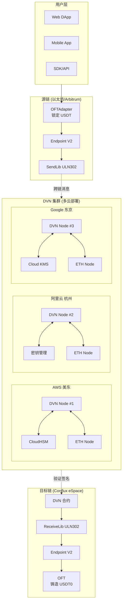

### 技术栈

| 层级 | 技术选型 |
|------|---------|
| **智能合约** | Solidity, Hardhat, LayerZero OFT V2 |
| **DVN 服务** | Go / Rust, gRPC, Redis |
| **区块链节点** | Geth (以太坊), Conflux-Rust |
| **HSM** | AWS CloudHSM, 阿里云密钥管理, Google Cloud KMS |
| **网络** | VPC, VPN/专线, NAT Gateway |
| **容器化** | Docker, Kubernetes |
| **监控** | Prometheus, Grafana, AlertManager |
| **日志** | ELK Stack / CloudWatch |

### 月度成本预估

| 组件 | AWS | 阿里云 | Google Cloud | 总计 |
|------|----:|-------:|-------------:|-----:|
| **DVN 服务器** | $200 | $180 | $200 | $580 |
| **以太坊节点** | $750 | $700 | $750 | $2,200 |
| **Conflux 节点** | $200 | $180 | $200 | $580 |
| **HSM** | $1,500 | $1,000 | $400 | $2,900 |
| **网络/带宽** | $200 | $150 | $200 | $550 |
| **跨云专线** | $300 | $300 | $300 | $900 |
| **监控/日志** | $100 | $80 | $100 | $280 |
| **总计** | **$3,250** | **$2,590** | **$2,150** | **$7,990** |

### 快速开始

```bash
# 1. 克隆部署脚本
git clone https://github.com/your-org/layerzero-cfx-dvn.git
cd layerzero-cfx-dvn

# 2. 配置环境变量
cp .env.example .env
vim .env

# 3. 部署基础设施 (Terraform)
cd infrastructure
terraform init
terraform plan
terraform apply

# 4. 部署智能合约
cd ../contracts
npx hardhat deploy --network ethereum
npx hardhat deploy --network conflux

# 5. 启动 DVN 服务
cd ../dvn
docker-compose up -d
```

---

# 1. 架构概述

## 1.1 系统架构图

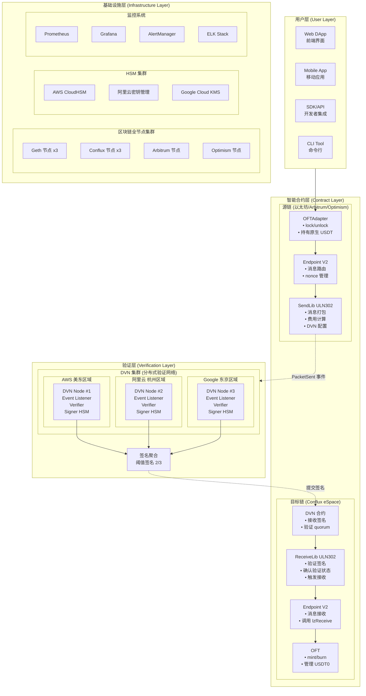

---

## 1.2 跨链消息流程

### 1.2.1 完整跨链流程 (以太坊 → Conflux)

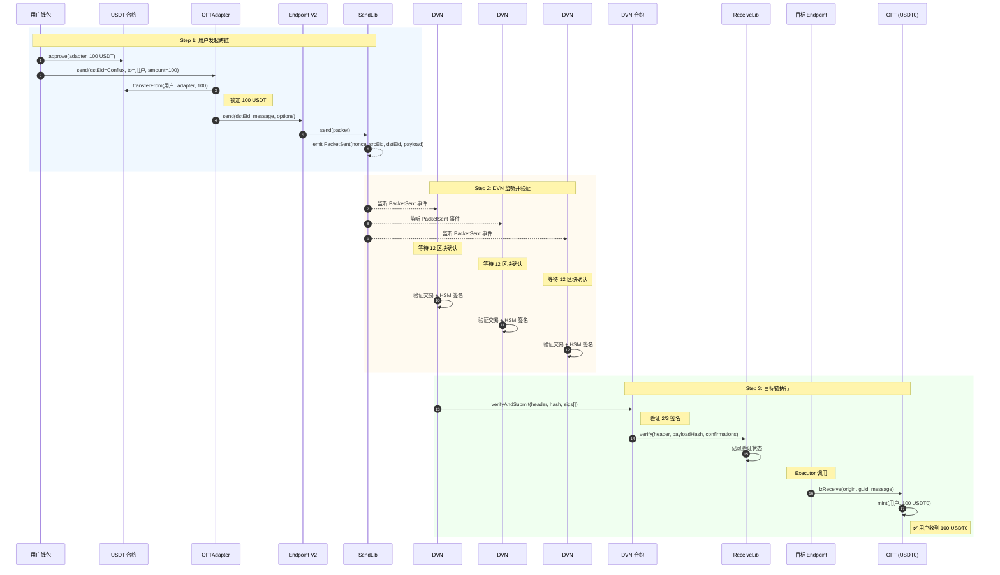

### 1.2.2 DVN 验证详细流程

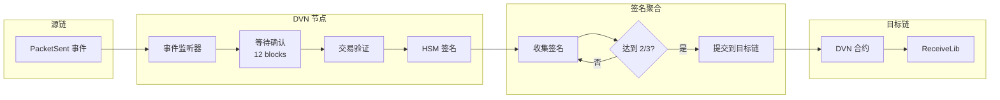

---

## 1.3 组件职责

| 组件 | 部署位置 | 职责 |
|------|---------|------|
| **OFTAdapter** | 源链 | 锁定/解锁原生代币 |
| **OFT** | 目标链 | 铸造/销毁包装代币 |
| **Endpoint** | 所有链 | 消息路由、nonce 管理 |
| **SendLib** | 源链 | 打包消息、触发事件 |
| **ReceiveLib** | 目标链 | 验证签名、确认消息 |
| **DVN 合约** | 目标链 | 接收并验证 DVN 签名 |
| **DVN 节点** | 链下 | 监听事件、签名验证 |
| **区块链节点** | 链下 | 提供可信数据源 |
| **HSM** | 链下 | 安全存储签名密钥 |

---

## 1.4 安全模型

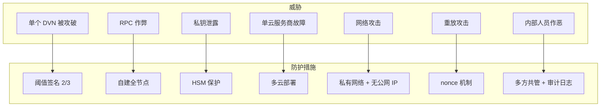

### 信任假设

| 假设 | 描述 |
|------|------|
| DVN 诚实性 | 至少 2/3 的 DVN 节点是诚实的 |
| 云服务商隔离 | 各云服务商不会同时被攻破 |
| HSM 安全性 | HSM 硬件是安全的 |
| 数据可信性 | 自建区块链节点数据是可信的 |

---

## 1.5 高可用设计

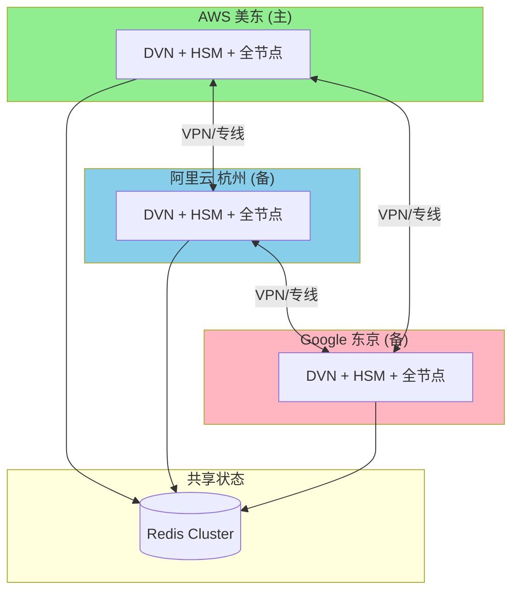

### 故障转移策略

| 场景 | 处理方式 |
|------|---------|
| 单个区域故障 | 其他 2 个区域继续运行，满足 2/3 阈值 |
| 单个 DVN 节点故障 | 自动切换到健康节点 |
| HSM 故障 | 使用其他区域 HSM 签名 |
| 区块链节点故障 | 自动切换到备用节点 |

---

## 1.6 数据流架构

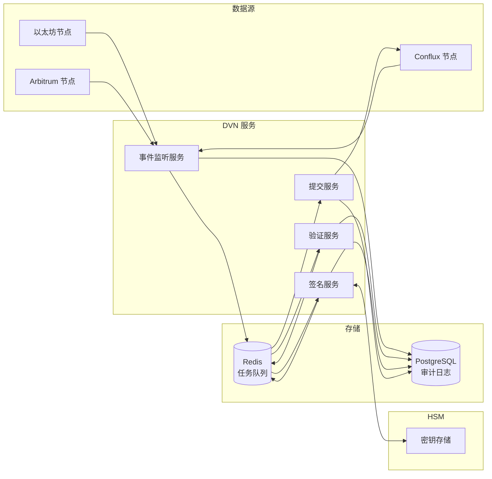

---

# 2. 智能合约部署

## 2.1 合约架构

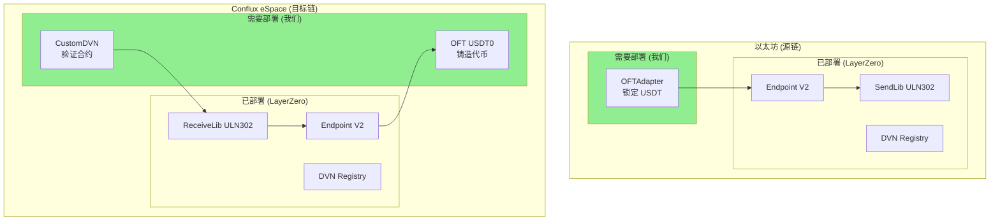

---

## 2.2 项目结构

```bash
contracts/
├── src/
│   ├── OFTAdapter.sol          # 源链适配器
│   ├── OFT.sol                 # 目标链代币
│   ├── CustomDVN.sol           # 自定义 DVN 合约
│   └── interfaces/
│       ├── ILayerZeroEndpointV2.sol
│       ├── IReceiveLib.sol
│       └── ISendLib.sol
├── script/
│   ├── DeployEthereum.s.sol    # 以太坊部署脚本
│   ├── DeployConflux.s.sol     # Conflux 部署脚本
│   └── ConfigureOApp.s.sol     # 配置脚本
├── test/
│   └── OFT.t.sol
├── foundry.toml
└── hardhat.config.ts
```

---

## 2.3 OFTAdapter 合约 (源链)

```solidity
// SPDX-License-Identifier: MIT
pragma solidity ^0.8.20;

import { OFTAdapter } from "@layerzerolabs/oft-evm/contracts/OFTAdapter.sol";
import { Ownable } from "@openzeppelin/contracts/access/Ownable.sol";

/**
 * @title USDTOFTAdapter
 * @notice 源链 USDT 锁定合约
 * @dev 锁定原生 USDT，通过 LayerZero 发送跨链消息
 */
contract USDTOFTAdapter is OFTAdapter {
    
    // 每日跨链限额
    uint256 public dailyLimit;
    uint256 public dailyTransferred;
    uint256 public lastResetTime;
    
    // 单笔最大/最小限额
    uint256 public minAmount;
    uint256 public maxAmount;
    
    // 暂停状态
    bool public paused;
    
    // 白名单（可选）
    mapping(address => bool) public whitelist;
    bool public whitelistEnabled;
    
    event DailyLimitUpdated(uint256 oldLimit, uint256 newLimit);
    event Paused(address account);
    event Unpaused(address account);
    
    error TransferPaused();
    error ExceedsDailyLimit();
    error AmountTooSmall();
    error AmountTooLarge();
    error NotWhitelisted();
    
    constructor(
        address _token,           // USDT 地址
        address _lzEndpoint,      // LayerZero Endpoint
        address _delegate         // 管理员
    ) OFTAdapter(_token, _lzEndpoint, _delegate) Ownable(_delegate) {
        dailyLimit = 1_000_000 * 1e6;  // 100万 USDT
        minAmount = 10 * 1e6;           // 最小 10 USDT
        maxAmount = 100_000 * 1e6;      // 最大 10万 USDT
        lastResetTime = block.timestamp;
    }
    
    /**
     * @notice 重写 _debit 以添加限额检查
     */
    function _debit(
        address _from,
        uint256 _amountLD,
        uint256 _minAmountLD,
        uint32 _dstEid
    ) internal virtual override returns (uint256 amountSentLD, uint256 amountReceivedLD) {
        // 暂停检查
        if (paused) revert TransferPaused();
        
        // 白名单检查
        if (whitelistEnabled && !whitelist[_from]) revert NotWhitelisted();
        
        // 金额检查
        if (_amountLD < minAmount) revert AmountTooSmall();
        if (_amountLD > maxAmount) revert AmountTooLarge();
        
        // 每日限额检查
        _checkAndUpdateDailyLimit(_amountLD);
        
        // 调用父合约逻辑
        return super._debit(_from, _amountLD, _minAmountLD, _dstEid);
    }
    
    function _checkAndUpdateDailyLimit(uint256 _amount) internal {
        // 重置每日计数
        if (block.timestamp >= lastResetTime + 1 days) {
            dailyTransferred = 0;
            lastResetTime = block.timestamp;
        }
        
        if (dailyTransferred + _amount > dailyLimit) {
            revert ExceedsDailyLimit();
        }
        
        dailyTransferred += _amount;
    }
    
    // ============ 管理函数 ============
    
    function setDailyLimit(uint256 _limit) external onlyOwner {
        emit DailyLimitUpdated(dailyLimit, _limit);
        dailyLimit = _limit;
    }
    
    function setAmountLimits(uint256 _min, uint256 _max) external onlyOwner {
        minAmount = _min;
        maxAmount = _max;
    }
    
    function pause() external onlyOwner {
        paused = true;
        emit Paused(msg.sender);
    }
    
    function unpause() external onlyOwner {
        paused = false;
        emit Unpaused(msg.sender);
    }
    
    function setWhitelist(address _user, bool _status) external onlyOwner {
        whitelist[_user] = _status;
    }
    
    function setWhitelistEnabled(bool _enabled) external onlyOwner {
        whitelistEnabled = _enabled;
    }
    
    /**
     * @notice 紧急提取（多签控制）
     */
    function emergencyWithdraw(
        address _token,
        address _to,
        uint256 _amount
    ) external onlyOwner {
        IERC20(_token).transfer(_to, _amount);
    }
}
```

---

## 2.4 OFT 合约 (目标链)

```solidity
// SPDX-License-Identifier: MIT
pragma solidity ^0.8.20;

import { OFT } from "@layerzerolabs/oft-evm/contracts/OFT.sol";
import { Ownable } from "@openzeppelin/contracts/access/Ownable.sol";

/**
 * @title USDT0
 * @notice Conflux 上的 USDT 包装代币
 */
contract USDT0 is OFT {
    
    uint256 public maxTotalSupply;
    bool public paused;
    
    error MintPaused();
    error ExceedsMaxSupply();
    
    constructor(
        string memory _name,
        string memory _symbol,
        address _lzEndpoint,
        address _delegate
    ) OFT(_name, _symbol, _lzEndpoint, _delegate) Ownable(_delegate) {
        maxTotalSupply = 1_000_000_000 * 1e6;  // 10亿上限
    }
    
    function decimals() public pure override returns (uint8) {
        return 6;
    }
    
    function _credit(
        address _to,
        uint256 _amountLD,
        uint32 _srcEid
    ) internal virtual override returns (uint256 amountReceivedLD) {
        if (paused) revert MintPaused();
        if (totalSupply() + _amountLD > maxTotalSupply) revert ExceedsMaxSupply();
        return super._credit(_to, _amountLD, _srcEid);
    }
    
    function setMaxTotalSupply(uint256 _max) external onlyOwner {
        maxTotalSupply = _max;
    }
    
    function pause() external onlyOwner { paused = true; }
    function unpause() external onlyOwner { paused = false; }
}
```

---

## 2.5 自定义 DVN 合约

```solidity
// SPDX-License-Identifier: MIT
pragma solidity ^0.8.20;

import { ECDSA } from "@openzeppelin/contracts/utils/cryptography/ECDSA.sol";
import { Ownable } from "@openzeppelin/contracts/access/Ownable.sol";

interface IReceiveLib {
    function verify(
        bytes calldata _packetHeader,
        bytes32 _payloadHash,
        uint64 _confirmations
    ) external;
}

/**
 * @title CustomDVN
 * @notice 自定义 DVN 验证合约
 */
contract CustomDVN is Ownable {
    using ECDSA for bytes32;
    
    mapping(address => bool) public signers;
    address[] public signerList;
    uint256 public quorum;
    mapping(uint32 => address) public receiveLibs;
    mapping(bytes32 => bool) public processedMessages;
    mapping(uint32 => uint64) public requiredConfirmations;
    
    event SignerAdded(address indexed signer);
    event SignerRemoved(address indexed signer);
    event QuorumUpdated(uint256 oldQuorum, uint256 newQuorum);
    event VerificationSubmitted(bytes32 indexed messageHash, uint32 srcEid, uint64 nonce);
    
    error InvalidSignature();
    error InsufficientSignatures();
    error MessageAlreadyProcessed();
    error InvalidReceiveLib();
    error DuplicateSigner();
    error InvalidQuorum();
    
    constructor(
        address[] memory _initialSigners,
        uint256 _quorum,
        address _owner
    ) Ownable(_owner) {
        require(_quorum <= _initialSigners.length && _quorum > 0, "Invalid quorum");
        
        for (uint256 i = 0; i < _initialSigners.length; i++) {
            signers[_initialSigners[i]] = true;
            signerList.push(_initialSigners[i]);
            emit SignerAdded(_initialSigners[i]);
        }
        quorum = _quorum;
    }
    
    function verifyAndSubmit(
        bytes calldata _packetHeader,
        bytes32 _payloadHash,
        uint64 _confirmations,
        bytes[] calldata _signatures
    ) external {
        bytes32 messageHash = keccak256(abi.encodePacked(
            _packetHeader, _payloadHash, _confirmations
        ));
        
        if (processedMessages[messageHash]) revert MessageAlreadyProcessed();
        _verifySignatures(messageHash, _signatures);
        processedMessages[messageHash] = true;
        
        uint32 srcEid = _parseSrcEid(_packetHeader);
        address receiveLib = receiveLibs[srcEid];
        if (receiveLib == address(0)) revert InvalidReceiveLib();
        
        IReceiveLib(receiveLib).verify(_packetHeader, _payloadHash, _confirmations);
        emit VerificationSubmitted(messageHash, srcEid, _parseNonce(_packetHeader));
    }
    
    function _verifySignatures(bytes32 _messageHash, bytes[] calldata _signatures) internal view {
        if (_signatures.length < quorum) revert InsufficientSignatures();
        
        bytes32 ethSignedHash = _messageHash.toEthSignedMessageHash();
        address lastSigner = address(0);
        
        for (uint256 i = 0; i < _signatures.length; i++) {
            address signer = ethSignedHash.recover(_signatures[i]);
            if (!signers[signer]) revert InvalidSignature();
            if (signer <= lastSigner) revert DuplicateSigner();
            lastSigner = signer;
        }
    }
    
    function _parseSrcEid(bytes calldata _packetHeader) internal pure returns (uint32) {
        return uint32(bytes4(_packetHeader[9:13]));
    }
    
    function _parseNonce(bytes calldata _packetHeader) internal pure returns (uint64) {
        return uint64(bytes8(_packetHeader[1:9]));
    }
    
    // 管理函数
    function addSigner(address _signer) external onlyOwner {
        if (signers[_signer]) revert DuplicateSigner();
        signers[_signer] = true;
        signerList.push(_signer);
        emit SignerAdded(_signer);
    }
    
    function setQuorum(uint256 _quorum) external onlyOwner {
        if (_quorum > signerList.length || _quorum == 0) revert InvalidQuorum();
        emit QuorumUpdated(quorum, _quorum);
        quorum = _quorum;
    }
    
    function setReceiveLib(uint32 _srcEid, address _receiveLib) external onlyOwner {
        receiveLibs[_srcEid] = _receiveLib;
    }
    
    function getSignerCount() external view returns (uint256) { return signerList.length; }
    function getAllSigners() external view returns (address[] memory) { return signerList; }
}
```

---

## 2.6 部署流程

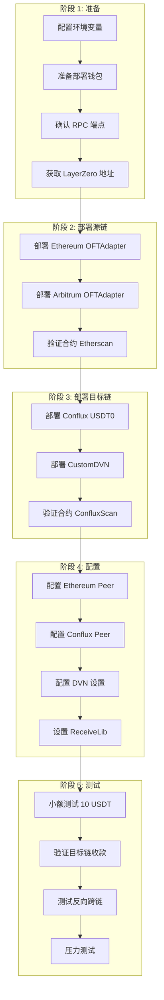

---

## 2.7 Hardhat 配置

```typescript
// hardhat.config.ts
import { HardhatUserConfig } from "hardhat/config";
import "@nomicfoundation/hardhat-toolbox";

const config: HardhatUserConfig = {
  solidity: {
    version: "0.8.20",
    settings: { optimizer: { enabled: true, runs: 200 } },
  },
  networks: {
    ethereum: {
      url: process.env.ETH_RPC_URL,
      accounts: [process.env.DEPLOYER_PRIVATE_KEY!],
      chainId: 1,
    },
    conflux: {
      url: process.env.CFX_RPC_URL,
      accounts: [process.env.DEPLOYER_PRIVATE_KEY!],
      chainId: 1030,
    },
    arbitrum: {
      url: process.env.ARB_RPC_URL,
      accounts: [process.env.DEPLOYER_PRIVATE_KEY!],
      chainId: 42161,
    },
  },
};

export default config;
```

---

## 2.8 部署脚本

```typescript
// scripts/deploy.ts
import { ethers } from "hardhat";

const LZ_ENDPOINTS = {
  ethereum: "0x1a44076050125825900e736c501f859c50fE728c",
  conflux: "0x...",
  arbitrum: "0x1a44076050125825900e736c501f859c50fE728c",
};

const EID = {
  ethereum: 30101,
  conflux: 30250,
  arbitrum: 30110,
};

const USDT_ADDRESS = {
  ethereum: "0xdAC17F958D2ee523a2206206994597C13D831ec7",
  arbitrum: "0xFd086bC7CD5C481DCC9C85ebE478A1C0b69FCbb9",
};

async function main() {
  const [deployer] = await ethers.getSigners();
  console.log("Deploying with:", deployer.address);

  const network = process.env.NETWORK || "ethereum";
  
  if (network === "ethereum" || network === "arbitrum") {
    await deployOFTAdapter(network, deployer);
  } else if (network === "conflux") {
    await deployConfluxContracts(deployer);
  }
}

async function deployOFTAdapter(network: string, deployer: any) {
  const OFTAdapter = await ethers.getContractFactory("USDTOFTAdapter");
  const adapter = await OFTAdapter.deploy(
    USDT_ADDRESS[network],
    LZ_ENDPOINTS[network],
    deployer.address
  );
  await adapter.waitForDeployment();
  console.log("OFTAdapter:", await adapter.getAddress());
}

async function deployConfluxContracts(deployer: any) {
  // 部署 OFT
  const OFT = await ethers.getContractFactory("USDT0");
  const oft = await OFT.deploy("USDT0", "USDT0", LZ_ENDPOINTS.conflux, deployer.address);
  await oft.waitForDeployment();
  console.log("USDT0:", await oft.getAddress());
  
  // 部署 DVN
  const dvnSigners = [
    process.env.DVN_SIGNER_1!,
    process.env.DVN_SIGNER_2!,
    process.env.DVN_SIGNER_3!,
  ];
  
  const CustomDVN = await ethers.getContractFactory("CustomDVN");
  const dvn = await CustomDVN.deploy(dvnSigners, 2, deployer.address);
  await dvn.waitForDeployment();
  console.log("CustomDVN:", await dvn.getAddress());
}

main().catch(console.error);
```

---

## 2.9 合约地址汇总

| 网络 | 合约 | 地址 |
|------|------|------|
| Ethereum | OFTAdapter | `0x...` |
| Ethereum | Endpoint | `0x1a44076050125825900e736c501f859c50fE728c` |
| Arbitrum | OFTAdapter | `0x...` |
| Conflux | USDT0 | `0x...` |
| Conflux | CustomDVN | `0x...` |
| Conflux | Endpoint | `0x...` |

---

# 3. DVN 节点部署

## 3.1 DVN 节点架构

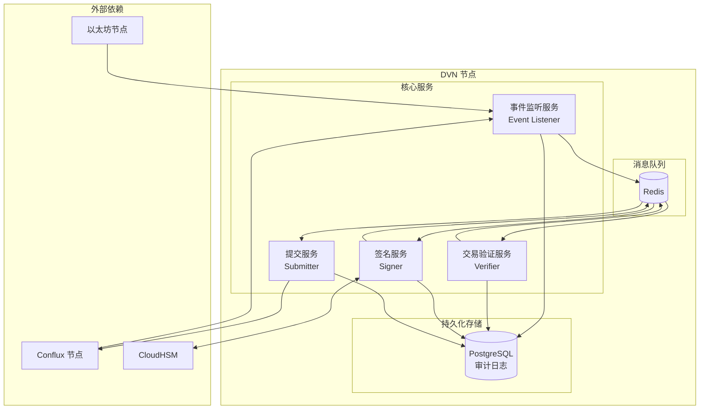

---

## 3.2 多区域部署架构

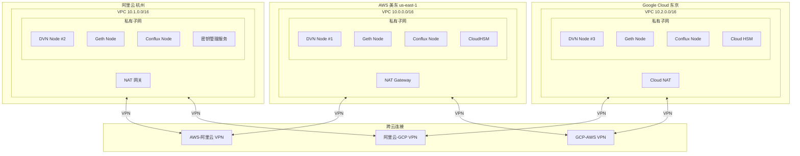

---

## 3.3 配置文件

```yaml
# config.yaml
service:
  name: dvn-node-1
  region: aws-us-east-1
  log_level: info

# 源链配置
source_chains:
  ethereum:
    chain_id: 1
    eid: 30101
    rpc_url: "http://10.0.2.100:8545"  # 内网 Geth 节点
    confirmations: 12
    block_time: 12s
    contracts:
      endpoint: "0x1a44076050125825900e736c501f859c50fE728c"
      send_lib: "0x..."
      
  arbitrum:
    chain_id: 42161
    eid: 30110
    rpc_url: "http://10.0.2.101:8545"
    confirmations: 64
    block_time: 250ms

# 目标链配置
target_chains:
  conflux:
    chain_id: 1030
    eid: 30250
    rpc_url: "http://10.0.2.102:8545"  # 内网 Conflux 节点
    contracts:
      endpoint: "0x..."
      receive_lib: "0x..."
      dvn: "0x..."

# HSM 配置
hsm:
  provider: aws  # aws | aliyun | gcp
  aws:
    cluster_id: "cluster-xxx"
    hsm_ip: "10.0.2.200"
    key_label: "dvn-signing-key"
    pin_env: "HSM_PIN"

# Redis 配置
redis:
  addr: "10.0.2.50:6379"
  password_env: "REDIS_PASSWORD"
  db: 0

# PostgreSQL 配置
postgres:
  host: "10.0.2.51"
  port: 5432
  database: "dvn"
  user: "dvn"
  password_env: "POSTGRES_PASSWORD"

# 签名配置
signing:
  quorum: 2
  total_signers: 3
  timeout: 30s
```

---

## 3.4 Docker Compose

```yaml
# docker-compose.yml
version: '3.8'

services:
  dvn:
    build: .
    container_name: dvn-node
    restart: unless-stopped
    environment:
      - HSM_PIN=${HSM_PIN}
      - REDIS_PASSWORD=${REDIS_PASSWORD}
      - POSTGRES_PASSWORD=${POSTGRES_PASSWORD}
    volumes:
      - ./config.yaml:/app/config.yaml:ro
      - /opt/cloudhsm:/opt/cloudhsm:ro
    networks:
      - dvn-network
    depends_on:
      - redis
      - postgres

  redis:
    image: redis:7-alpine
    container_name: dvn-redis
    restart: unless-stopped
    command: redis-server --requirepass ${REDIS_PASSWORD}
    volumes:
      - redis-data:/data
    networks:
      - dvn-network

  postgres:
    image: postgres:15-alpine
    container_name: dvn-postgres
    restart: unless-stopped
    environment:
      - POSTGRES_USER=dvn
      - POSTGRES_PASSWORD=${POSTGRES_PASSWORD}
      - POSTGRES_DB=dvn
    volumes:
      - postgres-data:/var/lib/postgresql/data
    networks:
      - dvn-network

networks:
  dvn-network:
    driver: bridge

volumes:
  redis-data:
  postgres-data:
```

---

# 4. 区块链节点部署

## 4.1 节点部署架构

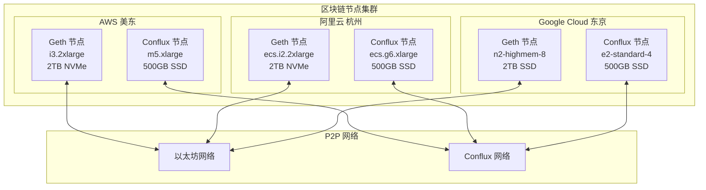

---

## 4.2 硬件要求

### 以太坊节点

| 配置项 | 最低要求 | 推荐配置 |
|--------|---------|---------|
| CPU | 4 核 | 8 核 |
| 内存 | 16 GB | 32 GB |
| 存储 | 1 TB SSD | 2 TB NVMe |
| IOPS | 10,000 | 16,000+ |
| 带宽 | 25 Mbps | 100 Mbps |
| 同步时间 | 3-5 天 | 1-2 天 |

### Conflux 节点

| 配置项 | 最低要求 | 推荐配置 |
|--------|---------|---------|
| CPU | 4 核 | 8 核 |
| 内存 | 8 GB | 16 GB |
| 存储 | 200 GB SSD | 500 GB SSD |
| 带宽 | 10 Mbps | 50 Mbps |
| 同步时间 | 6-12 小时 | 3-6 小时 |

---

## 4.3 节点高可用配置

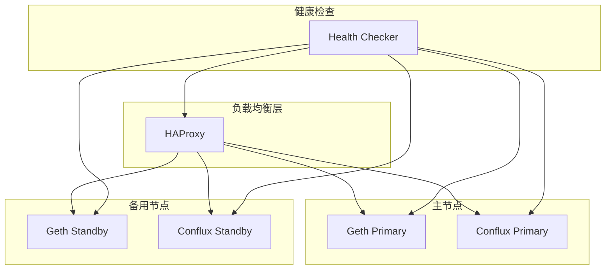

---

## 4.4 监控指标

| 指标 | 描述 | 告警阈值 |
|------|------|---------|
| `node_sync_status` | 同步状态 | syncing = true |
| `node_block_height` | 区块高度 | 落后 > 10 块 |
| `node_peer_count` | 对等节点数 | < 5 |
| `node_disk_usage` | 磁盘使用率 | > 85% |
| `node_rpc_latency` | RPC 延迟 | > 500ms |
| `node_rpc_errors` | RPC 错误数 | > 10/分钟 |

---

# 5. HSM 多云部署

## 5.1 多云 HSM 架构

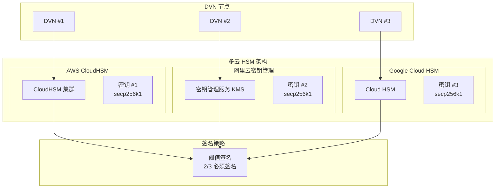

---

## 5.2 统一签名接口

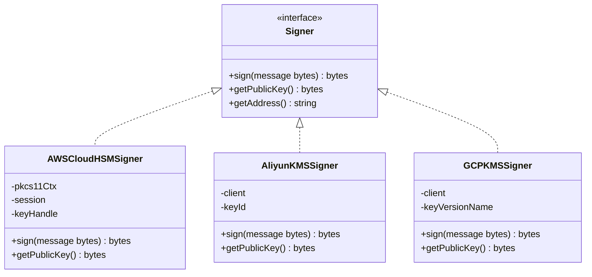

---

## 5.3 密钥备份策略

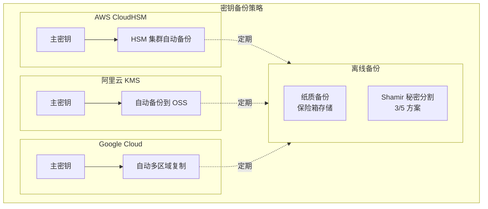

---

## 5.4 故障恢复流程

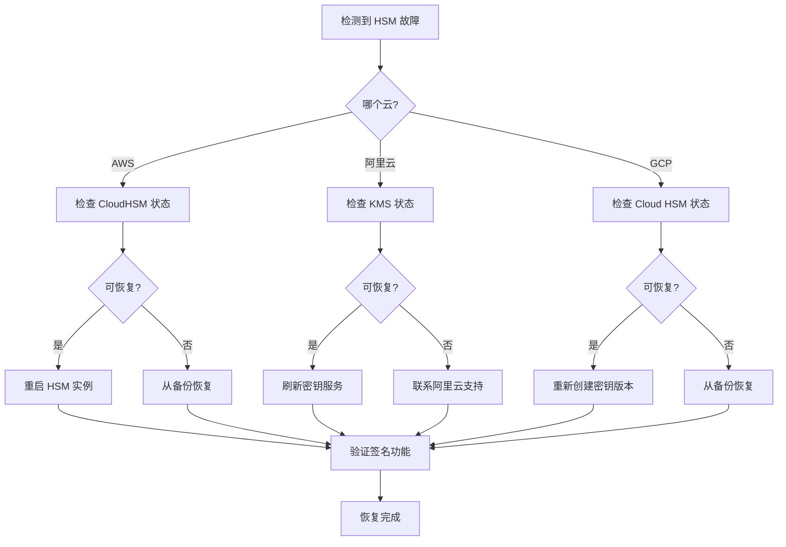

---

# 6. 网络架构

## 6.1 整体网络架构

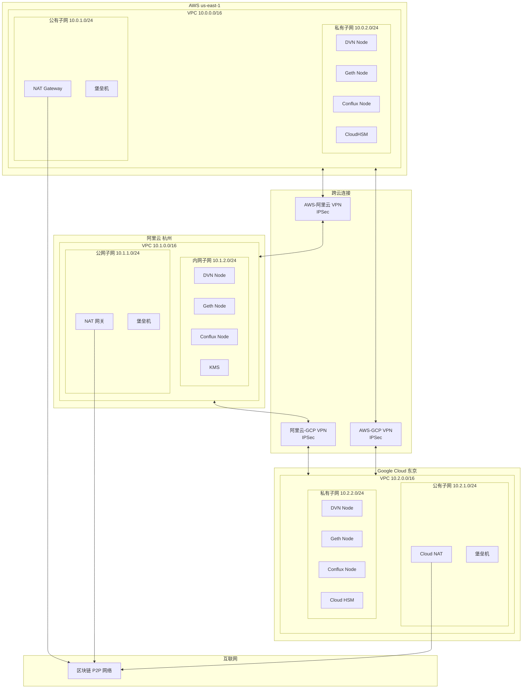

---

## 6.2 跨云 VPN 配置

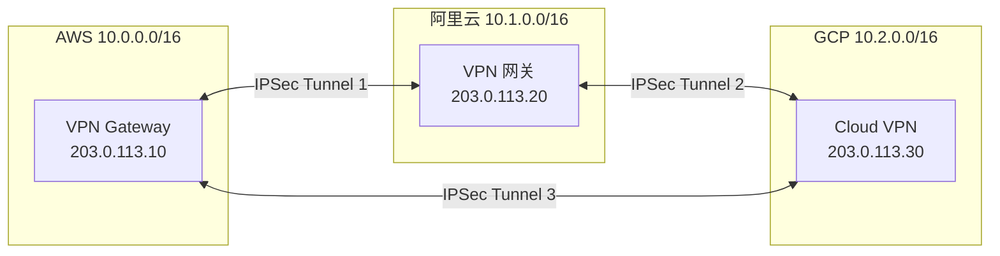

---

## 6.3 IP 地址规划

| 区域 | 网段 | 用途 |
|------|------|------|
| **AWS** | 10.0.0.0/16 | |
| | 10.0.1.0/24 | 公有子网 (NAT, 堡垒机) |
| | 10.0.2.0/24 | 私有子网 (DVN, 节点, HSM) |
| **阿里云** | 10.1.0.0/16 | |
| | 10.1.1.0/24 | 公网子网 |
| | 10.1.2.0/24 | 内网子网 |
| **GCP** | 10.2.0.0/16 | |
| | 10.2.1.0/24 | 公有子网 |
| | 10.2.2.0/24 | 私有子网 |

---

## 6.4 网络安全检查清单

| 检查项 | 状态 | 说明 |
|--------|:----:|------|
| DVN 节点无公网 IP | ✅ | 部署在私有子网 |
| 入站流量限制 | ✅ | 只允许内网访问 |
| HSM 访问限制 | ✅ | 只允许 DVN 安全组 |
| RPC 端口限制 | ✅ | 只允许 DVN 安全组 |
| VPN 加密 | ✅ | IPSec AES-256 |
| 堡垒机访问限制 | ✅ | 只允许管理员 IP |
| 流量日志 | ✅ | VPC Flow Logs 启用 |

---

# 7. 监控告警

## 7.1 监控架构

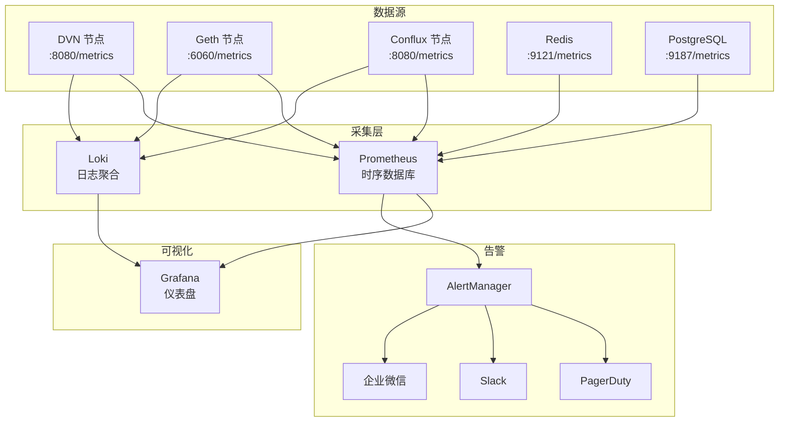

---

## 7.2 核心监控指标

### DVN 服务指标

| 指标名称 | 类型 | 描述 | 告警阈值 |
|---------|------|------|---------|
| `dvn_events_received_total` | Counter | 接收的事件总数 | - |
| `dvn_events_processed_total` | Counter | 处理的事件总数 | - |
| `dvn_events_pending` | Gauge | 待处理事件数 | > 100 |
| `dvn_verification_latency_seconds` | Histogram | 验证延迟 | p99 > 30s |
| `dvn_signing_duration_seconds` | Histogram | 签名耗时 | p99 > 5s |
| `dvn_signing_errors_total` | Counter | 签名错误数 | > 0 |
| `dvn_submission_success_total` | Counter | 成功提交数 | - |
| `dvn_submission_failed_total` | Counter | 失败提交数 | > 0 |

### 区块链节点指标

| 指标名称 | 描述 | 告警阈值 |
|---------|------|---------|
| `eth_syncing` | 同步状态 | true |
| `eth_block_number` | 当前区块高度 | 落后 > 10 块 |
| `eth_peer_count` | 对等节点数 | < 5 |
| `eth_rpc_latency_seconds` | RPC 延迟 | > 500ms |
| `eth_rpc_errors_total` | RPC 错误数 | > 10/min |

---

## 7.3 告警响应流程

```mermaid
flowchart TD
    Alert[告警触发]
    
    Alert --> Severity{严重级别}
    
    Severity -->|Critical| Critical[立即响应]
    Severity -->|Warning| Warning[15分钟内响应]
    Severity -->|Info| Info[工作时间处理]
    
    Critical --> Oncall[通知值班人员]
    Oncall --> Ack[确认告警]
    Ack --> Diagnose[诊断问题]
    Diagnose --> Fix[修复问题]
    Fix --> Verify[验证修复]
    Verify --> Resolve[解决告警]
    Resolve --> Postmortem[事后分析]
    
    Warning --> Check[检查问题]
    Check --> Minor{需要修复?}
    Minor -->|是| Fix
    Minor -->|否| Monitor[持续监控]
    
    Info --> Log[记录日志]
```

---

# 8. 运维手册

## 8.1 日常运维流程

```mermaid
flowchart LR
    subgraph Daily["每日任务"]
        D1[检查服务状态]
        D2[查看监控仪表盘]
        D3[检查告警日志]
        D4[验证跨链功能]
    end

    subgraph Weekly["每周任务"]
        W1[检查磁盘空间]
        W2[审查安全日志]
        W3[更新系统补丁]
        W4[备份验证]
    end

    subgraph Monthly["每月任务"]
        M1[性能分析]
        M2[成本审计]
        M3[灾难恢复演练]
        M4[密钥轮换评估]
    end

    D1 --> D2 --> D3 --> D4
    W1 --> W2 --> W3 --> W4
    M1 --> M2 --> M3 --> M4
```

---

## 8.2 服务管理命令

```bash
# DVN 服务
docker-compose ps           # 查看服务状态
docker-compose logs -f dvn  # 查看日志
docker-compose restart dvn  # 重启服务

# 区块链节点
curl -s -X POST -H "Content-Type: application/json" \
    --data '{"jsonrpc":"2.0","method":"eth_syncing","params":[],"id":1}' \
    http://localhost:8545 | jq

# HSM 管理
/opt/cloudhsm/bin/cloudhsm-cli cluster describe
```

---

## 8.3 故障排查决策树

```mermaid
flowchart TD
    Start[发现问题]
    
    Start --> Check1{服务是否运行?}
    
    Check1 -->|否| Action1[启动服务]
    Check1 -->|是| Check2{日志有错误?}
    
    Check2 -->|是| Analyze[分析错误日志]
    Check2 -->|否| Check3{网络连通?}
    
    Analyze --> ErrorType{错误类型}
    ErrorType -->|HSM 错误| HSMFix[检查 HSM 连接]
    ErrorType -->|RPC 错误| RPCFix[检查区块链节点]
    ErrorType -->|签名错误| SignFix[检查密钥配置]
    ErrorType -->|其他| General[通用排查]
    
    Check3 -->|否| NetFix[检查网络配置]
    Check3 -->|是| Check4{资源充足?}
    
    Check4 -->|否| ResourceFix[扩容/清理]
    Check4 -->|是| Escalate[升级处理]
    
    Action1 --> Verify[验证服务]
    HSMFix --> Verify
    RPCFix --> Verify
    SignFix --> Verify
    NetFix --> Verify
    ResourceFix --> Verify
    General --> Verify
    
    Verify --> Done[问题解决]
```

---

## 8.4 紧急响应级别

| 级别 | 描述 | 响应时间 | 示例 |
|------|------|---------|------|
| P0 | 系统完全不可用 | 15 分钟 | 所有 DVN 宕机 |
| P1 | 核心功能受损 | 30 分钟 | 无法提交验证 |
| P2 | 部分功能受损 | 2 小时 | 单个区域故障 |
| P3 | 性能下降 | 24 小时 | 延迟增加 |

---

## 8.5 备份策略

```mermaid
flowchart TB
    subgraph Backup["备份内容"]
        DB[(PostgreSQL<br/>审计日志)]
        Config[配置文件]
        HSMKey[HSM 密钥<br/>云服务商托管]
    end

    subgraph Schedule["备份频率"]
        Daily[每日 02:00]
        Weekly[每周日 03:00]
        Monthly[每月 1 日 04:00]
    end

    subgraph Storage["存储位置"]
        S3[AWS S3]
        OSS[阿里云 OSS]
        GCS[Google Cloud Storage]
    end

    DB --> Daily
    Config --> Weekly
    
    Daily --> S3
    Daily --> OSS
    Weekly --> GCS
```

---

## 8.6 运维检查表

### 每日检查

| 检查项 | 命令/方法 | 预期结果 |
|--------|----------|---------|
| DVN 服务状态 | `docker-compose ps` | 3 个 running |
| 事件积压 | Grafana 仪表盘 | < 10 |
| 签名延迟 | Grafana 仪表盘 | p99 < 5s |
| 区块同步 | `eth_syncing` | false |
| HSM 连接 | `cloudhsm-cli cluster describe` | connected |
| 磁盘使用 | `df -h` | < 80% |
| 告警数量 | AlertManager | 0 active |

### 每周检查

| 检查项 | 命令/方法 | 预期结果 |
|--------|----------|---------|
| 安全日志审查 | CloudTrail / 操作审计 | 无异常 |
| 备份验证 | 恢复测试 | 成功 |
| 系统更新 | `yum check-update` | 评估并更新 |
| 证书有效期 | `openssl x509 -enddate` | > 30 天 |
| 跨云连接 | VPN 状态检查 | 3 条 tunnel up |

---

## 📅 版本历史

| 版本 | 日期 | 更新内容 |
|------|------|---------|
| v1.0.0 | 2024-01 | 初始版本 |

