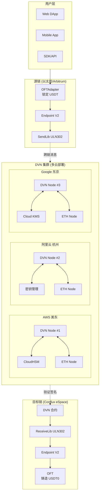

# LayerZero + Conflux 跨链完整部署方案

## 📋 文档索引

| 文档 | 内容 |
|------|------|
| [1. 架构概述](./01_架构概述.md) | 整体架构、组件说明、数据流 |
| [2. 智能合约部署](./02_智能合约部署.md) | OFT 合约、配置、部署脚本 |
| [3. DVN 节点部署](./03_DVN节点部署.md) | DVN 服务、多区域部署 |
| [4. 区块链节点部署](./04_区块链节点部署.md) | 以太坊/Conflux 全节点 |
| [5. HSM 多云部署](./05_HSM多云部署.md) | AWS/阿里云/Google 云 HSM |
| [6. 网络架构](./06_网络架构.md) | VPC、跨云连接、安全组 |
| [7. 监控告警](./07_监控告警.md) | Prometheus、Grafana、告警 |
| [8. 运维手册](./08_运维手册.md) | 日常运维、故障处理 |

---

## 🎯 项目概述

### 目标

构建一个安全、去中心化的 LayerZero DVN（Decentralized Verifier Network），支持以太坊生态与 Conflux 之间的跨链资产转移。

### 核心特性

| 特性 | 描述 |
|------|------|
| ✅ 去中心化验证 | 自建 DVN，不依赖第三方 |
| ✅ 多云 HSM | AWS + 阿里云 + Google Cloud 分布式密钥 |
| ✅ 自建节点 | 防止 RPC 作弊，完全可信数据源 |
| ✅ 高可用架构 | 多区域部署，无单点故障 |
| ✅ 完全私有网络 | 无公网暴露，最高安全级别 |

---

## 🏗️ 整体架构预览



---

## 📊 技术栈

| 层级 | 技术选型 |
|------|---------|
| **智能合约** | Solidity, Hardhat, LayerZero OFT V2 |
| **DVN 服务** | Go / Rust, gRPC, Redis |
| **区块链节点** | Geth (以太坊), Conflux-Rust |
| **HSM** | AWS CloudHSM, 阿里云密钥管理, Google Cloud KMS |
| **网络** | VPC, VPN/专线, NAT Gateway |
| **容器化** | Docker, Kubernetes |
| **监控** | Prometheus, Grafana, AlertManager |
| **日志** | ELK Stack / CloudWatch |

---

## 💰 成本估算

### 月度成本预估

| 组件 | AWS | 阿里云 | Google Cloud | 总计 |
|------|----:|-------:|-------------:|-----:|
| **DVN 服务器** | $200 | $180 | $200 | $580 |
| **以太坊节点** | $750 | $700 | $750 | $2,200 |
| **Conflux 节点** | $200 | $180 | $200 | $580 |
| **HSM** | $1,500 | $1,000 | $400 | $2,900 |
| **网络/带宽** | $200 | $150 | $200 | $550 |
| **跨云专线** | $300 | $300 | $300 | $900 |
| **监控/日志** | $100 | $80 | $100 | $280 |
| **总计** | **$3,250** | **$2,590** | **$2,150** | **$7,990** |

---

## 🚀 快速开始

```bash
# 1. 克隆部署脚本
git clone https://github.com/your-org/layerzero-cfx-dvn.git
cd layerzero-cfx-dvn

# 2. 配置环境变量
cp .env.example .env
vim .env

# 3. 部署基础设施 (Terraform)
cd infrastructure
terraform init
terraform plan
terraform apply

# 4. 部署智能合约
cd ../contracts
npx hardhat deploy --network ethereum
npx hardhat deploy --network conflux

# 5. 启动 DVN 服务
cd ../dvn
docker-compose up -d
```

---

## 📅 版本历史

| 版本 | 日期 | 更新内容 |
|------|------|---------|
| v1.0.0 | 2024-01 | 初始版本 |
