# ZK 跨链验证方案

## 📋 目录

- [方案概述](#方案概述)
- [1. 架构设计](#1-架构设计)
- [2. ZK 电路设计](#2-zk-电路设计)
- [3. 去中心化 Prover 网络](#3-去中心化-prover-网络)
- [4. 智能合约](#4-智能合约)
- [5. 部署方案](#5-部署方案)
- [6. 经济模型](#6-经济模型)
- [7. 安全分析](#7-安全分析)

---

## 方案概述

### 从 DVN 到 ZK：信任模型的升级

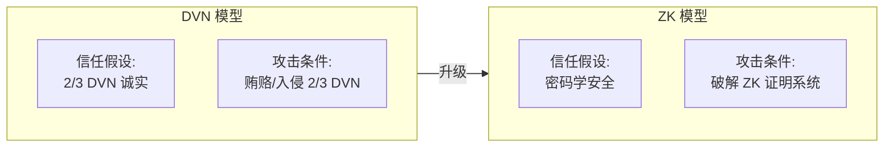

### 核心优势

| 对比项 | DVN 方案 | ZK 方案 |
|--------|---------|---------|
| **信任基础** | 社会信任（诚实多数） | 数学证明（密码学） |
| **作恶可能** | 2/3 串谋可作恶 | 数学上不可能 |
| **验证内容** | "我们看到了交易" | "交易确实存在" |
| **延迟** | ~30 秒 | ~5-15 分钟 |
| **成本** | DVN 签名费 | 证明生成 + 验证 gas |
| **去中心化** | 依赖 DVN 数量 | 依赖 Prover 网络 |

### 整体架构

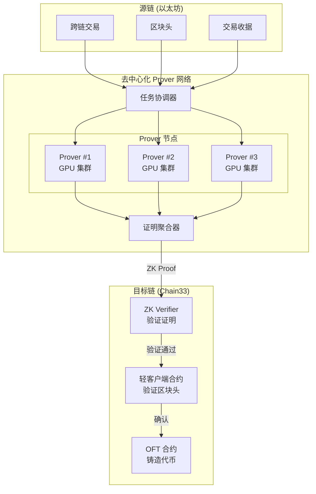

---

## 1. 架构设计

### 1.1 分层架构

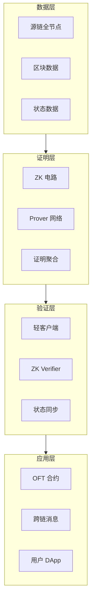

### 1.2 证明内容

ZK 证明需要证明以下内容：

```
┌─────────────────────────────────────────────────────────────┐
│                    ZK 证明内容                               │
├─────────────────────────────────────────────────────────────┤
│                                                             │
│  1. 区块有效性证明                                           │
│     ├── 区块头格式正确                                       │
│     ├── 区块哈希计算正确                                     │
│     └── PoS 验证者签名有效 (≥2/3 质押权重)                   │
│                                                             │
│  2. 交易包含证明                                             │
│     ├── 交易存在于区块的交易树中                             │
│     └── Merkle 路径验证正确                                  │
│                                                             │
│  3. 收据/事件证明                                            │
│     ├── 交易收据存在于收据树中                               │
│     ├── 收据 Merkle 路径验证正确                             │
│     └── PacketSent 事件数据正确                              │
│                                                             │
│  4. 状态转换证明 (可选)                                      │
│     └── 源链合约状态变更正确                                 │
│                                                             │
└─────────────────────────────────────────────────────────────┘
```

### 1.3 完整流程

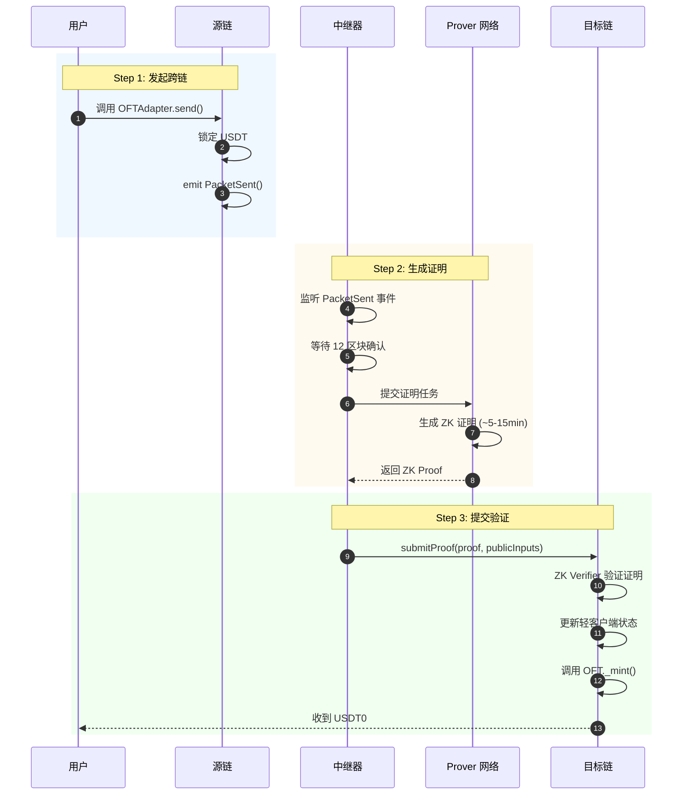

---

## 2. ZK 电路设计

### 2.1 电路架构

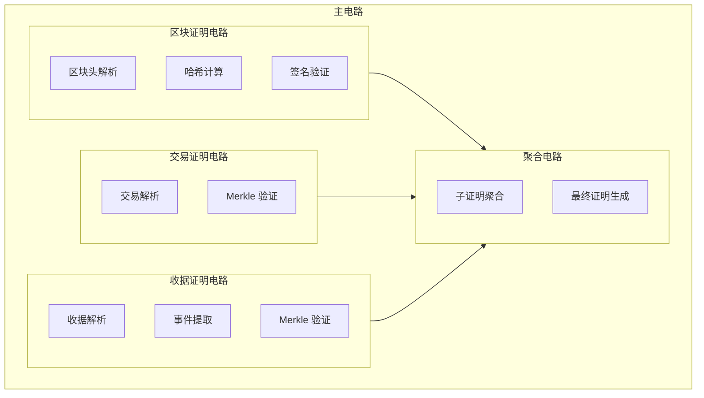

### 2.2 电路规格

| 电路组件 | 约束数量 | 证明时间 | 说明 |
|---------|---------|---------|------|
| 区块头验证 | ~50K | ~30s | Keccak256 哈希 |
| BLS 签名验证 | ~500K | ~3min | 单个验证者签名 |
| 聚合签名验证 | ~2M | ~10min | 512 验证者聚合 |
| Merkle 证明 | ~10K | ~5s | 单条路径 |
| 事件解析 | ~5K | ~2s | RLP 解码 |
| **总计** | ~3M | ~15min | 完整证明 |

### 2.3 电路实现（Circom 示例）

```circom
// circuits/block_header.circom
pragma circom 2.1.0;

include "node_modules/circomlib/circuits/poseidon.circom";
include "node_modules/circomlib/circuits/bitify.circom";

// 区块头验证电路
template BlockHeaderVerifier() {
    // 公开输入
    signal input blockHash[32];           // 区块哈希
    signal input stateRoot[32];           // 状态根
    signal input receiptsRoot[32];        // 收据根
    signal input blockNumber;             // 区块高度
    
    // 私有输入
    signal input parentHash[32];
    signal input timestamp;
    signal input extraData[32];
    
    // 输出
    signal output valid;
    
    // 验证区块哈希 = Keccak256(RLP(header))
    component keccak = Keccak256(1088);  // RLP 编码后的区块头
    // ... 计算并验证哈希
    
    valid <== 1;
}

// Merkle 证明验证电路
template MerkleProofVerifier(levels) {
    signal input leaf[32];
    signal input root[32];
    signal input pathElements[levels][32];
    signal input pathIndices[levels];
    
    signal output valid;
    
    component hashers[levels];
    signal hashes[levels + 1][32];
    
    for (var i = 0; i < 32; i++) {
        hashes[0][i] <== leaf[i];
    }
    
    for (var i = 0; i < levels; i++) {
        hashers[i] = Keccak256(64);
        
        // 根据 pathIndex 决定左右顺序
        for (var j = 0; j < 32; j++) {
            hashers[i].in[j] <== pathIndices[i] * pathElements[i][j] 
                              + (1 - pathIndices[i]) * hashes[i][j];
            hashers[i].in[32 + j] <== pathIndices[i] * hashes[i][j] 
                                    + (1 - pathIndices[i]) * pathElements[i][j];
        }
        
        for (var j = 0; j < 32; j++) {
            hashes[i + 1][j] <== hashers[i].out[j];
        }
    }
    
    // 验证计算出的根与输入根匹配
    component eq[32];
    signal matches[32];
    for (var i = 0; i < 32; i++) {
        eq[i] = IsEqual();
        eq[i].in[0] <== hashes[levels][i];
        eq[i].in[1] <== root[i];
        matches[i] <== eq[i].out;
    }
    
    // 所有字节都匹配
    component and = MultiAND(32);
    for (var i = 0; i < 32; i++) {
        and.in[i] <== matches[i];
    }
    valid <== and.out;
}

// 主证明电路
template CrossChainProof() {
    // === 公开输入 ===
    signal input srcChainId;
    signal input dstChainId;
    signal input blockNumber;
    signal input blockHash[32];
    signal input packetHash[32];
    signal input sender[20];
    signal input receiver[20];
    signal input amount;
    signal input nonce;
    
    // === 私有输入 ===
    signal input blockHeader[1024];        // RLP 编码的区块头
    signal input txMerkleProof[20][32];    // 交易 Merkle 证明
    signal input txIndex;
    signal input receiptMerkleProof[20][32]; // 收据 Merkle 证明
    signal input receiptIndex;
    signal input eventData[256];           // 事件数据
    
    // === 验证步骤 ===
    
    // 1. 验证区块头
    component blockVerifier = BlockHeaderVerifier();
    blockVerifier.blockHash <== blockHash;
    // ... 其他输入
    
    // 2. 验证交易包含
    component txProof = MerkleProofVerifier(20);
    // ... 配置 Merkle 证明
    
    // 3. 验证收据包含
    component receiptProof = MerkleProofVerifier(20);
    // ... 配置 Merkle 证明
    
    // 4. 验证事件数据
    // ... 解析并验证 PacketSent 事件
    
    // 输出验证结果
    signal output valid;
    valid <== blockVerifier.valid * txProof.valid * receiptProof.valid;
}

component main {public [srcChainId, dstChainId, blockNumber, blockHash, 
                        packetHash, sender, receiver, amount, nonce]} 
    = CrossChainProof();
```

### 2.4 使用 SP1 (Succinct) 的 Rust 实现

```rust
// prover/src/main.rs
use sp1_sdk::{ProverClient, SP1Stdin};

/// 跨链证明的公开输入
#[derive(Debug, Clone, Serialize, Deserialize)]
pub struct CrossChainPublicInputs {
    pub src_chain_id: u64,
    pub dst_chain_id: u64,
    pub block_number: u64,
    pub block_hash: [u8; 32],
    pub packet_hash: [u8; 32],
    pub sender: [u8; 20],
    pub receiver: [u8; 20],
    pub amount: u128,
    pub nonce: u64,
}

/// 跨链证明的私有输入
#[derive(Debug, Clone, Serialize, Deserialize)]
pub struct CrossChainPrivateInputs {
    pub block_header: Vec<u8>,
    pub tx_merkle_proof: Vec<[u8; 32]>,
    pub tx_index: u64,
    pub receipt_merkle_proof: Vec<[u8; 32]>,
    pub receipt_index: u64,
    pub event_data: Vec<u8>,
}

fn main() {
    // 初始化 SP1 客户端
    let client = ProverClient::new();
    
    // 加载 ELF 文件（编译后的验证程序）
    let elf = include_bytes!("../../program/elf/riscv32im-succinct-zkvm-elf");
    
    // 准备输入
    let mut stdin = SP1Stdin::new();
    
    let public_inputs = CrossChainPublicInputs {
        src_chain_id: 1,        // Ethereum
        dst_chain_id: 1030,     // Chain33
        block_number: 19000000,
        block_hash: [0u8; 32],  // 实际区块哈希
        packet_hash: [0u8; 32], // PacketSent 事件哈希
        sender: [0u8; 20],
        receiver: [0u8; 20],
        amount: 100_000_000,    // 100 USDT
        nonce: 1,
    };
    
    let private_inputs = CrossChainPrivateInputs {
        block_header: vec![],   // 实际区块头数据
        tx_merkle_proof: vec![],
        tx_index: 0,
        receipt_merkle_proof: vec![],
        receipt_index: 0,
        event_data: vec![],
    };
    
    stdin.write(&public_inputs);
    stdin.write(&private_inputs);
    
    // 生成证明
    println!("开始生成证明...");
    let (pk, vk) = client.setup(elf);
    let proof = client.prove(&pk, stdin).expect("证明生成失败");
    
    // 验证证明
    client.verify(&proof, &vk).expect("证明验证失败");
    
    println!("证明生成成功！");
    println!("证明大小: {} bytes", proof.bytes().len());
}
```

### 2.5 验证程序（SP1 Program）

```rust
// program/src/main.rs
#![no_main]
sp1_zkvm::entrypoint!(main);

use alloy_primitives::{B256, Address, U256};
use alloy_rlp::Decodable;

/// 以太坊区块头
#[derive(Debug, RlpDecodable)]
struct BlockHeader {
    parent_hash: B256,
    uncle_hash: B256,
    coinbase: Address,
    state_root: B256,
    transactions_root: B256,
    receipts_root: B256,
    logs_bloom: [u8; 256],
    difficulty: U256,
    number: u64,
    gas_limit: u64,
    gas_used: u64,
    timestamp: u64,
    extra_data: Vec<u8>,
    mix_hash: B256,
    nonce: u64,
    base_fee: Option<U256>,
}

fn main() {
    // 读取输入
    let public_inputs: CrossChainPublicInputs = sp1_zkvm::io::read();
    let private_inputs: CrossChainPrivateInputs = sp1_zkvm::io::read();
    
    // 1. 解析并验证区块头
    let header = BlockHeader::decode(&mut &private_inputs.block_header[..])
        .expect("区块头解析失败");
    
    // 验证区块号
    assert_eq!(header.number, public_inputs.block_number, "区块号不匹配");
    
    // 验证区块哈希
    let computed_hash = keccak256(&private_inputs.block_header);
    assert_eq!(computed_hash, public_inputs.block_hash, "区块哈希不匹配");
    
    // 2. 验证交易 Merkle 证明
    let tx_root = verify_merkle_proof(
        &public_inputs.packet_hash,
        &private_inputs.tx_merkle_proof,
        private_inputs.tx_index,
    );
    assert_eq!(tx_root, header.transactions_root, "交易根不匹配");
    
    // 3. 验证收据 Merkle 证明
    let receipt_hash = keccak256(&private_inputs.event_data);
    let receipt_root = verify_merkle_proof(
        &receipt_hash,
        &private_inputs.receipt_merkle_proof,
        private_inputs.receipt_index,
    );
    assert_eq!(receipt_root, header.receipts_root, "收据根不匹配");
    
    // 4. 解析并验证事件数据
    let event = parse_packet_sent_event(&private_inputs.event_data);
    assert_eq!(event.sender, public_inputs.sender, "发送者不匹配");
    assert_eq!(event.receiver, public_inputs.receiver, "接收者不匹配");
    assert_eq!(event.amount, public_inputs.amount, "金额不匹配");
    assert_eq!(event.nonce, public_inputs.nonce, "nonce 不匹配");
    
    // 输出公开输入的承诺
    sp1_zkvm::io::commit(&public_inputs);
    
    println!("✅ 跨链证明验证通过！");
}

fn verify_merkle_proof(
    leaf: &[u8; 32],
    proof: &[[u8; 32]],
    index: u64,
) -> B256 {
    let mut current = B256::from_slice(leaf);
    let mut idx = index;
    
    for sibling in proof {
        let sibling = B256::from_slice(sibling);
        if idx % 2 == 0 {
            current = keccak256(&[current.as_slice(), sibling.as_slice()].concat());
        } else {
            current = keccak256(&[sibling.as_slice(), current.as_slice()].concat());
        }
        idx /= 2;
    }
    
    current
}
```

---

## 3. 去中心化 Prover 网络

### 3.1 网络架构

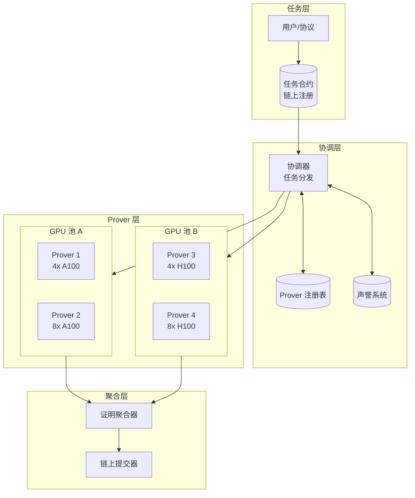

### 3.2 任务分配机制

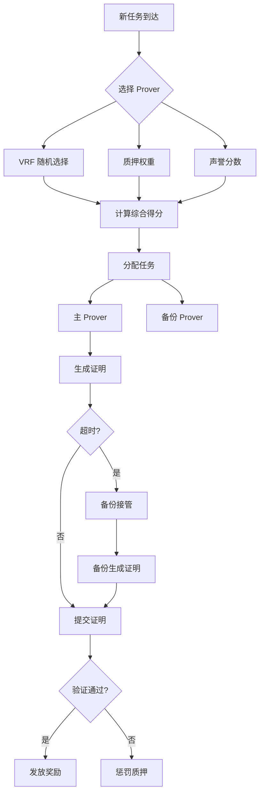

### 3.3 Prover 节点实现

```go
// prover/node.go
package prover

import (
    "context"
    "crypto/ecdsa"
    "math/big"
    "time"
    
    "github.com/ethereum/go-ethereum/common"
    "github.com/ethereum/go-ethereum/ethclient"
)

type ProverNode struct {
    // 身份
    privateKey *ecdsa.PrivateKey
    address    common.Address
    
    // 连接
    coordinator *CoordinatorClient
    ethClient   *ethclient.Client
    
    // 状态
    stake      *big.Int
    reputation uint64
    
    // 硬件
    gpuCount   int
    gpuMemory  int64 // GB
    
    // 任务
    taskQueue  chan *ProofTask
    results    chan *ProofResult
}

type ProofTask struct {
    TaskID       string
    BlockNumber  uint64
    BlockHash    common.Hash
    PacketHash   common.Hash
    Deadline     time.Time
    Reward       *big.Int
}

type ProofResult struct {
    TaskID    string
    Proof     []byte
    PublicInputs []byte
    ProveTime time.Duration
}

func NewProverNode(cfg *Config) (*ProverNode, error) {
    node := &ProverNode{
        taskQueue: make(chan *ProofTask, 100),
        results:   make(chan *ProofResult, 100),
        gpuCount:  cfg.GPUCount,
        gpuMemory: cfg.GPUMemory,
    }
    
    // 连接协调器
    node.coordinator = NewCoordinatorClient(cfg.CoordinatorURL)
    
    // 连接以太坊节点
    client, err := ethclient.Dial(cfg.EthRPC)
    if err != nil {
        return nil, err
    }
    node.ethClient = client
    
    return node, nil
}

func (n *ProverNode) Start(ctx context.Context) error {
    // 注册到协调器
    if err := n.register(); err != nil {
        return err
    }
    
    // 启动任务接收
    go n.receiveTask(ctx)
    
    // 启动证明生成
    go n.processTask(ctx)
    
    // 启动结果提交
    go n.submitResults(ctx)
    
    return nil
}

func (n *ProverNode) register() error {
    return n.coordinator.Register(&RegisterRequest{
        Address:   n.address,
        Stake:     n.stake,
        GPUCount:  n.gpuCount,
        GPUMemory: n.gpuMemory,
    })
}

func (n *ProverNode) receiveTask(ctx context.Context) {
    stream := n.coordinator.SubscribeTasks(n.address)
    
    for {
        select {
        case <-ctx.Done():
            return
        case task := <-stream:
            n.taskQueue <- task
        }
    }
}

func (n *ProverNode) processTask(ctx context.Context) {
    for {
        select {
        case <-ctx.Done():
            return
        case task := <-n.taskQueue:
            result, err := n.generateProof(ctx, task)
            if err != nil {
                log.Printf("证明生成失败: %v", err)
                continue
            }
            n.results <- result
        }
    }
}

func (n *ProverNode) generateProof(ctx context.Context, task *ProofTask) (*ProofResult, error) {
    start := time.Now()
    
    // 1. 获取区块数据
    block, err := n.ethClient.BlockByNumber(ctx, big.NewInt(int64(task.BlockNumber)))
    if err != nil {
        return nil, err
    }
    
    // 2. 获取交易收据
    receipt, err := n.ethClient.TransactionReceipt(ctx, task.PacketHash)
    if err != nil {
        return nil, err
    }
    
    // 3. 构建 Merkle 证明
    txProof := buildTxMerkleProof(block, receipt.TransactionIndex)
    receiptProof := buildReceiptMerkleProof(block, receipt.TransactionIndex)
    
    // 4. 准备输入
    inputs := &ProverInputs{
        BlockHeader:     block.Header(),
        TxMerkleProof:   txProof,
        ReceiptProof:    receiptProof,
        EventData:       receipt.Logs[0].Data,
    }
    
    // 5. 调用 SP1 生成证明
    proof, err := n.sp1Prove(inputs)
    if err != nil {
        return nil, err
    }
    
    return &ProofResult{
        TaskID:    task.TaskID,
        Proof:     proof,
        ProveTime: time.Since(start),
    }, nil
}

func (n *ProverNode) sp1Prove(inputs *ProverInputs) ([]byte, error) {
    // 调用 SP1 Prover
    cmd := exec.Command("sp1-prover", 
        "--elf", "/path/to/program.elf",
        "--input", inputsToJSON(inputs),
    )
    
    output, err := cmd.Output()
    if err != nil {
        return nil, err
    }
    
    return output, nil
}
```

### 3.4 协调器实现

```go
// coordinator/coordinator.go
package coordinator

type Coordinator struct {
    // Prover 管理
    provers     map[common.Address]*ProverInfo
    proversLock sync.RWMutex
    
    // 任务管理
    pendingTasks  *TaskQueue
    activeTasks   map[string]*ActiveTask
    
    // 链上合约
    taskContract  *TaskContract
    
    // VRF
    vrfKey *vrf.PrivateKey
}

type ProverInfo struct {
    Address    common.Address
    Stake      *big.Int
    GPUCount   int
    Reputation uint64
    LastSeen   time.Time
    ActiveTasks int
}

type ActiveTask struct {
    Task       *ProofTask
    Prover     common.Address
    BackupProver common.Address
    StartTime  time.Time
    Deadline   time.Time
}

// 选择 Prover
func (c *Coordinator) selectProver(task *ProofTask) (common.Address, common.Address, error) {
    c.proversLock.RLock()
    defer c.proversLock.RUnlock()
    
    // 计算每个 Prover 的得分
    type scoredProver struct {
        addr  common.Address
        score *big.Int
    }
    
    var candidates []scoredProver
    
    for addr, info := range c.provers {
        if info.ActiveTasks >= 3 {
            continue // 跳过繁忙的 Prover
        }
        
        // 得分 = 质押 * 声誉 * VRF随机数
        vrfOutput := c.vrfKey.Prove(append(task.TaskID, addr.Bytes()...))
        randomFactor := new(big.Int).SetBytes(vrfOutput[:8])
        
        score := new(big.Int).Mul(info.Stake, big.NewInt(int64(info.Reputation)))
        score.Mul(score, randomFactor)
        
        candidates = append(candidates, scoredProver{addr, score})
    }
    
    // 按得分排序
    sort.Slice(candidates, func(i, j int) bool {
        return candidates[i].score.Cmp(candidates[j].score) > 0
    })
    
    if len(candidates) < 2 {
        return common.Address{}, common.Address{}, errors.New("可用 Prover 不足")
    }
    
    return candidates[0].addr, candidates[1].addr, nil
}

// 处理证明提交
func (c *Coordinator) handleProofSubmission(result *ProofResult) error {
    task, ok := c.activeTasks[result.TaskID]
    if !ok {
        return errors.New("任务不存在")
    }
    
    // 验证证明
    valid, err := c.verifyProof(result.Proof, task.Task)
    if err != nil || !valid {
        // 惩罚 Prover
        c.slashProver(task.Prover, "无效证明")
        return errors.New("证明验证失败")
    }
    
    // 提交到链上
    if err := c.submitProofOnChain(result); err != nil {
        return err
    }
    
    // 发放奖励
    c.rewardProver(task.Prover, task.Task.Reward)
    
    // 更新声誉
    c.updateReputation(task.Prover, true)
    
    delete(c.activeTasks, result.TaskID)
    
    return nil
}
```

### 3.5 分布式证明（任务拆分）

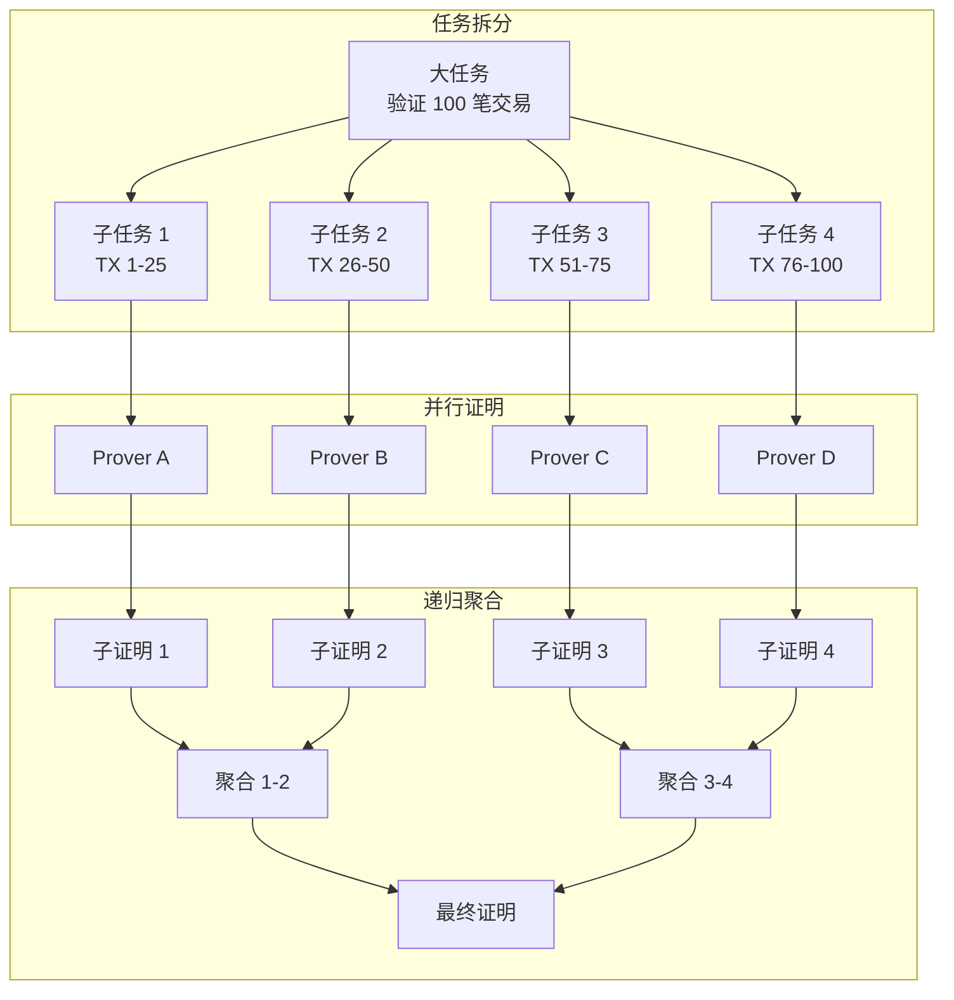

---

## 4. 智能合约

### 4.1 合约架构

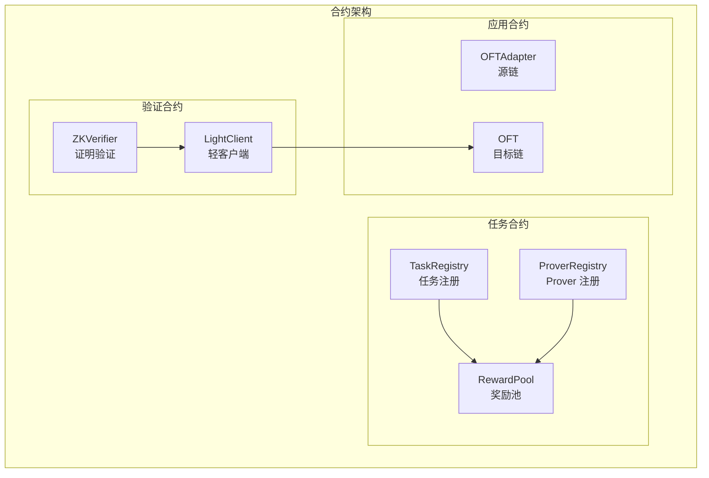

### 4.2 ZK Verifier 合约

```solidity
// SPDX-License-Identifier: MIT
pragma solidity ^0.8.20;

import {ISP1Verifier} from "@sp1-contracts/ISP1Verifier.sol";

/**
 * @title ZKCrossChainVerifier
 * @notice 验证跨链 ZK 证明
 */
contract ZKCrossChainVerifier {
    
    // SP1 验证器
    ISP1Verifier public immutable sp1Verifier;
    
    // 程序 VKey（验证密钥）
    bytes32 public immutable programVKey;
    
    // 轻客户端
    ILightClient public lightClient;
    
    // 已处理的消息
    mapping(bytes32 => bool) public processedMessages;
    
    // 事件
    event ProofVerified(
        bytes32 indexed messageHash,
        uint64 srcChainId,
        uint64 dstChainId,
        address sender,
        address receiver,
        uint256 amount
    );
    
    constructor(
        address _sp1Verifier,
        bytes32 _programVKey,
        address _lightClient
    ) {
        sp1Verifier = ISP1Verifier(_sp1Verifier);
        programVKey = _programVKey;
        lightClient = ILightClient(_lightClient);
    }
    
    /**
     * @notice 验证并执行跨链消息
     * @param proof ZK 证明
     * @param publicInputs 公开输入
     */
    function verifyAndExecute(
        bytes calldata proof,
        PublicInputs calldata publicInputs
    ) external {
        // 1. 计算消息哈希
        bytes32 messageHash = keccak256(abi.encode(
            publicInputs.srcChainId,
            publicInputs.dstChainId,
            publicInputs.blockNumber,
            publicInputs.packetHash,
            publicInputs.sender,
            publicInputs.receiver,
            publicInputs.amount,
            publicInputs.nonce
        ));
        
        // 2. 检查是否已处理
        require(!processedMessages[messageHash], "Already processed");
        
        // 3. 编码公开输入
        bytes memory encodedInputs = abi.encode(publicInputs);
        
        // 4. 验证 ZK 证明
        sp1Verifier.verifyProof(
            programVKey,
            encodedInputs,
            proof
        );
        
        // 5. 更新轻客户端状态（如果需要）
        if (publicInputs.blockNumber > lightClient.latestBlock()) {
            lightClient.updateBlock(
                publicInputs.blockNumber,
                publicInputs.blockHash
            );
        }
        
        // 6. 标记为已处理
        processedMessages[messageHash] = true;
        
        // 7. 执行跨链操作（调用 OFT）
        IOFT(publicInputs.oftAddress).lzReceive(
            publicInputs.srcChainId,
            abi.encodePacked(publicInputs.sender),
            publicInputs.nonce,
            abi.encode(publicInputs.receiver, publicInputs.amount)
        );
        
        emit ProofVerified(
            messageHash,
            publicInputs.srcChainId,
            publicInputs.dstChainId,
            publicInputs.sender,
            publicInputs.receiver,
            publicInputs.amount
        );
    }
    
    /**
     * @notice 批量验证
     */
    function batchVerifyAndExecute(
        bytes[] calldata proofs,
        PublicInputs[] calldata publicInputsArray
    ) external {
        require(proofs.length == publicInputsArray.length, "Length mismatch");
        
        for (uint i = 0; i < proofs.length; i++) {
            verifyAndExecute(proofs[i], publicInputsArray[i]);
        }
    }
}

struct PublicInputs {
    uint64 srcChainId;
    uint64 dstChainId;
    uint64 blockNumber;
    bytes32 blockHash;
    bytes32 packetHash;
    address sender;
    address receiver;
    uint256 amount;
    uint64 nonce;
    address oftAddress;
}
```

### 4.3 Prover 注册合约

```solidity
// SPDX-License-Identifier: MIT
pragma solidity ^0.8.20;

/**
 * @title ProverRegistry
 * @notice Prover 注册与质押管理
 */
contract ProverRegistry {
    
    struct Prover {
        address owner;
        uint256 stake;
        uint256 reputation;  // 0-10000 (100.00%)
        uint256 completedTasks;
        uint256 failedTasks;
        bool active;
        uint256 lastActiveTime;
    }
    
    // 最小质押
    uint256 public constant MIN_STAKE = 10 ether;
    
    // 初始声誉
    uint256 public constant INITIAL_REPUTATION = 5000; // 50%
    
    // Prover 映射
    mapping(address => Prover) public provers;
    address[] public proverList;
    
    // 事件
    event ProverRegistered(address indexed prover, uint256 stake);
    event ProverSlashed(address indexed prover, uint256 amount, string reason);
    event ReputationUpdated(address indexed prover, uint256 newReputation);
    
    /**
     * @notice 注册为 Prover
     */
    function register() external payable {
        require(msg.value >= MIN_STAKE, "Insufficient stake");
        require(!provers[msg.sender].active, "Already registered");
        
        provers[msg.sender] = Prover({
            owner: msg.sender,
            stake: msg.value,
            reputation: INITIAL_REPUTATION,
            completedTasks: 0,
            failedTasks: 0,
            active: true,
            lastActiveTime: block.timestamp
        });
        
        proverList.push(msg.sender);
        
        emit ProverRegistered(msg.sender, msg.value);
    }
    
    /**
     * @notice 增加质押
     */
    function addStake() external payable {
        require(provers[msg.sender].active, "Not registered");
        provers[msg.sender].stake += msg.value;
    }
    
    /**
     * @notice 惩罚 Prover
     */
    function slash(address prover, uint256 amount, string calldata reason) external onlyCoordinator {
        Prover storage p = provers[prover];
        require(p.active, "Not active");
        
        uint256 slashAmount = amount > p.stake ? p.stake : amount;
        p.stake -= slashAmount;
        p.failedTasks++;
        
        // 更新声誉
        _updateReputation(prover, false);
        
        // 如果质押不足，停用
        if (p.stake < MIN_STAKE) {
            p.active = false;
        }
        
        emit ProverSlashed(prover, slashAmount, reason);
    }
    
    /**
     * @notice 记录成功完成任务
     */
    function recordSuccess(address prover) external onlyCoordinator {
        provers[prover].completedTasks++;
        provers[prover].lastActiveTime = block.timestamp;
        _updateReputation(prover, true);
    }
    
    /**
     * @notice 更新声誉
     */
    function _updateReputation(address prover, bool success) internal {
        Prover storage p = provers[prover];
        
        if (success) {
            // 成功：声誉 +1%，最高 100%
            p.reputation = p.reputation + 100 > 10000 ? 10000 : p.reputation + 100;
        } else {
            // 失败：声誉 -5%
            p.reputation = p.reputation > 500 ? p.reputation - 500 : 0;
        }
        
        emit ReputationUpdated(prover, p.reputation);
    }
    
    /**
     * @notice 获取活跃 Prover 列表
     */
    function getActiveProvers() external view returns (address[] memory) {
        uint256 count = 0;
        for (uint i = 0; i < proverList.length; i++) {
            if (provers[proverList[i]].active) {
                count++;
            }
        }
        
        address[] memory active = new address[](count);
        uint256 idx = 0;
        for (uint i = 0; i < proverList.length; i++) {
            if (provers[proverList[i]].active) {
                active[idx++] = proverList[i];
            }
        }
        
        return active;
    }
    
    /**
     * @notice 计算 Prover 权重（用于任务分配）
     */
    function getProverWeight(address prover) external view returns (uint256) {
        Prover storage p = provers[prover];
        if (!p.active) return 0;
        
        // 权重 = 质押 * 声誉 / 10000
        return p.stake * p.reputation / 10000;
    }
}
```

### 4.4 任务合约

```solidity
// SPDX-License-Identifier: MIT
pragma solidity ^0.8.20;

/**
 * @title TaskRegistry
 * @notice 证明任务注册与奖励分发
 */
contract TaskRegistry {
    
    struct Task {
        bytes32 taskId;
        uint64 srcChainId;
        uint64 blockNumber;
        bytes32 packetHash;
        uint256 reward;
        uint256 deadline;
        address assignedProver;
        address backupProver;
        TaskStatus status;
    }
    
    enum TaskStatus {
        Pending,
        Assigned,
        Completed,
        Failed,
        Expired
    }
    
    // 任务映射
    mapping(bytes32 => Task) public tasks;
    
    // 奖励池
    uint256 public rewardPool;
    
    // 基础奖励
    uint256 public baseReward = 0.01 ether;
    
    // 超时时间
    uint256 public taskTimeout = 30 minutes;
    
    // 事件
    event TaskCreated(bytes32 indexed taskId, uint256 reward, uint256 deadline);
    event TaskAssigned(bytes32 indexed taskId, address prover, address backup);
    event TaskCompleted(bytes32 indexed taskId, address prover, uint256 reward);
    event TaskFailed(bytes32 indexed taskId, string reason);
    
    /**
     * @notice 创建新任务（由中继器调用）
     */
    function createTask(
        uint64 srcChainId,
        uint64 blockNumber,
        bytes32 packetHash
    ) external payable returns (bytes32) {
        bytes32 taskId = keccak256(abi.encodePacked(
            srcChainId,
            blockNumber,
            packetHash,
            block.timestamp
        ));
        
        require(tasks[taskId].taskId == bytes32(0), "Task exists");
        
        uint256 reward = msg.value > 0 ? msg.value : baseReward;
        
        tasks[taskId] = Task({
            taskId: taskId,
            srcChainId: srcChainId,
            blockNumber: blockNumber,
            packetHash: packetHash,
            reward: reward,
            deadline: block.timestamp + taskTimeout,
            assignedProver: address(0),
            backupProver: address(0),
            status: TaskStatus.Pending
        });
        
        emit TaskCreated(taskId, reward, block.timestamp + taskTimeout);
        
        return taskId;
    }
    
    /**
     * @notice 分配任务（由协调器调用）
     */
    function assignTask(
        bytes32 taskId,
        address prover,
        address backup
    ) external onlyCoordinator {
        Task storage task = tasks[taskId];
        require(task.status == TaskStatus.Pending, "Invalid status");
        
        task.assignedProver = prover;
        task.backupProver = backup;
        task.status = TaskStatus.Assigned;
        
        emit TaskAssigned(taskId, prover, backup);
    }
    
    /**
     * @notice 完成任务（由协调器调用）
     */
    function completeTask(
        bytes32 taskId,
        address prover
    ) external onlyCoordinator {
        Task storage task = tasks[taskId];
        require(task.status == TaskStatus.Assigned, "Invalid status");
        require(block.timestamp <= task.deadline, "Deadline passed");
        
        task.status = TaskStatus.Completed;
        
        // 发放奖励
        payable(prover).transfer(task.reward);
        
        emit TaskCompleted(taskId, prover, task.reward);
    }
    
    /**
     * @notice 处理超时任务
     */
    function handleTimeout(bytes32 taskId) external {
        Task storage task = tasks[taskId];
        require(task.status == TaskStatus.Assigned, "Invalid status");
        require(block.timestamp > task.deadline, "Not expired");
        
        task.status = TaskStatus.Expired;
        
        // 惩罚主 Prover
        IProverRegistry(proverRegistry).slash(
            task.assignedProver,
            task.reward,
            "Task timeout"
        );
        
        // 奖励给备份 Prover 重新尝试
        // ... 或者退款给任务创建者
        
        emit TaskFailed(taskId, "Timeout");
    }
}
```

---

## 5. 部署方案

### 5.1 部署架构

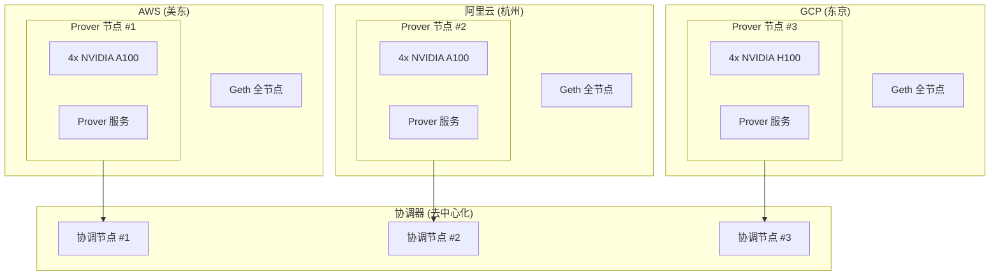

### 5.2 硬件要求

| 组件 | 最低配置 | 推荐配置 |
|------|---------|---------|
| **Prover 节点** | | |
| GPU | 2x RTX 4090 | 4x A100 80GB |
| CPU | 32 核 | 64 核 |
| 内存 | 128 GB | 256 GB |
| 存储 | 1 TB NVMe | 2 TB NVMe |
| **协调节点** | | |
| CPU | 8 核 | 16 核 |
| 内存 | 32 GB | 64 GB |
| 存储 | 500 GB SSD | 1 TB SSD |
| **全节点** | | |
| CPU | 8 核 | 16 核 |
| 内存 | 32 GB | 64 GB |
| 存储 | 2 TB NVMe | 4 TB NVMe |

### 5.3 成本估算

| 组件 | 月度成本 (AWS) | 月度成本 (自建) |
|------|---------------|----------------|
| Prover (4x A100) | $15,000 | $3,000 (电费+折旧) |
| 全节点 | $750 | $200 |
| 协调器 | $300 | $100 |
| 网络 | $200 | $100 |
| **单区域总计** | **$16,250** | **$3,400** |
| **三区域总计** | **$48,750** | **$10,200** |

### 5.4 部署脚本

```bash
#!/bin/bash
# deploy_zk_prover.sh

set -e

echo "============================================"
echo "部署 ZK Prover 节点"
echo "============================================"

# 1. 安装 CUDA
echo "安装 CUDA..."
wget https://developer.download.nvidia.com/compute/cuda/12.2.0/local_installers/cuda_12.2.0_535.54.03_linux.run
sudo sh cuda_12.2.0_535.54.03_linux.run --silent

# 2. 安装 Rust
echo "安装 Rust..."
curl --proto '=https' --tlsv1.2 -sSf https://sh.rustup.rs | sh -s -- -y
source $HOME/.cargo/env

# 3. 安装 SP1
echo "安装 SP1..."
curl -L https://sp1.succinct.xyz | bash
sp1up

# 4. 构建 Prover
echo "构建 Prover..."
cd /opt/zk-prover
cargo build --release

# 5. 配置环境
echo "配置环境..."
cat > /opt/zk-prover/.env << EOF
ETH_RPC_URL=http://localhost:8545
COORDINATOR_URL=https://coordinator.example.com
PROVER_KEY=${PROVER_PRIVATE_KEY}
GPU_COUNT=4
EOF

# 6. 创建 systemd 服务
sudo cat > /etc/systemd/system/zk-prover.service << EOF
[Unit]
Description=ZK Prover Node
After=network.target

[Service]
Type=simple
User=prover
WorkingDirectory=/opt/zk-prover
ExecStart=/opt/zk-prover/target/release/prover-node
Restart=always
RestartSec=10
Environment=RUST_LOG=info

[Install]
WantedBy=multi-user.target
EOF

# 7. 启动服务
sudo systemctl daemon-reload
sudo systemctl enable zk-prover
sudo systemctl start zk-prover

echo "ZK Prover 部署完成！"
```

---

## 6. 经济模型

### 6.1 费用结构

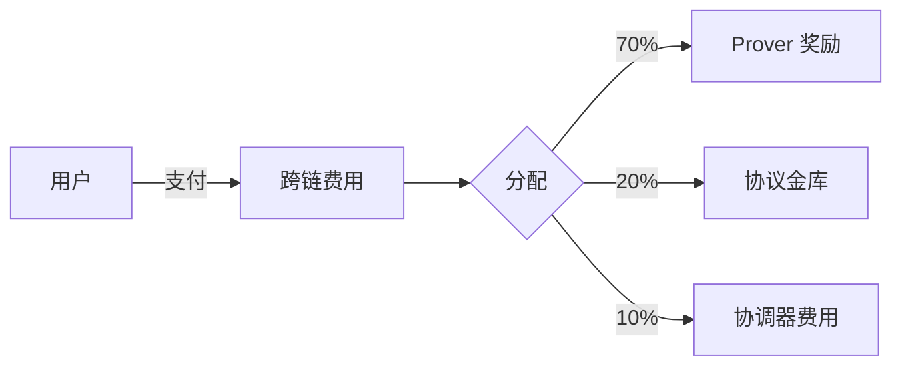

### 6.2 定价模型

| 交易类型 | 基础费用 | 说明 |
|---------|---------|------|
| 标准跨链 | $1.00 | 15 分钟内完成 |
| 快速跨链 | $3.00 | 5 分钟内完成 |
| 批量跨链 | $0.50/笔 | 10 笔以上 |

### 6.3 Prover 收益模型

```
Prover 月收益 = 任务数量 × 单任务奖励 × 成功率

假设：
- 每日任务：100 笔
- 单任务奖励： $0.70
- 成功率：99%
- 每月收益：100 × 30 × 0.70 × 0.99 = $2,079

ROI（4x A100 自建）：
- 硬件成本： $100,000
- 月运营成本： $3,000
- 月收益： $2,079
- 回本周期：约 4 年（需要更多任务量）
```

---

## 7. 安全分析

### 7.1 安全模型对比

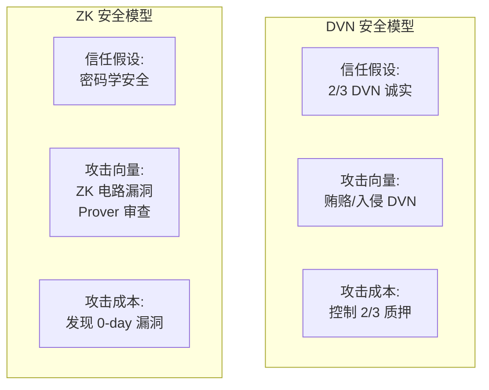

### 7.2 风险分析

| 风险 | 概率 | 影响 | 缓解措施 |
|------|------|------|---------|
| ZK 电路 Bug | 低 | 高 | 形式化验证、多轮审计、Bug Bounty |
| Prover 审查 | 中 | 中 | 去中心化 Prover 网络、任务超时机制 |
| Prover 停机 | 中 | 低 | 多 Prover 冗余、备份机制 |
| 源链重组 | 低 | 高 | 等待足够区块确认 |
| 合约漏洞 | 低 | 高 | 审计、升级机制、时间锁 |

### 7.3 与 DVN 的安全性对比

| 攻击场景 | DVN 方案 | ZK 方案 |
|---------|---------|---------|
| **伪造交易** | 控制 2/3 DVN 可伪造 | ❌ 数学上不可能 |
| **审查交易** | 2/3 DVN 串谋可审查 | 单 Prover 可审查，但有惩罚和替换机制 |
| **延迟攻击** | DVN 可延迟签名 | Prover 可延迟，但有备份和超时 |
| **重放攻击** | 依赖 nonce 防护 | 依赖 nonce + 消息哈希 |

### 7.4 安全建议

1. **电路安全**
   - 使用经过审计的电路库
   - 进行形式化验证
   - 定期安全审计

2. **Prover 去中心化**
   - 鼓励多方参与
   - 设置合理的准入门槛
   - 实现公平的任务分配

3. **合约安全**
   - 多签升级机制
   - 时间锁
   - 紧急暂停功能

4. **监控告警**
   - 证明生成延迟监控
   - 异常交易检测
   - Prover 健康检查

---

## 📅 实施计划

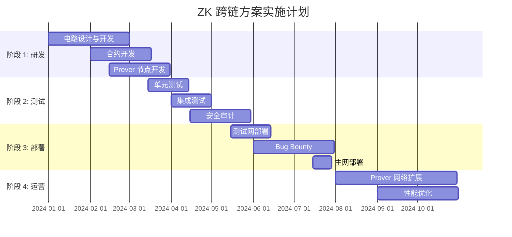

---

## 版本历史

| 版本 | 日期 | 更新内容 |
|------|------|---------|
| v1.0.0 | 2024-01 | 初始版本 |

