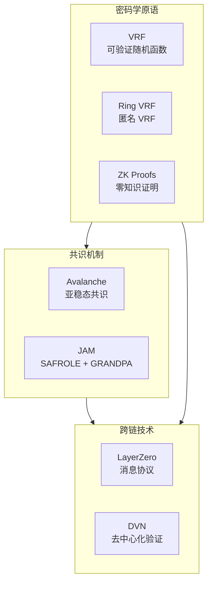

# 区块链技术文档库

> 🔗 深入探索区块链核心技术：共识机制、密码学原语、跨链协议与下一代区块链架构


---

## 📚 文档目录

### 1. 🔄 共识机制

#### [Avalanche 共识协议深度解析](./Avalanche_共识/Avalanche_共识协议深度解析.md)

基于 "Scalable and Probabilistic Leaderless BFT Consensus through Metastability" 论文的翻译与深度分析。

**核心内容：**
- 亚稳态（Metastability）共识机制原理
- Slush → Snowflake → Snowball → Snowman 协议演进
- 分叉概率的数学证明（< 10⁻³⁰）
- 采样算法与安全性分析
- 与传统 BFT 共识的对比

**关键参数：**
| 参数 | 值 | 说明 |
|------|-----|------|
| k | 20 | 采样大小 |
| α | 15 | 法定人数阈值 |
| β | 20 | 连续成功轮数 |
| 容错率 | < 20% | 拜占庭节点上限 |

---

### 2. 🎲 密码学原语

#### [VRF 可验证随机函数](./VRF/vrf.md)

全面解析可验证随机函数（Verifiable Random Function）的构造与应用。

**核心内容：**
- VRF 基础构造：密钥生成、证明生成、验证
- 哈希到曲线（Hash-to-Curve）技术
- Fiat-Shamir 变换：从交互到非交互
- 零知识证明结构解析
- **Ring VRF**：匿名可验证随机函数

**应用场景：**
- 区块链共识中的出块者选举
- 智能合约随机数生成
- 分布式系统抽奖与调度
- 匿名投票系统

#### 专题文档
- [VRF 在区块链共识中的应用](./VRF/vrf_blockchain_consensus.md)
- [VRF 智能合约随机数方案](./VRF/vrf_smart_contract_randomness.md)
- [VRF 匿名凭证与投票](./VRF/vrf_anonymous_credentials_voting.md)

---

### 3. 🌉 跨链技术

#### [LayerZero 跨链部署方案](./LayerZero_跨链部署方案/)

完整的 LayerZero DVN（去中心化验证网络）部署指南，支持以太坊生态与 Conflux 之间的跨链资产转移。

**核心特性：**
| 特性 | 描述 |
|------|------|
| ✅ 去中心化验证 | 自建 DVN，不依赖第三方 |
| ✅ 多云 HSM | AWS + 阿里云 + Google Cloud 分布式密钥 |
| ✅ 自建节点 | 防止 RPC 作弊，完全可信数据源 |
| ✅ 高可用架构 | 多区域部署，无单点故障 |

**文档索引：**
1. [架构概述](./LayerZero_跨链部署方案/01_架构概述.md)
2. [智能合约部署](./LayerZero_跨链部署方案/02_智能合约部署.md)
3. [DVN 节点部署](./LayerZero_跨链部署方案/03_DVN节点部署.md)
4. [区块链节点部署](./LayerZero_跨链部署方案/04_区块链节点部署.md)
5. [HSM 多云部署](./LayerZero_跨链部署方案/05_HSM多云部署.md)
6. [网络架构](./LayerZero_跨链部署方案/06_网络架构.md)
7. [监控告警](./LayerZero_跨链部署方案/07_监控告警.md)
8. [运维手册](./LayerZero_跨链部署方案/08_运维手册.md)

**扩展文档：**
- [ZK 跨链验证方案](./LayerZero_跨链部署方案/ZK_跨链验证方案.md)

---

### 4. ⚡ 下一代区块链

#### [JAM (Join-Accumulate Machine) 实现原理](./JAM/JAM_实现原理.md)

Polkadot 下一代协议 JAM 的深度解析，由 Gavin Wood 在 2024 年提出。

**核心创新：**

```
┌─────────────────────────────────────────────────────────────────┐
│                        JAM 核心要点                              │
├─────────────────────────────────────────────────────────────────┤
│                                                                 │
│  1. 三阶段模型                                                   │
│     Refine(无状态) → Join(担保) → Accumulate(状态转换)           │
│                                                                 │
│  2. 共享安全                                                     │
│     所有服务共享 Polkadot 验证者集的安全性                        │
│                                                                 │
│  3. 原生互操作                                                   │
│     跨服务通信是协议原生功能，不需要外部桥                        │
│                                                                 │
│  4. 混合共识                                                     │
│     SAFROLE(出块) + GRANDPA(最终性)                              │
│                                                                 │
└─────────────────────────────────────────────────────────────────┘
```

**与传统架构对比：**
| 对比项 | Polkadot 1.0 | JAM |
|--------|-------------|-----|
| **核心** | 中继链 | JAM Core |
| **应用** | 平行链 | 服务 (Service) |
| **插槽** | 需要竞拍 | 按需付费 |
| **灵活性** | 固定架构 | 高度通用 |

---

## 🗺️ 技术栈总览



---

## 🔧 技术深度

| 主题 | 难度 | 前置知识 |
|------|------|----------|
| Avalanche 共识 | ⭐⭐⭐⭐ | 概率论、分布式系统 |
| VRF 原理 | ⭐⭐⭐⭐⭐ | 椭圆曲线密码学、零知识证明 |
| Ring VRF | ⭐⭐⭐⭐⭐ | VRF、环签名 |
| LayerZero 部署 | ⭐⭐⭐ | 智能合约、DevOps |
| JAM 架构 | ⭐⭐⭐⭐ | Polkadot 生态、共识机制 |

---

## 📖 阅读建议

### 入门路径

1. **共识机制入门** → [Avalanche 共识协议](./Avalanche_共识/Avalanche_共识协议深度解析.md) 第 1-4 章
2. **密码学基础** → [VRF 基础概念](./VRF/vrf.md) 第 1-4 章
3. **跨链实践** → [LayerZero 架构概述](./LayerZero_跨链部署方案/01_架构概述.md)

### 进阶路径

1. **深入共识** → Avalanche 安全性分析、分叉概率证明
2. **高级密码学** → Ring VRF、零知识证明在跨链中的应用
3. **前沿架构** → JAM 三阶段执行模型

---

## 🤝 贡献指南

欢迎提交 Issue 和 Pull Request！

1. Fork 本仓库
2. 创建特性分支 (`git checkout -b feature/AmazingFeature`)
3. 提交更改 (`git commit -m 'Add some AmazingFeature'`)
4. 推送到分支 (`git push origin feature/AmazingFeature`)
5. 开启 Pull Request

---

## 📄 许可证

本项目采用 MIT 许可证 - 详见 [LICENSE](LICENSE) 文件

---

## 📬 联系方式

如有问题或建议，欢迎通过以下方式联系：

- 提交 [GitHub Issue](https://github.com/vipwzw/blockchain-doc/issues)

---

*最后更新：2024 年 12 月*

