# 可验证随机函数（VRF）：构建可验证的随机性

## 摘要
可验证随机函数（Verifiable Random Function, VRF）是一种神奇的密码学原语，它能够从一段输入生成看似随机的输出，并提供一个密码学证明，让任何人都能验证这个随机数的确是由指定的私钥持有者计算得出的，且没有经过篡改。VRF是构建公平透明随机性系统的基石，在区块链共识、随机数生成、抽奖系统等场景中有着重要应用。

本文将从基础概念开始，逐步深入VRF的构造原理，解释其背后的密码学机制，并通过可视化流程图展示VRF的工作流程。

---

## 1. 引言：随机性的困境

在数字世界中，真正的随机性是一种稀缺资源。计算机本质上是确定性的机器，传统上我们通过伪随机数生成器（PRNG）来模拟随机性。但在多方参与的分布式系统中，尤其是在没有可信第三方的情况下，如何生成**公平、透明、可验证**的随机数成为一个核心挑战。

考虑以下场景：
1. 区块链中需要随机选择出块者
2. 智能合约需要不可预测的随机数用于游戏
3. 分布式抽奖系统需要可审计的随机结果

传统解决方案的问题：
- 中心化随机数生成器：存在单点故障和信任问题
- 简单的哈希链：后一个参与者可以操纵结果
- 承诺-揭示方案：需要多轮交互，效率低下

**VRF提供了完美的解决方案**：它允许一个参与方生成随机数，并提供数学证明，让任何人（而不仅仅是生成者）都能验证这个随机数的确是从指定输入公正计算得出的。

---

## 2. 背景知识

### 2.1 随机预言机模型（Random Oracle Model, ROM）

在深入VRF之前，我们需要理解**随机预言机模型**——这是许多现代密码学协议（包括VRF）安全证明的基础。

#### 什么是随机预言机？

想象一个**完美的、不可预测的魔法黑盒**：

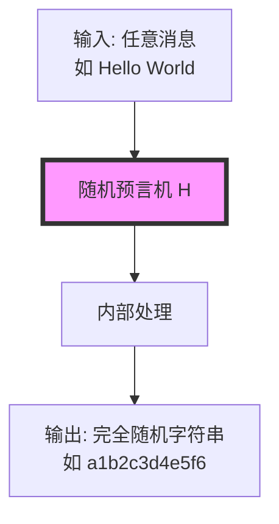

随机预言机具有以下特性：

| 特性 | 描述 | 现实世界类比 |
|------|------|--------------|
| **确定性** | 相同输入总是产生相同输出 | 完美的记忆 |
| **随机性** | 对任何新输入，输出均匀随机 | 掷公平骰子 |
| **高效性** | 响应查询是即时的 | 即时查询字典 |
| **一致性** | 对所有人返回相同响应 | 公共参考书 |

在现实世界中，**密码学哈希函数**（如SHA-256、SHA-3）被用作随机预言机的近似。虽然理论上哈希函数不是完美的随机预言机，但在实践中，将哈希函数建模为随机预言机已被证明是安全且有效的。

### 2.2 哈希到曲线（Hash-to-Curve）

哈希到曲线是许多基于椭圆曲线的密码学协议（包括VRF）中的关键技术。它解决了如何将任意数据映射到椭圆曲线上的点的问题。

#### 为什么需要哈希到曲线？

椭圆曲线运算需要在曲线点上进行，但我们的输入通常是任意数据（字符串、数字等）。我们需要一个确定性的方法将任意输入映射到椭圆曲线点。

**简单方法的缺陷**：
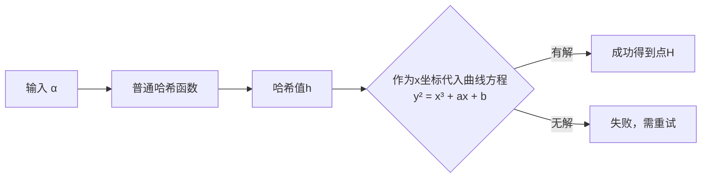

这种方法不是恒定时间的，可能泄露信息，而且产生的点分布可能不均匀。

#### 安全的哈希到曲线算法

现代哈希到曲线算法（如IETF标准化的算法）确保：

1. **确定性**：相同的α总是映射到相同的点H
2. **均匀分布**：输出点在曲线上均匀分布
3. **恒定时间**：计算时间不依赖于输入
4. **安全性**：满足随机预言机模型下的安全性

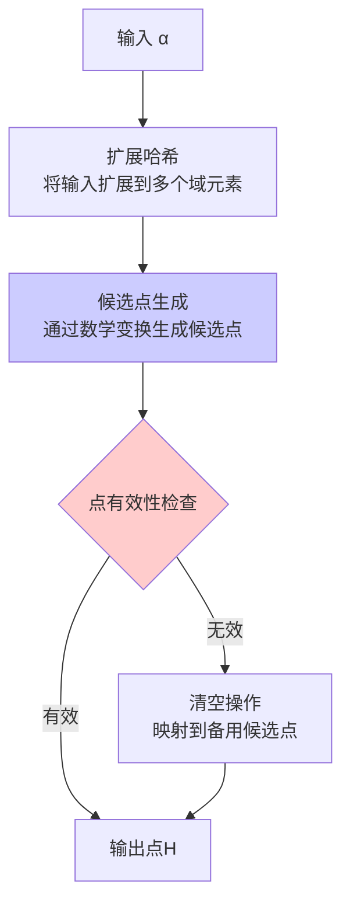

在VRF中，我们使用哈希到曲线函数H₁将输入α映射到椭圆曲线点：
\[
H = H_1(\alpha) \in \mathbb{G}
\]
其中\(\mathbb{G}\)是椭圆曲线点的群。

### 2.3 Fiat-Shamir变换：从交互到非交互

许多密码学协议（如身份认证）最初是**交互式**的，需要验证者和证明者之间来回通信。Fiat-Shamir变换通过哈希函数将这个交互式协议转换为**非交互式**协议。

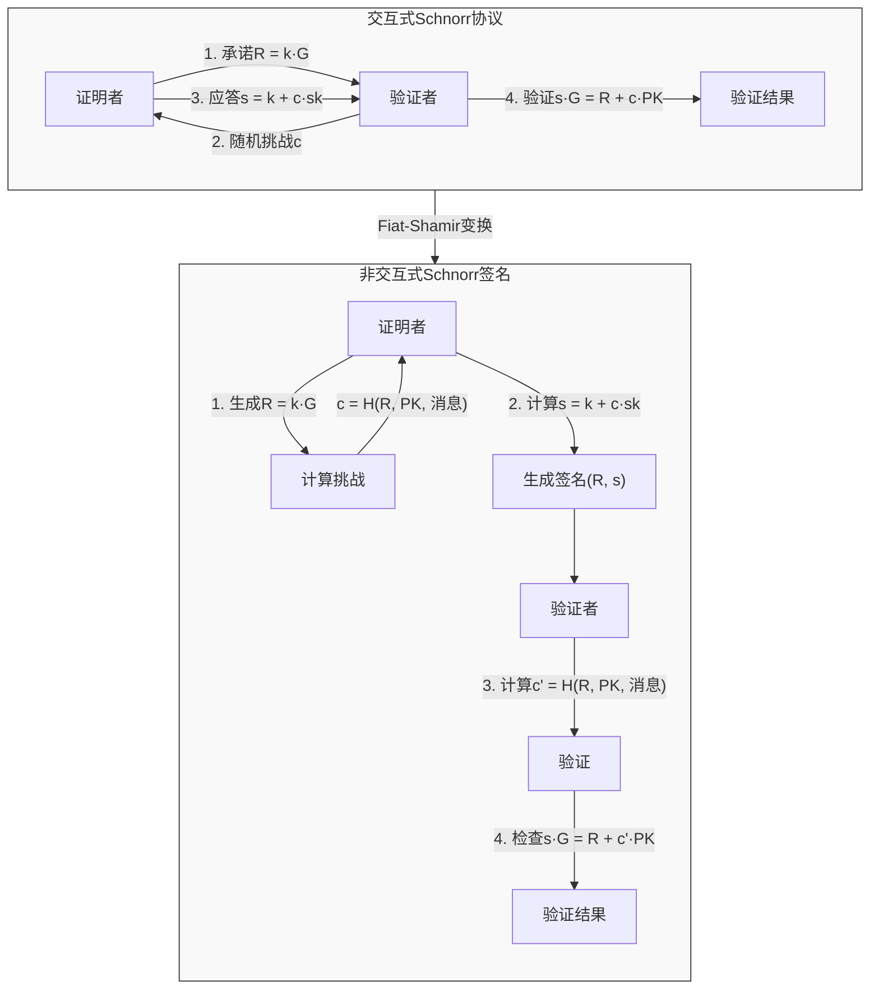

关键洞见：用**哈希函数**模拟验证者生成随机挑战的过程。这之所以安全，是因为：
1. 哈希函数输出看起来是随机的
2. 证明者无法在计算R之前预测c
3. 证明者必须"先承诺，后挑战"

这个变换是VRF能够非交互地生成可验证随机数的核心机制。

---

## 3. VRF的核心构造

### 3.1 总体架构

一个完整的VRF系统由三个核心算法组成，它们共同构建了一个可验证的随机性生成管道：

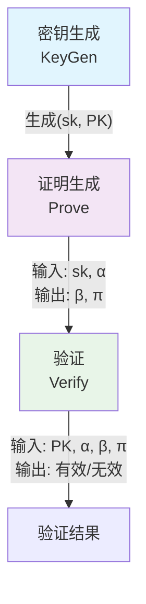

### 3.2 详细构造步骤

下面我们以基于椭圆曲线的VRF（EC-VRF）为例，详细分解其构造过程。整个过程基于椭圆曲线离散对数问题的困难性。

#### 步骤1：系统参数设置

首先，我们需要定义使用的椭圆曲线和相关参数：

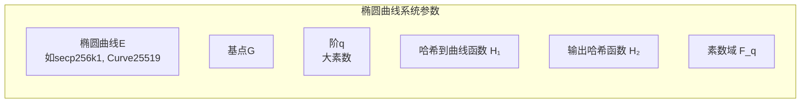

#### 步骤2：密钥生成 (KeyGen)

每个参与者生成自己的公私钥对：

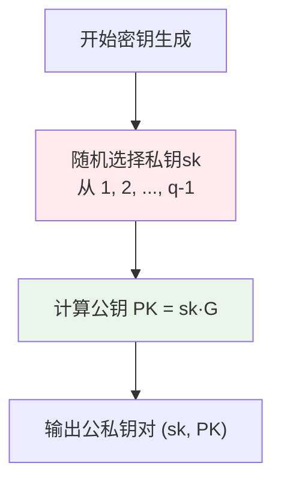

#### 步骤3：证明生成 (Prove)

给定私钥sk和输入α，生成随机输出β和证明π：

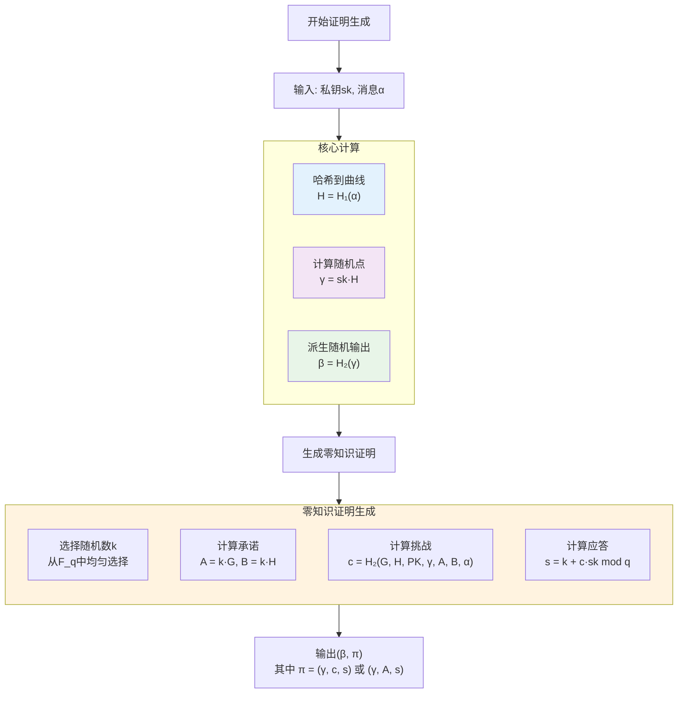

**零知识证明的安全原理**：
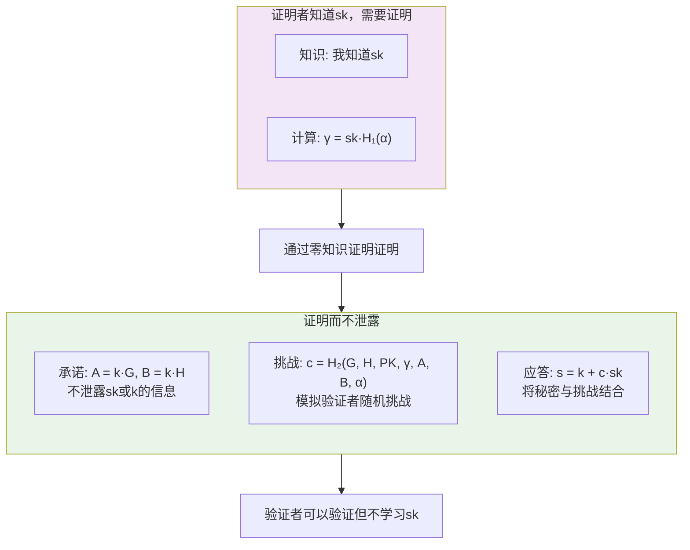

#### 步骤4：验证 (Verify)

给定公钥PK、输入α、输出β和证明π，任何人都可以验证：

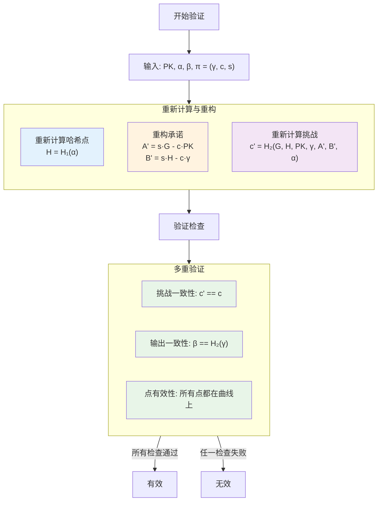

**验证的数学原理**：
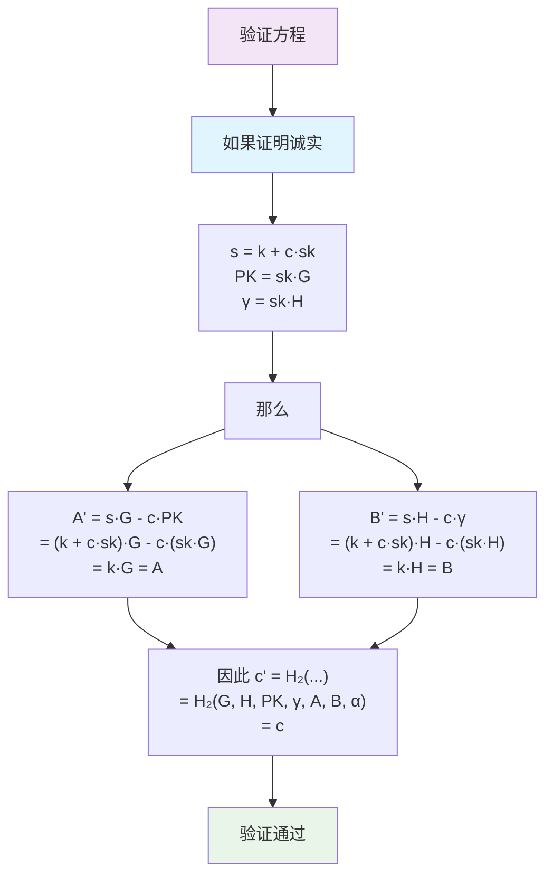

---

## 4. 为什么需要这样构造？

VRF的构造不是随意的，每个组件都有其特定的安全目的。下面我们分解每个设计选择背后的原理：

### 4.1 哈希到曲线（Hash-to-Curve）的必要性

在VRF中，哈希到曲线函数H₁具有关键作用：

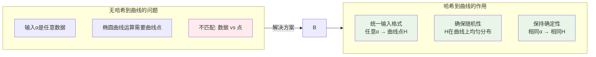

### 4.2 γ = sk·H 的安全意义

计算 γ = sk·H 是VRF的核心，其安全性基于离散对数问题的困难性：

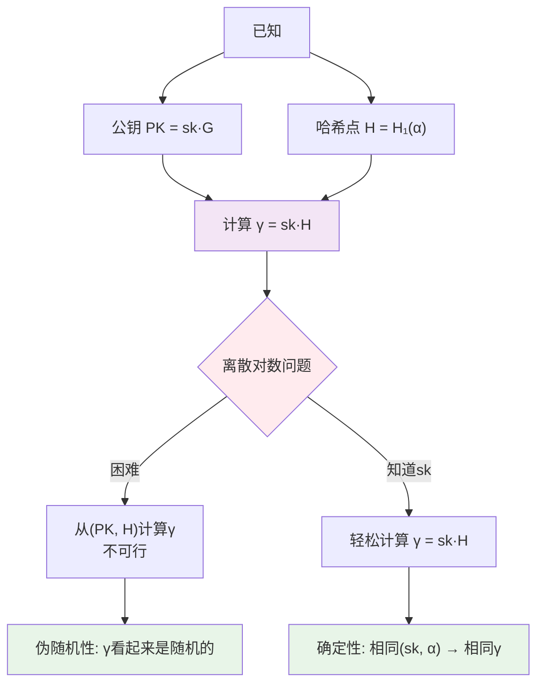

### 4.3 零知识证明的结构解析

VRF中的零知识证明确保了可验证性而不泄露秘密：

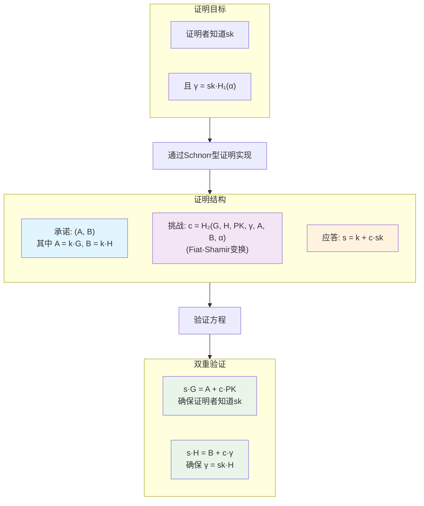

### 4.4 安全属性实现机制

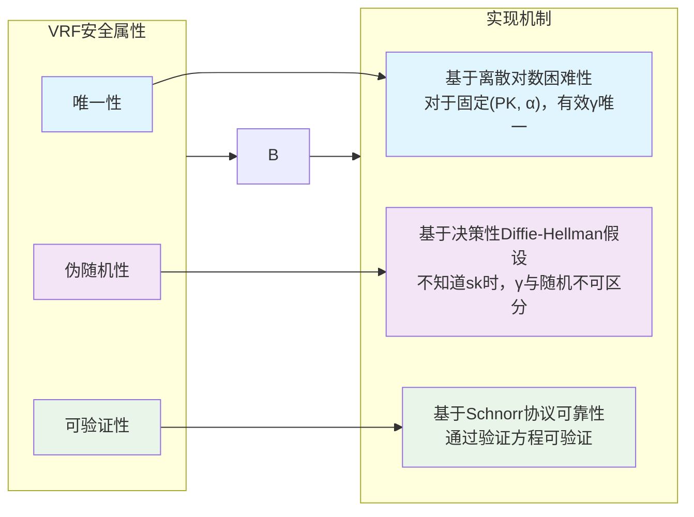

---

## 5. VRF的完整工作流程示例

让我们通过一个具体例子——区块链中的出块者选择——来看VRF的实际应用：

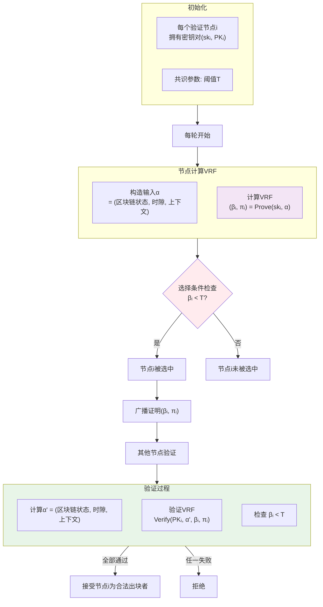

**区块链中使用VRF的优势**：
1. **公平性**：选择完全基于随机数，无人能预测结果
2. **可验证性**：任何节点都能独立验证选择结果的正确性
3. **抗操纵性**：在计算β_i前，节点不知道自己是否被选中
4. **高效性**：非交互式，节点独立计算，无需多轮通信
5. **可追究性**：恶意节点无法否认自己的选择结果

---

## 6. 实际应用与实现考虑

### 6.1 实际部署中的VRF

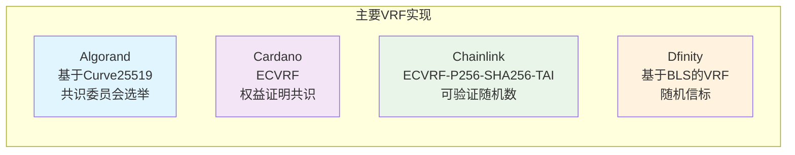

### 6.2 实现注意事项

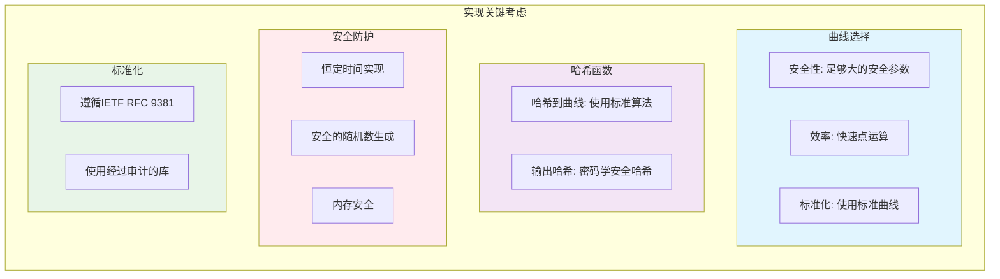

### 6.3 性能考虑

典型EC-VRF操作的性能特征：

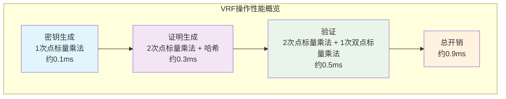

---

## 7. 总结

可验证随机函数（VRF）是现代密码学的一个强大工具，它巧妙结合了多种密码学原语：

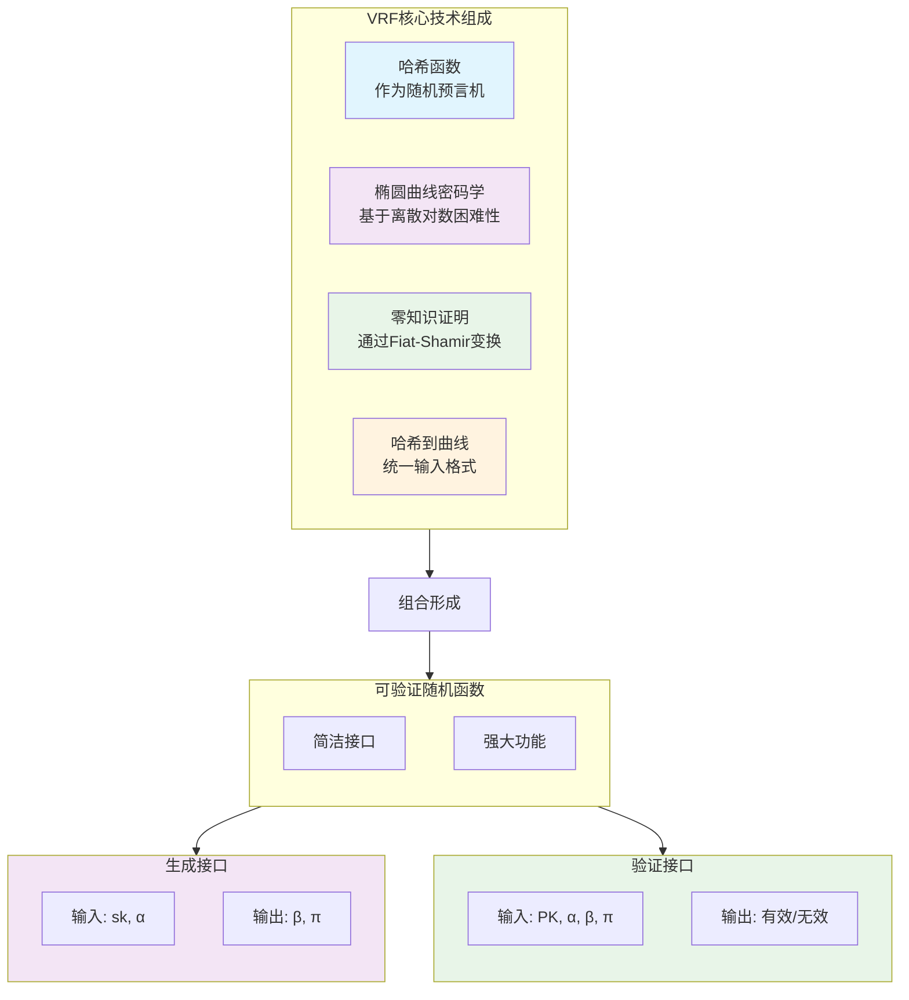

VRF的优雅之处在于，它将复杂的密码学构造封装成简单的接口，使得在分布式系统中实现公平、透明、可验证的随机性成为可能。其主要应用包括：

1. **区块链共识**：随机选择出块者、委员会成员
2. **智能合约随机数**：游戏、抽奖、NFT生成
3. **分布式系统**：随机调度、负载均衡
4. **密码学协议**：匿名凭证、电子投票

随着区块链、分布式系统和密码学的发展，VRF的应用场景只会越来越广泛。理解其构造原理不仅有助于正确使用现有VRF实现，也为设计新的基于随机性的协议提供了基础工具。

---

## 参考文献与进一步阅读

1. **学术论文**：
   - Micali, S., Rabin, M., & Vadhan, S. (1999). Verifiable Random Functions
   - Dodis, Y. (2002). Efficient Construction of (Distributed) Verifiable Random Functions

2. **标准文档**：
   - IETF RFC 9381: Verifiable Random Functions (VRFs)
   - IETF draft-irtf-cfrg-hash-to-curve: Hashing to Elliptic Curves

3. **实现库**：
   - libsodium: crypto_vrf_* 函数族
   - Chainlink VRF: 生产级实现
   - Algorand Go实现: crypto/vrf

4. **应用案例**：
   - Algorand共识协议
   - Chainlink可验证随机数
   - ICON区块链的DPoS共识

通过深入理解VRF的构造和工作原理，开发者可以更安全、更有效地在分布式系统中应用这一强大的密码学原语，构建更加公平、透明、可信的系统。

---

## Ring VRF：匿名可验证随机函数

### 1. 什么是 Ring VRF

Ring VRF（环可验证随机函数）是 VRF 与环签名的结合，它允许证明者生成一个可验证的随机输出，同时隐藏自己在验证者集合中的具体身份。

```mermaid
flowchart TD
    subgraph A["普通 VRF"]
        direction TB
        A1["证明: Y = xH 且 P = xG"]
        A2["使用 DLEQ 证明"]
        A3["暴露具体公钥 P"]
    end
    
    subgraph B["Ring VRF"]
        direction TB
        B1["证明: Y = xᵢH 且 Pᵢ = xᵢG<br/>对某个 i ∈ {1..n}"]
        B2["使用 DLEQ 环证明"]
        B3["只暴露属于环 R"]
    end
    
    A -->|"匿名化"| B
    
    style A3 fill:#ffebee
    style B3 fill:#e8f5e8
```

**核心特性**：

| 属性 | 普通 VRF | Ring VRF |
|------|----------|----------|
| 输出可验证 | ✓ | ✓ |
| 输出唯一 | ✓ | ✓ |
| 身份隐私 | ✗ 暴露公钥 | ✓ 只暴露属于环 |

### 2. 从环签名到 Ring VRF

Ring VRF 的核心是将单方程的环签名扩展为双方程的 DLEQ 环证明：

| 环签名 | Ring VRF |
|--------|----------|
| 证明知道 $x_i$ 使 $P_i = x_i G$ | 证明知道 $x_i$ 使 $P_i = x_i G$ **且** $Y = x_i H$ |
| 每个分支 1 个承诺点 $R_i$ | 每个分支 2 个承诺点 $R_i, T_i$ |
| 1 条验证方程 | 2 条验证方程 |

```mermaid
flowchart LR
    subgraph A["环签名验证"]
        direction TB
        E1["zᵢG = Rᵢ + cᵢPᵢ"]
    end
    
    subgraph B["Ring VRF 验证"]
        direction TB
        E2["zᵢG = Rᵢ + cᵢPᵢ"]
        E3["zᵢH = Tᵢ + cᵢY"]
    end
    
    A -->|"加一条方程"| B
    
    style A fill:#e1f5fe
    style B fill:#f3e5f5
```

### 3. Ring VRF 算法定义

#### 3.1 公共参数

- $\mathbb{G}$：椭圆曲线群，阶为 $q$
- $G$：群的生成元
- $H = \text{HashToCurve}(m)$：消息哈希到曲线
- $R = \{P_1, P_2, \ldots, P_n\}$：公钥环

#### 3.2 密钥生成 KeyGen

$$
x \leftarrow \mathbb{Z}_q, \quad P = xG
$$

输出密钥对 $(x, P)$。

#### 3.3 证明生成 Prove

**输入**：私钥 $x_s$，索引 $s$，消息 $m$，环 $R$

**输出**：VRF 输出 $\beta$，证明 $\pi$

```mermaid
flowchart TD
    Start["输入: 私钥 xₛ, 索引 s, 消息 m, 环 R"]
    
    Start --> Step1["Step 1: 计算 VRF 输出<br/>H = HashToCurve(m)<br/>Y = xₛ · H"]
    
    Step1 --> Step2["Step 2: 真实分支承诺<br/>选随机 u ← ℤq<br/>Rₛ = u · G<br/>Tₛ = u · H"]
    
    Step2 --> Step3["Step 3: 启动挑战链<br/>cₛ₊₁ = Hash(m || R || Y || Rₛ || Tₛ)"]
    
    Step3 --> Loop["Step 4: 循环伪造 (i = s+1 到 s-1 mod n)"]
    
    subgraph LoopBody["对每个 i ≠ s"]
        direction TB
        L1["随机选 zᵢ ← ℤq"]
        L2["伪造承诺:<br/>Rᵢ = zᵢG - cᵢPᵢ<br/>Tᵢ = zᵢH - cᵢY"]
        L3["推进挑战:<br/>cᵢ₊₁ = Hash(m || R || Y || Rᵢ || Tᵢ)"]
    end
    
    Loop --> LoopBody
    LoopBody --> Step5
    
    Step5["Step 5: 真实响应<br/>绕回到 s，已得 cₛ<br/>zₛ = u + cₛxₛ mod q"]
    
    Step5 --> Output["输出:<br/>β = Hash(Y)<br/>π = (c₁, z₁, ..., zₙ, Y)"]
    
    style Step1 fill:#e1f5fe
    style Step2 fill:#e8f5e8
    style LoopBody fill:#fff3e0
    style Step5 fill:#e8f5e8
```

#### 3.4 验证 Verify

**输入**：消息 $m$，环 $R$，输出 $\beta$，证明 $\pi = (c_1, z_1, \ldots, z_n, Y)$

**输出**：接受或拒绝

```mermaid
flowchart TD
    Input["输入: m, 环 R={P₁..Pₙ}, β, π=(c₁, z₁..zₙ, Y)"]
    
    Input --> V0["Step 0: H = HashToCurve(m)"]
    
    V0 --> V1["Step 1: 检查 β = Hash(Y)"]
    
    V1 --> V2["Step 2: 令 c = c₁"]
    
    V2 --> Loop["Step 3: 对 i = 1 到 n 循环"]
    
    subgraph LoopBody["每轮计算"]
        direction TB
        L1["Rᵢ = zᵢG - cPᵢ"]
        L2["Tᵢ = zᵢH - cY"]
        L3["c = Hash(m || R || Y || Rᵢ || Tᵢ)"]
    end
    
    Loop --> LoopBody
    
    LoopBody --> Check{"Step 4: c == c₁ ?"}
    
    Check -->|"是"| Accept["✓ 接受"]
    Check -->|"否"| Reject["✗ 拒绝"]
    
    style Accept fill:#e8f5e8
    style Reject fill:#ffebee
```

### 4. 环状挑战链结构

以 $n=3$，真实索引 $s=2$ 为例：

```mermaid
flowchart LR
    subgraph Ring["Ring VRF 挑战链"]
        direction LR
        
        subgraph S2["分支2 (真实)"]
            R2["Rₛ = uG<br/>Tₛ = uH"]
        end
        
        S2 -->|"c₁ = H(...||R₂||T₂)"| S1
        
        subgraph S1["分支1 (伪造)"]
            F1["z₁ 随机<br/>R₁ = z₁G - c₁P₁<br/>T₁ = z₁H - c₁Y"]
        end
        
        S1 -->|"c₂ = H(...||R₁||T₁)"| S3
        
        subgraph S3["分支3 (伪造)"]
            F3["z₃ 随机<br/>R₃ = z₃G - c₃P₃<br/>T₃ = z₃H - c₃Y"]
        end
        
        S3 -->|"c₂ = H(...||R₃||T₃)"| Real["z₂ = u + c₂xₛ"]
    end
    
    Real -->|"闭环验证"| S2
    
    style S2 fill:#e8f5e8
    style S1 fill:#fff3e0
    style S3 fill:#fff3e0
    style Real fill:#e8f5e8
```

### 5. 正确性证明

#### 5.1 伪造分支（$i \neq s$）

由于 $R_i, T_i$ 的定义方式，验证等式天然成立：

$$
R_i = z_i G - c_i P_i \quad \Rightarrow \quad z_i G = R_i + c_i P_i \quad \checkmark
$$

$$
T_i = z_i H - c_i Y \quad \Rightarrow \quad z_i H = T_i + c_i Y \quad \checkmark
$$

#### 5.2 真实分支（$i = s$）

已知 $R_s = uG$，$T_s = uH$，$z_s = u + c_s x_s$，验证时：

$$
z_s G - c_s P_s = (u + c_s x_s)G - c_s(x_s G) = uG = R_s \quad \checkmark
$$

$$
z_s H - c_s Y = (u + c_s x_s)H - c_s(x_s H) = uH = T_s \quad \checkmark
$$

因此哈希链正确闭合。

### 6. 安全性分析

#### 6.1 不可伪造性

```mermaid
flowchart TD
    subgraph A["攻击者不知道任何私钥"]
        direction TB
        A1["每个分支都必须伪造"]
        A2["Rᵢ, Tᵢ 都被哈希链决定"]
        A3["闭环 = 预测哈希输出"]
        A4["随机预言机下不可行"]
    end
    
    subgraph B["合法签名者知道 xₛ"]
        direction TB
        B1["锚定 Rₛ = uG, Tₛ = uH"]
        B2["用私钥算 zₛ = u + cₛxₛ"]
        B3["两个方程同时满足"]
        B4["闭环成功"]
    end
    
    style A4 fill:#ffebee
    style B4 fill:#e8f5e8
```

**核心论证**：私钥让签名者能"锚定"一个承诺点，然后用私钥"补齐"响应值。没有私钥则所有承诺点都被哈希链被动决定，闭环等价于哈希反演，计算上不可行。

#### 6.2 匿名性

验证者只能确认"环中某个成员生成了 $Y$"，无法区分具体是哪个成员，因为：

1. 所有分支的 $(c_i, z_i, R_i, T_i)$ 在统计上不可区分
2. 伪造分支使用模拟器构造，与真实分支无法区分

### 7. 伪代码实现

#### 7.1 密钥生成

```python
def keygen():
    x = random_scalar()      # 私钥 x ← ℤq
    P = x * G                # 公钥 P = xG
    return (x, P)
```

#### 7.2 Ring VRF 证明生成

```python
def ring_vrf_prove(x_s, s, m, ring):
    """
    x_s:  签名者私钥
    s:    签名者在环中的索引 (0-indexed)
    m:    消息
    ring: 公钥列表 [P_0, P_1, ..., P_{n-1}]
    """
    n = len(ring)
    
    # Step 1: 计算 VRF 输出
    H = hash_to_curve(m)
    Y = x_s * H
    
    # Step 2: 真实分支承诺
    u = random_scalar()
    R = [None] * n
    T = [None] * n
    R[s] = u * G
    T[s] = u * H
    
    # Step 3-4: 构建挑战链
    c = [None] * n
    z = [None] * n
    
    # 从 s+1 开始挑战链
    c[(s + 1) % n] = hash_challenge(m, ring, Y, R[s], T[s])
    
    # 伪造 n-1 个分支
    for j in range(1, n):
        i = (s + j) % n
        next_i = (i + 1) % n
        
        # 随机选择响应值
        z[i] = random_scalar()
        
        # 伪造承诺
        R[i] = z[i] * G - c[i] * ring[i]
        T[i] = z[i] * H - c[i] * Y
        
        # 推进挑战
        c[next_i] = hash_challenge(m, ring, Y, R[i], T[i])
    
    # Step 5: 真实响应
    z[s] = (u + c[s] * x_s) % q
    
    # 输出
    beta = hash_output(Y)
    proof = (c[0], z, Y)
    
    return (beta, proof)
```

#### 7.3 Ring VRF 验证

```python
def ring_vrf_verify(m, ring, beta, proof):
    """
    m:     消息
    ring:  公钥列表
    beta:  VRF 输出
    proof: (c_0, z_list, Y)
    """
    c_0, z, Y = proof
    n = len(ring)
    
    # 计算 H
    H = hash_to_curve(m)
    
    # 验证 beta
    if beta != hash_output(Y):
        return False
    
    # 重建挑战链
    c = c_0
    for i in range(n):
        R_i = z[i] * G - c * ring[i]
        T_i = z[i] * H - c * Y
        c = hash_challenge(m, ring, Y, R_i, T_i)
    
    # 检查闭环
    return c == c_0
```

### 8. Ring VRF 的属性

| 属性 | 说明 |
|------|------|
| **唯一性** | 对同一消息 $m$ 和私钥 $x_s$，输出 $Y = x_s H$ 唯一确定 |
| **匿名性** | 验证者只知道"环中某人"生成了输出，不知道具体是谁 |
| **可验证性** | 任何人可验证输出来自合法的环成员 |
| **伪随机性** | 不知道私钥的人无法预测 $\beta = \text{Hash}(Y)$ |

### 9. 应用场景

```mermaid
flowchart TD
    subgraph A["Ring VRF 应用"]
        direction TB
        App1["匿名领导者选举<br/>Polkadot JAM/SAFROLE"]
        App2["隐私投票系统"]
        App3["匿名抽签/抽奖"]
        App4["隐私保护的随机信标"]
    end
    
    subgraph B["优势"]
        direction TB
        Adv1["防止针对性攻击<br/>(DDoS, 贿赂)"]
        Adv2["保护参与者隐私"]
        Adv3["仍可验证随机性"]
    end
    
    A --> B
    
    style App1 fill:#e1f5fe
    style Adv1 fill:#e8f5e8
```

### 10. 与标准 VRF 的完整对比

| 方面 | 标准 VRF | Ring VRF |
|------|----------|----------|
| **证明类型** | DLEQ 证明 | DLEQ 环证明 |
| **公钥绑定** | 单个公钥 $P$ | 公钥环 $R = \{P_1, \ldots, P_n\}$ |
| **身份隐私** | 无（公钥公开） | 有（只暴露属于环） |
| **证明大小** | $O(1)$ | $O(n)$ |
| **验证时间** | $O(1)$ | $O(n)$ |
| **适用场景** | 一般随机数生成 | 匿名场景（如区块链出块者选举） |

Ring VRF 通过牺牲一定的效率（证明和验证复杂度从 $O(1)$ 增加到 $O(n)$），换取了强大的身份隐私保护，特别适用于需要匿名性的分布式系统场景。