# VRF 在匿名凭证与电子投票中的应用

## 摘要

可验证随机函数（VRF）不仅可用于随机数生成，在匿名凭证系统和电子投票协议中也发挥着关键作用。VRF 独特的"可验证的确定性伪随机输出"特性，使其成为构建隐私保护身份系统和公平透明投票机制的理想工具。本文深入探讨 VRF 在这两个领域的应用原理、协议设计和实现考量。

---

## 1. 匿名凭证系统

### 1.1 什么是匿名凭证？

匿名凭证（Anonymous Credentials）允许用户证明自己拥有某种属性或资格，而无需透露身份信息。

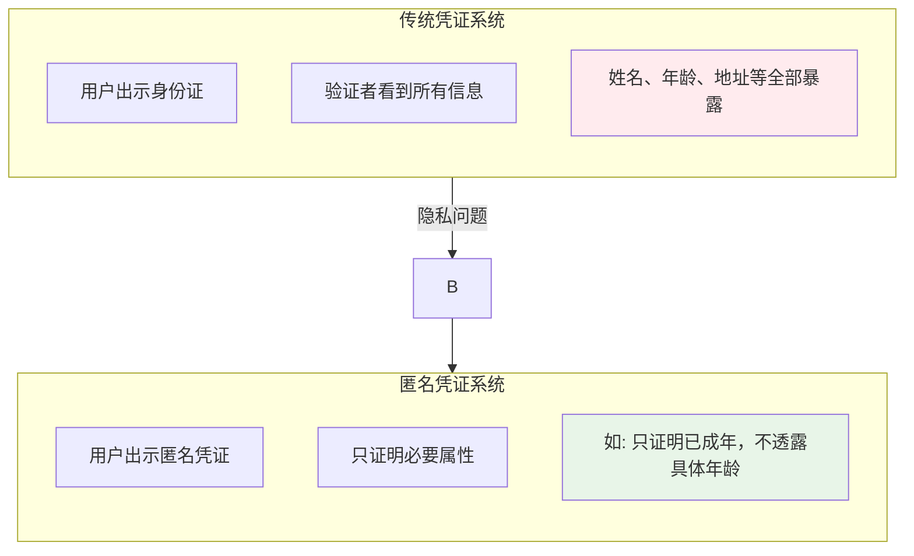
```mermaid
flowchart TD
    subgraph A["传统凭证系统"]
        direction TB
        T1["用户出示身份证"]
        T2["验证者看到所有信息"]
        T3["姓名、年龄、地址等全部暴露"]
    end
    
    A -->|"隐私问题"| B
    
    subgraph C["匿名凭证系统"]
        direction TB
        A1["用户出示匿名凭证"]
        A2["只证明必要属性"]
        A3["如: 只证明已成年，不透露具体年龄"]
    end
    
    B --> C
    
    style T3 fill:#ffebee
    style A3 fill:#e8f5e8
```

### 1.2 VRF 在匿名凭证中的角色

VRF 在匿名凭证系统中主要用于生成**不可链接的伪随机标识符**：

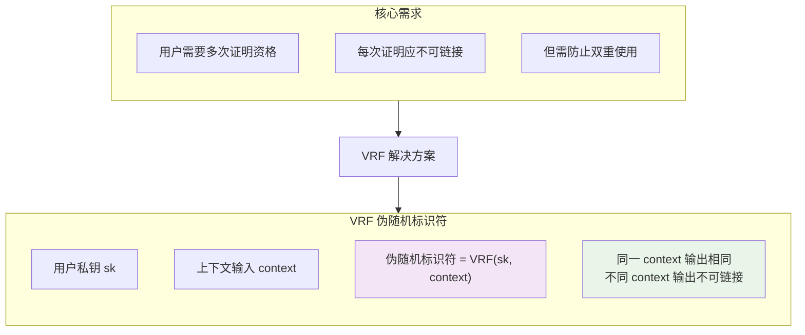
```mermaid
flowchart TD
    subgraph A["核心需求"]
        direction TB
        N1["用户需要多次证明资格"]
        N2["每次证明应不可链接"]
        N3["但需防止双重使用"]
    end
    
    A --> B["VRF 解决方案"]
    
    subgraph C["VRF 伪随机标识符"]
        direction TB
        V1["用户私钥 sk"]
        V2["上下文输入 context"]
        V3["伪随机标识符 = VRF(sk, context)"]
        V4["同一 context 输出相同<br/>不同 context 输出不可链接"]
    end
    
    B --> C
    
    style V3 fill:#f3e5f5
    style V4 fill:#e8f5e8
```

### 1.3 OPRF：基于 VRF 的不经意伪随机函数

OPRF（Oblivious Pseudo-Random Function）是 VRF 的一个重要变体，在匿名凭证中广泛使用：

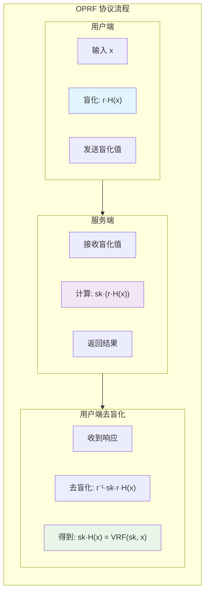
```mermaid
flowchart TD
    subgraph A["OPRF 协议流程"]
        direction TB
        
        subgraph B["用户端"]
            direction LR
            U1["输入 x"]
            U2["盲化: r·H(x)"]
            U3["发送盲化值"]
        end
        
        subgraph C["服务端"]
            direction LR
            S1["接收盲化值"]
            S2["计算: sk·(r·H(x))"]
            S3["返回结果"]
        end
        
        subgraph D["用户端去盲化"]
            direction LR
            R1["收到响应"]
            R2["去盲化: r⁻¹·sk·r·H(x)"]
            R3["得到: sk·H(x) = VRF(sk, x)"]
        end
    end
    
    B --> C --> D
    
    style U2 fill:#e1f5fe
    style S2 fill:#f3e5f5
    style R3 fill:#e8f5e8
```

**OPRF 的隐私保证**：
- 服务端不知道用户输入 $x$
- 用户不知道服务端私钥 $sk$
- 用户获得 VRF 输出，可用于匿名认证

### 1.4 匿名认证协议

使用 VRF/OPRF 构建匿名认证系统：

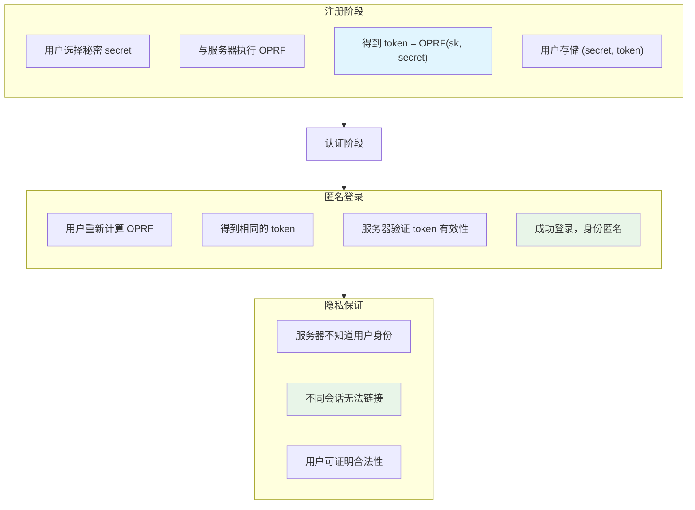
```mermaid
flowchart TD
    subgraph A["注册阶段"]
        direction TB
        R1["用户选择秘密 secret"]
        R2["与服务器执行 OPRF"]
        R3["得到 token = OPRF(sk, secret)"]
        R4["用户存储 (secret, token)"]
    end
    
    A --> B["认证阶段"]
    
    subgraph C["匿名登录"]
        direction TB
        L1["用户重新计算 OPRF"]
        L2["得到相同的 token"]
        L3["服务器验证 token 有效性"]
        L4["成功登录，身份匿名"]
    end
    
    B --> C
    
    subgraph D["隐私保证"]
        direction LR
        P1["服务器不知道用户身份"]
        P2["不同会话无法链接"]
        P3["用户可证明合法性"]
    end
    
    C --> D
    
    style R3 fill:#e1f5fe
    style L4 fill:#e8f5e8
    style P2 fill:#e8f5e8
```

### 1.5 防双花机制

在需要限制使用次数的场景（如优惠券），VRF 可防止双重使用：

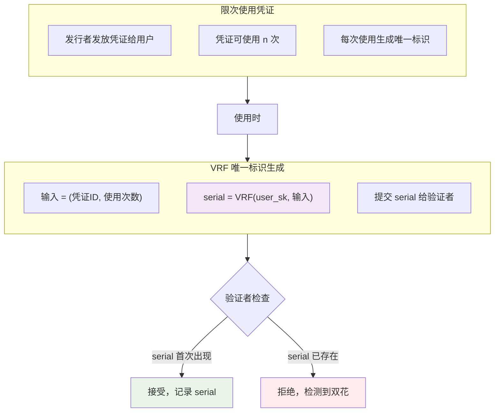
```mermaid
flowchart TD
    subgraph A["限次使用凭证"]
        direction TB
        C1["发行者发放凭证给用户"]
        C2["凭证可使用 n 次"]
        C3["每次使用生成唯一标识"]
    end
    
    A --> B["使用时"]
    
    subgraph C["VRF 唯一标识生成"]
        direction TB
        U1["输入 = (凭证ID, 使用次数)"]
        U2["serial = VRF(user_sk, 输入)"]
        U3["提交 serial 给验证者"]
    end
    
    B --> C
    
    C --> D{"验证者检查"}
    
    D -->|"serial 首次出现"| E["接受，记录 serial"]
    D -->|"serial 已存在"| F["拒绝，检测到双花"]
    
    style U2 fill:#f3e5f5
    style E fill:#e8f5e8
    style F fill:#ffebee
```

---

## 2. 电子投票系统

### 2.1 电子投票的核心需求

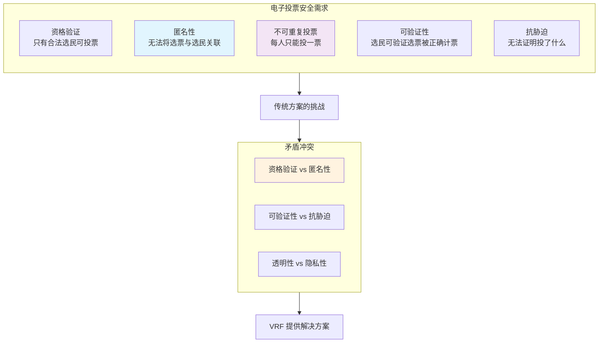
```mermaid
flowchart TD
    subgraph A["电子投票安全需求"]
        direction TB
        S1["资格验证<br/>只有合法选民可投票"]
        S2["匿名性<br/>无法将选票与选民关联"]
        S3["不可重复投票<br/>每人只能投一票"]
        S4["可验证性<br/>选民可验证选票被正确计票"]
        S5["抗胁迫<br/>无法证明投了什么"]
    end
    
    A --> B["传统方案的挑战"]
    
    subgraph C["矛盾冲突"]
        direction LR
        C1["资格验证 vs 匿名性"]
        C2["可验证性 vs 抗胁迫"]
        C3["透明性 vs 隐私性"]
    end
    
    B --> C
    
    C --> D["VRF 提供解决方案"]
    
    style S2 fill:#e1f5fe
    style S3 fill:#f3e5f5
    style C1 fill:#fff3e0
```

### 2.2 VRF 选民资格证明

VRF 可用于证明选民资格而不暴露身份：

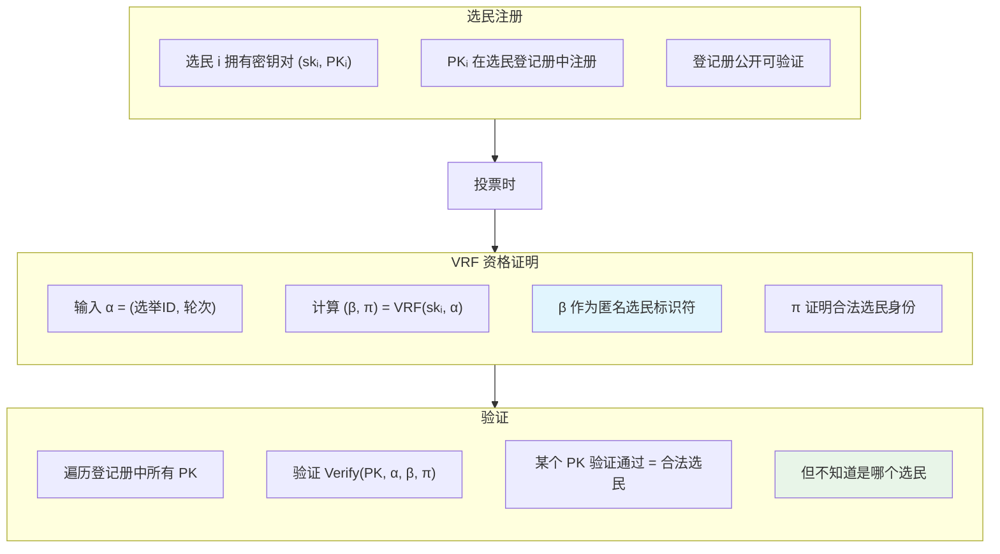
```mermaid
flowchart TD
    subgraph A["选民注册"]
        direction TB
        R1["选民 i 拥有密钥对 (skᵢ, PKᵢ)"]
        R2["PKᵢ 在选民登记册中注册"]
        R3["登记册公开可验证"]
    end
    
    A --> B["投票时"]
    
    subgraph C["VRF 资格证明"]
        direction TB
        V1["输入 α = (选举ID, 轮次)"]
        V2["计算 (β, π) = VRF(skᵢ, α)"]
        V3["β 作为匿名选民标识符"]
        V4["π 证明合法选民身份"]
    end
    
    B --> C
    
    subgraph D["验证"]
        direction TB
        E1["遍历登记册中所有 PK"]
        E2["验证 Verify(PK, α, β, π)"]
        E3["某个 PK 验证通过 = 合法选民"]
        E4["但不知道是哪个选民"]
    end
    
    C --> D
    
    style V3 fill:#e1f5fe
    style E4 fill:#e8f5e8
```

### 2.3 不可重复投票

VRF 的确定性保证每个选民对同一选举只能产生一个有效的匿名标识符：

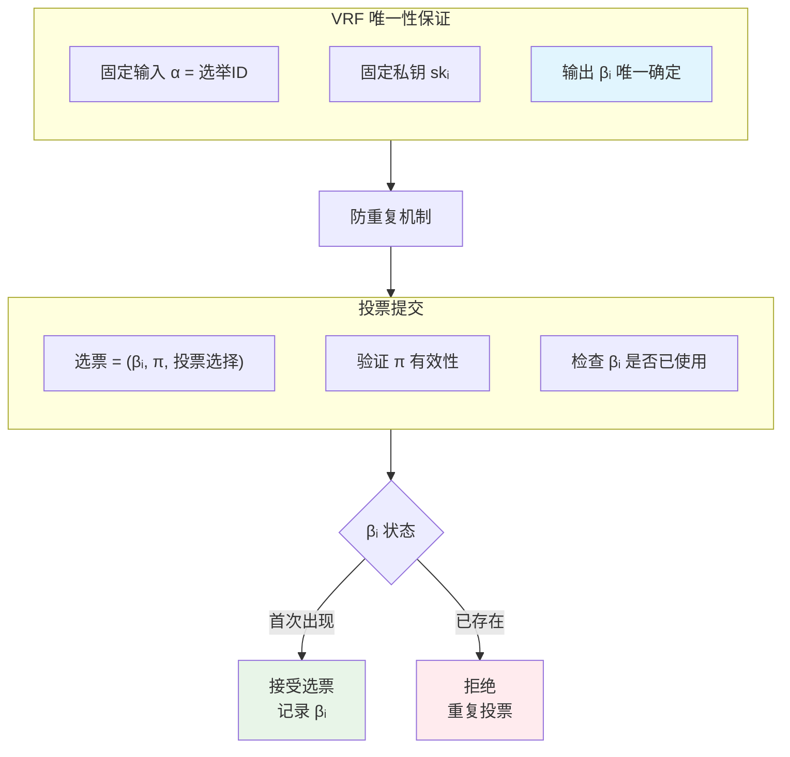
```mermaid
flowchart TD
    subgraph A["VRF 唯一性保证"]
        direction TB
        U1["固定输入 α = 选举ID"]
        U2["固定私钥 skᵢ"]
        U3["输出 βᵢ 唯一确定"]
    end
    
    A --> B["防重复机制"]
    
    subgraph C["投票提交"]
        direction TB
        S1["选票 = (βᵢ, π, 投票选择)"]
        S2["验证 π 有效性"]
        S3["检查 βᵢ 是否已使用"]
    end
    
    B --> C
    
    C --> D{"βᵢ 状态"}
    
    D -->|"首次出现"| E["接受选票<br/>记录 βᵢ"]
    D -->|"已存在"| F["拒绝<br/>重复投票"]
    
    style U3 fill:#e1f5fe
    style E fill:#e8f5e8
    style F fill:#ffebee
```

### 2.4 完整投票协议

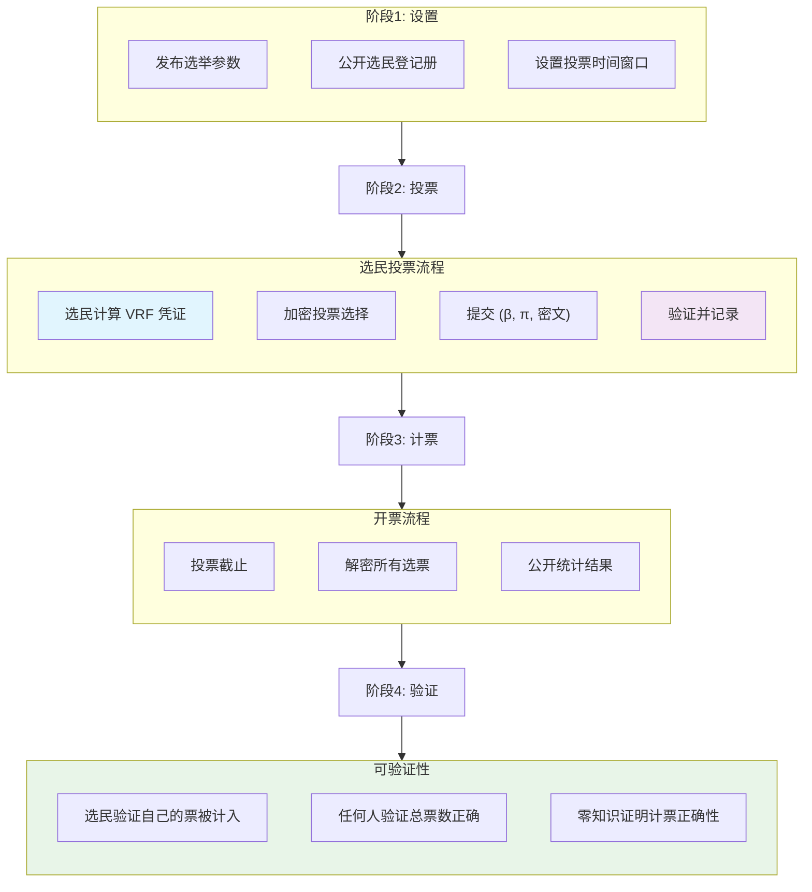
```mermaid
flowchart TD
    subgraph A["阶段1: 设置"]
        direction TB
        S1["发布选举参数"]
        S2["公开选民登记册"]
        S3["设置投票时间窗口"]
    end
    
    A --> B["阶段2: 投票"]
    
    subgraph C["选民投票流程"]
        direction TB
        V1["选民计算 VRF 凭证"]
        V2["加密投票选择"]
        V3["提交 (β, π, 密文)"]
        V4["验证并记录"]
    end
    
    B --> C
    
    C --> D["阶段3: 计票"]
    
    subgraph E["开票流程"]
        direction TB
        T1["投票截止"]
        T2["解密所有选票"]
        T3["公开统计结果"]
    end
    
    D --> E
    
    E --> F["阶段4: 验证"]
    
    subgraph G["可验证性"]
        direction TB
        P1["选民验证自己的票被计入"]
        P2["任何人验证总票数正确"]
        P3["零知识证明计票正确性"]
    end
    
    F --> G
    
    style V1 fill:#e1f5fe
    style V4 fill:#f3e5f5
    style G fill:#e8f5e8
```

### 2.5 与其他密码学技术结合

现代电子投票系统通常将 VRF 与其他技术结合：

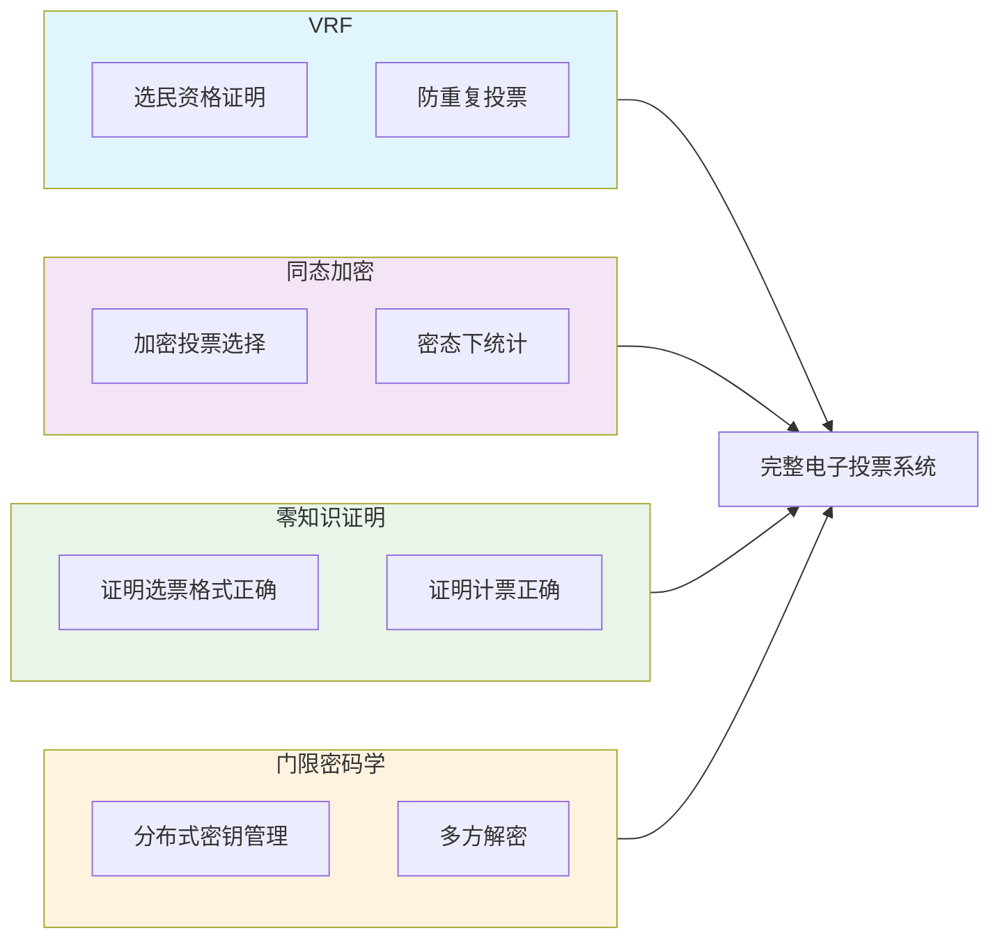
```mermaid
flowchart LR
    subgraph A["VRF"]
        direction TB
        V1["选民资格证明"]
        V2["防重复投票"]
    end
    
    subgraph B["同态加密"]
        direction TB
        H1["加密投票选择"]
        H2["密态下统计"]
    end
    
    subgraph C["零知识证明"]
        direction TB
        Z1["证明选票格式正确"]
        Z2["证明计票正确"]
    end
    
    subgraph D["门限密码学"]
        direction TB
        T1["分布式密钥管理"]
        T2["多方解密"]
    end
    
    A --> E["完整电子投票系统"]
    B --> E
    C --> E
    D --> E
    
    style A fill:#e1f5fe
    style B fill:#f3e5f5
    style C fill:#e8f5e8
    style D fill:#fff3e0
```

---

## 3. 高级协议设计

### 3.1 环 VRF (Ring VRF)

环 VRF 允许用户证明自己是某个群体的成员，而不透露具体身份：

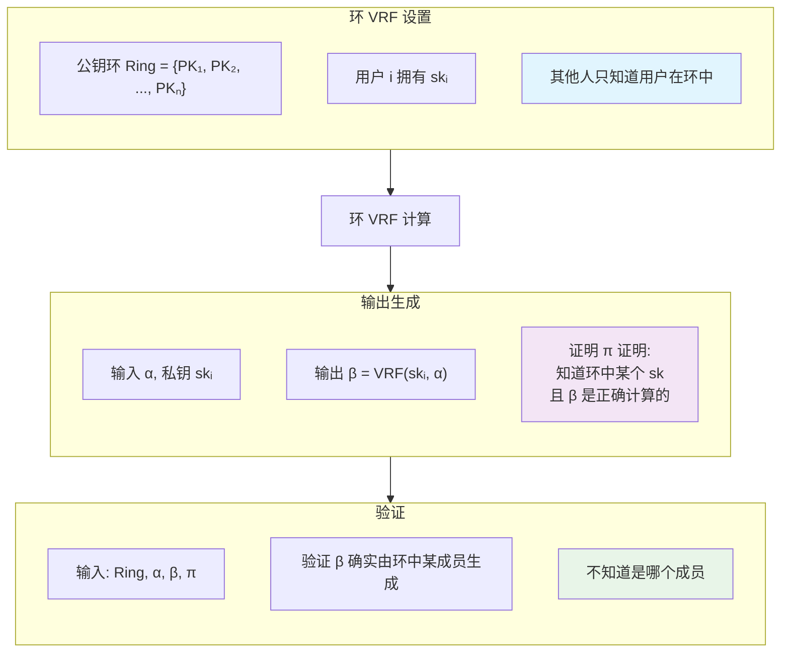
```mermaid
flowchart TD
    subgraph A["环 VRF 设置"]
        direction TB
        R1["公钥环 Ring = {PK₁, PK₂, ..., PKₙ}"]
        R2["用户 i 拥有 skᵢ"]
        R3["其他人只知道用户在环中"]
    end
    
    A --> B["环 VRF 计算"]
    
    subgraph C["输出生成"]
        direction TB
        V1["输入 α, 私钥 skᵢ"]
        V2["输出 β = VRF(skᵢ, α)"]
        V3["证明 π 证明:<br/>知道环中某个 sk<br/>且 β 是正确计算的"]
    end
    
    B --> C
    
    subgraph D["验证"]
        direction TB
        E1["输入: Ring, α, β, π"]
        E2["验证 β 确实由环中某成员生成"]
        E3["不知道是哪个成员"]
    end
    
    C --> D
    
    style R3 fill:#e1f5fe
    style V3 fill:#f3e5f5
    style E3 fill:#e8f5e8
```

**环 VRF 在投票中的应用**：

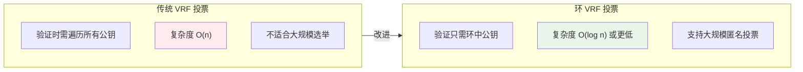
```mermaid
flowchart LR
    subgraph A["传统 VRF 投票"]
        direction TB
        T1["验证时需遍历所有公钥"]
        T2["复杂度 O(n)"]
        T3["不适合大规模选举"]
    end
    
    subgraph B["环 VRF 投票"]
        direction TB
        R1["验证只需环中公钥"]
        R2["复杂度 O(log n) 或更低"]
        R3["支持大规模匿名投票"]
    end
    
    A -->|"改进"| B
    
    style T2 fill:#ffebee
    style R2 fill:#e8f5e8
```

### 3.2 可链接 VRF

在某些场景，需要检测同一用户的多次行为而不暴露身份：

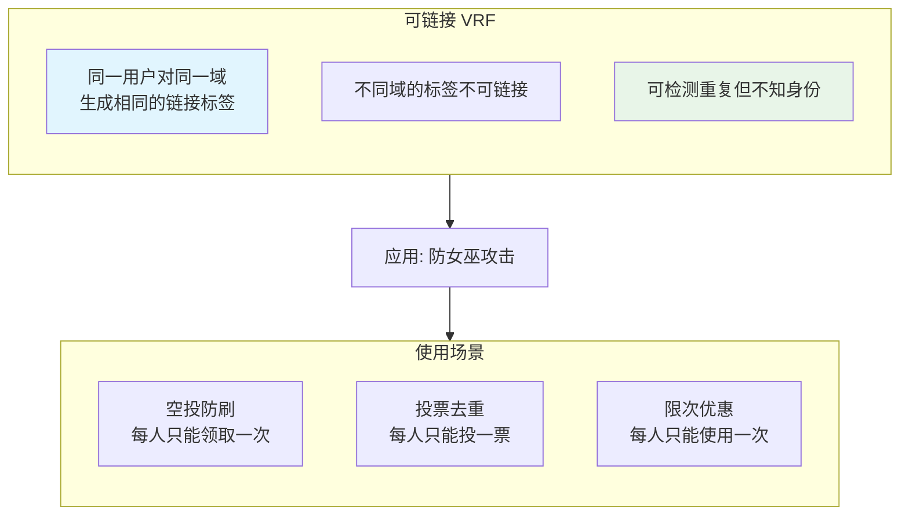
```mermaid
flowchart TD
    subgraph A["可链接 VRF"]
        direction TB
        L1["同一用户对同一域<br/>生成相同的链接标签"]
        L2["不同域的标签不可链接"]
        L3["可检测重复但不知身份"]
    end
    
    A --> B["应用: 防女巫攻击"]
    
    subgraph C["使用场景"]
        direction TB
        S1["空投防刷<br/>每人只能领取一次"]
        S2["投票去重<br/>每人只能投一票"]
        S3["限次优惠<br/>每人只能使用一次"]
    end
    
    B --> C
    
    style L1 fill:#e1f5fe
    style L3 fill:#e8f5e8
```

### 3.3 阈值 VRF

多方共同生成 VRF 输出，增强安全性：

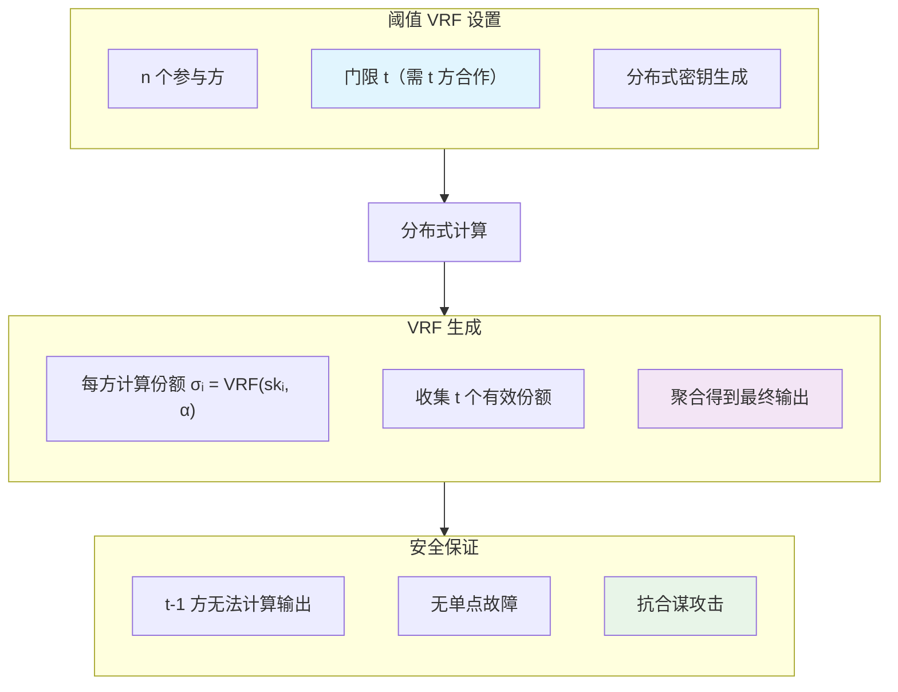
```mermaid
flowchart TD
    subgraph A["阈值 VRF 设置"]
        direction TB
        T1["n 个参与方"]
        T2["门限 t（需 t 方合作）"]
        T3["分布式密钥生成"]
    end
    
    A --> B["分布式计算"]
    
    subgraph C["VRF 生成"]
        direction TB
        V1["每方计算份额 σᵢ = VRF(skᵢ, α)"]
        V2["收集 t 个有效份额"]
        V3["聚合得到最终输出"]
    end
    
    B --> C
    
    subgraph D["安全保证"]
        direction TB
        S1["t-1 方无法计算输出"]
        S2["无单点故障"]
        S3["抗合谋攻击"]
    end
    
    C --> D
    
    style T2 fill:#e1f5fe
    style V3 fill:#f3e5f5
    style S3 fill:#e8f5e8
```

---

## 4. 实现考量

### 4.1 密码学选择

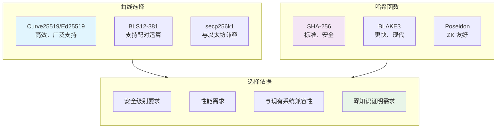
```mermaid
flowchart TD
    subgraph A["曲线选择"]
        direction TB
        C1["Curve25519/Ed25519<br/>高效、广泛支持"]
        C2["BLS12-381<br/>支持配对运算"]
        C3["secp256k1<br/>与以太坊兼容"]
    end
    
    subgraph B["哈希函数"]
        direction TB
        H1["SHA-256<br/>标准、安全"]
        H2["BLAKE3<br/>更快、现代"]
        H3["Poseidon<br/>ZK 友好"]
    end
    
    subgraph C["选择依据"]
        direction TB
        S1["安全级别要求"]
        S2["性能需求"]
        S3["与现有系统兼容性"]
        S4["零知识证明需求"]
    end
    
    A --> C
    B --> C
    
    style C1 fill:#e1f5fe
    style H1 fill:#f3e5f5
    style S4 fill:#e8f5e8
```

### 4.2 隐私与效率权衡

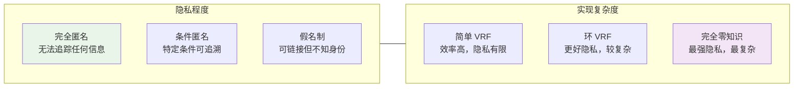
```mermaid
flowchart LR
    subgraph A["隐私程度"]
        direction TB
        P1["完全匿名<br/>无法追踪任何信息"]
        P2["条件匿名<br/>特定条件可追溯"]
        P3["假名制<br/>可链接但不知身份"]
    end
    
    subgraph B["实现复杂度"]
        direction TB
        I1["简单 VRF<br/>效率高，隐私有限"]
        I2["环 VRF<br/>更好隐私，较复杂"]
        I3["完全零知识<br/>最强隐私，最复杂"]
    end
    
    A --- B
    
    style P1 fill:#e8f5e8
    style I3 fill:#f3e5f5
```

### 4.3 区块链集成

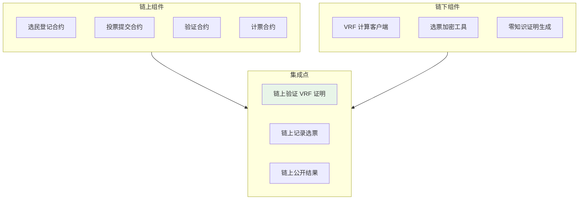
```mermaid
flowchart TD
    subgraph A["链上组件"]
        direction TB
        O1["选民登记合约"]
        O2["投票提交合约"]
        O3["验证合约"]
        O4["计票合约"]
    end
    
    subgraph B["链下组件"]
        direction TB
        F1["VRF 计算客户端"]
        F2["选票加密工具"]
        F3["零知识证明生成"]
    end
    
    subgraph C["集成点"]
        direction LR
        I1["链上验证 VRF 证明"]
        I2["链上记录选票"]
        I3["链上公开结果"]
    end
    
    A --> C
    B --> C
    
    style I1 fill:#e8f5e8
```

---

## 5. 安全分析

### 5.1 威胁模型

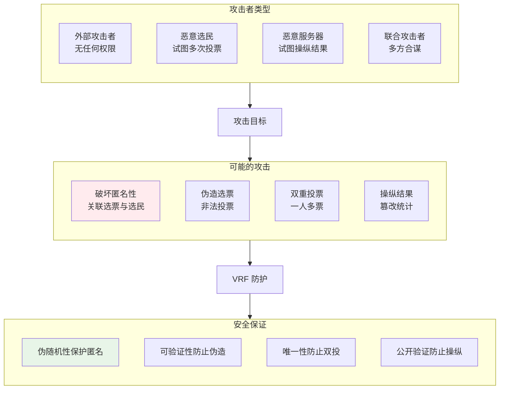
```mermaid
flowchart TD
    subgraph A["攻击者类型"]
        direction TB
        T1["外部攻击者<br/>无任何权限"]
        T2["恶意选民<br/>试图多次投票"]
        T3["恶意服务器<br/>试图操纵结果"]
        T4["联合攻击者<br/>多方合谋"]
    end
    
    A --> B["攻击目标"]
    
    subgraph C["可能的攻击"]
        direction TB
        A1["破坏匿名性<br/>关联选票与选民"]
        A2["伪造选票<br/>非法投票"]
        A3["双重投票<br/>一人多票"]
        A4["操纵结果<br/>篡改统计"]
    end
    
    B --> C
    
    C --> D["VRF 防护"]
    
    subgraph E["安全保证"]
        direction TB
        S1["伪随机性保护匿名"]
        S2["可验证性防止伪造"]
        S3["唯一性防止双投"]
        S4["公开验证防止操纵"]
    end
    
    D --> E
    
    style A1 fill:#ffebee
    style S1 fill:#e8f5e8
```

### 5.2 安全属性证明

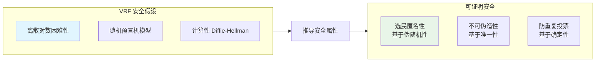
```mermaid
flowchart LR
    subgraph A["VRF 安全假设"]
        direction TB
        H1["离散对数困难性"]
        H2["随机预言机模型"]
        H3["计算性 Diffie-Hellman"]
    end
    
    A --> B["推导安全属性"]
    
    subgraph C["可证明安全"]
        direction TB
        P1["选民匿名性<br/>基于伪随机性"]
        P2["不可伪造性<br/>基于唯一性"]
        P3["防重复投票<br/>基于确定性"]
    end
    
    B --> C
    
    style H1 fill:#e1f5fe
    style P1 fill:#e8f5e8
```

---

## 6. 实际应用案例

### 6.1 Zcash Sapling

Zcash 使用 VRF 类似结构生成 nullifier：

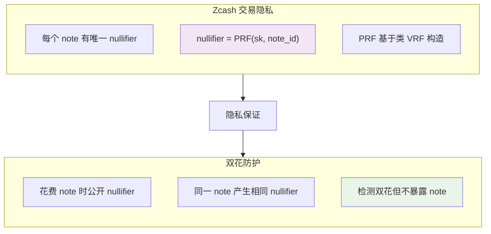
```mermaid
flowchart TD
    subgraph A["Zcash 交易隐私"]
        direction TB
        Z1["每个 note 有唯一 nullifier"]
        Z2["nullifier = PRF(sk, note_id)"]
        Z3["PRF 基于类 VRF 构造"]
    end
    
    A --> B["隐私保证"]
    
    subgraph C["双花防护"]
        direction TB
        D1["花费 note 时公开 nullifier"]
        D2["同一 note 产生相同 nullifier"]
        D3["检测双花但不暴露 note"]
    end
    
    B --> C
    
    style Z2 fill:#f3e5f5
    style D3 fill:#e8f5e8
```

### 6.2 Vocdoni

Vocdoni 是基于区块链的开源投票平台：

```mermaid
flowchart TD
    subgraph A["Vocdoni 架构"]
        direction TB
        V1["使用 zk-SNARKs 匿名"]
        V2["Tendermint 共识"]
        V3["IPFS 存储选票"]
    end
    
    A --> B["VRF 应用点"]
    
    subgraph C["选民证明"]
        direction TB
        P1["证明在 Census 中"]
        P2["生成匿名凭证"]
        P3["防止重复投票"]
    end
    
    B --> C
    
    style P2 fill:#e8f5e8
```

### 6.3 Signal Private Group

Signal 使用 OPRF 进行私密群组管理：

```mermaid
flowchart LR
    subgraph A["群组成员验证"]
        direction TB
        S1["成员持有秘密凭证"]
        S2["OPRF 验证成员资格"]
        S3["服务器不知道成员身份"]
    end
    
    subgraph B["隐私保证"]
        direction TB
        P1["成员关系隐私"]
        P2["消息内容隐私"]
        P3["元数据保护"]
    end
    
    A --> B
    
    style S3 fill:#e8f5e8
    style P3 fill:#e8f5e8
```

---

## 7. 未来发展方向

```mermaid
flowchart TD
    subgraph A["后量子 VRF"]
        direction TB
        Q1["基于格的 VRF"]
        Q2["基于同源的 VRF"]
        Q3["抵抗量子计算攻击"]
    end
    
    subgraph B["效率优化"]
        direction TB
        E1["批量验证"]
        E2["预计算优化"]
        E3["硬件加速"]
    end
    
    subgraph C["功能扩展"]
        direction TB
        F1["可更新 VRF"]
        F2["可聚合 VRF"]
        F3["属性选择性披露"]
    end
    
    subgraph D["应用扩展"]
        direction TB
        A1["去中心化身份 DID"]
        A2["隐私保护 ML"]
        A3["跨链匿名桥"]
    end
    
    style Q3 fill:#e1f5fe
    style E3 fill:#f3e5f5
    style F3 fill:#e8f5e8
    style A3 fill:#fff3e0
```

---

## 8. 总结

VRF 在匿名凭证和电子投票中的应用展示了密码学原语的强大组合能力：

```mermaid
flowchart TD
    subgraph A["VRF 核心特性"]
        direction LR
        V1["确定性<br/>同输入同输出"]
        V2["伪随机性<br/>输出不可预测"]
        V3["可验证性<br/>证明计算正确"]
    end
    
    A --> B["匿名凭证应用"]
    
    subgraph C["匿名凭证"]
        direction TB
        C1["不可链接标识符"]
        C2["匿名认证"]
        C3["防双花机制"]
    end
    
    A --> D["电子投票应用"]
    
    subgraph E["电子投票"]
        direction TB
        E1["选民资格证明"]
        E2["防重复投票"]
        E3["投票匿名性"]
    end
    
    C --> F["隐私保护系统"]
    E --> F
    
    style V1 fill:#e1f5fe
    style V2 fill:#f3e5f5
    style V3 fill:#e8f5e8
    style F fill:#fff3e0
```

VRF 及其变体（OPRF、环 VRF、阈值 VRF 等）为构建隐私保护的身份认证和投票系统提供了坚实的密码学基础。随着零知识证明技术的发展和后量子密码学的成熟，VRF 在隐私保护领域的应用将更加广泛和深入。

---

## 参考文献

1. Goldberg, S., et al. (2017). Verifiable Random Functions (VRFs)
2. IETF RFC 9497: Oblivious Pseudorandom Functions (OPRFs)
3. Chaum, D. (1985). Security without Identification: Transaction Systems to Make Big Brother Obsolete
4. Bowe, S., et al. (2017). Zcash Protocol Specification
5. Benaloh, J., & Tuinstra, D. (1994). Receipt-free Secret-ballot Elections
6. Adida, B. (2008). Helios: Web-based Open-Audit Voting
7. Chase, M., & Lysyanskaya, A. (2006). On Signatures of Knowledge
8. IETF draft-irtf-cfrg-vrf: Verifiable Random Functions

