# VRF 在区块链共识中的应用

## 摘要

可验证随机函数（VRF）在区块链共识协议中扮演着核心角色。它为权益证明（PoS）和委托权益证明（DPoS）等共识机制提供了公平、不可预测且可验证的随机性来源。本文深入探讨 VRF 在区块链共识中的应用原理、典型实现案例，以及如何利用 VRF 构建安全高效的共识协议。

---

## 1. 共识协议中的随机性需求

### 1.1 为什么共识需要随机性？

在区块链网络中，多个节点需要就"谁有权产生下一个区块"达成一致。随机性是解决这一问题的关键：

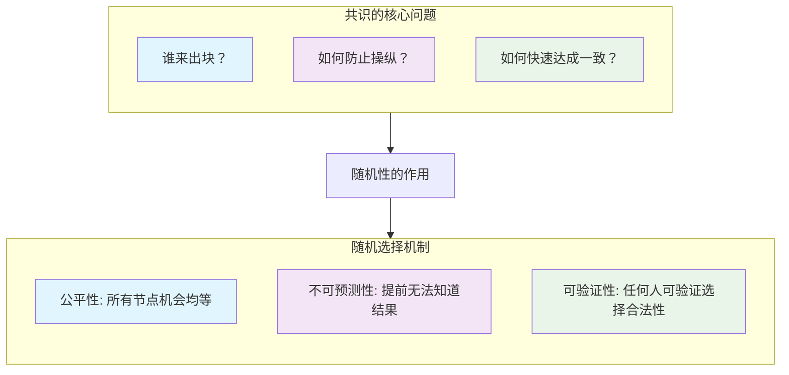

### 1.2 传统随机性方案的问题

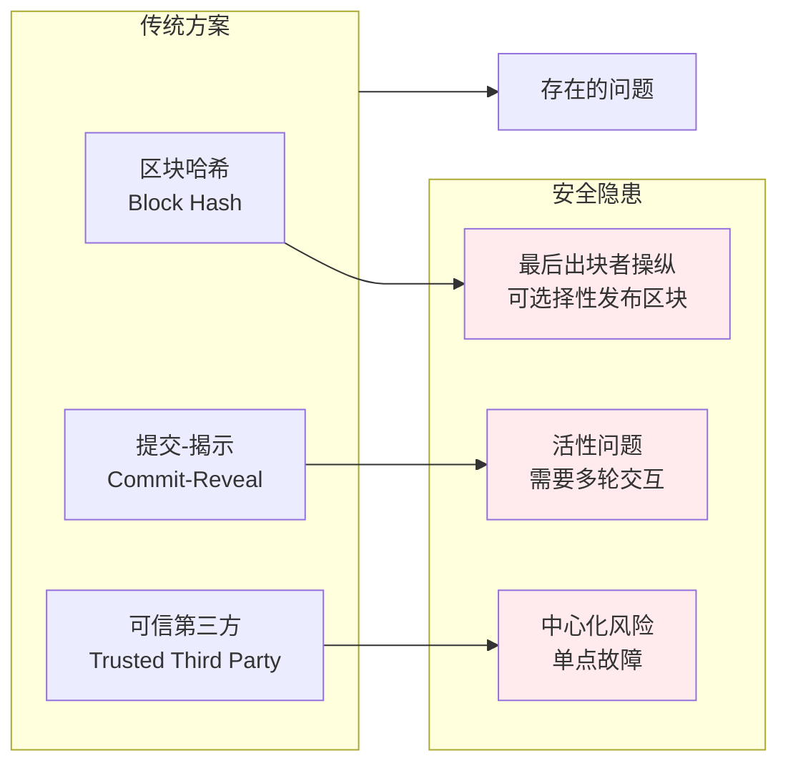

**VRF 完美解决这些问题**：
- 无需可信第三方
- 单轮非交互式
- 不可被操纵
- 完全可验证

---

## 2. VRF 在共识中的核心机制

### 2.1 基于 VRF 的领导者选举

在基于 VRF 的共识协议中，每个时隙（slot）或轮次（round）的领导者通过以下流程选出：

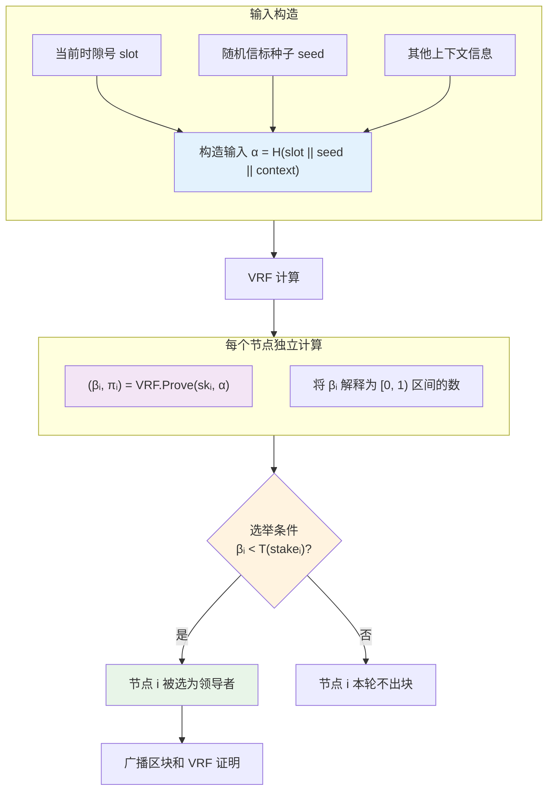

### 2.2 阈值函数与权益加权

阈值函数 $T(\text{stake})$ 将节点的权益映射到被选中的概率：

$$
P(\text{selected}) = 1 - (1 - f)^{\text{stake}}
$$

其中 $f$ 是协议参数，控制每个时隙期望的领导者数量。

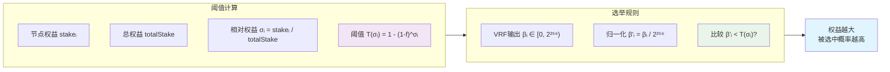

### 2.3 安全性保证

VRF 为共识提供以下安全保证：

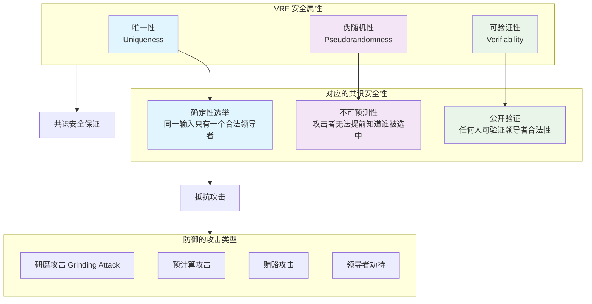

---

## 3. 典型实现案例

### 3.1 Algorand 共识

Algorand 是第一个大规模使用 VRF 的公链，其共识协议称为 Pure Proof of Stake (PPoS)。

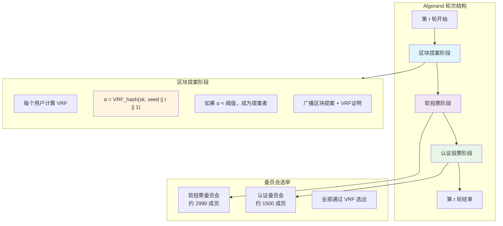

**Algorand VRF 的关键特性**：

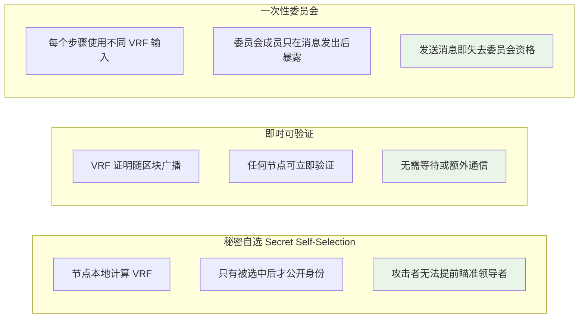

**为什么不能直接选择 VRF 最小的提案？**

一个自然的问题是：既然每个提案都有 VRF 输出，为什么不直接选择 VRF 值最小的提案，而需要复杂的委员会投票机制？

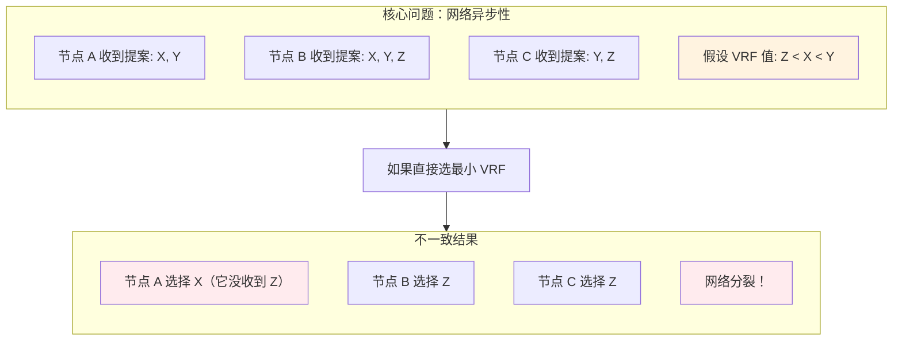

**根本困难**：

| 问题 | 说明 |
|------|------|
| **无法确定完整集合** | 节点永远不知道是否收到了"所有"提案，可能有更好的提案还在网络中传输 |
| **等待时间不确定** | 等多久才能确定没有更多提案？异步网络中无法确定 |
| **恶意行为** | 攻击者可选择性地向部分节点发送提案，制造不一致 |
| **网络分区** | 分区两侧的节点看到不同的提案集合 |

**委员会投票的解决方案**：

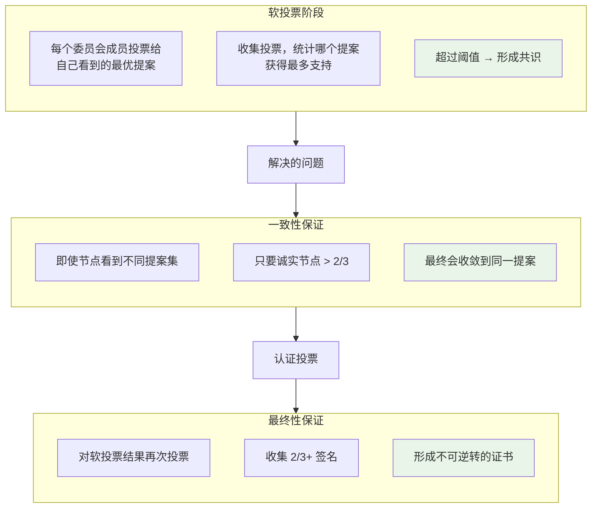

**类比理解**：

> 想象一个选举场景：每个候选人有一个"能力分数"（VRF 值），我们想选分数最高的人。
> 
> - **错误方案**：每个选民直接投给自己认识的候选人中分数最高的 → 不同选民可能投给不同人
> - **正确方案**：先提名，再统一投票确认 → 即使最初看法不同，投票后达成一致

**Algorand 的精妙设计**：

1. **软投票**：将"谁是最优提案"的局部判断汇聚成全局共识
2. **认证投票**：为共识结果提供密码学证明（可转移的最终性）
3. **超时机制**：即使某些提案丢失，也能继续前进（活性保证）

**委员会规模与投票机制**：

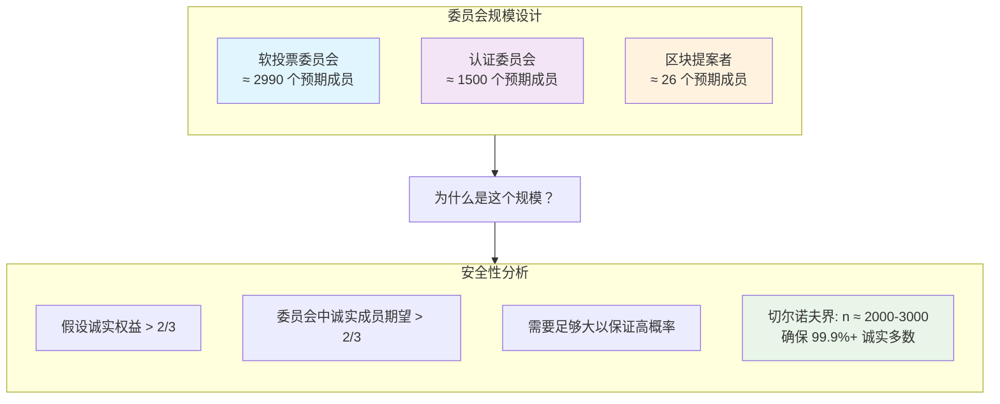

**密码学投票技术**：

| 组件 | 技术 | 用途 |
|------|------|------|
| **VRF** | ECVRF-ED25519-SHA512-Elligator2 | 委员会成员自选 |
| **数字签名** | Ed25519 | 对投票消息签名 |
| **哈希函数** | SHA-512/256 | 消息摘要、VRF 输入 |
| **曲线** | Curve25519 | VRF 和签名的椭圆曲线 |

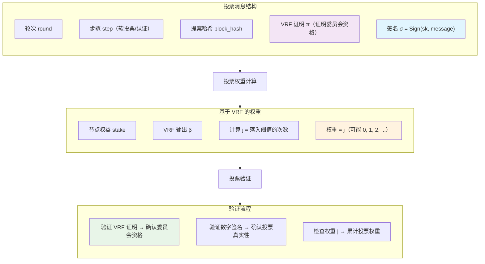

**"可分裂权益"机制**：

Algorand 的巧妙设计是每个节点可能获得 **多张选票**（而不是 0 或 1）：

$$
j = \max\{k : \sum_{i=0}^{k-1} B(i; n, p) \leq \frac{\beta}{2^{256}}\}
$$

其中 $B(i; n, p)$ 是二项分布的累积分布函数，$n$ 是节点持有的微 Algo 数量。

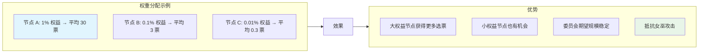

**共识达成条件**：

| 阶段 | 阈值 | 期望委员会 | 所需票数 |
|------|------|------------|----------|
| 软投票 | $T_{step} \cdot \tau_{step}$ | 2990 | ≈ 2267 票 (75.8%) |
| 认证投票 | $T_{final} \cdot \tau_{final}$ | 1500 | ≈ 1112 票 (74.1%) |

> **注**：实际阈值根据协议版本和安全参数有所调整。设置高于 2/3 是为了在概率波动下仍保证安全。

**数据结构与通信架构**：

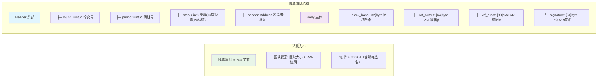

**谁来收集投票？—— 去中心化 Gossip 网络**：

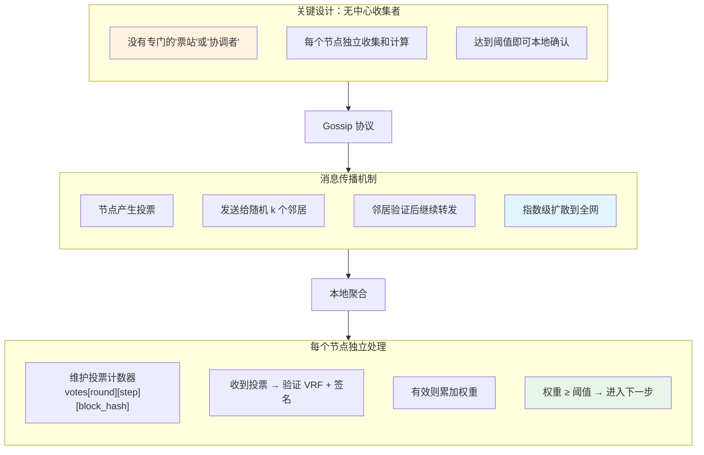

**通信复杂度分析**：

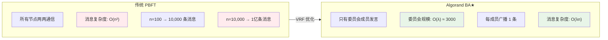

| 指标 | 传统 PBFT | Algorand | 改进 |
|------|-----------|----------|------|
| **消息复杂度** | $O(n^2)$ | $O(\lambda n)$ | 从平方降到线性 |
| **委员会规模** | $n$（全部节点）| $O(\lambda) \approx 3000$ | 固定常数 |
| **单节点发送** | $O(n)$ 条 | $O(1)$ 条 | 常数条消息 |
| **单节点接收** | $O(n)$ 条 | $O(\lambda)$ 条 | ≈ 3000 条 |
| **带宽需求** | $O(n^2 \cdot |msg|)$ | $O(\lambda n \cdot |msg|)$ | 可扩展 |

其中 $\lambda$ 是安全参数，决定委员会大小（通常 $\lambda \approx 3000$）。

**Gossip 网络拓扑**：

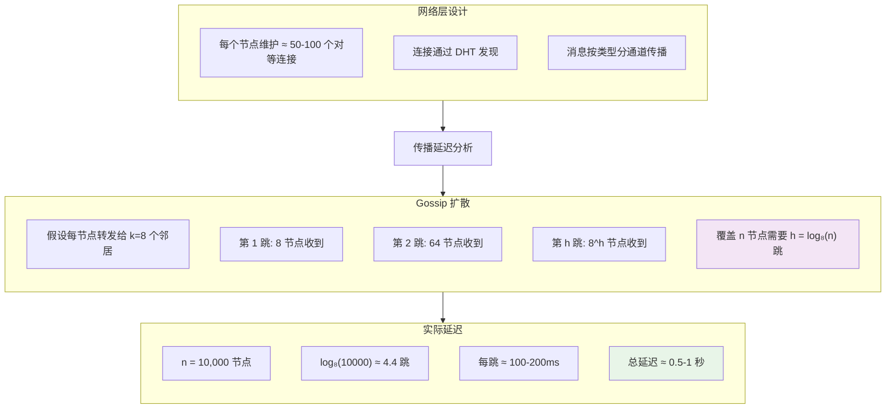

**投票聚合数据结构**：

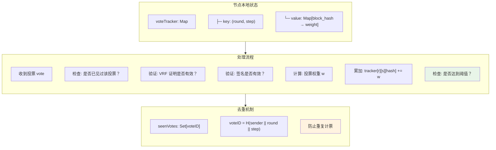

**实际性能数据**（Algorand 主网）：

| 指标 | 数值 |
|------|------|
| 节点数 | ~1,200 中继节点 + 数万参与节点 |
| 出块时间 | ~3.3 秒 |
| 最终性 | 即时（一轮确认） |
| 区块大小 | 最大 5MB |
| TPS | ~6,000（理论）/ ~1,200（实际） |
| 委员会消息 | 每轮 ~4,500 条投票消息 |
| 带宽需求 | 中继节点 ~100 Mbps |

**BA★ 与 BBA★ 协议架构**：

Algorand 的共识协议由两层组成：

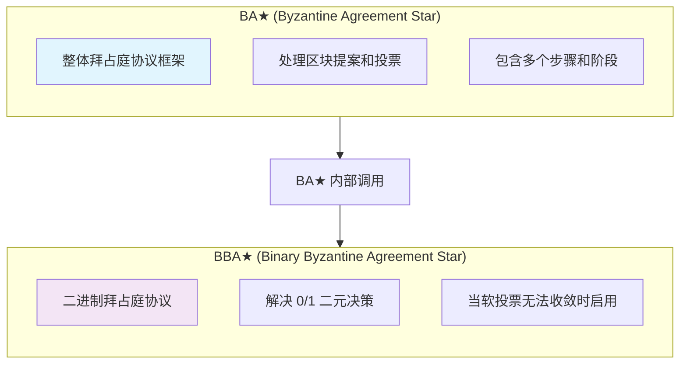

**为什么需要 BBA★？**

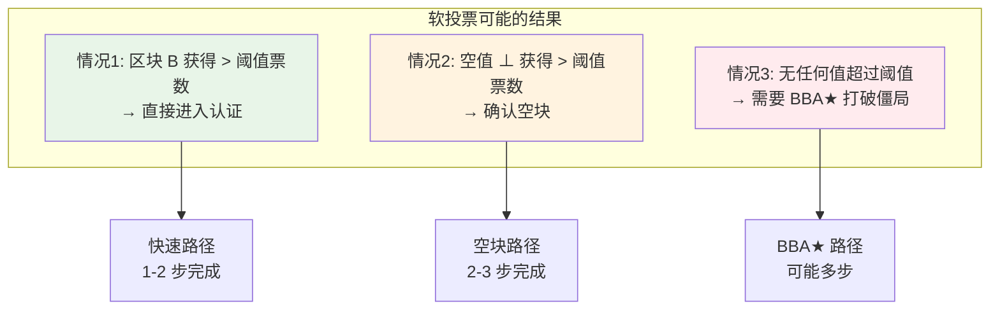

**BBA★ 核心机制**：

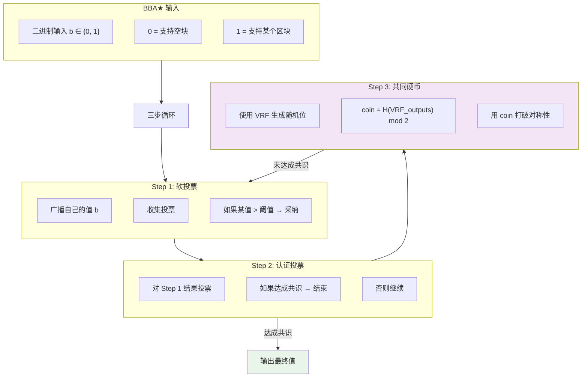

**共同硬币（Common Coin）机制**：

这是 BBA★ 最精妙的部分——如何在分布式系统中生成一个所有诚实节点都认同的随机位？

```mermaid
flowchart TD
    subgraph A["共同硬币生成"]
        direction TB
        C1["每个委员会成员 i 计算<br/>VRF_i = VRF(sk_i, round || step)"]
        C2["所有节点收集 VRF 输出"]
        C3["coin = H(min(VRF_1, VRF_2, ...)) mod 2"]
    end
    
    A --> B["关键属性"]
    
    subgraph C["安全性保证"]
        direction TB
        P1["不可预测: 攻击者无法提前知道 coin 值"]
        P2["一致性: 诚实节点计算出相同的 coin"]
        P3["抗操纵: 需要控制最小 VRF 的节点才能影响"]
    end
    
    B --> C
    
    subgraph D["概率收敛"]
        direction TB
        Q1["如果诚实节点分裂 (50% 投 0, 50% 投 1)"]
        Q2["coin 随机选择一方"]
        Q3["期望 O(1) 轮收敛"]
    end
    
    C --> D
    
    style C3 fill:#f3e5f5
    style P1 fill:#e8f5e8
    style Q3 fill:#e8f5e8
```

**BBA★ 完整流程**：

```mermaid
flowchart TD
    Start["BBA★ 开始<br/>输入 b ∈ {0,1}"] --> Step1
    
    subgraph Step1["Step 1: 软投票"]
        S1A["广播 (round, step, b, VRF证明, 签名)"]
        S1B["等待超时或收集足够票"]
        S1C{"某值 v 票数 > t_1?"}
    end
    
    S1C -->|"是"| S1D["设置 b = v"]
    S1C -->|"否"| S1E["b 保持不变"]
    
    S1D --> Step2
    S1E --> Step2
    
    subgraph Step2["Step 2: 认证投票"]
        S2A["广播 (round, step, b, VRF证明, 签名)"]
        S2B["等待超时或收集足够票"]
        S2C{"某值 v 票数 > t_2?"}
    end
    
    S2C -->|"是，且 v ≠ ⊥"| Finish["输出 v，结束"]
    S2C -->|"是，v = ⊥"| Step3
    S2C -->|"否"| Step3
    
    subgraph Step3["Step 3: 共同硬币"]
        S3A["计算 coin = CommonCoin(round, step)"]
        S3B["设置 b = coin"]
    end
    
    Step3 --> Step1Next["回到 Step 1（新一轮）"]
    Step1Next --> Step1
    
    style Finish fill:#e8f5e8
    style S3A fill:#f3e5f5
```

**BBA★ 的理论保证**：

| 属性 | 保证 | 条件 |
|------|------|------|
| **一致性 (Agreement)** | 所有诚实节点输出相同值 | 诚实节点 > 2/3 |
| **有效性 (Validity)** | 如果所有诚实节点输入相同，输出该值 | 诚实节点 > 2/3 |
| **终止性 (Termination)** | 期望 O(1) 轮结束 | 概率性保证 |

**收敛时间分析**：

```mermaid
flowchart LR
    subgraph A["最好情况"]
        direction TB
        B1["所有节点看到相同提案"]
        B2["软投票直接达成共识"]
        B3["2 步完成"]
    end
    
    subgraph B["正常情况"]
        direction TB
        N1["软投票 + 认证投票"]
        N2["可能进入 1 轮 BBA★"]
        N3["3-6 步完成"]
    end
    
    subgraph C["最坏情况"]
        direction TB
        W1["网络异步严重"]
        W2["多轮 BBA★"]
        W3["期望 O(1) 轮，但有方差"]
    end
    
    style B1 fill:#e8f5e8
    style B3 fill:#e8f5e8
    style N3 fill:#fff3e0
    style W3 fill:#ffebee
```

**BA★ 与 BBA★ 的关系总结**：

```mermaid
flowchart TD
    subgraph A["BA★ 整体协议"]
        direction TB
        
        subgraph B["阶段1: 区块提案"]
            P1["VRF 选举提案者"]
            P2["广播区块提案"]
        end
        
        subgraph C["阶段2: 分级共识"]
            G1["软投票: 过滤提案"]
            G2["认证投票: 尝试快速确认"]
        end
        
        subgraph D["阶段3: BBA★ (如需要)"]
            BB1["二进制决策: 区块 vs 空块"]
            BB2["共同硬币打破僵局"]
        end
        
        B --> C --> D
    end
    
    D --> E["输出: 确认的区块或空块"]
    
    style B fill:#e1f5fe
    style C fill:#f3e5f5
    style D fill:#fff3e0
    style E fill:#e8f5e8
```

> **总结**：BA★ 是"外壳"，处理区块提案和初步投票；BBA★ 是"内核"，当快速路径失败时，用共同硬币保证最终收敛。这种分层设计使得正常情况下效率高（2-3 步），异常情况下仍能保证活性（期望 O(1) 轮）。

**区块与投票的分离传播（关键性能优化）**：

```mermaid
flowchart TD
    subgraph A["区块提案阶段"]
        direction TB
        B1["提案者生成区块 B"]
        B2["计算区块哈希 h = H(B)"]
        B3["广播: 完整区块 B + VRF证明"]
        B4["区块大小: 可能 1-5 MB"]
    end
    
    subgraph B["投票阶段"]
        direction TB
        V1["投票只包含区块哈希 h"]
        V2["不包含区块内容！"]
        V3["投票消息: ≈ 200 字节"]
        V4["3000 票 × 200B = 600 KB"]
    end
    
    A --> B
    
    subgraph C["带宽对比"]
        direction TB
        C1["❌ 如果投票含区块:<br/>3000 × 5MB = 15 GB"]
        C2["✅ 实际设计:<br/>5MB + 600KB ≈ 5.6 MB"]
        C3["节省: 99.96%"]
    end
    
    B --> C
    
    style V2 fill:#e8f5e8
    style C2 fill:#e8f5e8
    style C3 fill:#e8f5e8
```

**投票消息的精确结构**：

```mermaid
flowchart LR
    subgraph A["投票消息内容"]
        direction TB
        M1["round: 8 字节"]
        M2["step: 1 字节"]
        M3["block_hash: 32 字节 ← 只有哈希!"]
        M4["sender: 32 字节"]
        M5["vrf_output: 64 字节"]
        M6["vrf_proof: 80 字节"]
        M7["signature: 64 字节"]
        M8["总计: ≈ 280 字节"]
    end
    
    style M3 fill:#e8f5e8
    style M8 fill:#fff3e0
```

**多区块提案场景处理**：

```mermaid
flowchart TD
    subgraph A["场景: 5 个区块提案"]
        direction TB
        P1["提案者 A 广播区块 B_A (2MB)"]
        P2["提案者 B 广播区块 B_B (1.5MB)"]
        P3["提案者 C 广播区块 B_C (3MB)"]
        P4["提案者 D 广播区块 B_D (2MB)"]
        P5["提案者 E 广播区块 B_E (1MB)"]
    end
    
    A --> B["区块传播: 总计 9.5 MB"]
    
    subgraph C["投票阶段"]
        direction TB
        V1["节点 X 投票给 h_C (280B)"]
        V2["节点 Y 投票给 h_A (280B)"]
        V3["节点 Z 投票给 h_C (280B)"]
        V4["... 3000 个投票 ..."]
    end
    
    B --> C
    
    C --> D["投票传播: 总计 ≈ 840 KB"]
    
    D --> E["总带宽: 9.5MB + 0.84MB ≈ 10.3 MB"]
    
    style D fill:#e8f5e8
    style E fill:#e8f5e8
```

**节点可能遇到的情况及处理**：

```mermaid
flowchart TD
    subgraph A["情况1: 先收到区块，后收到投票"]
        direction TB
        S1["收到区块 B_C"]
        S2["缓存区块，计算哈希 h_C"]
        S3["收到投票 vote(h_C)"]
        S4["可以验证并计票"]
    end
    
    subgraph B["情况2: 先收到投票，后收到区块"]
        direction TB
        T1["收到投票 vote(h_C)"]
        T2["验证 VRF 和签名 ✓"]
        T3["累计投票权重（即使没有区块）"]
        T4["稍后收到区块 B_C"]
        T5["验证 H(B_C) == h_C"]
    end
    
    subgraph C["情况3: 收到投票但从未收到区块"]
        direction TB
        U1["收到大量投票给 h_X"]
        U2["没有收到区块 B_X"]
        U3["如果 h_X 获胜 → 主动请求区块"]
        U4["从其他节点拉取 B_X"]
    end
    
    style T3 fill:#e8f5e8
    style U4 fill:#fff3e0
```

**区块获取策略**：

| 策略 | 说明 | 优点 |
|------|------|------|
| **推送优先** | 提案者广播区块给所有人 | 延迟低 |
| **按需拉取** | 只有需要时才请求区块 | 带宽省 |
| **哈希先行** | 先传哈希，后传区块 | 快速过滤 |

```mermaid
flowchart LR
    subgraph A["Algorand 的混合策略"]
        direction TB
        H1["1. 提案者广播区块（推送）"]
        H2["2. 投票只含哈希（节省带宽）"]
        H3["3. 如果区块丢失，按需拉取"]
        H4["4. 只需获取最终获胜的区块"]
    end
    
    A --> B["效果"]
    
    subgraph C["实际收益"]
        direction TB
        R1["多数情况: 1 个区块获胜"]
        R2["节点最终只需存储 1 个区块"]
        R3["其他 4 个提案可丢弃"]
        R4["投票验证不依赖区块内容"]
    end
    
    B --> C
    
    style H2 fill:#e8f5e8
    style R4 fill:#e8f5e8
```

**为什么投票不需要区块内容？**

```mermaid
flowchart TD
    subgraph A["投票验证只需要"]
        direction TB
        V1["1. VRF 证明 → 验证委员会资格"]
        V2["2. 数字签名 → 验证投票真实性"]
        V3["3. 区块哈希 → 知道投给谁"]
        V4["以上都不需要区块内容！"]
    end
    
    subgraph B["区块内容只在最后需要"]
        direction TB
        E1["确认区块后"]
        E2["执行交易"]
        E3["更新状态"]
        E4["这时才需要完整区块"]
    end
    
    A --> B
    
    style V4 fill:#e8f5e8
    style E1 fill:#fff3e0
```

**性能总结**：

| 阶段 | 传播内容 | 数据量 |
|------|----------|--------|
| 区块提案 | 完整区块 × 提案数 | 5-50 MB（假设 5-10 个提案）|
| 软投票 | 哈希 + 签名 × 3000 | ≈ 840 KB |
| 认证投票 | 哈希 + 签名 × 1500 | ≈ 420 KB |
| **总计** | | **≈ 6-51 MB** |
| **如果投票含区块** | | **15-150 GB** ❌ |

> **关键洞察**：投票与区块内容解耦是 Algorand 能够支持大委员会（3000+ 成员）的关键。如果每个投票都要携带区块，系统将完全不可扩展。

### 3.2 Cardano Ouroboros Praos

Cardano 的 Ouroboros Praos 协议是另一个著名的基于 VRF 的 PoS 共识协议。

```mermaid
flowchart TD
    subgraph A["Ouroboros Praos 结构"]
        direction TB
        E1["纪元 Epoch<br/>约 5 天"]
        E2["时隙 Slot<br/>1 秒"]
        E3["纪元包含 432,000 个时隙"]
    end
    
    A --> B["领导者选举流程"]
    
    subgraph C["VRF 计算"]
        direction TB
        V1["输入: η || slot || nonce"]
        V2["η 是纪元随机性"]
        V3["计算 y = VRF.Eval(sk, input)"]
    end
    
    B --> C
    
    C --> D["选举判定"]
    
    subgraph E["领导者确定"]
        direction TB
        L1["计算 p = 1 - (1-f)^σ"]
        L2["σ 是相对权益"]
        L3["y / 2^(512) < p 则被选中"]
    end
    
    D --> E
    
    style E1 fill:#e1f5fe
    style V3 fill:#f3e5f5
    style L3 fill:#e8f5e8
```

**纪元随机性更新**：

```mermaid
flowchart LR
    subgraph A["纪元 e 的随机性"]
        direction TB
        R1["η_e = 当前纪元随机性"]
    end
    
    A --> B["收集 VRF 输出"]
    
    subgraph C["随机性更新"]
        direction TB
        U1["收集纪元前 2/3 时隙的 VRF 输出"]
        U2["ρ = 所有 VRF 输出的哈希"]
        U3["η_{e+1} = H(η_e || ρ)"]
    end
    
    B --> C
    
    C --> D["下一纪元使用新随机性"]
    
    style R1 fill:#e1f5fe
    style U3 fill:#f3e5f5
    style D fill:#e8f5e8
```

### 3.3 Dfinity/Internet Computer

Dfinity 使用基于 BLS 签名的阈值 VRF 实现分布式随机信标。

```mermaid
flowchart TD
    subgraph A["阈值 VRF 设置"]
        direction TB
        S1["n 个节点组成委员会"]
        S2["门限 t = 2n/3 + 1"]
        S3["分布式密钥生成 DKG"]
    end
    
    A --> B["随机信标生成"]
    
    subgraph C["BLS 阈值签名"]
        direction TB
        B1["每个节点计算份额<br/>σᵢ = BLS.Sign(skᵢ, round)"]
        B2["收集 t 个有效份额"]
        B3["聚合得到完整签名<br/>σ = Aggregate(σ₁, ..., σₜ)"]
    end
    
    B --> C
    
    C --> D["派生随机数"]
    
    subgraph E["随机信标输出"]
        direction TB
        O1["随机数 = H(σ)"]
        O2["确定性: 同一轮次输出唯一"]
        O3["不可预测: 需要 t 方合作"]
    end
    
    D --> E
    
    style S3 fill:#e1f5fe
    style B3 fill:#f3e5f5
    style O1 fill:#e8f5e8
```

---

## 4. 边界情况处理：空槽与多领导者

由于 VRF 输出的概率性质，阈值判定可能产生两种边界情况：

### 4.1 问题分析

```mermaid
flowchart TD
    subgraph A["阈值判定的概率结果"]
        direction TB
        T1["每个节点独立计算 VRF"]
        T2["判定 β < T(stake)?"]
        T3["结果服从二项分布"]
    end
    
    A --> B["可能的结果"]
    
    subgraph C["三种情况"]
        direction LR
        R1["0 个节点满足<br/>空槽 Empty Slot"]
        R2["1 个节点满足<br/>理想情况"]
        R3["多个节点满足<br/>多领导者 Multi-Leader"]
    end
    
    B --> C
    
    C --> D["需要特殊处理"]
    
    style R1 fill:#ffebee
    style R2 fill:#e8f5e8
    style R3 fill:#fff3e0
```

**概率分析**：

设 $n$ 为总节点数，$f$ 为协议参数（期望每槽领导者数），则每个节点被选中的概率为 $p = f/n$。

根据二项分布，精确公式为：

- 空槽概率：$P(\text{empty}) = (1 - p)^n = \left(1 - \frac{f}{n}\right)^n$
- 单领导者概率：$P(\text{single}) = \binom{n}{1} p (1-p)^{n-1} = f \cdot \left(1 - \frac{f}{n}\right)^{n-1}$
- 多领导者概率：$P(\text{multi}) = 1 - P(\text{empty}) - P(\text{single})$

**泊松近似条件**：

当满足以下条件时，二项分布 $B(n, p)$ 可用参数为 $\lambda = np = f$ 的泊松分布近似：

| 条件 | 经验法则 | 说明 |
|------|----------|------|
| $n$ 足够大 | $n \geq 20$ | 节点数较多 |
| $p$ 足够小 | $p = f/n \leq 0.05$ | 单节点选中概率低 |
| $\lambda = np$ 适中 | $f \leq 10$ | 期望领导者数不太大 |

**更严格的判定**：当 $n \geq 100$ 且 $f \leq 10$ 时，近似误差通常小于 1%。

在实际区块链共识中（如 Algorand、Cardano），节点数 $n$ 通常为数千至数百万，而期望领导者数 $f$ 通常为 1-5，完全满足泊松近似条件。

**泊松近似公式**（$n$ 很大，$p$ 很小，$f = np$ 适中）：

- 空槽概率：$P(\text{empty}) \approx e^{-f}$
- 单领导者概率：$P(\text{single}) \approx f \cdot e^{-f}$
- 多领导者概率：$P(\text{multi}) \approx 1 - e^{-f} - f \cdot e^{-f}$

**数值示例**（$f = 1$）：

| 节点数 $n$ | 精确 $P(\text{empty})$ | 泊松近似 $e^{-1}$ | 相对误差 |
|------------|------------------------|-------------------|----------|
| 10 | $(0.9)^{10} = 34.87\%$ | $36.79\%$ | 5.5% |
| 50 | $(0.98)^{50} = 36.42\%$ | $36.79\%$ | 1.0% |
| 100 | $(0.99)^{100} = 36.60\%$ | $36.79\%$ | 0.5% |
| 1000 | $(0.999)^{1000} = 36.77\%$ | $36.79\%$ | 0.05% |

当 $f = 1$ 且 $n \geq 100$ 时：空槽 ≈ 36.8%，单领导者 ≈ 36.8%，多领导者 ≈ 26.4%

### 4.2 空槽处理机制

```mermaid
flowchart TD
    subgraph A["空槽检测"]
        direction TB
        D1["时隙开始"]
        D2["等待区块提案"]
        D3["超时未收到任何区块"]
        D4["判定为空槽"]
    end
    
    D1 --> D2 --> D3 --> D4
    
    A --> B["处理策略"]
    
    subgraph C["策略一: 跳过空槽"]
        direction TB
        S1["直接进入下一时隙"]
        S2["链高度不增加"]
        S3["时隙号继续递增"]
        S4["适用: Cardano Ouroboros"]
    end
    
    subgraph D["策略二: 空块填充"]
        direction TB
        E1["生成特殊空块"]
        E2["维持链的连续性"]
        E3["保持时隙-区块对应"]
    end
    
    subgraph E["策略三: 超时重选"]
        direction TB
        R1["触发备用选举"]
        R2["使用不同 VRF 输入"]
        R3["选出备用领导者"]
        R4["适用: Algorand 软投票"]
    end
    
    B --> C
    B --> D
    B --> E
    
    style D4 fill:#ffebee
    style S1 fill:#e8f5e8
    style R3 fill:#e8f5e8
```

**Cardano Ouroboros 的空槽处理**：

```mermaid
flowchart LR
    subgraph A["时隙序列"]
        direction LR
        T1["Slot 100<br/>区块 #50"]
        T2["Slot 101<br/>空槽"]
        T3["Slot 102<br/>空槽"]
        T4["Slot 103<br/>区块 #51"]
        T5["Slot 104<br/>区块 #52"]
    end
    
    T1 --> T2 --> T3 --> T4 --> T5
    
    subgraph B["链结构"]
        direction TB
        B1["区块 #50<br/>slot=100"]
        B2["区块 #51<br/>slot=103<br/>prev=#50"]
        B3["区块 #52<br/>slot=104<br/>prev=#51"]
    end
    
    B1 --> B2 --> B3
    
    style T2 fill:#ffebee
    style T3 fill:#ffebee
```

**Algorand 的超时机制**：

```mermaid
flowchart TD
    subgraph A["区块提案阶段"]
        direction TB
        P1["等待 λ 秒收集提案"]
        P2["如有提案: 进入软投票"]
        P3["如无提案: 提案空块"]
    end
    
    P1 --> P2
    P1 --> P3
    
    subgraph B["软投票阶段"]
        direction TB
        S1["委员会投票"]
        S2["收集 2/3 投票"]
        S3["超时: 投票给空值"]
    end
    
    P2 --> B
    P3 --> B
    
    subgraph C["认证阶段"]
        direction TB
        C1["如有共识: 确认区块"]
        C2["如无共识: 进入下一轮"]
    end
    
    B --> C
    
    style P3 fill:#fff3e0
    style S3 fill:#fff3e0
    style C2 fill:#ffebee
```

### 4.3 多领导者处理机制

```mermaid
flowchart TD
    subgraph A["多领导者场景"]
        direction TB
        M1["时隙 s 中多个节点满足阈值"]
        M2["节点 A: (β_A, π_A, Block_A)"]
        M3["节点 B: (β_B, π_B, Block_B)"]
        M4["节点 C: (β_C, π_C, Block_C)"]
    end
    
    A --> B["处理策略"]
    
    subgraph C["策略一: VRF 优先级排序"]
        direction TB
        V1["比较 VRF 输出值"]
        V2["最小 β 值优先级最高"]
        V3["全网选择同一优胜者"]
    end
    
    subgraph D["策略二: 分叉后选择"]
        direction TB
        F1["暂时允许分叉"]
        F2["后续区块决定主链"]
        F3["最长链/最重链规则"]
    end
    
    subgraph E["策略三: 投票确认"]
        direction TB
        T1["委员会投票选择"]
        T2["收集 2/3 投票"]
        T3["确定唯一区块"]
    end
    
    B --> C
    B --> D
    B --> E
    
    style V3 fill:#e8f5e8
    style F3 fill:#e8f5e8
    style T3 fill:#e8f5e8
```

**VRF 优先级排序详解**：

```mermaid
flowchart TD
    subgraph A["优先级计算"]
        direction TB
        P1["节点 A: β_A = 0x3a7f..."]
        P2["节点 B: β_B = 0x8c2d..."]
        P3["节点 C: β_C = 0x1e4b..."]
    end
    
    A --> B["排序"]
    
    subgraph C["优先级顺序"]
        direction TB
        R1["第1优先: C (0x1e4b... 最小)"]
        R2["第2优先: A (0x3a7f...)"]
        R3["第3优先: B (0x8c2d... 最大)"]
    end
    
    B --> C
    
    C --> D["区块选择"]
    
    subgraph E["选择规则"]
        direction TB
        S1["接收到多个区块时"]
        S2["验证所有 VRF 证明"]
        S3["选择 β 最小的区块"]
        S4["可验证且确定性"]
    end
    
    D --> E
    
    style R1 fill:#e8f5e8
    style S4 fill:#e8f5e8
```

**Algorand 的多提案处理**：

```mermaid
flowchart TD
    subgraph A["区块提案阶段"]
        direction TB
        P1["收到多个提案"]
        P2["每个提案包含 VRF 证明"]
        P3["验证所有证明"]
    end
    
    A --> B["优先级过滤"]
    
    subgraph C["选择最优提案"]
        direction TB
        F1["比较 VRF 输出"]
        F2["选择 hash 最小的提案"]
        F3["丢弃其他提案"]
    end
    
    B --> C
    
    C --> D["软投票"]
    
    subgraph E["委员会投票"]
        direction TB
        V1["软投票委员会成员"]
        V2["为最优提案投票"]
        V3["收集 t 个投票"]
    end
    
    D --> E
    
    E --> F["认证投票"]
    
    subgraph G["最终确认"]
        direction TB
        T1["认证委员会成员"]
        T2["为软投票结果投票"]
        T3["2/3 投票后区块确认"]
    end
    
    F --> G
    
    style F2 fill:#e1f5fe
    style T3 fill:#e8f5e8
```

### 4.4 参数调优与概率控制

```mermaid
flowchart LR
    subgraph A["参数选择"]
        direction TB
        P1["期望领导者数 f"]
        P2["f 小: 空槽多, 冲突少"]
        P3["f 大: 空槽少, 冲突多"]
    end
    
    A --> B["典型设置"]
    
    subgraph C["实际案例"]
        direction TB
        C1["Algorand: f ≈ 20-70<br/>多提案者设计"]
        C2["Cardano: f = 0.05<br/>低冲突优先"]
        C3["期望 95% 时隙有领导者"]
    end
    
    B --> C
    
    subgraph D["概率分布"]
        direction TB
        D1["f=1: 空槽 37%"]
        D2["f=3: 空槽 5%"]
        D3["f=5: 空槽 0.7%"]
    end
    
    C --> D
    
    style C2 fill:#e1f5fe
    style D3 fill:#e8f5e8
```

### 4.5 确定性最终保证

即使存在空槽和多领导者，协议仍能保证最终一致性：

```mermaid
flowchart TD
    subgraph A["安全性保证"]
        direction TB
        S1["VRF 唯一性: 每个节点对同一输入只能产生一个有效证明"]
        S2["验证确定性: 所有节点对同一证明得出相同判定"]
        S3["排序确定性: VRF 输出提供全局一致的排序"]
    end
    
    A --> B["活性保证"]
    
    subgraph C["活性机制"]
        direction TB
        L1["超时机制确保不会永久卡住"]
        L2["空槽后自动进入下一时隙"]
        L3["多轮投票最终达成共识"]
    end
    
    B --> C
    
    C --> D["最终一致性"]
    
    subgraph E["收敛保证"]
        direction TB
        E1["概率性最终性: 分叉概率指数衰减"]
        E2["确定性最终性: 通过认证委员会确认"]
        E3["经济最终性: 回滚需要削减大量权益"]
    end
    
    D --> E
    
    style S3 fill:#e1f5fe
    style L1 fill:#f3e5f5
    style E2 fill:#e8f5e8
```

---

## 5. VRF 共识的高级安全主题

### 5.1 抵抗研磨攻击

研磨攻击（Grinding Attack）是攻击者尝试操纵 VRF 输入以获得有利的随机输出。

```mermaid
flowchart TD
    subgraph A["研磨攻击原理"]
        direction TB
        G1["攻击者控制某些输入参数"]
        G2["尝试不同输入值"]
        G3["选择对自己有利的输出"]
    end
    
    A --> B["VRF 的防御机制"]
    
    subgraph C["防御策略"]
        direction TB
        D1["限制可变输入<br/>VRF 输入来自链上确定数据"]
        D2["延迟公开<br/>VRF 输入在 VRF 计算前确定"]
        D3["惩罚机制<br/>异常行为导致权益削减"]
    end
    
    B --> C
    
    subgraph D["Algorand 解决方案"]
        direction TB
        A1["使用前一轮的 VRF 输出作为种子"]
        A2["种子在计算前已固定"]
        A3["无法通过研磨改变种子"]
    end
    
    C --> D
    
    style G3 fill:#ffebee
    style D1 fill:#e8f5e8
    style D2 fill:#e8f5e8
    style D3 fill:#e8f5e8
```

### 5.2 私有领导者选举

VRF 支持一种强大的特性：**秘密自选**（Secret Self-Selection）。

```mermaid
flowchart TD
    subgraph A["传统公开选举"]
        direction TB
        T1["提前公布下一轮领导者"]
        T2["攻击者可针对性攻击"]
        T3["DDoS、贿赂等风险"]
    end
    
    subgraph B["VRF 秘密自选"]
        direction TB
        V1["节点本地判断是否被选中"]
        V2["只有出块时才公开身份"]
        V3["证明随区块发布"]
    end
    
    A -->|"安全提升"| B
    
    B --> C["时序安全"]
    
    subgraph D["保护窗口"]
        direction LR
        P1["选举: 私密进行"]
        P2["出块: 身份公开"]
        P3["验证: 任何人可验证"]
    end
    
    C --> D
    
    style T3 fill:#ffebee
    style V2 fill:#e8f5e8
    style D fill:#e1f5fe
```

### 5.3 可排序的 VRF 输出

当多个节点同时被选中时，VRF 输出可用于确定优先级：

```mermaid
flowchart TD
    subgraph A["多领导者场景"]
        direction TB
        M1["时隙 s 有多个候选领导者"]
        M2["节点 A: β_A = 0x1234..."]
        M3["节点 B: β_B = 0x5678..."]
        M4["节点 C: β_C = 0x0abc..."]
    end
    
    A --> B["排序规则"]
    
    subgraph C["优先级确定"]
        direction TB
        S1["将 VRF 输出解释为数值"]
        S2["数值最小者优先级最高"]
        S3["排序: C < A < B"]
    end
    
    B --> C
    
    C --> D["最终选择"]
    
    subgraph E["区块接受规则"]
        direction TB
        R1["优先接受优先级最高的区块"]
        R2["其他区块成为叔块或被丢弃"]
        R3["减少分叉，提高确定性"]
    end
    
    D --> E
    
    style M4 fill:#e8f5e8
    style S3 fill:#f3e5f5
    style R1 fill:#e1f5fe
```

---

## 6. 实现指南

### 6.1 VRF 共识模块架构

```mermaid
flowchart TD
    subgraph A["VRF 共识模块"]
        direction TB
        
        subgraph B["密钥管理"]
            direction LR
            K1["私钥安全存储"]
            K2["公钥注册上链"]
        end
        
        subgraph C["VRF 计算引擎"]
            direction LR
            V1["输入构造"]
            V2["VRF 评估"]
            V3["证明生成"]
        end
        
        subgraph D["选举逻辑"]
            direction LR
            E1["阈值计算"]
            E2["选举判定"]
            E3["优先级排序"]
        end
        
        subgraph E["验证模块"]
            direction LR
            P1["VRF 证明验证"]
            P2["权益验证"]
            P3["阈值验证"]
        end
    end
    
    B --> C --> D
    C --> E
    
    style B fill:#e1f5fe
    style C fill:#f3e5f5
    style D fill:#fff3e0
    style E fill:#e8f5e8
```

### 6.2 关键代码流程

```mermaid
flowchart TD
    Start["时隙开始"] --> GetInput["构造 VRF 输入<br/>input = H(seed || slot)"]
    GetInput --> ComputeVRF["计算 VRF<br/>(output, proof) = VRF(sk, input)"]
    ComputeVRF --> GetThreshold["获取选举阈值<br/>threshold = T(myStake, totalStake)"]
    GetThreshold --> CheckElection{"output < threshold?"}
    
    CheckElection -->|"是"| CreateBlock["创建区块"]
    CreateBlock --> AttachProof["附加 VRF 证明"]
    AttachProof --> Broadcast["广播区块"]
    
    CheckElection -->|"否"| Listen["监听其他区块"]
    
    Listen --> ReceiveBlock["收到区块"]
    ReceiveBlock --> VerifyVRF["验证 VRF 证明"]
    VerifyVRF --> VerifyThreshold["验证选举条件"]
    VerifyThreshold --> Accept["接受区块"]
    
    style ComputeVRF fill:#f3e5f5
    style CheckElection fill:#fff3e0
    style VerifyVRF fill:#e8f5e8
```

### 6.3 安全实现清单

```mermaid
flowchart TD
    subgraph A["VRF 实现安全清单"]
        direction TB
        
        subgraph B["密码学安全"]
            direction LR
            S1["使用标准 VRF 算法<br/>如 ECVRF-P256-SHA256"]
            S2["恒定时间实现"]
            S3["安全随机数生成"]
        end
        
        subgraph C["协议安全"]
            direction LR
            P1["正确的输入构造"]
            P2["严格的阈值计算"]
            P3["完整的证明验证"]
        end
        
        subgraph D["系统安全"]
            direction LR
            Y1["私钥隔离存储"]
            Y2["时钟同步"]
            Y3["网络安全"]
        end
    end
    
    style S1 fill:#e1f5fe
    style P1 fill:#f3e5f5
    style Y1 fill:#e8f5e8
```

---

## 7. 性能与扩展性

### 7.1 性能特征

```mermaid
graph LR
    subgraph A["VRF 共识性能"]
        direction TB
        P1["VRF 计算: ~0.3ms"]
        P2["VRF 验证: ~0.5ms"]
        P3["证明大小: 80-100 字节"]
    end
    
    A --> B["可扩展性"]
    
    subgraph C["线性扩展"]
        direction TB
        S1["每个区块只需一次 VRF 验证"]
        S2["无需全网广播投票"]
        S3["通信复杂度 O(1)"]
    end
    
    B --> C
    
    style P1 fill:#e1f5fe
    style P2 fill:#f3e5f5
    style S3 fill:#e8f5e8
```

### 7.2 与其他共识的对比

| 特性 | VRF-PoS | 传统 PoW | PBFT |
|------|---------|----------|------|
| 能源消耗 | 极低 | 极高 | 低 |
| 最终性 | 概率/快速 | 概率/慢 | 确定性 |
| 扩展性 | 高 | 低 | 低 |
| 去中心化 | 高 | 中 | 低 |
| 领导者隐私 | 支持 | 不适用 | 不支持 |

---

## 8. 总结

VRF 为区块链共识协议带来了革命性的改进：

```mermaid
flowchart TD
    subgraph A["VRF 在共识中的价值"]
        direction TB
        V1["公平选举<br/>基于权益的概率选择"]
        V2["抗攻击<br/>秘密自选防止针对性攻击"]
        V3["高效验证<br/>非交互式可验证"]
        V4["可组合<br/>与其他密码学原语结合"]
    end
    
    A --> B["实际应用"]
    
    subgraph C["生产级实现"]
        direction LR
        I1["Algorand<br/>高性能公链"]
        I2["Cardano<br/>学术严谨"]
        I3["Dfinity<br/>阈值 VRF"]
    end
    
    B --> C
    
    C --> D["未来发展"]
    
    subgraph E["研究方向"]
        direction TB
        F1["后量子 VRF"]
        F2["更高效的阈值 VRF"]
        F3["跨链 VRF 互操作"]
    end
    
    D --> E
    
    style V1 fill:#e1f5fe
    style V2 fill:#f3e5f5
    style V3 fill:#e8f5e8
    style V4 fill:#fff3e0
```

通过 VRF，区块链共识实现了真正的去中心化随机性，为构建安全、高效、公平的分布式系统奠定了坚实基础。

---

## 参考文献

1. Gilad, Y., et al. (2017). Algorand: Scaling Byzantine Agreements for Cryptocurrencies
2. David, B., et al. (2018). Ouroboros Praos: An Adaptively-Secure, Semi-synchronous Proof-of-Stake Blockchain
3. Hanke, T., et al. (2018). DFINITY Technology Overview Series: Consensus System
4. IETF RFC 9381: Verifiable Random Functions (VRFs)
5. Micali, S., Rabin, M., & Vadhan, S. (1999). Verifiable Random Functions

