# 智能合约随机数：VRF 的链上应用

## 摘要

智能合约需要安全、不可预测且可验证的随机数来支持各种应用场景，如游戏、抽奖、NFT 生成等。然而，区块链的确定性本质使得在链上生成安全随机数成为一个经典难题。可验证随机函数（VRF）通过提供可验证的链下随机数生成机制，优雅地解决了这一问题。本文深入探讨 VRF 在智能合约随机数领域的应用原理、实现架构和最佳实践。

---

## 1. 智能合约随机数的挑战

### 1.1 为什么链上随机数很难？

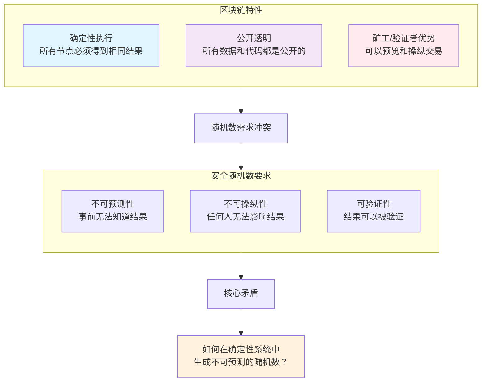
```mermaid
flowchart TD
    subgraph A["区块链特性"]
        direction TB
        C1["确定性执行<br/>所有节点必须得到相同结果"]
        C2["公开透明<br/>所有数据和代码都是公开的"]
        C3["矿工/验证者优势<br/>可以预览和操纵交易"]
    end
    
    A --> B["随机数需求冲突"]
    
    subgraph C["安全随机数要求"]
        direction TB
        R1["不可预测性<br/>事前无法知道结果"]
        R2["不可操纵性<br/>任何人无法影响结果"]
        R3["可验证性<br/>结果可以被验证"]
    end
    
    B --> C
    
    C --> D["核心矛盾"]
    D --> E["如何在确定性系统中<br/>生成不可预测的随机数？"]
    
    style C1 fill:#e1f5fe
    style C2 fill:#f3e5f5
    style C3 fill:#ffebee
    style E fill:#fff3e0
```

### 1.2 不安全的随机数方案

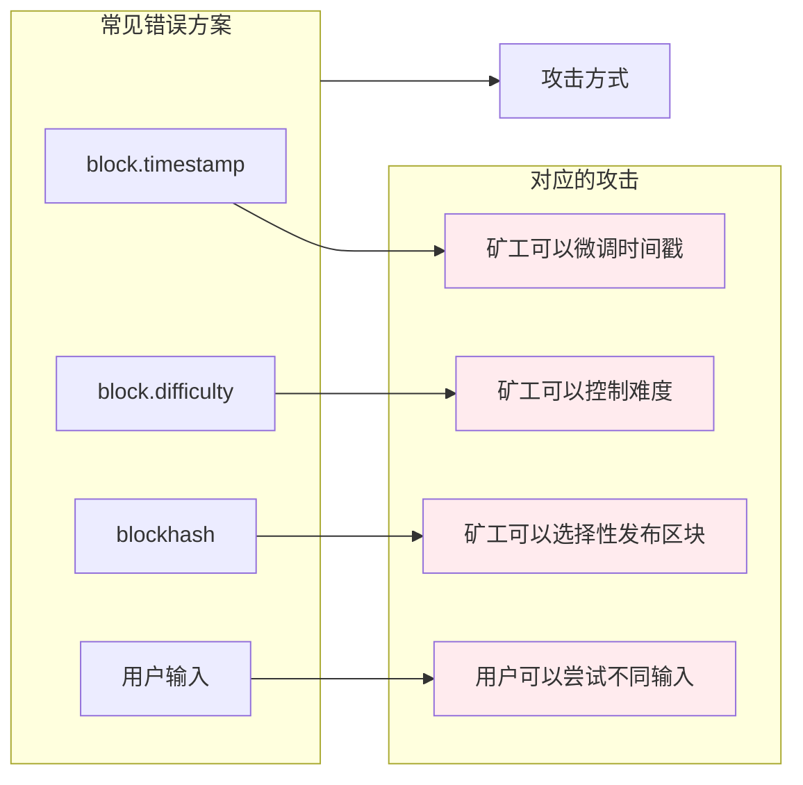
```mermaid
flowchart LR
    subgraph A["常见错误方案"]
        direction TB
        M1["block.timestamp"]
        M2["block.difficulty"]
        M3["blockhash"]
        M4["用户输入"]
    end
    
    A --> B["攻击方式"]
    
    subgraph C["对应的攻击"]
        direction TB
        A1["矿工可以微调时间戳"]
        A2["矿工可以控制难度"]
        A3["矿工可以选择性发布区块"]
        A4["用户可以尝试不同输入"]
    end
    
    M1 --> A1
    M2 --> A2
    M3 --> A3
    M4 --> A4
    
    style A1 fill:#ffebee
    style A2 fill:#ffebee
    style A3 fill:#ffebee
    style A4 fill:#ffebee
```

**经典攻击案例**：

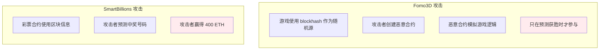
```mermaid
flowchart TD
    subgraph A["Fomo3D 攻击"]
        direction TB
        F1["游戏使用 blockhash 作为随机源"]
        F2["攻击者创建恶意合约"]
        F3["恶意合约模拟游戏逻辑"]
        F4["只在预测获胜时才参与"]
    end
    
    subgraph B["SmartBillions 攻击"]
        direction TB
        S1["彩票合约使用区块信息"]
        S2["攻击者预测中奖号码"]
        S3["攻击者赢得 400 ETH"]
    end
    
    style F4 fill:#ffebee
    style S3 fill:#ffebee
```

---

## 2. VRF 解决方案架构

### 2.1 Chainlink VRF 工作原理

Chainlink VRF 是目前最广泛使用的链上 VRF 解决方案：

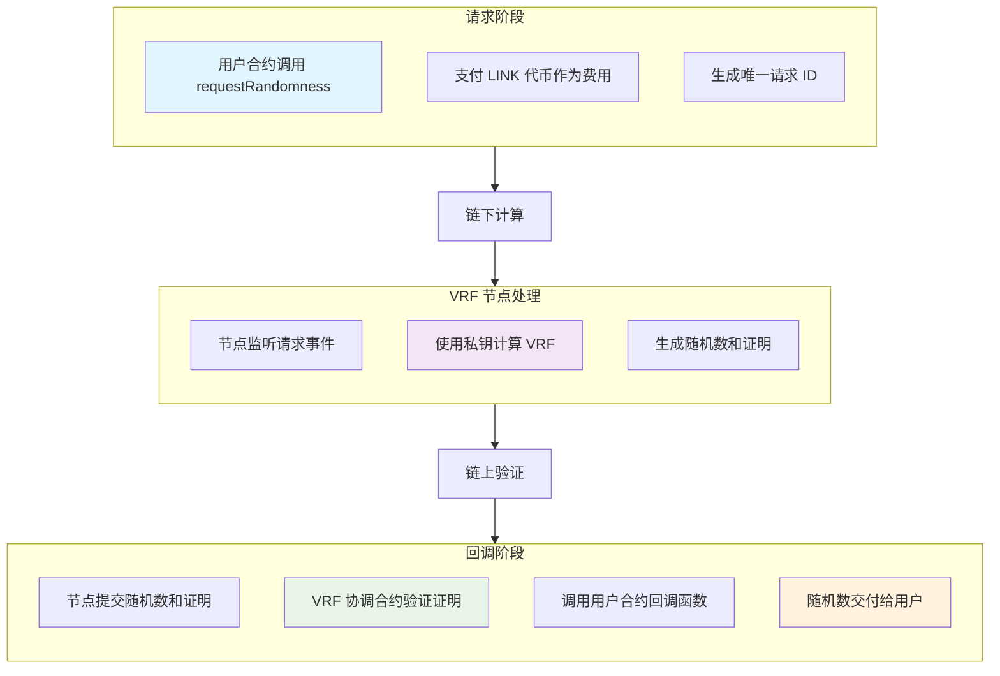
```mermaid
flowchart TD
    subgraph A["请求阶段"]
        direction TB
        R1["用户合约调用 requestRandomness"]
        R2["支付 LINK 代币作为费用"]
        R3["生成唯一请求 ID"]
    end
    
    A --> B["链下计算"]
    
    subgraph C["VRF 节点处理"]
        direction TB
        V1["节点监听请求事件"]
        V2["使用私钥计算 VRF"]
        V3["生成随机数和证明"]
    end
    
    B --> C
    
    C --> D["链上验证"]
    
    subgraph E["回调阶段"]
        direction TB
        F1["节点提交随机数和证明"]
        F2["VRF 协调合约验证证明"]
        F3["调用用户合约回调函数"]
        F4["随机数交付给用户"]
    end
    
    D --> E
    
    style R1 fill:#e1f5fe
    style V2 fill:#f3e5f5
    style F2 fill:#e8f5e8
    style F4 fill:#fff3e0
```

### 2.2 VRF 请求-响应流程详解

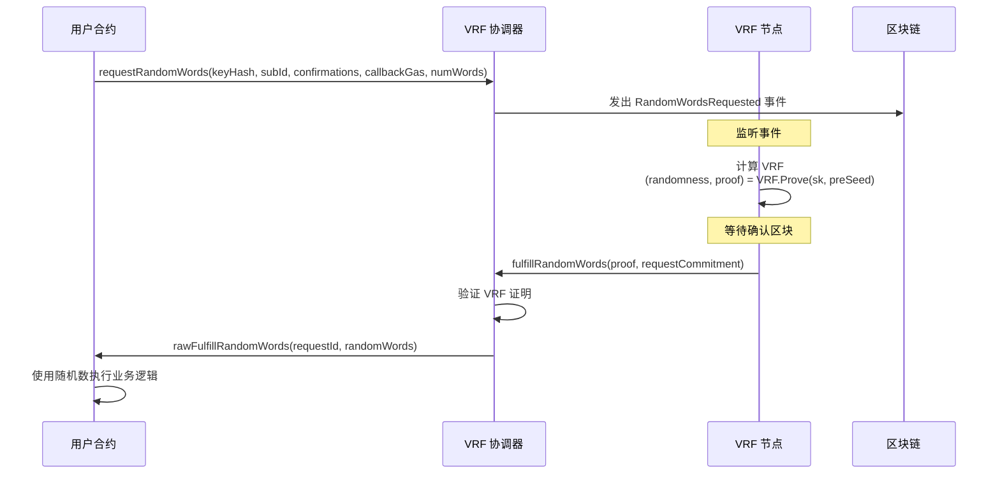
```mermaid
sequenceDiagram
    participant User as 用户合约
    participant Coord as VRF 协调器
    participant Node as VRF 节点
    participant Chain as 区块链
    
    User->>Coord: requestRandomWords(keyHash, subId, confirmations, callbackGas, numWords)
    Coord->>Chain: 发出 RandomWordsRequested 事件
    
    Note over Node: 监听事件
    Node->>Node: 计算 VRF<br/>(randomness, proof) = VRF.Prove(sk, preSeed)
    
    Note over Node: 等待确认区块
    Node->>Coord: fulfillRandomWords(proof, requestCommitment)
    
    Coord->>Coord: 验证 VRF 证明
    Coord->>User: rawFulfillRandomWords(requestId, randomWords)
    
    User->>User: 使用随机数执行业务逻辑
```

### 2.3 安全性保证

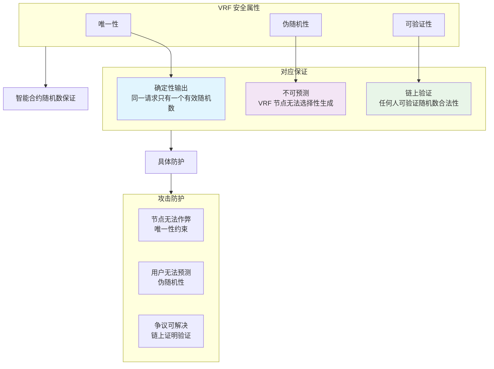
```mermaid
flowchart TD
    subgraph A["VRF 安全属性"]
        direction LR
        S1["唯一性"]
        S2["伪随机性"]
        S3["可验证性"]
    end
    
    A --> B["智能合约随机数保证"]
    
    subgraph C["对应保证"]
        direction TB
        G1["确定性输出<br/>同一请求只有一个有效随机数"]
        G2["不可预测<br/>VRF 节点无法选择性生成"]
        G3["链上验证<br/>任何人可验证随机数合法性"]
    end
    
    S1 --> G1
    S2 --> G2
    S3 --> G3
    
    C --> D["具体防护"]
    
    subgraph E["攻击防护"]
        direction LR
        P1["节点无法作弊<br/>唯一性约束"]
        P2["用户无法预测<br/>伪随机性"]
        P3["争议可解决<br/>链上证明验证"]
    end
    
    D --> E
    
    style G1 fill:#e1f5fe
    style G2 fill:#f3e5f5
    style G3 fill:#e8f5e8
```

---

## 3. 实现指南

### 3.1 Chainlink VRF v2.5 集成

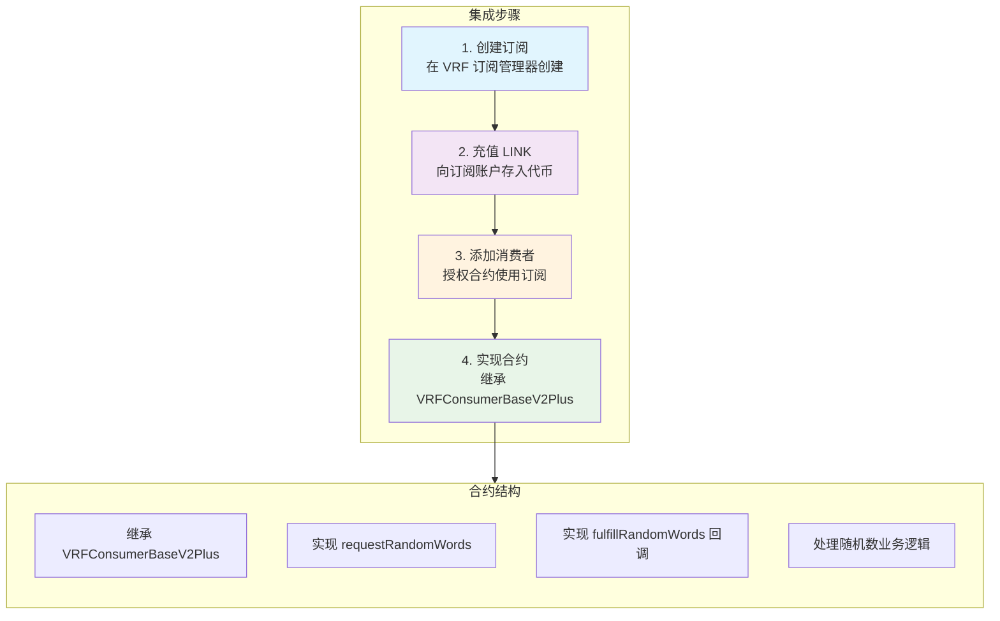
```mermaid
flowchart TD
    subgraph A["集成步骤"]
        direction TB
        S1["1. 创建订阅<br/>在 VRF 订阅管理器创建"]
        S2["2. 充值 LINK<br/>向订阅账户存入代币"]
        S3["3. 添加消费者<br/>授权合约使用订阅"]
        S4["4. 实现合约<br/>继承 VRFConsumerBaseV2Plus"]
    end
    
    S1 --> S2 --> S3 --> S4
    
    subgraph B["合约结构"]
        direction TB
        C1["继承 VRFConsumerBaseV2Plus"]
        C2["实现 requestRandomWords"]
        C3["实现 fulfillRandomWords 回调"]
        C4["处理随机数业务逻辑"]
    end
    
    S4 --> B
    
    style S1 fill:#e1f5fe
    style S2 fill:#f3e5f5
    style S3 fill:#fff3e0
    style S4 fill:#e8f5e8
```

### 3.2 合约代码结构

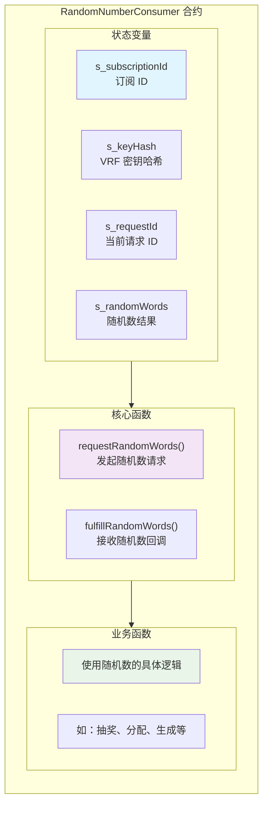
```mermaid
flowchart TD
    subgraph A["RandomNumberConsumer 合约"]
        direction TB
        
        subgraph B["状态变量"]
            direction LR
            V1["s_subscriptionId<br/>订阅 ID"]
            V2["s_keyHash<br/>VRF 密钥哈希"]
            V3["s_requestId<br/>当前请求 ID"]
            V4["s_randomWords<br/>随机数结果"]
        end
        
        subgraph C["核心函数"]
            direction LR
            F1["requestRandomWords()<br/>发起随机数请求"]
            F2["fulfillRandomWords()<br/>接收随机数回调"]
        end
        
        subgraph D["业务函数"]
            direction LR
            L1["使用随机数的具体逻辑"]
            L2["如：抽奖、分配、生成等"]
        end
    end
    
    B --> C --> D
    
    style V1 fill:#e1f5fe
    style F1 fill:#f3e5f5
    style L1 fill:#e8f5e8
```

### 3.3 关键参数说明

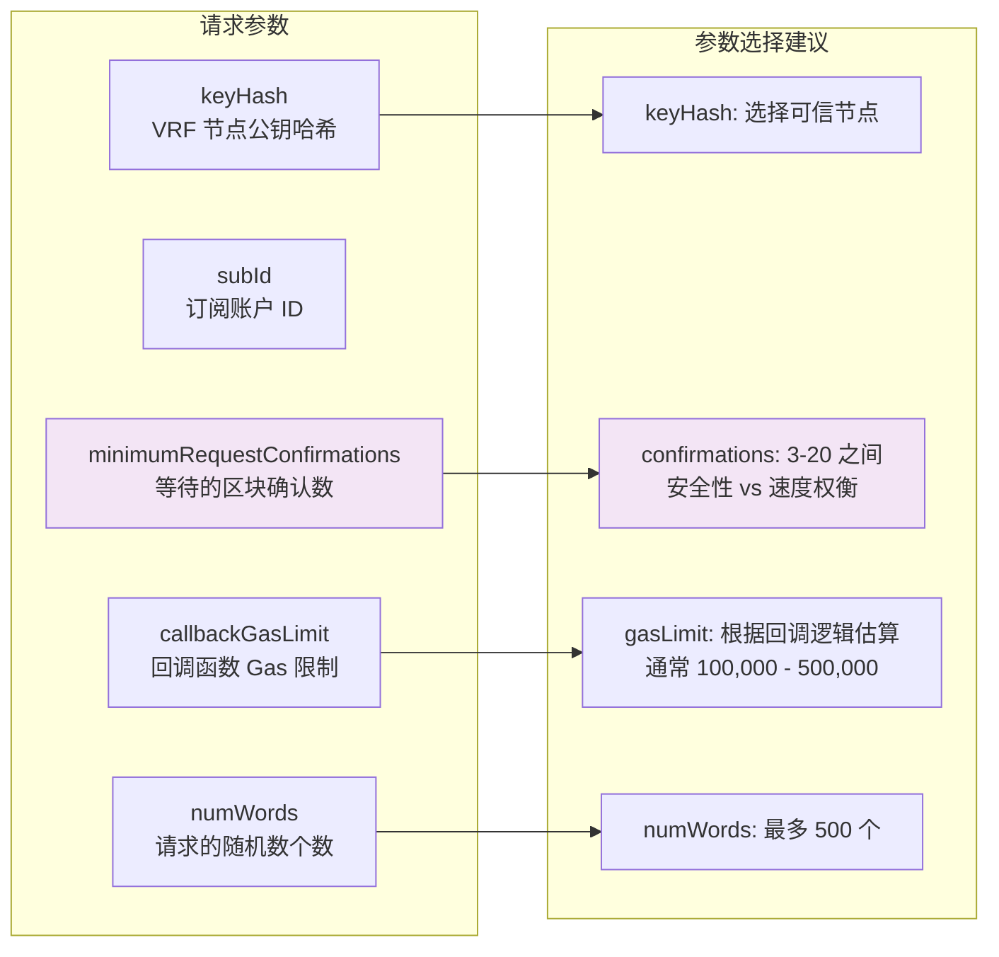
```mermaid
flowchart LR
    subgraph A["请求参数"]
        direction TB
        P1["keyHash<br/>VRF 节点公钥哈希"]
        P2["subId<br/>订阅账户 ID"]
        P3["minimumRequestConfirmations<br/>等待的区块确认数"]
        P4["callbackGasLimit<br/>回调函数 Gas 限制"]
        P5["numWords<br/>请求的随机数个数"]
    end
    
    subgraph B["参数选择建议"]
        direction TB
        R1["keyHash: 选择可信节点"]
        R2["confirmations: 3-20 之间<br/>安全性 vs 速度权衡"]
        R3["gasLimit: 根据回调逻辑估算<br/>通常 100,000 - 500,000"]
        R4["numWords: 最多 500 个"]
    end
    
    P1 --> R1
    P3 --> R2
    P4 --> R3
    P5 --> R4
    
    style P3 fill:#f3e5f5
    style R2 fill:#f3e5f5
```

---

## 4. 典型应用场景

### 4.1 链上游戏

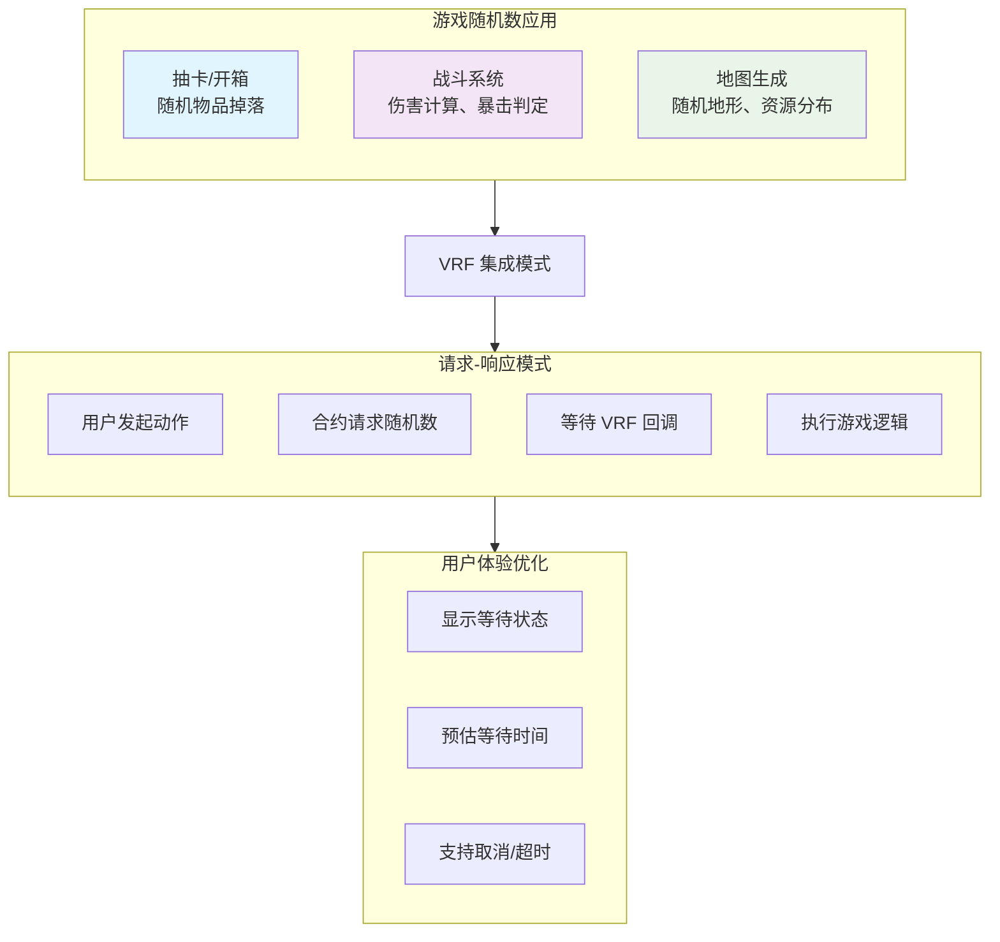
```mermaid
flowchart TD
    subgraph A["游戏随机数应用"]
        direction TB
        G1["抽卡/开箱<br/>随机物品掉落"]
        G2["战斗系统<br/>伤害计算、暴击判定"]
        G3["地图生成<br/>随机地形、资源分布"]
    end
    
    A --> B["VRF 集成模式"]
    
    subgraph C["请求-响应模式"]
        direction TB
        M1["用户发起动作"]
        M2["合约请求随机数"]
        M3["等待 VRF 回调"]
        M4["执行游戏逻辑"]
    end
    
    B --> C
    
    subgraph D["用户体验优化"]
        direction LR
        U1["显示等待状态"]
        U2["预估等待时间"]
        U3["支持取消/超时"]
    end
    
    C --> D
    
    style G1 fill:#e1f5fe
    style G2 fill:#f3e5f5
    style G3 fill:#e8f5e8
```

### 4.2 NFT 随机属性生成

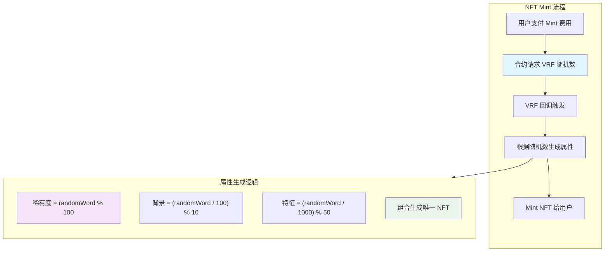
```mermaid
flowchart TD
    subgraph A["NFT Mint 流程"]
        direction TB
        N1["用户支付 Mint 费用"]
        N2["合约请求 VRF 随机数"]
        N3["VRF 回调触发"]
        N4["根据随机数生成属性"]
        N5["Mint NFT 给用户"]
    end
    
    N1 --> N2 --> N3 --> N4 --> N5
    
    subgraph B["属性生成逻辑"]
        direction TB
        A1["稀有度 = randomWord % 100"]
        A2["背景 = (randomWord / 100) % 10"]
        A3["特征 = (randomWord / 1000) % 50"]
        A4["组合生成唯一 NFT"]
    end
    
    N4 --> B
    
    style N2 fill:#e1f5fe
    style A1 fill:#f3e5f5
    style A4 fill:#e8f5e8
```

**稀有度分布示例**：

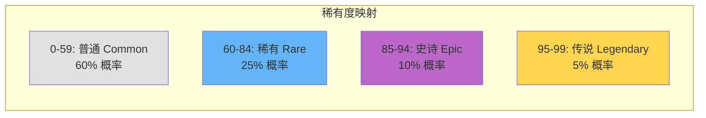
```mermaid
flowchart LR
    subgraph A["稀有度映射"]
        direction TB
        R1["0-59: 普通 Common<br/>60% 概率"]
        R2["60-84: 稀有 Rare<br/>25% 概率"]
        R3["85-94: 史诗 Epic<br/>10% 概率"]
        R4["95-99: 传说 Legendary<br/>5% 概率"]
    end
    
    style R1 fill:#e0e0e0
    style R2 fill:#64b5f6
    style R3 fill:#ba68c8
    style R4 fill:#ffd54f
```

### 4.3 去中心化抽奖

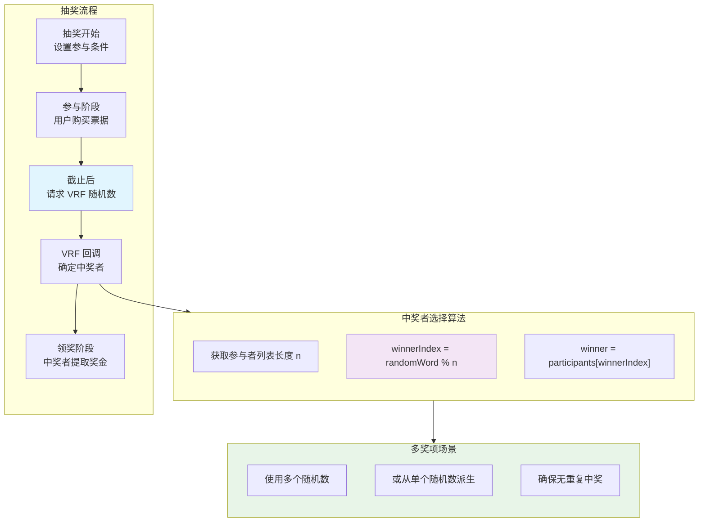
```mermaid
flowchart TD
    subgraph A["抽奖流程"]
        direction TB
        L1["抽奖开始<br/>设置参与条件"]
        L2["参与阶段<br/>用户购买票据"]
        L3["截止后<br/>请求 VRF 随机数"]
        L4["VRF 回调<br/>确定中奖者"]
        L5["领奖阶段<br/>中奖者提取奖金"]
    end
    
    L1 --> L2 --> L3 --> L4 --> L5
    
    subgraph B["中奖者选择算法"]
        direction TB
        W1["获取参与者列表长度 n"]
        W2["winnerIndex = randomWord % n"]
        W3["winner = participants[winnerIndex]"]
    end
    
    L4 --> B
    
    subgraph C["多奖项场景"]
        direction TB
        M1["使用多个随机数"]
        M2["或从单个随机数派生"]
        M3["确保无重复中奖"]
    end
    
    B --> C
    
    style L3 fill:#e1f5fe
    style W2 fill:#f3e5f5
    style C fill:#e8f5e8
```

### 4.4 公平分配

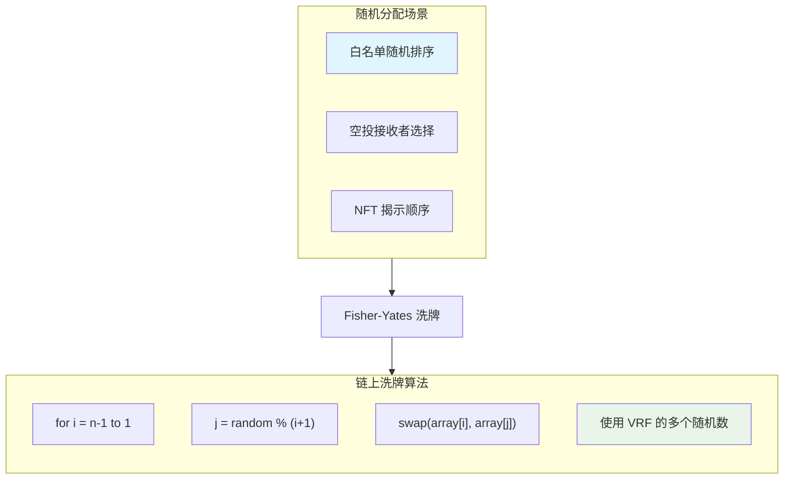
```mermaid
flowchart TD
    subgraph A["随机分配场景"]
        direction LR
        S1["白名单随机排序"]
        S2["空投接收者选择"]
        S3["NFT 揭示顺序"]
    end
    
    A --> B["Fisher-Yates 洗牌"]
    
    subgraph C["链上洗牌算法"]
        direction TB
        F1["for i = n-1 to 1"]
        F2["j = random % (i+1)"]
        F3["swap(array[i], array[j])"]
        F4["使用 VRF 的多个随机数"]
    end
    
    B --> C
    
    style S1 fill:#e1f5fe
    style F4 fill:#e8f5e8
```

---

## 5. 安全最佳实践

### 5.1 重入攻击防护

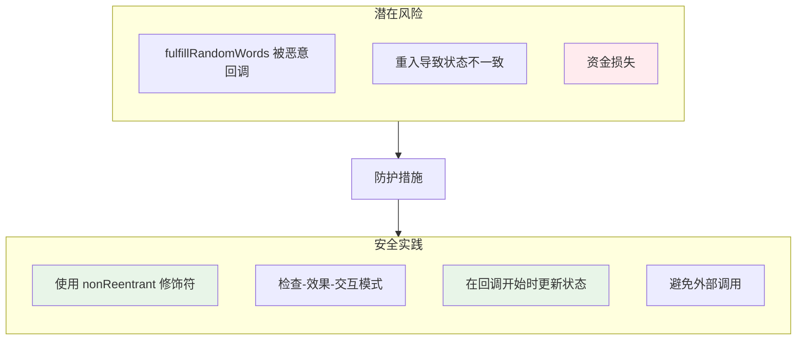
```mermaid
flowchart TD
    subgraph A["潜在风险"]
        direction TB
        R1["fulfillRandomWords 被恶意回调"]
        R2["重入导致状态不一致"]
        R3["资金损失"]
    end
    
    A --> B["防护措施"]
    
    subgraph C["安全实践"]
        direction TB
        P1["使用 nonReentrant 修饰符"]
        P2["检查-效果-交互模式"]
        P3["在回调开始时更新状态"]
        P4["避免外部调用"]
    end
    
    B --> C
    
    style R3 fill:#ffebee
    style P1 fill:#e8f5e8
    style P3 fill:#e8f5e8
```

### 5.2 请求 ID 管理

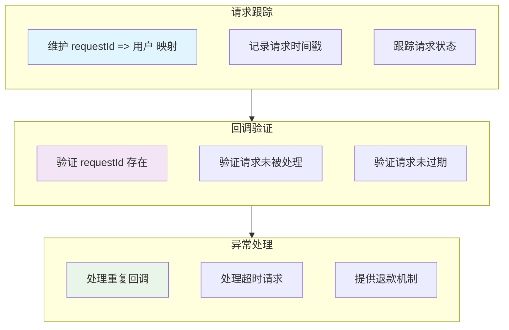
```mermaid
flowchart TD
    subgraph A["请求跟踪"]
        direction TB
        T1["维护 requestId => 用户 映射"]
        T2["记录请求时间戳"]
        T3["跟踪请求状态"]
    end
    
    subgraph B["回调验证"]
        direction TB
        V1["验证 requestId 存在"]
        V2["验证请求未被处理"]
        V3["验证请求未过期"]
    end
    
    A --> B
    
    subgraph C["异常处理"]
        direction TB
        E1["处理重复回调"]
        E2["处理超时请求"]
        E3["提供退款机制"]
    end
    
    B --> C
    
    style T1 fill:#e1f5fe
    style V1 fill:#f3e5f5
    style E1 fill:#e8f5e8
```

### 5.3 Gas 管理

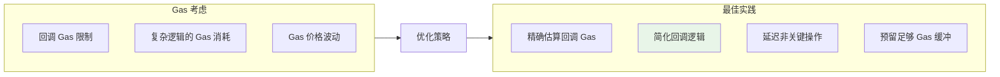
```mermaid
flowchart LR
    subgraph A["Gas 考虑"]
        direction TB
        G1["回调 Gas 限制"]
        G2["复杂逻辑的 Gas 消耗"]
        G3["Gas 价格波动"]
    end
    
    A --> B["优化策略"]
    
    subgraph C["最佳实践"]
        direction TB
        O1["精确估算回调 Gas"]
        O2["简化回调逻辑"]
        O3["延迟非关键操作"]
        O4["预留足够 Gas 缓冲"]
    end
    
    B --> C
    
    style O2 fill:#e8f5e8
```

### 5.4 订阅管理

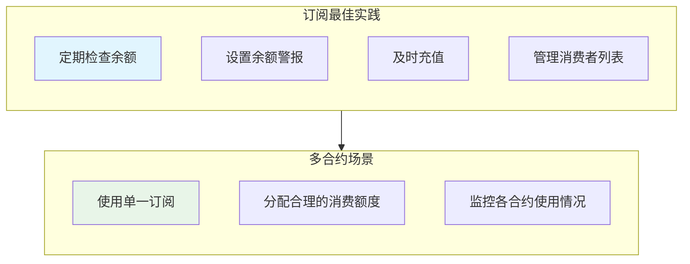
```mermaid
flowchart TD
    subgraph A["订阅最佳实践"]
        direction TB
        S1["定期检查余额"]
        S2["设置余额警报"]
        S3["及时充值"]
        S4["管理消费者列表"]
    end
    
    subgraph B["多合约场景"]
        direction TB
        M1["使用单一订阅"]
        M2["分配合理的消费额度"]
        M3["监控各合约使用情况"]
    end
    
    A --> B
    
    style S1 fill:#e1f5fe
    style M1 fill:#e8f5e8
```

---

## 6. 高级模式

### 6.1 批量随机数

当需要多个随机数时，可以在一次请求中获取：

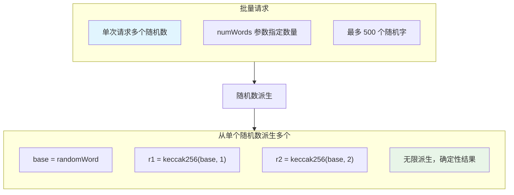
```mermaid
flowchart TD
    subgraph A["批量请求"]
        direction TB
        B1["单次请求多个随机数"]
        B2["numWords 参数指定数量"]
        B3["最多 500 个随机字"]
    end
    
    A --> B["随机数派生"]
    
    subgraph C["从单个随机数派生多个"]
        direction TB
        D1["base = randomWord"]
        D2["r1 = keccak256(base, 1)"]
        D3["r2 = keccak256(base, 2)"]
        D4["无限派生，确定性结果"]
    end
    
    B --> C
    
    style B1 fill:#e1f5fe
    style D4 fill:#e8f5e8
```

### 6.2 延迟揭示模式

用于 NFT 盲盒等场景：

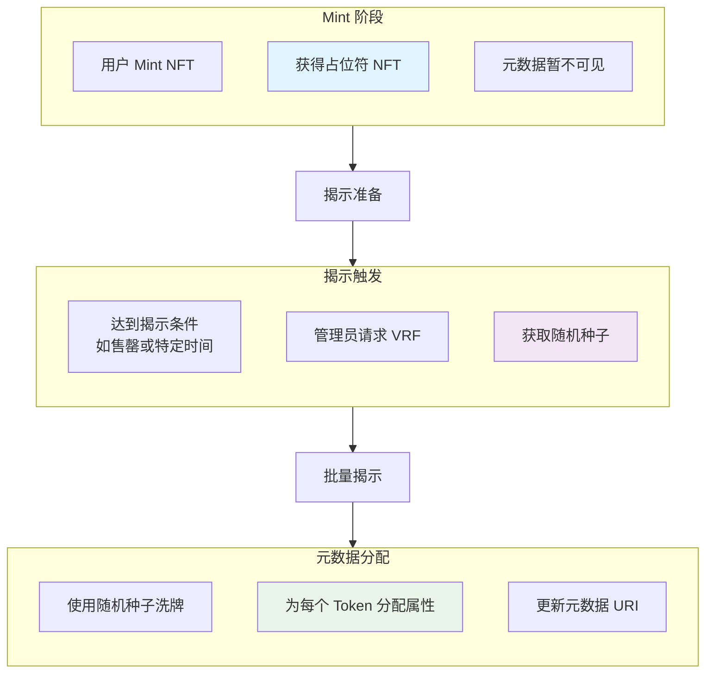
```mermaid
flowchart TD
    subgraph A["Mint 阶段"]
        direction TB
        M1["用户 Mint NFT"]
        M2["获得占位符 NFT"]
        M3["元数据暂不可见"]
    end
    
    A --> B["揭示准备"]
    
    subgraph C["揭示触发"]
        direction TB
        R1["达到揭示条件<br/>如售罄或特定时间"]
        R2["管理员请求 VRF"]
        R3["获取随机种子"]
    end
    
    B --> C
    
    C --> D["批量揭示"]
    
    subgraph E["元数据分配"]
        direction TB
        A1["使用随机种子洗牌"]
        A2["为每个 Token 分配属性"]
        A3["更新元数据 URI"]
    end
    
    D --> E
    
    style M2 fill:#e1f5fe
    style R3 fill:#f3e5f5
    style A2 fill:#e8f5e8
```

### 6.3 可验证延迟函数 (VDF) 结合

对于需要更强时间锁定的场景：

```mermaid
flowchart LR
    subgraph A["VRF + VDF 组合"]
        direction TB
        V1["VRF 提供初始随机性"]
        V2["VDF 提供时间延迟"]
        V3["组合提供更强安全性"]
    end
    
    subgraph B["工作流程"]
        direction TB
        F1["请求 VRF 随机数"]
        F2["VRF 输出作为 VDF 输入"]
        F3["VDF 计算需要固定时间"]
        F4["最终输出无法提前预测"]
    end
    
    A --> B
    
    style V3 fill:#e8f5e8
    style F4 fill:#e8f5e8
```

---

## 7. 成本优化

### 7.1 Gas 成本分析

```mermaid
flowchart TD
    subgraph A["VRF 成本组成"]
        direction TB
        C1["请求费用<br/>约 0.1-0.25 LINK"]
        C2["回调 Gas 费<br/>取决于逻辑复杂度"]
        C3["验证 Gas 费<br/>约 200,000 Gas"]
    end
    
    A --> B["优化方向"]
    
    subgraph C["成本优化策略"]
        direction TB
        O1["批量请求减少次数"]
        O2["简化回调逻辑"]
        O3["使用 Gas 价格预言机"]
        O4["选择低峰时段执行"]
    end
    
    B --> C
    
    style C1 fill:#e1f5fe
    style O1 fill:#e8f5e8
```

### 7.2 订阅模式 vs 直接付费

```mermaid
flowchart LR
    subgraph A["订阅模式"]
        direction TB
        S1["预充值 LINK"]
        S2["多合约共享订阅"]
        S3["更低单次成本"]
        S4["推荐高频使用者"]
    end
    
    subgraph B["直接付费模式"]
        direction TB
        D1["每次请求单独付费"]
        D2["无需预充值"]
        D3["合约需持有 LINK"]
        D4["适合低频使用者"]
    end
    
    style S3 fill:#e8f5e8
    style D4 fill:#e8f5e8
```

---

## 8. 监控与调试

### 8.1 事件监控

```mermaid
flowchart TD
    subgraph A["关键事件"]
        direction TB
        E1["RandomWordsRequested<br/>请求发出"]
        E2["RandomWordsFulfilled<br/>随机数交付"]
    end
    
    A --> B["监控指标"]
    
    subgraph C["监控内容"]
        direction TB
        M1["请求到响应延迟"]
        M2["请求成功率"]
        M3["Gas 消耗统计"]
        M4["订阅余额"]
    end
    
    B --> C
    
    subgraph D["告警设置"]
        direction TB
        A1["响应延迟过高"]
        A2["请求失败"]
        A3["余额不足"]
    end
    
    C --> D
    
    style E2 fill:#e8f5e8
    style A3 fill:#ffebee
```

### 8.2 常见问题排查

```mermaid
flowchart TD
    subgraph A["问题: 回调未触发"]
        direction TB
        P1["检查订阅余额"]
        P2["验证消费者授权"]
        P3["确认 Gas 限制足够"]
        P4["检查网络拥堵"]
    end
    
    subgraph B["问题: 随机数不符预期"]
        direction TB
        Q1["检查取模运算"]
        Q2["验证派生逻辑"]
        Q3["确认无溢出"]
    end
    
    subgraph C["问题: Gas 费过高"]
        direction TB
        R1["简化回调逻辑"]
        R2["减少状态写入"]
        R3["优化数据结构"]
    end
    
    style P1 fill:#e1f5fe
    style Q2 fill:#f3e5f5
    style R1 fill:#e8f5e8
```

---

## 9. 总结

VRF 为智能合约随机数提供了完美的解决方案：

```mermaid
flowchart TD
    subgraph A["VRF 智能合约随机数优势"]
        direction TB
        V1["安全性<br/>密码学保证不可预测"]
        V2["可验证性<br/>链上证明验证"]
        V3["去中心化<br/>无需信任第三方"]
        V4["易集成<br/>成熟的 SDK 和文档"]
    end
    
    A --> B["应用场景"]
    
    subgraph C["典型用例"]
        direction LR
        U1["链上游戏"]
        U2["NFT 生成"]
        U3["抽奖系统"]
        U4["公平分配"]
    end
    
    B --> C
    
    C --> D["最佳实践"]
    
    subgraph E["开发建议"]
        direction TB
        P1["使用成熟 VRF 服务"]
        P2["遵循安全模式"]
        P3["做好成本规划"]
        P4["实现完善监控"]
    end
    
    D --> E
    
    style V1 fill:#e1f5fe
    style V2 fill:#f3e5f5
    style V3 fill:#e8f5e8
    style V4 fill:#fff3e0
```

通过正确使用 VRF，开发者可以在智能合约中实现真正安全、公平、可验证的随机性，为用户提供可信赖的链上随机体验。

---

## 参考文献

1. Chainlink VRF Documentation: https://docs.chain.link/vrf
2. IETF RFC 9381: Verifiable Random Functions (VRFs)
3. Goldberg, S., et al. (2017). Verifiable Random Functions (VRFs)
4. Security Analysis of Randomness in Ethereum Smart Contracts
5. Best Practices for Smart Contract Randomness

