# KZG、IPA 与 FRI：多项式承诺在零知识证明中的对比

> 从承诺方案到证明系统，深入理解三大多项式承诺的技术权衡

---

## 摘要

KZG（Kate-Zaverucha-Goldberg）和 IPA（Inner Product Argument）是当今零知识证明系统中最重要的两种多项式承诺方案。它们在零知识证明中扮演着"后端"角色——将算术电路编译后的多项式约束转化为可验证的简洁证明。本文深入分析两者的数学原理、在 ZK 系统中的应用方式，以及各自的技术权衡，帮助读者理解何时选择哪种方案。

**关键词**：KZG、IPA、多项式承诺、零知识证明、SNARK、可信设置、配对运算

---

## 目录

1. [引言：零知识证明为什么需要多项式承诺](#引言零知识证明为什么需要多项式承诺)
2. [多项式承诺在 ZK 系统中的角色](#多项式承诺在-zk-系统中的角色)
3. [KZG 承诺：配对的力量](#kzg-承诺配对的力量)
4. [IPA 承诺：离散对数的优雅](#ipa-承诺离散对数的优雅)
5. [FRI 承诺：哈希的力量](#fri-承诺哈希的力量)
6. [核心技术对比](#核心技术对比)
7. [在主流 ZK 系统中的应用](#在主流-zk-系统中的应用)
8. [实际工程权衡](#实际工程权衡)
9. [未来发展方向](#未来发展方向)
10. [总结](#总结)

---

## 引言：零知识证明为什么需要多项式承诺

### 1.1 零知识证明的核心问题

零知识证明（Zero-Knowledge Proof, ZKP）允许证明者向验证者证明某个陈述为真，而不泄露任何额外信息。在区块链场景中，这意味着：

```
┌─────────────────────────────────────────────────────────────────────────────┐
│                        零知识证明的典型应用场景                              │
├─────────────────────────────────────────────────────────────────────────────┤
│                                                                             │
│  📊 隐私交易                                                                │
│     证明: "我有足够余额支付这笔交易"                                       │
│     不泄露: 具体余额数值、交易历史                                         │
│                                                                             │
│  🔐 身份验证                                                                │
│     证明: "我的年龄超过 18 岁"                                             │
│     不泄露: 具体出生日期、身份证号                                         │
│                                                                             │
│  ⚡ 链下扩容 (Rollup)                                                       │
│     证明: "这 1000 笔交易都是有效的"                                       │
│     不泄露/压缩: 交易的具体执行过程                                        │
│                                                                             │
└─────────────────────────────────────────────────────────────────────────────┘
```

### 1.2 从计算问题到多项式

现代零知识证明系统的核心洞察：**任何计算问题都可以转化为多项式等式**。

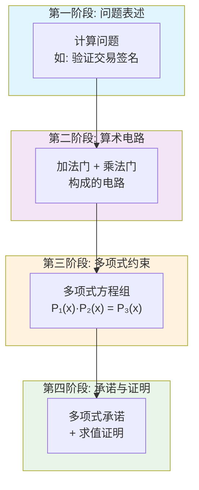

**关键问题**：如何让验证者相信"证明者知道某些满足约束的多项式"，而不需要验证者看到整个多项式？

**答案**：**多项式承诺方案**（Polynomial Commitment Scheme, PCS）

---

## 多项式承诺在 ZK 系统中的角色

### 2.1 什么是多项式承诺

多项式承诺是一种密码学协议，允许：

1. **承诺**：对多项式 $P(X)$ 生成一个简短的承诺 $C$
2. **求值证明**：证明 $P(z) = y$，即多项式在点 $z$ 的值是 $y$
3. **零知识**（可选）：验证者除了知道 $P(z) = y$ 外，不了解 $P(X)$ 的其他信息

```
┌─────────────────────────────────────────────────────────────────────────────┐
│                       多项式承诺的三个核心操作                               │
├─────────────────────────────────────────────────────────────────────────────┤
│                                                                             │
│  1. Commit(P) → C                                                           │
│     ┌─────────────────────────────────────────────────────────────────┐    │
│     │  输入: 多项式 P(X) = a₀ + a₁X + a₂X² + ... + aₙXⁿ              │    │
│     │  输出: 承诺 C (一个群元素，通常 32-48 bytes)                    │    │
│     │  性质: C 唯一绑定 P(X)，但不泄露 P(X) 的系数                   │    │
│     └─────────────────────────────────────────────────────────────────┘    │
│                                                                             │
│  2. Open(P, z) → (y, π)                                                     │
│     ┌─────────────────────────────────────────────────────────────────┐    │
│     │  输入: 多项式 P(X)，求值点 z                                    │    │
│     │  输出: 值 y = P(z)，证明 π                                      │    │
│     │  证明: π 使验证者确信 y 确实是 P 在 z 处的值                   │    │
│     └─────────────────────────────────────────────────────────────────┘    │
│                                                                             │
│  3. Verify(C, z, y, π) → {Accept, Reject}                                   │
│     ┌─────────────────────────────────────────────────────────────────┐    │
│     │  输入: 承诺 C，点 z，声称的值 y，证明 π                        │    │
│     │  输出: 接受或拒绝                                               │    │
│     │  性质: 只有知道正确 P(X) 的人才能生成有效证明                  │    │
│     └─────────────────────────────────────────────────────────────────┘    │
│                                                                             │
└─────────────────────────────────────────────────────────────────────────────┘
```

### 2.2 多项式承诺在 ZK 证明中的位置

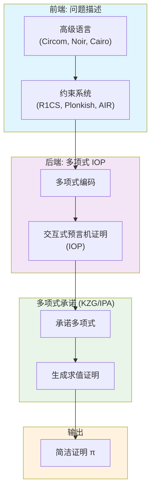

**关键洞察**：多项式承诺是 SNARK 系统的"最后一公里"——它将交互式的多项式 IOP 编译成非交互式的简洁证明。选择不同的 PCS，直接影响：

- 证明大小
- 证明/验证时间
- 是否需要可信设置
- 后量子安全性

---

## KZG 承诺：配对的力量

### 3.1 数学基础：双线性配对

KZG 的核心是**双线性配对**（Bilinear Pairing），这是一种特殊的数学映射：

$$
e: \mathbb{G}_1 \times \mathbb{G}_2 \rightarrow \mathbb{G}_T
$$

满足双线性性质：

$$
e(aG_1, bG_2) = e(G_1, G_2)^{ab}
$$

```
┌─────────────────────────────────────────────────────────────────────────────┐
│                         双线性配对的直观理解                                 │
├─────────────────────────────────────────────────────────────────────────────┤
│                                                                             │
│  想象三个"世界":                                                            │
│                                                                             │
│     G₁ (源群 1)          G₂ (源群 2)          G_T (目标群)                  │
│     ┌─────────┐         ┌─────────┐         ┌─────────────┐                │
│     │ a·G₁    │         │ b·G₂    │         │ e(G₁,G₂)^ab │                │
│     │         │    ×    │         │    =    │             │                │
│     │ 曲线点  │         │ 曲线点  │         │  大群元素   │                │
│     └─────────┘         └─────────┘         └─────────────┘                │
│                                                                             │
│  关键性质:                                                                  │
│  ─────────                                                                  │
│  1. e(aP, bQ) = e(P, Q)^ab     // 指数可以"提取"到目标群                   │
│  2. e(P₁ + P₂, Q) = e(P₁, Q) · e(P₂, Q)  // 分配律                         │
│  3. 从 aG₁ 无法计算 a (离散对数难)                                         │
│  4. 但可以"检验"两边指数是否相等！                                         │
│                                                                             │
│  这让我们能在"不知道秘密值"的情况下验证多项式关系!                         │
│                                                                             │
└─────────────────────────────────────────────────────────────────────────────┘
```

### 3.2 可信设置（Trusted Setup）

KZG 需要一次性的可信设置，生成公共参数：

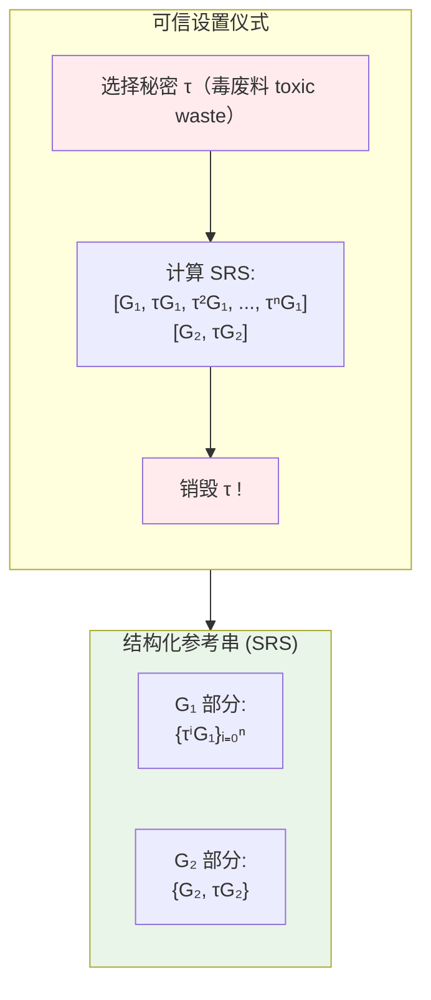

**安全假设**：τ 必须被完全销毁。如果任何人知道 τ，他们可以伪造任意证明！

**实际方案**：使用多方计算（MPC）仪式，只要有一个参与者诚实销毁了自己的份额，系统就是安全的。

- **以太坊 KZG 仪式**：超过 14 万参与者
- **Zcash Powers of Tau**：数百参与者

### 3.3 KZG 承诺与求值证明

#### 3.3.1 承诺

给定多项式 $P(X) = \sum_{i=0}^{n} a_i X^i$，承诺计算为：

$$
C = P(\tau) \cdot G_1 = \sum_{i=0}^{n} a_i \cdot (\tau^i G_1)
$$

证明者使用 SRS 中的 $\{\tau^i G_1\}$ 计算承诺，但不知道实际的 τ 值。

```
┌─────────────────────────────────────────────────────────────────────────────┐
│                           KZG 承诺计算示例                                   │
├─────────────────────────────────────────────────────────────────────────────┤
│                                                                             │
│  多项式: P(X) = 3 + 2X + 5X²                                               │
│                                                                             │
│  SRS (公开):                                                                │
│     [G₁, τG₁, τ²G₁, ...]                                                   │
│                                                                             │
│  承诺计算:                                                                  │
│     C = 3·G₁ + 2·(τG₁) + 5·(τ²G₁)                                          │
│       = (3 + 2τ + 5τ²)·G₁                                                  │
│       = P(τ)·G₁                                                            │
│                                                                             │
│  注意:                                                                      │
│  • 证明者不知道 τ，只能使用 SRS 中的"加密"形式                            │
│  • 承诺 C 是单个群元素，大小恒定 (48 bytes for BLS12-381)                 │
│  • 多项式阶数 n 不影响承诺大小!                                            │
│                                                                             │
└─────────────────────────────────────────────────────────────────────────────┘
```

#### 3.3.2 求值证明

要证明 $P(z) = y$，关键洞察是：

$$
P(X) - y \text{ 被 } (X - z) \text{ 整除} \quad \Leftrightarrow \quad P(z) = y
$$

证明者计算**商多项式**：

$$
Q(X) = \frac{P(X) - y}{X - z}
$$

证明 $\pi = Q(\tau) \cdot G_1$

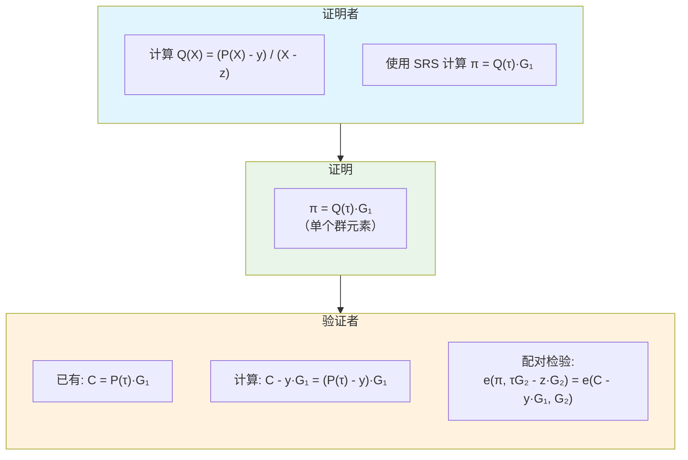

#### 3.3.3 验证方程

验证者检查配对等式：

$$
e(\pi, \tau G_2 - z \cdot G_2) = e(C - y \cdot G_1, G_2)
$$

**正确性分析**：

$$
\begin{aligned}
\text{左边} &= e(Q(\tau) \cdot G_1, (\tau - z) \cdot G_2) \\
&= e(G_1, G_2)^{Q(\tau) \cdot (\tau - z)} \\
\text{右边} &= e((P(\tau) - y) \cdot G_1, G_2) \\
&= e(G_1, G_2)^{P(\tau) - y}
\end{aligned}
$$

由于 $Q(X) \cdot (X - z) = P(X) - y$，在 $X = \tau$ 处：

$$
Q(\tau) \cdot (\tau - z) = P(\tau) - y \quad \Rightarrow \quad \text{左边} = \text{右边}
$$

### 3.4 KZG 在零知识证明中的优势

```
┌─────────────────────────────────────────────────────────────────────────────┐
│                           KZG 的核心优势                                     │
├─────────────────────────────────────────────────────────────────────────────┤
│                                                                             │
│  ⚡ O(1) 证明大小                                                           │
│     • 单个求值证明: 1 个群元素 (48 bytes)                                  │
│     • 与多项式阶数无关!                                                    │
│     • 适合链上验证（gas 成本固定）                                         │
│                                                                             │
│  🚀 O(1) 验证时间                                                           │
│     • 2 次配对运算（约 1-2ms）                                             │
│     • 独立于多项式阶数                                                     │
│     • 非常适合 Rollup 的链上验证                                           │
│                                                                             │
│  📦 批量验证                                                                │
│     • 多个证明可以聚合验证                                                 │
│     • 摊销后成本更低                                                       │
│                                                                             │
│  🔗 同态性                                                                  │
│     • C(P₁) + C(P₂) = C(P₁ + P₂)                                           │
│     • 支持高效的多项式运算                                                 │
│                                                                             │
└─────────────────────────────────────────────────────────────────────────────┘
```

---

## IPA 承诺：离散对数的优雅

### 4.1 无需配对的承诺方案

IPA (Inner Product Argument) 只依赖于**离散对数假设**，不需要双线性配对。

```
┌─────────────────────────────────────────────────────────────────────────────┐
│                        IPA vs KZG 的密码学基础                               │
├─────────────────────────────────────────────────────────────────────────────┤
│                                                                             │
│                    KZG                           IPA                        │
│              ┌─────────────┐              ┌─────────────┐                  │
│              │  配对曲线   │              │  标准曲线   │                  │
│              │ BLS12-381   │              │ Curve25519  │                  │
│              │   Bn254     │              │  secp256k1  │                  │
│              └─────────────┘              └─────────────┘                  │
│                    │                            │                          │
│              ┌─────────────┐              ┌─────────────┐                  │
│              │ 双线性配对  │              │  离散对数   │                  │
│              │  e(·,·)     │              │    DLP      │                  │
│              └─────────────┘              └─────────────┘                  │
│                    │                            │                          │
│              需要可信设置                  透明设置                        │
│             (Toxic Waste)              (无秘密参数)                        │
│                                                                             │
└─────────────────────────────────────────────────────────────────────────────┘
```

### 4.1.1 IPA 透明设置的本质：没有私钥需要销毁

这是 IPA 与 KZG 最根本的区别。让我们详细对比：

```
┌─────────────────────────────────────────────────────────────────────────────┐
│                   KZG 可信设置 vs IPA 透明设置                               │
├─────────────────────────────────────────────────────────────────────────────┤
│                                                                             │
│  ╔═══════════════════════════════════════════════════════════════════════╗ │
│  ║                        KZG: 有秘密，必须销毁                           ║ │
│  ╠═══════════════════════════════════════════════════════════════════════╣ │
│  ║                                                                       ║ │
│  ║  1. 选择秘密 τ (toxic waste)                                         ║ │
│  ║                    ↓                                                  ║ │
│  ║  2. 计算 SRS: [G, τG, τ²G, ..., τⁿG]                                 ║ │
│  ║                    ↓                                                  ║ │
│  ║  3. 🔥 必须销毁 τ 🔥                                                  ║ │
│  ║                                                                       ║ │
│  ║  风险: 如果任何人知道 τ，可以伪造任意证明！                          ║ │
│  ║        τ² = τ·τ，τ³ = τ·τ·τ... 攻击者可以构造任意多项式             ║ │
│  ║                                                                       ║ │
│  ╚═══════════════════════════════════════════════════════════════════════╝ │
│                                                                             │
│  ╔═══════════════════════════════════════════════════════════════════════╗ │
│  ║                     IPA: 无秘密，无需销毁                              ║ │
│  ╠═══════════════════════════════════════════════════════════════════════╣ │
│  ║                                                                       ║ │
│  ║  生成元通过 "Nothing-Up-My-Sleeve" (NUMS) 方法生成:                  ║ │
│  ║                                                                       ║ │
│  ║    G₀ = HashToCurve("IPA Generator 0")                               ║ │
│  ║    G₁ = HashToCurve("IPA Generator 1")                               ║ │
│  ║    G₂ = HashToCurve("IPA Generator 2")                               ║ │
│  ║    ...                                                                ║ │
│  ║                                                                       ║ │
│  ║  ✅ 没有秘密值参与生成过程                                           ║ │
│  ║  ✅ 任何人都可以独立重新计算并验证                                   ║ │
│  ║  ✅ 没有 "私钥" 需要销毁                                             ║ │
│  ║                                                                       ║ │
│  ╚═══════════════════════════════════════════════════════════════════════╝ │
│                                                                             │
└─────────────────────────────────────────────────────────────────────────────┘
```

#### NUMS (Nothing-Up-My-Sleeve) 生成元

```python
def generate_ipa_generators(n: int) -> List[Point]:
    """
    生成 IPA 的 n 个独立生成元
    
    关键: 整个过程是确定性的、公开的、可验证的
    没有任何秘密参与！
    """
    generators = []
    for i in range(n):
        # 使用公开的、确定性的字符串
        seed = f"IPA Generator {i}"
        
        # 哈希到曲线 - 这是单向的，没有人知道对应的"私钥"
        G_i = hash_to_curve(seed)
        
        generators.append(G_i)
    
    return generators
```

#### 为什么这是安全的？

```
┌─────────────────────────────────────────────────────────────────────────────┐
│                    NUMS 生成元的安全性分析                                   │
├─────────────────────────────────────────────────────────────────────────────┤
│                                                                             │
│  问题: 生成元 Gᵢ = HashToCurve(seedᵢ)，有没有对应的"私钥"？              │
│                                                                             │
│  答案: 从密码学角度，不存在可用的私钥                                      │
│                                                                             │
│  理由:                                                                      │
│  ──────                                                                     │
│  1. 如果 Gᵢ = xᵢ · G_base，要找到 xᵢ 需要解决离散对数问题 (DLP)           │
│     这在计算上是不可行的 (2^128 级别的安全性)                              │
│                                                                             │
│  2. 更重要的是: 没有人在生成过程中使用过 xᵢ                               │
│     • HashToCurve 直接输出曲线点                                           │
│     • 不经过 "选择标量 → 点乘" 的过程                                     │
│     • 因此 xᵢ 从未被计算、从未存在过                                      │
│                                                                             │
│  3. 攻击者要伪造证明，需要知道不同生成元之间的离散对数关系:               │
│     即找到 a 使得 G₁ = a · G₀                                              │
│     这同样是 DLP 难题                                                      │
│                                                                             │
│  关键区别:                                                                  │
│  ──────────                                                                 │
│  • KZG: τ 确实存在过，只是被销毁了 → 必须信任销毁过程                     │
│  • IPA: 离散对数关系从未被计算过 → 无需信任任何人                         │
│                                                                             │
└─────────────────────────────────────────────────────────────────────────────┘
```

#### 公开可验证性

任何人都可以验证 IPA 的设置是正确的：

```python
def verify_ipa_setup(generators: List[Point]) -> bool:
    """
    任何人都可以运行这个函数来验证生成元
    """
    for i, G_i in enumerate(generators):
        expected = hash_to_curve(f"IPA Generator {i}")
        if G_i != expected:
            return False  # 生成元被篡改！
    return True  # 设置正确，无需信任任何人
```

| 对比维度 | KZG | IPA |
|----------|-----|-----|
| **是否有秘密** | 有 (τ) | 无 |
| **秘密何时存在** | 设置仪式期间 | 从未存在 |
| **需要销毁什么** | τ 及其幂次 | 无需销毁 |
| **信任假设** | 至少一个参与者诚实销毁 | 无需信任任何人 |
| **可验证性** | 无法验证销毁 | 完全可验证 |
| **后续更新** | 需要新仪式 | 随时可扩展 |

### 4.2 Pedersen 向量承诺

IPA 的承诺部分使用 **Pedersen 向量承诺**：

给定向量 $\mathbf{a} = [a_0, a_1, \ldots, a_{n-1}]$ 和 $n$ 个独立生成元 $\mathbf{G} = [G_0, G_1, \ldots, G_{n-1}]$：

$$
C = \langle \mathbf{a}, \mathbf{G} \rangle = \sum_{i=0}^{n-1} a_i \cdot G_i
$$

```
┌─────────────────────────────────────────────────────────────────────────────┐
│                       Pedersen 向量承诺示例                                  │
├─────────────────────────────────────────────────────────────────────────────┤
│                                                                             │
│  向量: a = [3, 2, 5, 7]                                                    │
│                                                                             │
│  生成元 (公开随机):                                                         │
│     G = [G₀, G₁, G₂, G₃]                                                   │
│     （通过哈希到曲线生成，无人知道离散对数关系）                           │
│                                                                             │
│  承诺计算:                                                                  │
│     C = 3·G₀ + 2·G₁ + 5·G₂ + 7·G₃                                          │
│       = ⟨a, G⟩                                                             │
│                                                                             │
│  性质:                                                                      │
│  • 绑定性: 无法找到不同的 a' 使得 ⟨a', G⟩ = C                              │
│  • 隐藏性: 从 C 无法恢复 a（需要解决 n 个离散对数）                        │
│  • 同态性: C(a) + C(b) = C(a + b)                                          │
│                                                                             │
└─────────────────────────────────────────────────────────────────────────────┘
```

### 4.3 内积证明的核心：折半协议

IPA 证明 $\langle \mathbf{a}, \mathbf{b} \rangle = z$ 的关键是**对数轮折半**：

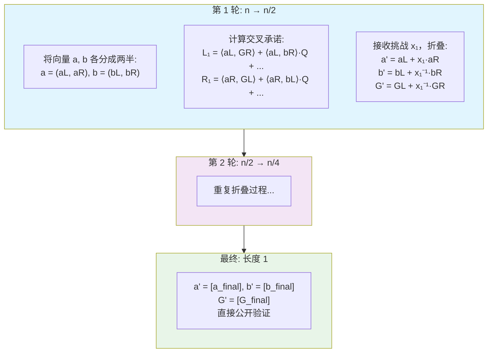

### 4.4 IPA 的数学细节

#### 4.4.1 设置

- 向量 $\mathbf{a}, \mathbf{b}$ 长度为 $n = 2^k$
- 生成元 $\mathbf{G}, \mathbf{H}$，辅助点 $Q$
- 承诺 $C = \langle \mathbf{a}, \mathbf{G} \rangle + \langle \mathbf{b}, \mathbf{H} \rangle + z \cdot Q$

#### 4.4.2 每轮交互

在第 $i$ 轮，当前向量长度为 $m$：

1. **分割**：
$$
\mathbf{a} = (\mathbf{a}_L, \mathbf{a}_R), \quad \mathbf{b} = (\mathbf{b}_L, \mathbf{b}_R)
$$

2. **计算交叉项**：
$$
L_i = \langle \mathbf{a}_L, \mathbf{G}_R \rangle + \langle \mathbf{b}_R, \mathbf{H}_L \rangle + \langle \mathbf{a}_L, \mathbf{b}_R \rangle \cdot Q
$$
$$
R_i = \langle \mathbf{a}_R, \mathbf{G}_L \rangle + \langle \mathbf{b}_L, \mathbf{H}_R \rangle + \langle \mathbf{a}_R, \mathbf{b}_L \rangle \cdot Q
$$

3. **接收随机挑战** $x_i$（Fiat-Shamir 变换）

4. **折叠**：
$$
\mathbf{a}' = \mathbf{a}_L + x_i \cdot \mathbf{a}_R
$$
$$
\mathbf{b}' = \mathbf{b}_L + x_i^{-1} \cdot \mathbf{b}_R
$$
$$
\mathbf{G}' = \mathbf{G}_L + x_i^{-1} \cdot \mathbf{G}_R
$$

#### 4.4.3 证明组成

```
┌─────────────────────────────────────────────────────────────────────────────┐
│                           IPA 证明结构                                       │
├─────────────────────────────────────────────────────────────────────────────┤
│                                                                             │
│  证明 π 包含:                                                               │
│                                                                             │
│  1. 每轮的交叉承诺:                                                         │
│     {(L₁, R₁), (L₂, R₂), ..., (Lₖ, Rₖ)}                                    │
│     共 2·log₂(n) 个群元素                                                  │
│                                                                             │
│  2. 最终的折叠值:                                                           │
│     a_final, b_final                                                       │
│     共 2 个标量                                                             │
│                                                                             │
│  总大小: 2·log₂(n) 个群元素 + 2 个标量                                     │
│         ≈ 2·log₂(n)·32 + 64 bytes                                          │
│                                                                             │
│  例如 n = 256:                                                              │
│     2·8·32 + 64 = 512 + 64 = 576 bytes                                     │
│                                                                             │
└─────────────────────────────────────────────────────────────────────────────┘
```

### 4.5 IPA 的验证

验证者：

1. **重建挑战序列** $\{x_1, x_2, \ldots, x_k\}$（使用 Fiat-Shamir）

2. **重建折叠后的承诺**：
$$
C' = C + \sum_{i=1}^{k} (x_i^2 \cdot L_i + x_i^{-2} \cdot R_i)
$$

3. **重建折叠后的生成元**（两组都需要重建）：

$$
\mathbf{G}' = \mathbf{G}_L + x_i^{-1} \cdot \mathbf{G}_R \quad \text{(每轮递归折叠)}
$$

$$
\mathbf{H}' = \mathbf{H}_L + x_i \cdot \mathbf{H}_R \quad \text{(注意: H 的折叠方向与 G 相反)}
$$

```
┌─────────────────────────────────────────────────────────────────────────────┐
│                        G 和 H 折叠方向的对称性                               │
├─────────────────────────────────────────────────────────────────────────────┤
│                                                                             │
│  为什么 G 用 x⁻¹ 而 H 用 x ？                                              │
│  ───────────────────────────                                                │
│                                                                             │
│  回顾向量折叠:                                                              │
│    a' = aL + x·aR        (a 向量用 x)                                      │
│    b' = bL + x⁻¹·bR      (b 向量用 x⁻¹)                                    │
│                                                                             │
│  为了保持内积不变，生成元必须反向折叠:                                      │
│    G' = GL + x⁻¹·GR      (与 a 配对，所以用 x⁻¹)                           │
│    H' = HL + x·HR        (与 b 配对，所以用 x)                             │
│                                                                             │
│  验证: ⟨a', G'⟩ 和 ⟨b', H'⟩ 的交叉项正好抵消!                              │
│                                                                             │
└─────────────────────────────────────────────────────────────────────────────┘
```

4. **验证最终等式**：
$$
C' = a_{final} \cdot G'_{final} + b_{final} \cdot H'_{final} + (a_{final} \cdot b_{final}) \cdot Q
$$

### 4.6 IPA 在零知识证明中的优势

```
┌─────────────────────────────────────────────────────────────────────────────┐
│                           IPA 的核心优势                                     │
├─────────────────────────────────────────────────────────────────────────────┤
│                                                                             │
│  🔓 透明设置                                                                │
│     • 无需可信设置仪式                                                     │
│     • 只需要随机生成元（可公开验证）                                       │
│     • 无 "toxic waste" 风险                                                │
│                                                                             │
│  🛡️ 更强的安全假设                                                         │
│     • 只依赖离散对数假设                                                   │
│     • 不需要配对友好曲线                                                   │
│     • 更多曲线可选（包括 Curve25519）                                      │
│                                                                             │
│  📐 灵活的曲线选择                                                          │
│     • 可用于任何素阶群                                                     │
│     • 支持更高效的曲线                                                     │
│     • 便于与现有系统集成                                                   │
│                                                                             │
│  🔐 原生零知识                                                              │
│     • 折叠过程天然隐藏原始向量                                             │
│     • 不需要额外的零知识化变换                                             │
│                                                                             │
└─────────────────────────────────────────────────────────────────────────────┘
```

---

## FRI 承诺：哈希的力量

### 5.1 第三条路线：基于哈希的多项式承诺

FRI (Fast Reed-Solomon Interactive Oracle Proof of Proximity) 是 STARK 系统的核心组件，代表了与 KZG/IPA 完全不同的技术路线。

```
┌─────────────────────────────────────────────────────────────────────────────┐
│                    三种多项式承诺的密码学基础                                │
├─────────────────────────────────────────────────────────────────────────────┤
│                                                                             │
│           KZG                 IPA                  FRI                      │
│     ┌───────────┐       ┌───────────┐       ┌───────────┐                  │
│     │ 配对曲线  │       │ 标准曲线  │       │  哈希函数 │                  │
│     │BLS12-381  │       │Curve25519 │       │  SHA-256  │                  │
│     └───────────┘       └───────────┘       │  BLAKE3   │                  │
│           │                   │             └───────────┘                  │
│     ┌───────────┐       ┌───────────┐             │                        │
│     │双线性配对 │       │ 离散对数  │       ┌───────────┐                  │
│     │  e(·,·)   │       │   DLP     │       │抗碰撞哈希 │                  │
│     └───────────┘       └───────────┘       └───────────┘                  │
│           │                   │                   │                        │
│      可信设置              透明设置            透明设置                    │
│     需要销毁 τ           无需信任            无需信任                     │
│                                                   │                        │
│                                             ┌───────────┐                  │
│                                             │ 后量子安全│                  │
│                                             │    ✓      │                  │
│                                             └───────────┘                  │
│                                                                             │
└─────────────────────────────────────────────────────────────────────────────┘
```

### 5.2 FRI 的核心思想

FRI 不使用椭圆曲线，而是基于**Reed-Solomon 编码**和**Merkle 树**：

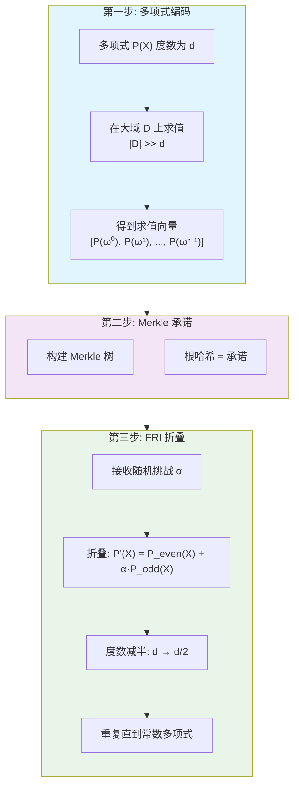

### 5.3 FRI 的数学原理

#### 5.3.1 Reed-Solomon 编码视角

低度多项式的求值构成 Reed-Solomon 码字：

```
┌─────────────────────────────────────────────────────────────────────────────┐
│                    Reed-Solomon 编码与 FRI                                   │
├─────────────────────────────────────────────────────────────────────────────┤
│                                                                             │
│  核心洞察:                                                                  │
│  ──────────                                                                 │
│  度数为 d 的多项式 P(X)，在 n 个点上求值 (n >> d)                          │
│  得到的向量 [P(ω⁰), P(ω¹), ..., P(ωⁿ⁻¹)] 是 RS[n, d+1] 码字              │
│                                                                             │
│  性质:                                                                      │
│  • 任意两个不同的度 ≤ d 多项式，最多在 d 个点重合                         │
│  • 在 n 个点中，至少 n - d 个点不同                                        │
│  • 距离 = n - d (非常大的汉明距离)                                        │
│                                                                             │
│  FRI 证明:                                                                  │
│  "提交的向量确实是某个低度多项式的求值"                                   │
│  而不是随机向量伪装的                                                      │
│                                                                             │
│                  度数 d 多项式空间                                         │
│                  ┌─────────────┐                                           │
│                  │   ·   ·     │                                           │
│                  │  ·  P(X) ·  │  ← 有效码字 (稀疏)                        │
│                  │   ·   ·     │                                           │
│                  └─────────────┘                                           │
│                         ↑                                                   │
│              FRI 证明: 提交的向量在这个空间内                              │
│                         ↓                                                   │
│           ┌─────────────────────────┐                                      │
│           │ · · · · · · · · · · · · │                                      │
│           │ · · · · · · · · · · · · │  ← 所有可能向量 (密集)               │
│           │ · · · · · · · · · · · · │                                      │
│           └─────────────────────────┘                                      │
│                                                                             │
└─────────────────────────────────────────────────────────────────────────────┘
```

#### 5.3.2 折叠协议

FRI 的核心是对数轮的"折半"过程：

```
┌─────────────────────────────────────────────────────────────────────────────┐
│                         FRI 折叠过程                                         │
├─────────────────────────────────────────────────────────────────────────────┤
│                                                                             │
│  初始: P(X) 度数为 d                                                        │
│                                                                             │
│  第 1 轮:                                                                   │
│  ─────────                                                                  │
│  将 P(X) 分解为奇偶部分:                                                   │
│     P(X) = P_even(X²) + X · P_odd(X²)                                      │
│                                                                             │
│  接收随机挑战 α₁                                                           │
│                                                                             │
│  折叠:                                                                      │
│     P₁(Y) = P_even(Y) + α₁ · P_odd(Y)                                      │
│     其中 Y = X²                                                            │
│                                                                             │
│  结果: P₁ 的度数 ≤ d/2                                                     │
│                                                                             │
│  第 2 轮:                                                                   │
│  ─────────                                                                  │
│  对 P₁ 重复上述过程...                                                     │
│     P₂(Z) = P₁_even(Z) + α₂ · P₁_odd(Z)                                    │
│                                                                             │
│  结果: P₂ 的度数 ≤ d/4                                                     │
│                                                                             │
│  ...                                                                        │
│                                                                             │
│  最终: 常数多项式 P_final = c (直接公开)                                   │
│                                                                             │
│  轮数: log₂(d)                                                             │
│                                                                             │
└─────────────────────────────────────────────────────────────────────────────┘
```

#### 5.3.3 承诺与查询

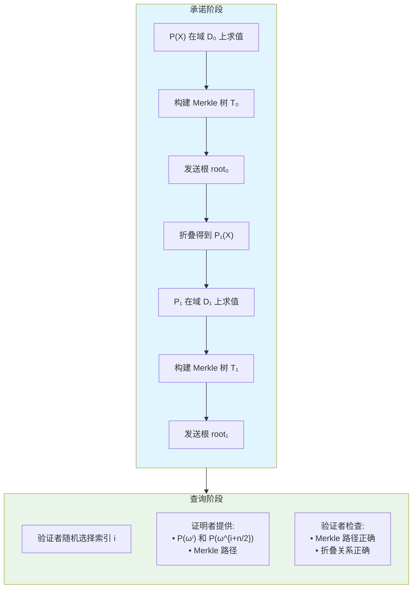

### 5.4 FRI 证明结构

```
┌─────────────────────────────────────────────────────────────────────────────┐
│                           FRI 证明组成                                       │
├─────────────────────────────────────────────────────────────────────────────┤
│                                                                             │
│  证明 π 包含:                                                               │
│                                                                             │
│  1. 每轮的 Merkle 根:                                                       │
│     [root₀, root₁, root₂, ..., root_k]                                     │
│     共 log(d) 个哈希值                                                     │
│                                                                             │
│  2. 查询响应 (对每个随机查询点):                                            │
│     • 求值: [P(ωⁱ), P(ω^{i+n/2})]                                          │
│     • Merkle 认证路径                                                      │
│     • 每轮的折叠值和路径                                                   │
│                                                                             │
│  3. 最终常数多项式值                                                        │
│                                                                             │
│  证明大小:                                                                  │
│  ──────────                                                                 │
│  • Merkle 根: O(log d) 个哈希                                              │
│  • 每个查询: O(log d) 个值 × O(log n) 路径长度                             │
│  • 查询数量: λ 个 (安全参数，通常 ~30-50)                                  │
│                                                                             │
│  总大小: O(λ · log²(n)) ≈ 几十到几百 KB                                    │
│                                                                             │
└─────────────────────────────────────────────────────────────────────────────┘
```

### 5.5 FRI 的优势与劣势

```
┌─────────────────────────────────────────────────────────────────────────────┐
│                           FRI 的核心特点                                     │
├─────────────────────────────────────────────────────────────────────────────┤
│                                                                             │
│  ✅ 优势:                                                                   │
│                                                                             │
│  1. 后量子安全                                                              │
│     • 仅依赖哈希函数的抗碰撞性                                             │
│     • 量子计算机无法有效攻击                                               │
│     • 未来 proof 的最佳选择                                                │
│                                                                             │
│  2. 透明设置                                                                │
│     • 无需可信设置                                                         │
│     • 公开可验证的公共参数                                                 │
│     • 与 IPA 类似的信任模型                                                │
│                                                                             │
│  3. 高效的证明生成                                                          │
│     • O(n log n) FFT 复杂度                                                │
│     • 可高度并行化                                                         │
│     • 适合硬件加速                                                         │
│                                                                             │
│  4. 灵活的域选择                                                            │
│     • 可使用任意有限域                                                     │
│     • 特别适合小域 (如 Goldilocks, BabyBear)                               │
│     • 算术运算更高效                                                       │
│                                                                             │
│  ❌ 劣势:                                                                   │
│                                                                             │
│  1. 证明较大                                                                │
│     • O(log² n) 大小                                                       │
│     • 典型: 50-200 KB (vs KZG 的 48 bytes)                                 │
│     • 链上验证 gas 成本高                                                  │
│                                                                             │
│  2. 验证较慢                                                                │
│     • O(log² n) 哈希运算                                                   │
│     • 比 KZG 的配对验证慢                                                  │
│     • 但仍比完整重新计算快得多                                             │
│                                                                             │
│  3. 需要大的膨胀率                                                          │
│     • 求值域需要比多项式度数大很多                                         │
│     • 典型膨胀率 4-16x                                                     │
│     • 增加证明者内存需求                                                   │
│                                                                             │
└─────────────────────────────────────────────────────────────────────────────┘
```

### 5.6 FRI 在零知识证明中的应用

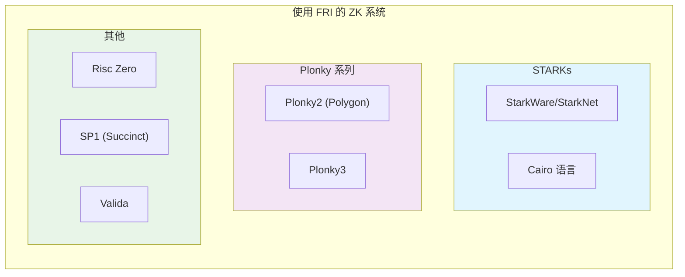

---

## 核心技术对比

### 6.1 复杂度对比

| 指标 | KZG | IPA | FRI |
|------|-----|-----|-----|
| **承诺大小** | $O(1)$ = 48 bytes | $O(1)$ = 32 bytes | $O(1)$ = 32 bytes |
| **单点证明大小** | $O(1)$ = 48 bytes | $O(\log n)$ ≈ 576 bytes | $O(\log^2 n)$ ≈ 50-200 KB |
| **证明生成时间** | $O(n)$ 群运算 | $O(n)$ 群运算 | $O(n \log n)$ 哈希 |
| **验证时间** | $O(1)$ = 2 次配对 | $O(n)$ 群运算 * | $O(\log^2 n)$ 哈希 |
| **批量验证** | 高效聚合 | 效率一般 | 支持批处理 |
| **可信设置** | 需要 | 不需要 | 不需要 |
| **后量子安全** | ❌ | ❌ | ✅ |

> * IPA 验证可以通过预计算优化到接近 $O(\log n)$

### 6.2 安全假设对比

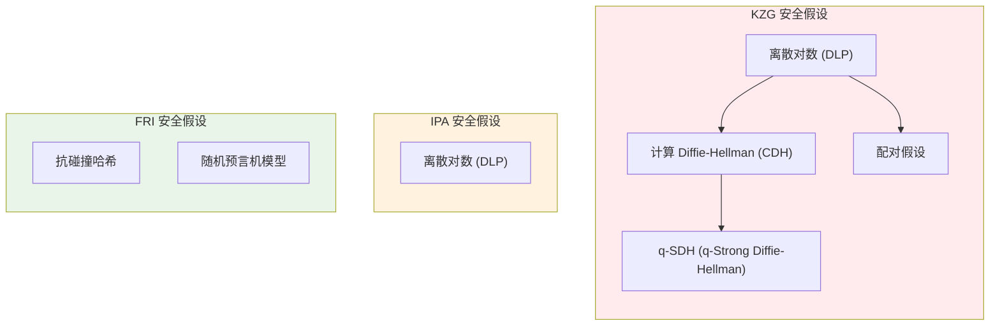

```
┌─────────────────────────────────────────────────────────────────────────────┐
│                         安全假设强度比较                                     │
├─────────────────────────────────────────────────────────────────────────────┤
│                                                                             │
│   最强假设 (最容易被攻破)                                                   │
│       ▲                                                                     │
│       │   KZG: 配对 + q-SDH + DLP                                          │
│       │        └─ 需要特殊曲线，假设较多                                   │
│       │                                                                     │
│       │   IPA: 离散对数 (DLP)                                              │
│       │        └─ 标准假设，研究充分                                       │
│       │                                                                     │
│       │   FRI: 抗碰撞哈希                                                  │
│       │        └─ 最弱假设，后量子安全                                     │
│       ▼                                                                     │
│   最弱假设 (最难被攻破)                                                     │
│                                                                             │
│   量子计算机影响:                                                           │
│   • KZG/IPA: Shor 算法可破解 DLP → 不安全                                  │
│   • FRI: Grover 算法仅平方加速哈希 → 加倍哈希长度即可                     │
│                                                                             │
└─────────────────────────────────────────────────────────────────────────────┘
```

### 6.3 曲线/域支持

| 曲线/域类型 | KZG | IPA | FRI |
|-------------|-----|-----|-----|
| BLS12-381 | ✓ | ✓ | - |
| Bn254 | ✓ | ✓ | - |
| Curve25519 | ✗ | ✓ | - |
| secp256k1 | ✗ | ✓ | - |
| Pallas/Vesta | ✗ | ✓ | - |
| Ristretto255 | ✗ | ✓ | - |
| Goldilocks (64-bit) | - | - | ✓ |
| BabyBear (31-bit) | - | - | ✓ |
| Mersenne31 | - | - | ✓ |
| 任意素数域 | ✗ | ✗ | ✓ |

> 注：FRI 不使用椭圆曲线，而是在有限域上操作

### 6.4 特性对比图

```
┌─────────────────────────────────────────────────────────────────────────────┐
│                   KZG vs IPA vs FRI 特性对比                                 │
├─────────────────────────────────────────────────────────────────────────────┤
│                                                                             │
│                            证明大小                                         │
│                               ↑                                             │
│                    KZG ████████████████ (48 bytes)                         │
│                    IPA ████████ (~500 bytes)                               │
│                    FRI ██ (~100 KB)                                        │
│                               │                                             │
│   后量子安全 ←────────────────┼────────────────→ 验证速度                   │
│                               │                                             │
│   KZG: ✗                     │              KZG: ████████████████ (最快)   │
│   IPA: ✗                     │              IPA: ████████ (中等)           │
│   FRI: ✓ ████████████        │              FRI: ████ (较慢)               │
│                               │                                             │
│                               ↓                                             │
│                           透明性                                            │
│                                                                             │
│                    KZG ██ (需要可信设置)                                   │
│                    IPA ████████████████ (完全透明)                         │
│                    FRI ████████████████ (完全透明)                         │
│                                                                             │
└─────────────────────────────────────────────────────────────────────────────┘
```

### 6.5 后量子安全性

| 方案 | 后量子安全 | 原因 | 迁移难度 |
|------|------------|------|----------|
| **KZG** | ❌ 不安全 | Shor 算法破解离散对数和配对 | 需要完全重构 |
| **IPA** | ❌ 不安全 | Shor 算法破解离散对数 | 需更换曲线为格基 |
| **FRI** | ✅ 安全 | 仅依赖哈希函数，Grover 仅平方加速 | 已就绪 |

```
┌─────────────────────────────────────────────────────────────────────────────┐
│                        后量子时代的选择                                      │
├─────────────────────────────────────────────────────────────────────────────┤
│                                                                             │
│   今天 (2024-2025):                                                         │
│   ─────────────────                                                         │
│   • 实用量子计算机尚未出现                                                 │
│   • KZG 仍是链上验证的最佳选择 (O(1) 证明/验证)                            │
│   • FRI 适合证明大小不敏感的场景                                           │
│                                                                             │
│   过渡期 (2025-2030+):                                                      │
│   ────────────────────                                                      │
│   • 混合方案: FRI 内层 + KZG 外层压缩                                      │
│   • 准备迁移路径                                                           │
│                                                                             │
│   后量子时代:                                                               │
│   ────────────────                                                          │
│   • FRI 成为默认选择                                                       │
│   • 或基于格/哈希的新承诺方案                                              │
│                                                                             │
│   当前最佳实践:                                                             │
│   ────────────────                                                          │
│   Plonky2/Plonky3 方案: FRI 生成 STARK → KZG 包装成 SNARK                 │
│   兼顾后量子准备性和链上效率                                               │
│                                                                             │
└─────────────────────────────────────────────────────────────────────────────┘
```

---

## 在主流 ZK 系统中的应用

### 7.1 使用 KZG 的系统

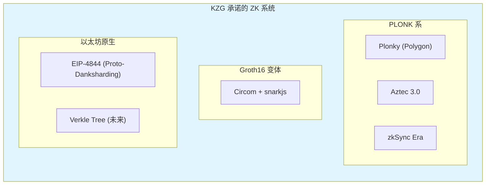

#### 以太坊 EIP-4844 中的 KZG

```
┌─────────────────────────────────────────────────────────────────────────────┐
│                      EIP-4844: Blob 数据的 KZG 承诺                          │
├─────────────────────────────────────────────────────────────────────────────┤
│                                                                             │
│  目的: 为 Rollup 提供廉价的数据可用性                                       │
│                                                                             │
│  工作流程:                                                                  │
│  1. Rollup 将交易数据编码为多项式 P(X)                                     │
│  2. 计算 KZG 承诺 C = Commit(P)                                            │
│  3. Blob 数据在节点间传播，承诺 C 上链                                     │
│  4. 验证者可通过 KZG 证明验证数据完整性                                    │
│                                                                             │
│  为什么选择 KZG:                                                            │
│  • O(1) 证明大小: 链上只存储 48 bytes 承诺                                 │
│  • 高效验证: 配对运算 EIP-2537 预编译                                      │
│  • 数据可用性采样 (DAS) 兼容                                               │
│                                                                             │
└─────────────────────────────────────────────────────────────────────────────┘
```

### 7.2 使用 IPA 的系统

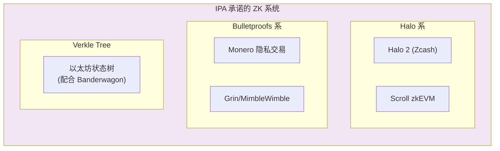

#### Halo 2 中的 IPA

```
┌─────────────────────────────────────────────────────────────────────────────┐
│                         Halo 2: 递归 IPA 证明                                │
├─────────────────────────────────────────────────────────────────────────────┤
│                                                                             │
│  核心创新: 通过"累加器"实现无配对的递归证明                                │
│                                                                             │
│  工作原理:                                                                  │
│  1. 不完全验证当前证明                                                     │
│  2. 将验证的"残留工作"累加到累加器中                                      │
│  3. 下一个证明继续推迟这个工作                                             │
│  4. 最终证明一次性完成所有累加的验证                                       │
│                                                                             │
│          ┌───────┐   ┌───────┐   ┌───────┐                                │
│          │ 证明1 │──►│ 证明2 │──►│ 证明3 │──► ...                          │
│          └───┬───┘   └───┬───┘   └───┬───┘                                │
│              │           │           │                                     │
│              ▼           ▼           ▼                                     │
│          累加器1 ────► 累加器2 ────► 累加器3 ──► 最终验证                  │
│                                                                             │
│  优势:                                                                      │
│  • 无需可信设置                                                            │
│  • 支持无限递归                                                            │
│  • 适合增量验证场景                                                        │
│                                                                             │
└─────────────────────────────────────────────────────────────────────────────┘
```

### 7.3 使用 FRI 的系统

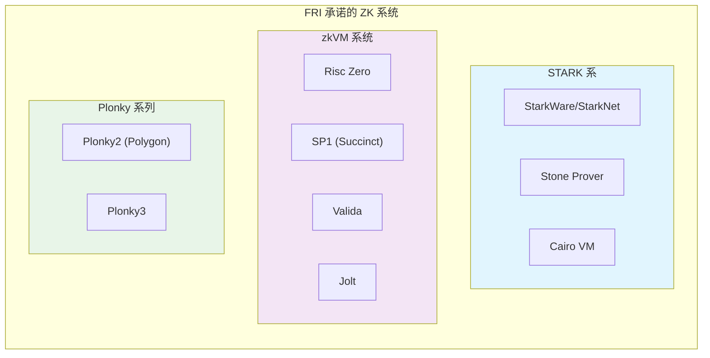

#### StarkNet 中的 FRI

```
┌─────────────────────────────────────────────────────────────────────────────┐
│                      StarkNet: 纯 FRI 的 STARK 系统                          │
├─────────────────────────────────────────────────────────────────────────────┤
│                                                                             │
│  特点:                                                                      │
│  ──────                                                                     │
│  • 完全透明设置，无需可信仪式                                              │
│  • 后量子安全                                                              │
│  • 证明较大 (~100-200 KB)，但链下验证快                                    │
│                                                                             │
│  解决方案: 递归证明 + SHARP                                                │
│  ─────────────────────────────                                              │
│  • 多个交易的证明递归聚合                                                  │
│  • 最终只在 L1 验证一个聚合证明                                            │
│  • 摊销后每笔交易成本大幅降低                                              │
│                                                                             │
│      Tx₁ ─┐                                                                │
│      Tx₂ ─┼─→ [STARK 聚合] ─→ [单个证明] ─→ L1 验证                       │
│      Tx₃ ─┤                                                                │
│      ...  ─┘                                                                │
│                                                                             │
└─────────────────────────────────────────────────────────────────────────────┘
```

### 7.4 混合方案：取长补短

一些系统组合使用多种承诺方案：

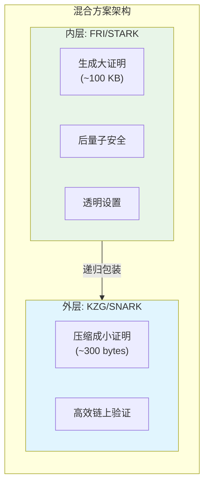

```
┌─────────────────────────────────────────────────────────────────────────────┐
│                         混合方案示例                                         │
├─────────────────────────────────────────────────────────────────────────────┤
│                                                                             │
│  Plonky2 / Polygon zkEVM:                                                   │
│  ────────────────────────                                                   │
│  • 内层: FRI (Goldilocks 域，快速证明生成)                                 │
│  • 外层: 可选 KZG 包装 (链上验证)                                          │
│  • 优势: 兼顾证明速度和验证效率                                            │
│                                                                             │
│  Risc Zero:                                                                 │
│  ──────────                                                                 │
│  • 内层: FRI-based STARK                                                   │
│  • 外层: Groth16 包装                                                      │
│  • 优势: zkVM + 链上高效验证                                               │
│                                                                             │
│  SP1 (Succinct):                                                            │
│  ──────────────                                                             │
│  • 内层: Plonky3 (FRI)                                                     │
│  • 外层: Groth16 或 KZG                                                    │
│  • 优势: 通用 zkVM + 灵活的输出格式                                        │
│                                                                             │
│  HyperPlonk:                                                                │
│  ──────────                                                                 │
│  • 多变量多项式: Sum-check 协议                                            │
│  • 单变量部分: KZG 承诺                                                    │
│  • 优势: 更适合高度结构化的电路                                            │
│                                                                             │
└─────────────────────────────────────────────────────────────────────────────┘
```

---

## 实际工程权衡

### 8.1 选择 KZG 的场景

```
┌─────────────────────────────────────────────────────────────────────────────┐
│                        何时选择 KZG                                          │
├─────────────────────────────────────────────────────────────────────────────┤
│                                                                             │
│  ✓ 适合场景:                                                               │
│                                                                             │
│  1. 链上验证成本敏感                                                       │
│     • Rollup 在 L1 提交证明                                                │
│     • 验证 gas 成本需最小化                                                │
│     → KZG 的 O(1) 验证无可替代                                             │
│                                                                             │
│  2. 证明大小敏感                                                            │
│     • 数据可用性层 (DA)                                                    │
│     • 带宽受限环境                                                         │
│     → KZG 的 48 bytes 证明极具优势                                         │
│                                                                             │
│  3. 已有可信设置基础设施                                                   │
│     • 以太坊生态 (KZG Ceremony 已完成)                                     │
│     • 可复用 Powers of Tau                                                 │
│                                                                             │
│  4. 批量验证场景                                                            │
│     • 同时验证多个证明                                                     │
│     • KZG 支持高效聚合验证                                                 │
│                                                                             │
└─────────────────────────────────────────────────────────────────────────────┘
```

### 8.2 选择 IPA 的场景

```
┌─────────────────────────────────────────────────────────────────────────────┐
│                        何时选择 IPA                                          │
├─────────────────────────────────────────────────────────────────────────────┤
│                                                                             │
│  ✓ 适合场景:                                                               │
│                                                                             │
│  1. 无法/不愿进行可信设置                                                  │
│     • 去中心化项目                                                         │
│     • 无法组织 MPC 仪式                                                    │
│     • 用户对可信设置有顾虑                                                 │
│     → IPA 的透明性是决定性优势                                             │
│                                                                             │
│  2. 递归证明场景                                                            │
│     • 需要证明的证明                                                       │
│     • 增量可验证计算 (IVC)                                                 │
│     → IPA + Halo 风格累加器更灵活                                          │
│                                                                             │
│  3. 特定曲线需求                                                            │
│     • 需要 Curve25519 (兼容性)                                             │
│     • 需要 cycle 曲线 (Pallas/Vesta)                                       │
│     → IPA 支持任意素阶群                                                   │
│                                                                             │
│  4. 链下验证为主                                                            │
│     • 客户端本地验证                                                       │
│     • 服务器端批量处理                                                     │
│     → 验证时间不是关键瓶颈                                                 │
│                                                                             │
└─────────────────────────────────────────────────────────────────────────────┘
```

### 8.3 选择 FRI 的场景

```
┌─────────────────────────────────────────────────────────────────────────────┐
│                        何时选择 FRI                                          │
├─────────────────────────────────────────────────────────────────────────────┤
│                                                                             │
│  ✓ 适合场景:                                                               │
│                                                                             │
│  1. 后量子安全是硬性要求                                                   │
│     • 政府/金融等高安全需求                                                │
│     • 长期存储的证明（10+ 年）                                             │
│     → FRI 是唯一后量子安全的成熟方案                                       │
│                                                                             │
│  2. 无法接受任何可信设置                                                   │
│     • 与 IPA 类似，但需要更成熟的生态                                      │
│     • 完全去中心化的系统                                                   │
│     → FRI 的透明性无可置疑                                                 │
│                                                                             │
│  3. zkVM / 通用计算证明                                                    │
│     • Risc-V, WASM 等虚拟机证明                                            │
│     • 需要证明任意程序执行                                                 │
│     → FRI 在小域上的高效性非常适合                                         │
│                                                                             │
│  4. 证明大小不敏感                                                          │
│     • 链下验证场景                                                         │
│     • 可以使用递归聚合                                                     │
│     • 带宽充足的环境                                                       │
│                                                                             │
│  5. 需要快速证明生成                                                        │
│     • FRI 的 FFT 结构可高度并行化                                          │
│     • GPU/多核加速效果显著                                                 │
│     • 适合需要低延迟的场景                                                 │
│                                                                             │
└─────────────────────────────────────────────────────────────────────────────┘
```

### 8.4 性能基准对比

| 操作 | KZG (BLS12-381) | IPA (Banderwagon) | FRI (Goldilocks) |
|------|-----------------|-------------------|------------------|
| **承诺 (n=2^16)** | ~100 ms | ~80 ms | ~50 ms |
| **生成证明 (单点)** | ~50 ms | ~200 ms | ~500 ms |
| **验证 (单点)** | ~2 ms | ~100 ms | ~50 ms |
| **证明大小 (单点)** | 48 bytes | ~1 KB | ~50-100 KB |
| **批量验证 (100 个)** | ~10 ms | ~5 秒 | ~2 秒 |

> 注：以上为估计值，实际性能取决于具体实现和硬件。FRI 在小域（如 Goldilocks）上证明生成更快。

```
┌─────────────────────────────────────────────────────────────────────────────┐
│                      三种方案的性能特征                                      │
├─────────────────────────────────────────────────────────────────────────────┤
│                                                                             │
│   证明大小 vs 验证速度 权衡图:                                              │
│                                                                             │
│   验证速度 ↑                                                                │
│   (快)    │                                                                 │
│           │   ★ KZG                                                        │
│           │   (48 bytes, 2ms)                                              │
│           │                                                                 │
│           │              ★ FRI                                             │
│           │              (100 KB, 50ms)                                    │
│           │                                                                 │
│           │                        ★ IPA                                   │
│           │                        (1 KB, 100ms)                           │
│   (慢)    └──────────────────────────────────────────→ 证明大小 (大)       │
│                                                                             │
│   注: IPA 验证慢是因为需要 O(n) 群运算重建生成元                           │
│       FRI 证明大但验证相对快（只需哈希运算）                               │
│                                                                             │
└─────────────────────────────────────────────────────────────────────────────┘
```

### 8.5 以太坊生态的选择

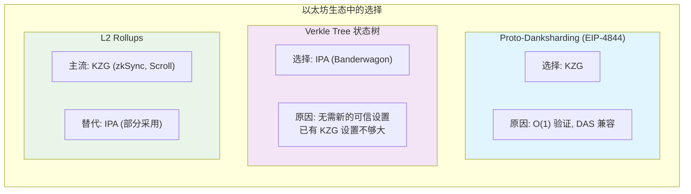

---

## 未来发展方向

### 9.1 KZG 的发展

```
┌─────────────────────────────────────────────────────────────────────────────┐
│                        KZG 未来方向                                          │
├─────────────────────────────────────────────────────────────────────────────┤
│                                                                             │
│  1. 通用可信设置                                                            │
│     • "万能 SRS": 一次设置，多系统复用                                     │
│     • 减少仪式成本                                                         │
│                                                                             │
│  2. 更高效的批处理                                                          │
│     • 多点打开优化                                                         │
│     • 聚合证明压缩                                                         │
│                                                                             │
│  3. 硬件加速                                                                │
│     • GPU/FPGA 加速配对运算                                                │
│     • ASIC 专用硬件                                                        │
│                                                                             │
│  4. 后量子迁移路径                                                          │
│     • 研究基于格的替代方案                                                 │
│     • 保持接口兼容                                                         │
│                                                                             │
└─────────────────────────────────────────────────────────────────────────────┘
```

### 9.2 IPA 的发展

```
┌─────────────────────────────────────────────────────────────────────────────┐
│                        IPA 未来方向                                          │
├─────────────────────────────────────────────────────────────────────────────┤
│                                                                             │
│  1. 验证加速                                                                │
│     • 预计算优化                                                           │
│     • 并行化验证                                                           │
│     • 批量验证技术                                                         │
│                                                                             │
│  2. 证明压缩                                                                │
│     • 更紧凑的证明格式                                                     │
│     • 聚合多个 IPA 证明                                                    │
│                                                                             │
│  3. 递归优化                                                                │
│     • 更高效的累加器                                                       │
│     • 减少递归开销                                                         │
│                                                                             │
│  4. 与 FRI 结合                                                             │
│     • 混合方案取长补短                                                     │
│     • 内层用 FRI，外层用 IPA                                               │
│                                                                             │
└─────────────────────────────────────────────────────────────────────────────┘
```

### 9.3 FRI 的发展

```
┌─────────────────────────────────────────────────────────────────────────────┐
│                        FRI 未来方向                                          │
├─────────────────────────────────────────────────────────────────────────────┤
│                                                                             │
│  1. 证明压缩                                                                │
│     • 递归聚合减少最终证明大小                                             │
│     • Circle STARKs (更紧凑的构造)                                         │
│     • 与 SNARK 混合压缩                                                    │
│                                                                             │
│  2. 域优化                                                                  │
│     • Goldilocks → 更小的域                                                │
│     • Binary fields (Binius)                                               │
│     • 针对特定硬件优化的域选择                                             │
│                                                                             │
│  3. 硬件加速                                                                │
│     • GPU 加速 FFT 和 Merkle 树                                            │
│     • FPGA 定制化实现                                                      │
│     • 专用 ASIC (长期)                                                     │
│                                                                             │
│  4. 交互到非交互优化                                                        │
│     • 更高效的 Fiat-Shamir 变换                                            │
│     • 减少查询数量                                                         │
│     • 聚合查询响应                                                         │
│                                                                             │
└─────────────────────────────────────────────────────────────────────────────┘
```

### 9.4 新兴替代方案

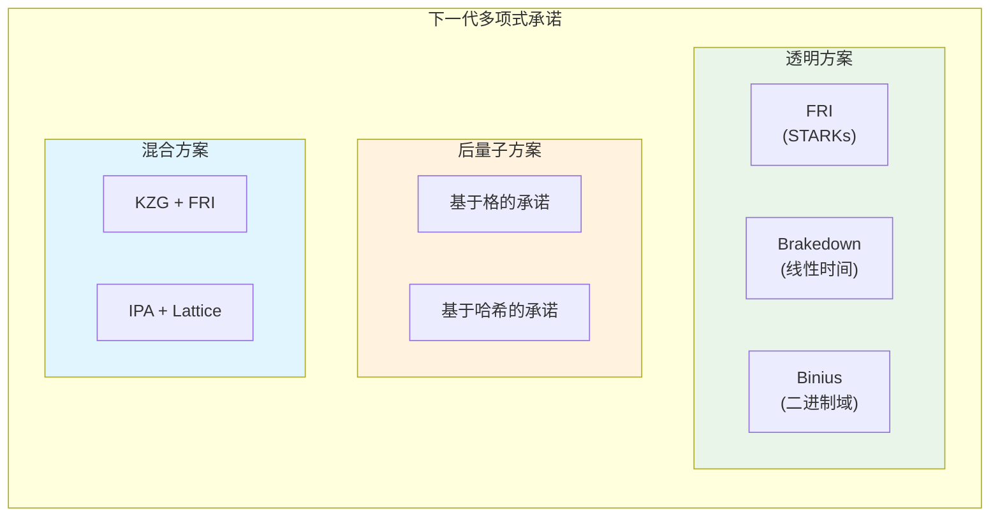

---

## 总结

### 10.1 核心对比总结

```
┌─────────────────────────────────────────────────────────────────────────────┐
│                   KZG vs IPA vs FRI 完整对比                                 │
├─────────────────────────────────────────────────────────────────────────────┤
│                                                                             │
│  ┌─────────────────────────────────────────────────────────────────────┐   │
│  │                           KZG                                       │   │
│  ├─────────────────────────────────────────────────────────────────────┤   │
│  │  优势:                                                              │   │
│  │  • O(1) 证明大小 (48 bytes) — 最小                                 │   │
│  │  • O(1) 验证时间 (2 次配对) — 最快                                 │   │
│  │  • 高效批量验证                                                    │   │
│  │  • 成熟的生态支持 (以太坊原生)                                     │   │
│  │                                                                     │   │
│  │  劣势:                                                              │   │
│  │  • 需要可信设置 (toxic waste)                                      │   │
│  │  • 仅支持配对友好曲线                                              │   │
│  │  • 更复杂的安全假设                                                │   │
│  │  • ❌ 不支持后量子安全                                             │   │
│  └─────────────────────────────────────────────────────────────────────┘   │
│                                                                             │
│  ┌─────────────────────────────────────────────────────────────────────┐   │
│  │                           IPA                                       │   │
│  ├─────────────────────────────────────────────────────────────────────┤   │
│  │  优势:                                                              │   │
│  │  • 无需可信设置 (完全透明)                                         │   │
│  │  • 支持任意素阶曲线 (灵活)                                         │   │
│  │  • 仅需离散对数假设 (更简单)                                       │   │
│  │  • 支持高效递归证明 (Halo 风格)                                    │   │
│  │                                                                     │   │
│  │  劣势:                                                              │   │
│  │  • O(log n) 证明大小 (~1 KB)                                       │   │
│  │  • O(n) 验证时间 (较慢)                                            │   │
│  │  • 批量验证效率较低                                                │   │
│  │  • ❌ 不支持后量子安全                                             │   │
│  └─────────────────────────────────────────────────────────────────────┘   │
│                                                                             │
│  ┌─────────────────────────────────────────────────────────────────────┐   │
│  │                           FRI                                       │   │
│  ├─────────────────────────────────────────────────────────────────────┤   │
│  │  优势:                                                              │   │
│  │  • ✅ 后量子安全 (仅依赖哈希)                                      │   │
│  │  • 无需可信设置 (完全透明)                                         │   │
│  │  • 支持任意有限域 (包括小域)                                       │   │
│  │  • 证明生成可高度并行化                                            │   │
│  │  • 最弱安全假设 (抗碰撞哈希)                                       │   │
│  │                                                                     │   │
│  │  劣势:                                                              │   │
│  │  • O(log² n) 证明大小 (~100 KB) — 最大                             │   │
│  │  • 需要大膨胀率 (4-16x)                                            │   │
│  │  • 链上验证 gas 成本较高                                           │   │
│  │  • 需要递归聚合才能实用                                            │   │
│  └─────────────────────────────────────────────────────────────────────┘   │
│                                                                             │
└─────────────────────────────────────────────────────────────────────────────┘
```

### 10.2 选择指南

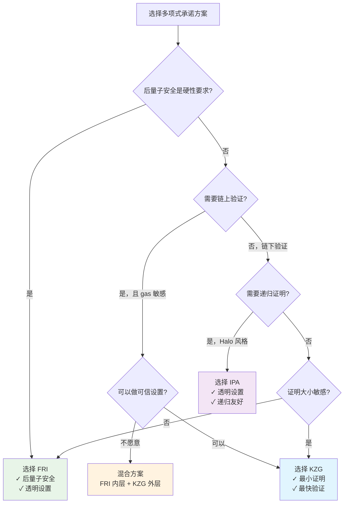

```
┌─────────────────────────────────────────────────────────────────────────────┐
│                         快速决策表                                           │
├─────────────────────────────────────────────────────────────────────────────┤
│                                                                             │
│  你的需求                              推荐方案                             │
│  ─────────────────────────────────────────────────────────                  │
│  链上验证 + 最低 gas               →  KZG                                  │
│  透明设置 + 递归证明               →  IPA                                  │
│  后量子安全                        →  FRI                                  │
│  链上高效 + 未来安全               →  FRI + KZG 混合                       │
│  zkVM / 通用计算                   →  FRI (小域优化)                       │
│  以太坊生态集成                    →  KZG (原生支持)                       │
│  Zcash/Halo 生态                   →  IPA                                  │
│  StarkNet 生态                     →  FRI                                  │
│                                                                             │
└─────────────────────────────────────────────────────────────────────────────┘
```

### 10.3 结语

KZG、IPA 和 FRI 代表了零知识证明系统中三种不同的设计哲学：

- **KZG**：通过接受可信设置的代价，换取极致的证明紧凑性和验证效率。适合资源受限的链上环境。

- **IPA**：通过接受较大的证明和验证开销，换取完全透明的设置和更广泛的曲线支持。适合注重去中心化和递归证明的场景。

- **FRI**：通过接受更大的证明大小，换取后量子安全性和完全透明性。适合对安全性要求最高或需要通用计算证明的场景。

```
┌─────────────────────────────────────────────────────────────────────────────┐
│                       三种方案的定位                                         │
├─────────────────────────────────────────────────────────────────────────────┤
│                                                                             │
│                        安全性/透明性                                        │
│                             ↑                                               │
│                             │       FRI                                     │
│                             │       ★                                       │
│                             │   (后量子安全)                                │
│                             │                                               │
│                             │   IPA                                         │
│                             │   ★                                           │
│                             │  (透明设置)                                   │
│                             │                                               │
│                             │                                               │
│                             │          KZG                                  │
│                             │          ★                                    │
│                             │      (可信设置)                               │
│                             │                                               │
│                             └──────────────────────────→ 效率              │
│                                  (证明小/验证快)                            │
│                                                                             │
└─────────────────────────────────────────────────────────────────────────────┘
```

随着 ZK 技术的发展，三者的边界正在模糊，混合方案成为趋势：

- **KZG** 正在探索通用设置和更高效的聚合
- **IPA** 正在优化验证效率和证明压缩
- **FRI** 正在通过递归和小域优化缩小证明大小
- **混合方案**（如 Plonky2）结合各方优势，成为新的主流

理解这三种方案的原理和权衡，是深入掌握现代零知识证明系统的关键一步。

---

## 参考文献

1. **KZG 原始论文**
   - Kate, A., Zaverucha, G. M., & Goldberg, I. (2010). Constant-Size Commitments to Polynomials and Their Applications.

2. **Bulletproofs (IPA 基础)**
   - Bünz, B., Bootle, J., Boneh, D., Poelstra, A., Wuille, P., & Maxwell, G. (2018). Bulletproofs: Short Proofs for Confidential Transactions and More.

3. **Halo (IPA 递归)**
   - Bowe, S., Grigg, J., & Hopwood, D. (2019). Recursive Proof Composition without a Trusted Setup.

4. **PLONK (KZG 应用)**
   - Gabizon, A., Williamson, Z. J., & Ciobotaru, O. (2019). PLONK: Permutations over Lagrange-bases for Oecumenical Noninteractive arguments of Knowledge.

5. **以太坊 KZG**
   - EIP-4844: Shard Blob Transactions
   - Ethereum KZG Ceremony Documentation

6. **Verkle Trees (IPA 应用)**
   - Kuszmaul, J. (2019). Verkle Trees.
   - Ethereum Verkle Tree EIP

---

## 附录：数学符号表

| 符号 | 含义 |
|------|------|
| $\mathbb{G}_1, \mathbb{G}_2$ | 配对曲线上的两个源群 |
| $\mathbb{G}_T$ | 配对的目标群 |
| $e(\cdot, \cdot)$ | 双线性配对映射 |
| $\tau$ | KZG 可信设置中的秘密值 |
| $P(X)$ | 多项式 |
| $C$ | 承诺值 |
| $\pi$ | 证明 |
| $\langle \mathbf{a}, \mathbf{b} \rangle$ | 向量内积 |
| $\mathbf{G}$ | 生成元向量 |
| $n$ | 多项式阶数 / 向量长度 |

