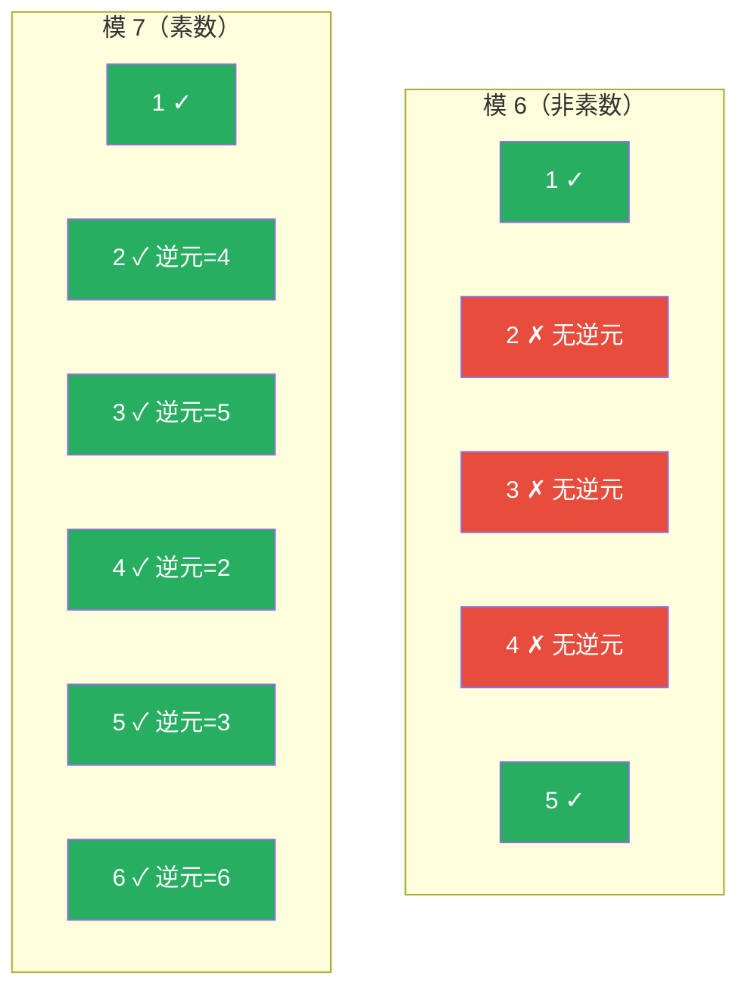
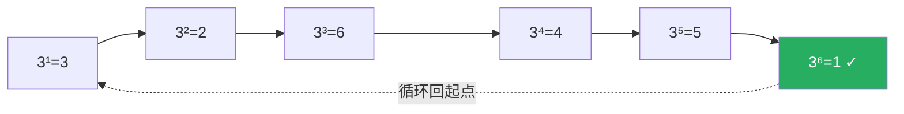
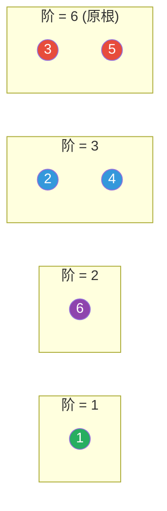
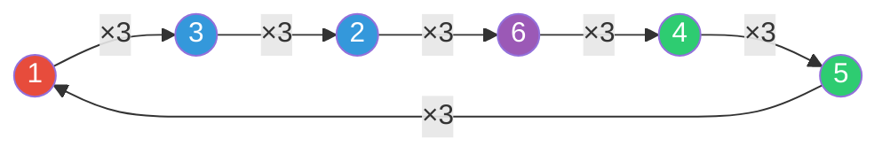
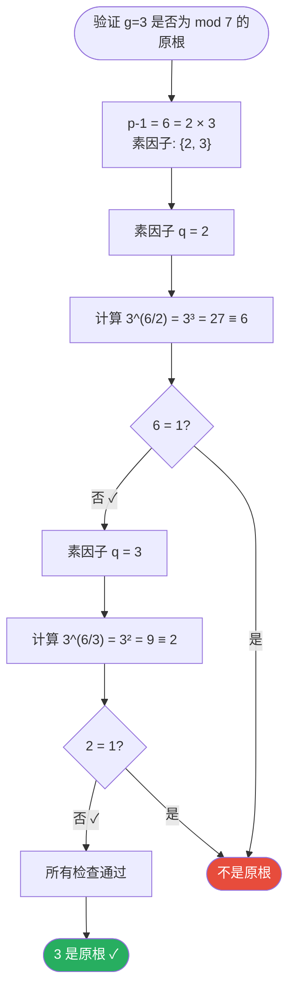
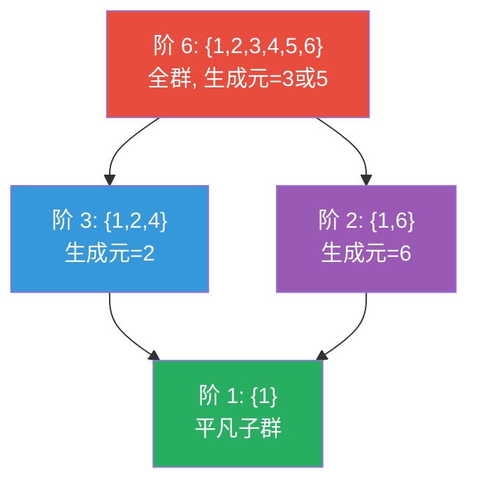
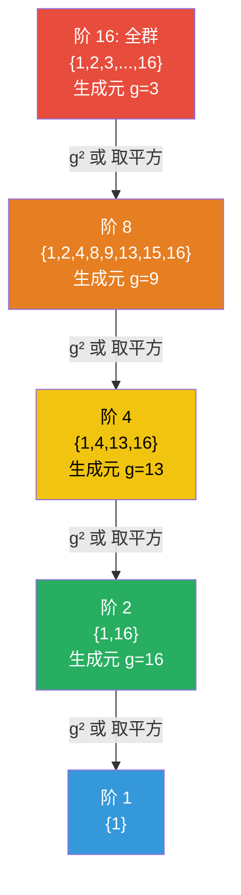
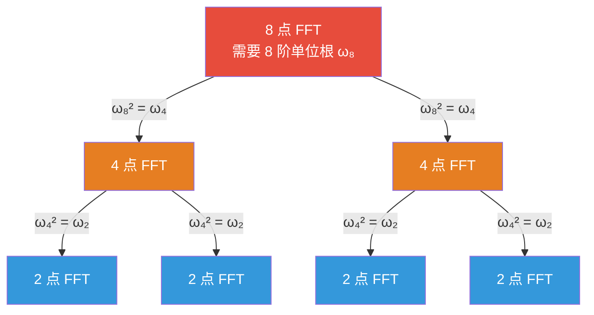
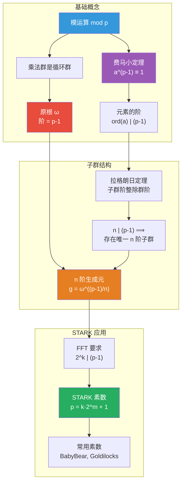
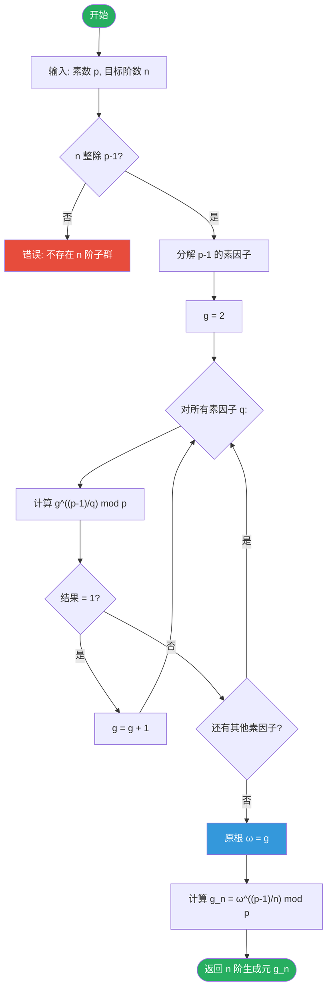

# 有限域中 n 阶单位根与生成元

> 从钟表到密码学：理解 STARK 中的数学基础

---

## 1. 引言：为什么需要单位根？

在 STARK 中，我们需要找到一个特殊的数 $g$（叫做 **n 阶生成元**），满足：
- $g^n = 1$（乘 n 次回到 1）
- $g, g^2, g^3, ..., g^{n-1}$ 全都不等于 1

这样 $\{1, g, g^2, ..., g^{n-1}\}$ 就是 n 个不同的数，用来编码计算轨迹。

**问题**：这样的 $g$ 一定存在吗？如何找到它？

要回答这个问题，我们需要理解几个基础概念。让我们从最直观的例子开始。

---

## 2. 模运算：钟表上的数学

### 2.1 什么是模运算？

**模运算**就是"除法取余数"。

$$a \mod n = a \div n \text{ 的余数}$$

例如：
- $17 \mod 5 = 2$（因为 $17 = 3 \times 5 + 2$）
- $20 \mod 7 = 6$（因为 $20 = 2 \times 7 + 6$）

### 2.2 钟表的直觉

想象一个 **7 小时制**的奇怪钟表（显示 0-6）：

```
          0
      6       1
    5     ⊙     2
      4       3
```

在这个钟表上，指针走到 6 之后，下一格回到 0：
- 现在是 5 点，过 4 小时 → $5 + 4 = 9 \equiv 2 \pmod 7$（指向 2）
- 现在是 3 点，过 10 小时 → $3 + 10 = 13 \equiv 6 \pmod 7$（指向 6）

这就是**模 7 运算**的直觉：数字在 $\{0, 1, 2, 3, 4, 5, 6\}$ 中循环。

### 2.3 模 7 的加法和乘法

在模 7 的世界里，可用的数字是 $\{0, 1, 2, 3, 4, 5, 6\}$：

```
加法:  5 + 4 = 9 ≡ 2 (mod 7)    因为 9 = 7 + 2
乘法:  3 × 4 = 12 ≡ 5 (mod 7)   因为 12 = 7 + 5
```

### 2.4 什么时候构成乘法群？

**群的四个条件**：
1. **封闭性**：$a \cdot b$ 还在集合中
2. **结合律**：$(a \cdot b) \cdot c = a \cdot (b \cdot c)$
3. **单位元**：存在 1 使得 $a \cdot 1 = a$
4. **逆元**：每个 $a$ 都存在 $a^{-1}$ 使得 $a \cdot a^{-1} = 1$

**关键问题**：模 n 下，什么元素有乘法逆元？

---

#### 2.4.1 反例：模 6 不构成乘法群

考虑 $\{1, 2, 3, 4, 5\}$ 在模 6 下：

```
问题 1：封闭性失败
  2 × 3 = 6 ≡ 0 (mod 6)    ← 结果跑出集合了！

问题 2：某些元素没有逆元
  2 × ? ≡ 1 (mod 6)        ← 找不到这样的数！
  
验证：2×1=2, 2×2=4, 2×3=0, 2×4=2, 2×5=4  都不是 1
```

#### 2.4.2 逆元存在的充要条件

**定理**：$a$ 在模 $n$ 下有乘法逆元 $\Leftrightarrow$ $\gcd(a, n) = 1$

**证明 ⟹**：假设 $\gcd(a, n) = d > 1$

如果存在逆元 $b$，则 $ab \equiv 1 \pmod{n}$，即 $ab = kn + 1$

但 $d \mid a$ 且 $d \mid n$，所以 $d \mid (ab - kn) = 1$

这意味着 $d \mid 1$，矛盾！所以 $d > 1$ 时逆元不存在。

**证明 ⟸**：假设 $\gcd(a, n) = 1$

由**贝祖定理**，存在整数 $x, y$ 使得 $ax + ny = 1$

所以 $ax = 1 - ny \equiv 1 \pmod{n}$

即 $x$ 就是 $a$ 的逆元。 $\square$

---

#### 2.4.3 模 n 的乘法群定义

**正确定义**：模 $n$ 的乘法群是：

$$\mathbb{Z}_n^* = \{a : 1 \leq a < n, \gcd(a, n) = 1\}$$

即**所有与 n 互素的元素**。

**例子对比**：

| 模数 n | 乘法群 $\mathbb{Z}_n^*$ | 群的阶 $\phi(n)$ |
|--------|------------------------|------------------|
| 6 | $\{1, 5\}$ | 2 |
| 7 | $\{1, 2, 3, 4, 5, 6\}$ | 6 |
| 8 | $\{1, 3, 5, 7\}$ | 4 |
| 9 | $\{1, 2, 4, 5, 7, 8\}$ | 6 |
| 10 | $\{1, 3, 7, 9\}$ | 4 |
| 12 | $\{1, 5, 7, 11\}$ | 4 |

#### 2.4.4 为什么素数 p 特殊？

**定理**：当 $p$ 是素数时，$\mathbb{Z}_p^* = \{1, 2, ..., p-1\}$

**证明**：对于任意 $1 \leq a < p$，由于 $p$ 是素数，$\gcd(a, p) = 1$（$a$ 不是 $p$ 的倍数）

所以所有非零元素都与 $p$ 互素，都有逆元。 $\square$



#### 2.4.5 验证模 7 的逆元

```
1 × 1 = 1  ✓    1 的逆元是 1
2 × 4 = 8 ≡ 1  ✓    2 的逆元是 4
3 × 5 = 15 ≡ 1  ✓    3 的逆元是 5
4 × 2 = 8 ≡ 1  ✓    4 的逆元是 2
5 × 3 = 15 ≡ 1  ✓    5 的逆元是 3
6 × 6 = 36 ≡ 1  ✓    6 的逆元是 6（自逆）
```

---

**结论**：在模**素数** $p$ 的世界里，$\{1, 2, ..., p-1\}$ 形成一个**乘法群**，因为所有元素都与 $p$ 互素，都有乘法逆元。

---

## 3. 费马小定理：乘法的周期性

### 3.1 一个神奇的发现

在模 7 的世界里，让我们计算 2 的幂次：

```
2¹ = 2
2² = 4
2³ = 8 ≡ 1 (mod 7)    ← 回到 1 了！
2⁴ = 2 × 2³ ≡ 2 × 1 = 2
2⁵ ≡ 4
2⁶ ≡ 1                 ← 又回到 1！
```

让我们再试试 3：

```
3¹ = 3
3² = 9 ≡ 2
3³ = 27 ≡ 6
3⁴ = 81 ≡ 4
3⁵ = 243 ≡ 5
3⁶ = 729 ≡ 1          ← 第 6 次回到 1！
```

### 3.2 费马小定理

**定理**：设 $p$ 是素数，$a \in \{1, 2, ..., p-1\}$，则：

$$a^{p-1} \equiv 1 \pmod{p}$$

> **注**：因为 $p$ 是素数，所以 $1 \leq a < p$ 时自动满足 $\gcd(a, p) = 1$。
> 
> 素数的定义保证了：小于 $p$ 的正整数都与 $p$ 互素。

**直观理解**：在模素数 $p$ 的乘法群中，任何元素的 $(p-1)$ 次幂都等于 1。

**用 3 的幂次展示循环（p=7）**：



**例子**：$p = 7$，所以 $a^6 \equiv 1$
- $2^6 = 64 = 9 \times 7 + 1 \equiv 1$ ✓
- $3^6 = 729 = 104 \times 7 + 1 \equiv 1$ ✓
- $5^6 = 15625 = 2232 \times 7 + 1 \equiv 1$ ✓

### 3.3 费马小定理的严格证明

**引理**：设 $p$ 是素数，$a \in \{1, 2, ..., p-1\}$，则集合

$$\{1 \cdot a, \ 2 \cdot a, \ 3 \cdot a, \ ..., \ (p-1) \cdot a\} \pmod p$$

是 $\{1, 2, ..., p-1\}$ 的一个**排列**（即相同的集合，只是顺序不同）。

**引理证明**：

需要证明两点：

**(1) 每个 $k \cdot a \mod p$ 都在 $\{1, 2, ..., p-1\}$ 中**

反证：假设 $k \cdot a \equiv 0 \pmod p$，即 $p \mid ka$

因为 $p$ 是素数且 $1 \leq k < p$，所以 $p \nmid k$

因为 $1 \leq a < p$，所以 $p \nmid a$

由素数的性质：$p \mid ka$ 且 $p \nmid k$ $\Rightarrow$ $p \mid a$，矛盾！

所以 $k \cdot a \not\equiv 0 \pmod p$。

**(2) 所有 $k \cdot a \mod p$ 互不相同**

反证：假设存在 $i \neq j$ 使得 $i \cdot a \equiv j \cdot a \pmod p$

则 $(i - j) \cdot a \equiv 0 \pmod p$，即 $p \mid (i-j)a$

因为 $p \nmid a$（$a$ 与 $p$ 互素），由素数性质得 $p \mid (i-j)$

但 $|i - j| < p-1 < p$，所以 $i - j = 0$，即 $i = j$，矛盾！

**结论**：$p-1$ 个不同的非零数，两两不同，所以恰好是 $\{1, 2, ..., p-1\}$。 $\square$

---

**费马小定理证明**：

由引理，$\{a, 2a, 3a, ..., (p-1)a\} \equiv \{1, 2, 3, ..., p-1\} \pmod p$

**关键步骤**：模 p 意义下集合相等 $\Rightarrow$ 元素乘积模 p 同余

> **详细解释**：
> 
> 引理告诉我们，存在一个排列 $\sigma$，使得：
> - $1 \cdot a \equiv \sigma(1) \pmod p$
> - $2 \cdot a \equiv \sigma(2) \pmod p$
> - $3 \cdot a \equiv \sigma(3) \pmod p$
> - ...
> - $(p-1) \cdot a \equiv \sigma(p-1) \pmod p$
> 
> 其中 $\{\sigma(1), \sigma(2), ..., \sigma(p-1)\} = \{1, 2, ..., p-1\}$
> 
> **模运算的乘法性质**：若 $a \equiv b \pmod p$ 且 $c \equiv d \pmod p$，则 $ac \equiv bd \pmod p$
> 
> **证明**：设 $a = b + kp$，$c = d + lp$，则 $ac = (b+kp)(d+lp) = bd + p(\cdots)$，所以 $ac \equiv bd \pmod p$
> 
> 对所有等式两边相乘：
> $$(1a) \cdot (2a) \cdot ... \cdot ((p-1)a) \equiv \sigma(1) \cdot \sigma(2) \cdot ... \cdot \sigma(p-1) \pmod p$$
> 
> 因为 $\sigma$ 是排列，右边只是 $1 \times 2 \times ... \times (p-1)$ 的重新排序（交换律）：
> $$\sigma(1) \cdot \sigma(2) \cdot ... \cdot \sigma(p-1) = 1 \cdot 2 \cdot ... \cdot (p-1)$$

**具体例子**（$p = 7$，$a = 3$）：

```
1×3 = 3  ≡ 3 (mod 7)
2×3 = 6  ≡ 6 (mod 7)
3×3 = 9  ≡ 2 (mod 7)
4×3 = 12 ≡ 5 (mod 7)
5×3 = 15 ≡ 1 (mod 7)
6×3 = 18 ≡ 4 (mod 7)

左边乘积: 3×6×9×12×15×18 = 3×6×2×5×1×4 × 7^k （某个 7 的倍数因子）
右边乘积: 1×2×3×4×5×6 = 720

关键: 3×6×2×5×1×4 = 720 = 1×2×3×4×5×6 （同一组数的乘积）

所以: 3×6×9×12×15×18 ≡ 720 (mod 7)
```

将两边所有元素相乘：

$$\underbrace{(1 \cdot a) \cdot (2 \cdot a) \cdot ... \cdot ((p-1) \cdot a)}_{\text{原始乘积}} \equiv \underbrace{1 \cdot 2 \cdot ... \cdot (p-1)}_{\text{模 p 后各项的乘积}} \pmod p$$

左边整理：

$$a^{p-1} \cdot (1 \cdot 2 \cdot 3 \cdot ... \cdot (p-1)) \equiv (1 \cdot 2 \cdot 3 \cdot ... \cdot (p-1)) \pmod p$$

设 $(p-1)! = 1 \cdot 2 \cdot ... \cdot (p-1)$，则：

$$a^{p-1} \cdot (p-1)! \equiv (p-1)! \pmod p$$

因为 $(p-1)!$ 中每个因子都与 $p$ 互素，所以 $\gcd((p-1)!, p) = 1$

因此 $(p-1)!$ 在模 $p$ 下有逆元，两边同除以 $(p-1)!$：

$$\boxed{a^{p-1} \equiv 1 \pmod p}$$

证毕。 $\square$

---

**具体例子**（$p = 7$，$a = 3$）：

```
原集合:        {1, 2, 3, 4, 5, 6}
乘以 3 后:     {3, 6, 9, 12, 15, 18}
模 7 后:       {3, 6, 2, 5,  1,  4}  ← 仍是 {1,2,3,4,5,6} 的排列 ✓

两边相乘:
左边: 3×6×9×12×15×18 = 3⁶ × 6! = 729 × 720
右边: 1×2×3×4×5×6 = 6! = 720

所以: 3⁶ × 720 ≡ 720 (mod 7)
消去 720: 3⁶ ≡ 1 (mod 7) ✓
```

---

## 4. 元素的阶：多快回到 1？

### 4.1 定义

**阶**（order）：元素 $a$ 的阶是使 $a^k = 1$ 成立的最小正整数 $k$，记作 $\text{ord}(a)$。

### 4.2 模 7 中各元素的阶

让我们完整计算模 7 中每个元素的幂次：

```
元素 1:  1¹ = 1                      阶 = 1
元素 2:  2¹=2, 2²=4, 2³=1            阶 = 3
元素 3:  3¹=3, 3²=2, 3³=6, 3⁴=4, 3⁵=5, 3⁶=1    阶 = 6
元素 4:  4¹=4, 4²=2, 4³=1            阶 = 3
元素 5:  5¹=5, 5²=4, 5³=6, 5⁴=2, 5⁵=3, 5⁶=1    阶 = 6
元素 6:  6¹=6, 6²=1                  阶 = 2
```

**按阶分类的 Mermaid 图**：



**观察**：
- 所有的阶都是 6 的因子：$\{1, 2, 3, 6\}$
- 阶为 6 的元素（3 和 5）能"走遍"所有点

### 4.3 拉格朗日定理（预览）

**定理**：元素的阶一定整除群的阶。

在模 7 中，群 $\{1,2,3,4,5,6\}$ 的阶是 6，所以每个元素的阶都整除 6。

---

## 5. 原根：能走遍所有点的元素

### 5.1 定义

**原根**（primitive root）：阶等于 $p-1$ 的元素。

换句话说，原根 $\omega$ 的幂次能**遍历**所有非零元素：

$$\{\omega^1, \omega^2, ..., \omega^{p-1}\} = \{1, 2, ..., p-1\}$$

### 5.2 模 7 的原根

从上面的计算，阶为 6 的元素是 3 和 5，它们都是原根。

验证 $\omega = 3$：

```
3¹ = 3
3² = 2
3³ = 6
3⁴ = 4
3⁵ = 5
3⁶ = 1

遍历了所有元素 {1, 2, 3, 4, 5, 6} ✓
```

**循环群的 Mermaid 图**（乘以 3 的循环）：



### 5.3 原根的存在性

**定理**：对于任意素数 $p$，原根一定存在。

这意味着乘法群 $\{1, 2, ..., p-1\}$ 是**循环群**——可以由一个元素生成全部。

### 5.4 如何快速验证原根？

**技巧**：不需要计算所有幂次！

设 $p-1$ 的素因子分解为 $p-1 = q_1^{a_1} \times q_2^{a_2} \times ...$

$\omega$ 是原根 $\Leftrightarrow$ 对于每个素因子 $q_i$，都有 $\omega^{(p-1)/q_i} \neq 1$

**例子**：验证 3 是模 7 的原根
- $p - 1 = 6 = 2 \times 3$，素因子是 2 和 3
- 检查 $3^{6/2} = 3^3 = 27 \equiv 6 \neq 1$ ✓
- 检查 $3^{6/3} = 3^2 = 9 \equiv 2 \neq 1$ ✓
- 两个都不是 1，所以 3 是原根 ✓

**原根验证流程图**：



---

## 6. 欧拉函数：有多少个原根？

### 6.1 定义

**欧拉函数** $\phi(n)$：$1$ 到 $n$ 中与 $n$ 互素的正整数个数。

$$\phi(n) = |\{k : 1 \leq k \leq n, \gcd(k, n) = 1\}|$$

> **注**：对于 $n \geq 2$，由于 $\gcd(n, n) = n \neq 1$，所以 $n$ 本身不计入，
> 等价于"小于 $n$ 且与 $n$ 互素"。但 $n = 1$ 是特例：$\gcd(1, 1) = 1$，所以 $\phi(1) = 1$。

### 6.2 计算例子

```
φ(1)  = 1                    {1}，gcd(1,1)=1 ✓（特例！）
φ(2)  = 1                    {1,2} 中检查：gcd(1,2)=1 ✓, gcd(2,2)=2 ✗ → 只有 {1}
φ(3)  = 2                    {1, 2}
φ(4)  = 2                    {1, 3}（2 和 4 都不互素）
φ(5)  = 4                    {1, 2, 3, 4}
φ(6)  = 2                    {1, 5}（2,3,4,6 都不互素）
φ(7)  = 6                    {1, 2, 3, 4, 5, 6}（7 是素数）
φ(8)  = 4                    {1, 3, 5, 7}
φ(12) = 4                    {1, 5, 7, 11}
```

### 6.3 公式

对于素数 $p$：$\phi(p) = p - 1$

对于素数幂 $p^k$：$\phi(p^k) = p^{k-1}(p-1)$

一般情况：$\phi(ab) = \phi(a)\phi(b)$（当 $\gcd(a,b)=1$）

### 6.4 原根的个数

**定理**：模 $p$ 的原根恰好有 $\phi(p-1)$ 个。

**例子**：
- 模 7：$\phi(6) = \phi(2)\phi(3) = 1 \times 2 = 2$ 个原根（就是 3 和 5）
- 模 13：$\phi(12) = \phi(4)\phi(3) = 2 \times 2 = 4$ 个原根

### 6.5 一个重要恒等式

$$\sum_{d \mid n} \phi(d) = n$$

**例子**：$n = 6$ 的因子是 $\{1, 2, 3, 6\}$

$\phi(1) + \phi(2) + \phi(3) + \phi(6) = 1 + 1 + 2 + 2 = 6$ ✓

**意义**：这保证了阶为 $p-1$ 的元素（原根）一定存在！

---

## 7. 拉格朗日定理：子群的结构

### 7.1 定理内容

**拉格朗日定理**：子群的阶一定整除群的阶。

### 7.2 直观理解

在模 7 的乘法群 $G = \{1, 2, 3, 4, 5, 6\}$ 中，$|G| = 6$。

可能的子群阶数：6 的因子 = $\{1, 2, 3, 6\}$

**子群列表**：

| 阶 | 子群 | 生成元 |
|---|------|--------|
| 1 | $\{1\}$ | 1 |
| 2 | $\{1, 6\}$ | 6（因为 $6^2 = 36 \equiv 1$）|
| 3 | $\{1, 2, 4\}$ | 2 或 4（因为 $2^3 \equiv 1$）|
| 6 | $\{1, 2, 3, 4, 5, 6\}$ | 3 或 5（原根）|

**子群的哈斯图（包含关系）**：



### 7.3 子群的唯一性

**重要结论**：对于循环群，每个整除群阶的因子 $d$，恰好存在**唯一**的 $d$ 阶子群。

### 7.4 如何构造 n 阶子群？

设 $\omega$ 是原根（阶为 $p-1$），要构造 $n$ 阶子群（$n \mid (p-1)$）：

$$g = \omega^{(p-1)/n}$$

则 $g$ 的阶恰好是 $n$。

**例子**：模 7 中，$\omega = 3$ 是原根

- 2 阶子群：$g = 3^{6/2} = 3^3 = 27 \equiv 6$，子群 = $\{1, 6\}$ ✓
- 3 阶子群：$g = 3^{6/3} = 3^2 = 9 \equiv 2$，子群 = $\{1, 2, 4\}$ ✓

---

## 8. 完整例子：模 17

### 8.1 基本信息

$p = 17$，$p - 1 = 16 = 2^4$

因子：$\{1, 2, 4, 8, 16\}$

### 8.2 找原根

$16 = 2^4$，唯一素因子是 2

测试 $\omega = 3$：
- 需要 $3^{16/2} = 3^8 \neq 1$
- $3^8 = 6561 = 386 \times 17 - 1 = 6562 - 1 \equiv -1 \equiv 16 \pmod{17}$
- $16 \neq 1$ ✓

所以 3 是模 17 的原根。

### 8.3 验证原根

```
3¹  = 3
3²  = 9
3³  = 27 ≡ 10
3⁴  = 30 ≡ 13
3⁵  = 39 ≡ 5
3⁶  = 15
3⁷  = 45 ≡ 11
3⁸  = 33 ≡ 16 ≡ -1
3⁹  = -3 ≡ 14
3¹⁰ = -9 ≡ 8
3¹¹ = -10 ≡ 7
3¹² = -13 ≡ 4
3¹³ = -5 ≡ 12
3¹⁴ = -15 ≡ 2
3¹⁵ = -11 ≡ 6
3¹⁶ = -16 ≡ 1 ✓

遍历了 {1,2,3,4,5,6,7,8,9,10,11,12,13,14,15,16} ✓
```

### 8.4 构造各阶子群

| 阶 $n$ | 生成元 $g = 3^{16/n}$ | 子群 |
|--------|----------------------|------|
| 2 | $3^8 = 16$ | $\{1, 16\}$ |
| 4 | $3^4 = 13$ | $\{1, 13, 16, 4\}$ |
| 8 | $3^2 = 9$ | $\{1, 9, 13, 15, 16, 8, 4, 2\}$ |
| 16 | $3^1 = 3$ | 全部 16 个元素 |

**模 17 子群链（链式包含结构）**：



**STARK 中常用 8 阶或 16 阶的子群作为轨迹域。**

---

## 9. STARK 素数的选择

### 9.1 为什么需要特殊的素数？

STARK 需要做大量的多项式运算，使用 **FFT**（快速傅里叶变换）可以加速。

FFT 的要求：
1. 需要 $n$ 阶单位根（$n$ 是 2 的幂次）
2. $n$ 必须整除 $p - 1$

所以需要选择 $p$，使得 $p - 1$ 包含大的 2 的幂次因子。

### 9.2 理想的素数形式

$$p = k \cdot 2^m + 1$$

其中 $m$ 足够大（通常 $m \geq 32$）。

这样 $p - 1 = k \cdot 2^m$，包含因子 $2^m$。

### 9.3 常用的 STARK 素数

| 名称 | 素数 $p$ | $p - 1$ 中 2 的幂次 | 最大 FFT 点数 |
|------|----------|---------------------|--------------|
| **BabyBear** | $2^{31} - 2^{27} + 1 = 2013265921$ | $2^{27}$ | 1.34 亿 |
| **Goldilocks** | $2^{64} - 2^{32} + 1$ | $2^{32}$ | 43 亿 |
| **StarkWare** | $2^{251} + 17 \cdot 2^{192} + 1$ | $2^{192}$ | 天文数字 |

### 9.4 BabyBear 详解

$$p = 2^{31} - 2^{27} + 1 = 2013265921$$

$$p - 1 = 2013265920 = 2^{27} \times 15 = 2^{27} \times 3 \times 5$$

**可用的 2 的幂次阶单位根**：

| 阶 $n$ | 生成元 $g$ | 用途 |
|--------|-----------|------|
| $2^{10} = 1024$ | 小规模测试 | 开发调试 |
| $2^{20} \approx 100$ 万 | 中等规模 | 普通证明 |
| $2^{27} \approx 1.34$ 亿 | 最大规模 | 超大计算 |

### 9.5 为什么 2 的幂次很重要？

**FFT 的递归结构**：



每次分割需要：
- $n/2$ 阶单位根 $= (\text{n 阶单位根})^2$

如果 $n = 2^k$，需要 $2^k, 2^{k-1}, ..., 2^1, 2^0$ 阶的单位根全都存在。

条件：$2^k \mid (p-1)$

### 9.6 素数选择的权衡

| 考虑因素 | 小素数（如 BabyBear） | 大素数（如 StarkWare） |
|---------|---------------------|---------------------|
| 运算速度 | 快（32 位乘法） | 慢（大整数运算） |
| 安全性 | 足够（ZK 应用） | 更高 |
| 最大 FFT | $2^{27}$ 点 | $2^{192}$ 点 |
| 适用场景 | RISC-V 电路 | 通用 |

---

## 10. Python 实现

```python
def prime_factors(n):
    """返回 n 的所有素因子"""
    factors = set()
    d = 2
    while d * d <= n:
        while n % d == 0:
            factors.add(d)
            n //= d
        d += 1
    if n > 1:
        factors.add(n)
    return factors

def euler_phi(n):
    """计算欧拉函数 φ(n)"""
    result = n
    p = 2
    temp = n
    while p * p <= temp:
        if temp % p == 0:
            while temp % p == 0:
                temp //= p
            result -= result // p
        p += 1
    if temp > 1:
        result -= result // temp
    return result

def is_primitive_root(g, p):
    """检查 g 是否是模 p 的原根"""
    if g <= 0 or g >= p:
        return False
    factors = prime_factors(p - 1)
    for q in factors:
        if pow(g, (p - 1) // q, p) == 1:
            return False
    return True

def find_primitive_root(p):
    """找素数 p 的最小原根"""
    for g in range(2, p):
        if is_primitive_root(g, p):
            return g
    return None

def find_nth_root_of_unity(p, n):
    """
    在 F_p 中找 n 阶单位根（生成元）
    """
    if (p - 1) % n != 0:
        raise ValueError(f"n={n} 不整除 p-1={p-1}")
    
    omega = find_primitive_root(p)
    g = pow(omega, (p - 1) // n, p)
    return g

def list_subgroup(g, n, p):
    """列出 g 生成的 n 阶子群"""
    return [pow(g, k, p) for k in range(n)]

# 演示
if __name__ == "__main__":
    print("=" * 50)
    print("模 7 的例子")
    print("=" * 50)
    
    p = 7
    print(f"素数 p = {p}, p-1 = {p-1}")
    print(f"p-1 的因子: {[d for d in range(1, p) if (p-1) % d == 0]}")
    
    omega = find_primitive_root(p)
    print(f"原根 ω = {omega}")
    print(f"原根的个数 = φ({p-1}) = {euler_phi(p-1)}")
    
    # 列出所有子群
    for n in [1, 2, 3, 6]:
        if (p - 1) % n == 0:
            g = find_nth_root_of_unity(p, n)
            subgroup = list_subgroup(g, n, p)
            print(f"{n} 阶子群: 生成元 g={g}, 子群={sorted(subgroup)}")
    
    print()
    print("=" * 50)
    print("模 17 的例子")
    print("=" * 50)
    
    p = 17
    print(f"素数 p = {p}, p-1 = {p-1} = 2^4")
    
    omega = find_primitive_root(p)
    print(f"原根 ω = {omega}")
    
    for n in [2, 4, 8, 16]:
        g = find_nth_root_of_unity(p, n)
        subgroup = list_subgroup(g, n, p)
        print(f"{n} 阶子群: 生成元 g={g}, 子群={sorted(subgroup)}")
    
    print()
    print("=" * 50)
    print("BabyBear 素数")
    print("=" * 50)
    
    p_baby = 2**31 - 2**27 + 1
    print(f"p = 2^31 - 2^27 + 1 = {p_baby}")
    print(f"p - 1 = {p_baby - 1} = 2^27 × 15")
    
    # 找小规模的单位根
    for k in [4, 8, 10]:
        n = 2 ** k
        g = find_nth_root_of_unity(p_baby, n)
        print(f"2^{k} = {n} 阶生成元: g = {g}")
```

---

## 11. 总结

### 11.1 概念关系图



### 11.2 找 n 阶生成元的算法流程



### 11.3 核心公式

| 概念 | 公式 | 意义 |
|------|------|------|
| 费马小定理 | $a^{p-1} \equiv 1 \pmod{p}$ | 乘法有周期性 |
| 元素的阶 | $\text{ord}(a) \mid (p-1)$ | 阶整除群阶 |
| 原根存在 | $\phi(p-1) > 0$ | 循环群一定有生成元 |
| n 阶生成元 | $g = \omega^{(p-1)/n}$ | 如何构造单位根 |
| FFT 条件 | $2^k \mid (p-1)$ | STARK 素数的选择 |

---

## 参考资料

- [费马小定理](https://zh.wikipedia.org/wiki/费马小定理)
- [原根](https://zh.wikipedia.org/wiki/原根)
- [欧拉函数](https://zh.wikipedia.org/wiki/欧拉函数)
- [拉格朗日定理（群论）](https://zh.wikipedia.org/wiki/拉格朗日定理_(群论))
- [STARKs, Part 3](https://vitalik.eth.link/general/2018/07/21/starks_part_3.html) - Vitalik Buterin
