# 群论可视化：直观理解群的结构

> 用画图的方式感受群论的美

---

## 0. Mermaid 流程图

### 0.1 循环群 Z₇* 的结构

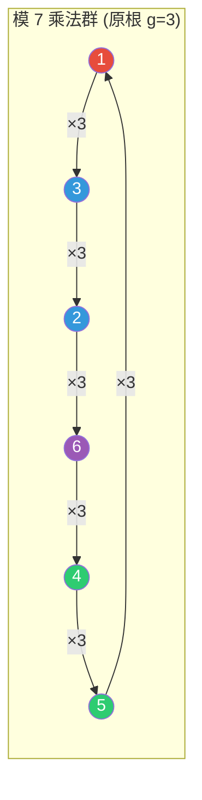

### 0.2 子群的层次结构（哈斯图）

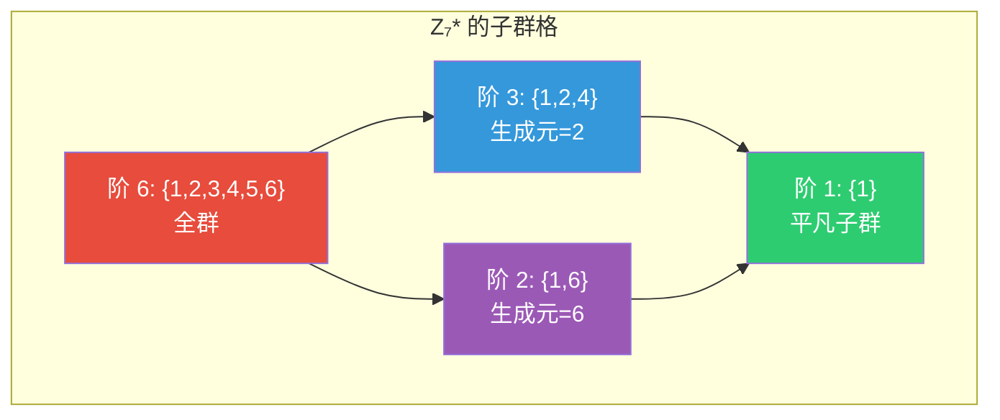

### 0.3 模 17 的子群链（2的幂次）

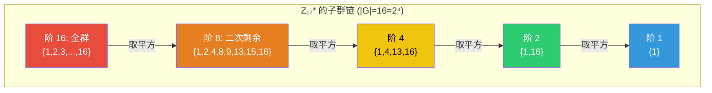

### 0.4 元素阶的分类

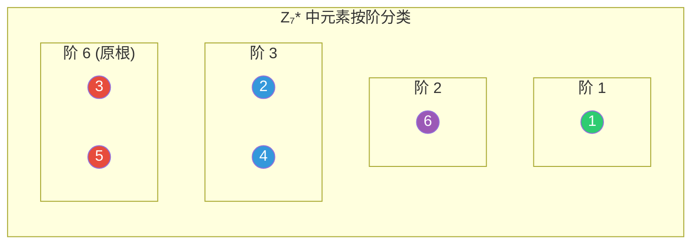

### 0.5 费马小定理的可视化

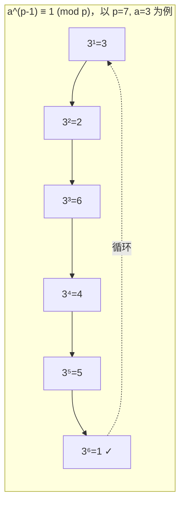

### 0.6 找 n 阶生成元的流程

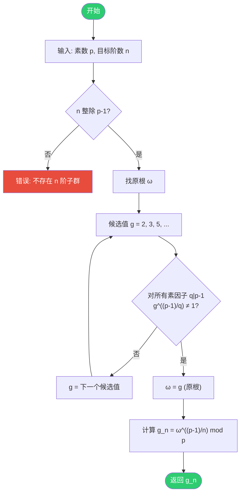

### 0.7 STARK 中的单位根使用

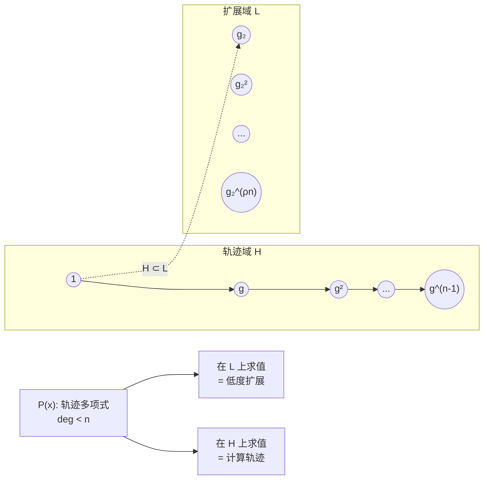

### 0.8 FFT 蝴蝶结构

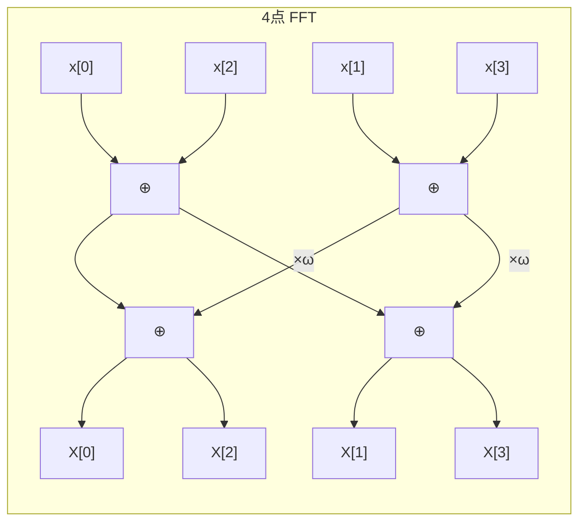

### 0.9 原根验证流程

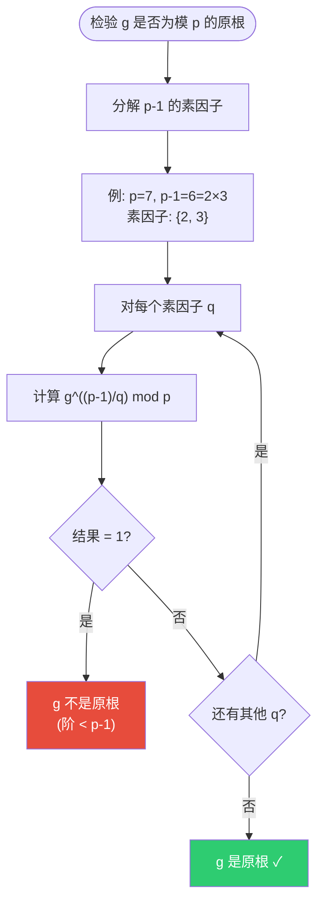

### 0.10 循环群的圆形流程图

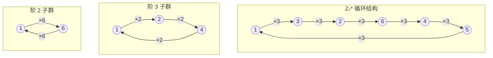

### 0.11 STARK 完整证明流程

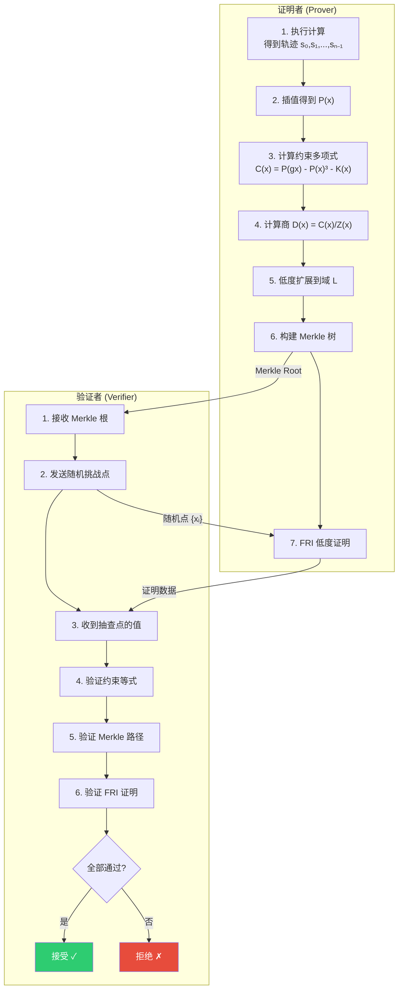

### 0.12 多项式承诺的对比

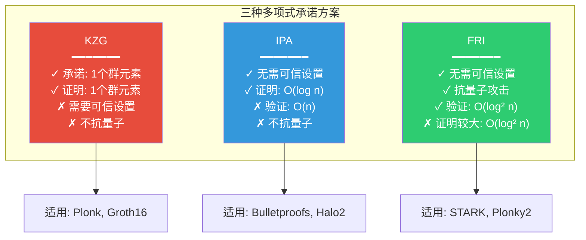

---

## 1. 循环群的圆形表示

### 1.1 基本思想

循环群的元素可以排列在**圆周**上，乘以生成元相当于**旋转**。

### 1.2 模 7 乘法群

$\mathbb{Z}_7^* = \{1, 2, 3, 4, 5, 6\}$，原根 $\omega = 3$

把 $3^k$ 按顺序排列在圆周上：

```
                    3⁰ = 1
                      ●
                    ╱   ╲
                  ╱       ╲
          3⁵ = 5 ●         ● 3¹ = 3
                 │         │
                 │         │
          3⁴ = 4 ●         ● 3² = 2
                  ╲       ╱
                    ╲   ╱
                      ●
                    3³ = 6
```

**操作解释**：
- 乘以 3 = 顺时针旋转 60°（转一格）
- 乘以 3² = 9 ≡ 2 = 顺时针旋转 120°（转两格）
- 乘以 3⁶ = 1 = 旋转 360°（回到原点）

### 1.3 用实际数值标注

```
                      1
                      ●
                    ╱   ╲
            ×3    ╱       ╲   ×3
                ╱           ╲
              5 ●             ● 3
                │             │
            ×3  │             │  ×3
                │             │
              4 ●             ● 2
                ╲           ╱
            ×3    ╲       ╱   ×3
                    ╲   ╱
                      ●
                      6
```

---

## 2. 子群的嵌套结构

### 2.1 模 7 的子群

$|G| = 6 = 2 \times 3$，子群阶数：$\{1, 2, 3, 6\}$

```
┌─────────────────────────────────────────────────────────┐
│                                                         │
│    阶 = 6 的群：{1, 2, 3, 4, 5, 6}（全群）              │
│                                                         │
│    ┌─────────────────────────────────────────────┐     │
│    │                                             │     │
│    │    阶 = 3 的子群：{1, 2, 4}                 │     │
│    │                                             │     │
│    │         1 ←─×2─→ 2 ←─×2─→ 4 ←─×2─→ 1       │     │
│    │                                             │     │
│    └─────────────────────────────────────────────┘     │
│                                                         │
│    ┌─────────────────────────────┐                     │
│    │                             │                     │
│    │    阶 = 2 的子群：{1, 6}    │                     │
│    │                             │                     │
│    │         1 ←──×6──→ 6        │                     │
│    │                             │                     │
│    └─────────────────────────────┘                     │
│                                                         │
│    ┌───────────────┐                                   │
│    │ 阶 = 1：{1}   │  （平凡子群）                     │
│    └───────────────┘                                   │
│                                                         │
└─────────────────────────────────────────────────────────┘
```

### 2.2 子群的圆形嵌套

```
                全群 G = {1,2,3,4,5,6}
                    ╭───────────────╮
                    │       1       │
                    │     ╱   ╲     │
                    │   5       3   │
                    │   │  ╭─╮  │   │
                    │   │  │1│  │   │  ← 阶 1 子群 {1}
                    │   │  ╰─╯  │   │
                    │   4       2   │
                    │     ╲   ╱     │
                    │       6       │
                    ╰───────────────╯

        阶 3 子群 {1,2,4}          阶 2 子群 {1,6}
            ╭───────╮                 ╭───────╮
            │   1   │                 │   1   │
            │  ╱ ╲  │                 │   │   │
            │ 4   2 │                 │   6   │
            ╰───────╯                 ╰───────╯
```

---

## 3. 凯莱图 (Cayley Graph)

### 3.1 什么是凯莱图？

凯莱图是群的"地图"：
- **节点** = 群的元素
- **边** = 乘以生成元的操作

### 3.2 $\mathbb{Z}_7^*$ 的凯莱图（生成元 = 3）

```
            ┌───────────────────────────────────────┐
            │                                       │
            │              1                        │
            │              │                        │
            │              │ ×3                     │
            │              ▼                        │
            │              3                        │
            │              │                        │
            │              │ ×3                     │
            │              ▼                        │
        ×3  │              2                        │
        ┌───┘              │                        │
        │                  │ ×3                     │
        ▼                  ▼                        │
        5 ◄────×3───────── 6                        │
        │                                           │
        │ ×3                                        │
        ▼                                           │
        4 ──────────────────────────────────────────┘
                           ×3
```

更清晰的圆形凯莱图：

```
                        1
                       ╱│╲
                      ╱ │ ╲
                     ╱  │  ╲
              ×3    ╱   │   ╲    
                   ╱    │    ╲
                  5     │     3
                  │╲    │    ╱│
                  │ ╲   │   ╱ │
              ×3  │  ╲  │  ╱  │ ×3
                  │   ╲ │ ╱   │
                  │    ╲│╱    │
                  4─────6─────2
                       ×3
                       
     箭头方向：1→3→2→6→4→5→1（乘以 3 的循环）
```

---

## 4. 乘法表的热力图

### 4.1 模 7 乘法表

```
×  │ 1  2  3  4  5  6
───┼──────────────────
1  │ 1  2  3  4  5  6
2  │ 2  4  6  1  3  5
3  │ 3  6  2  5  1  4
4  │ 4  1  5  2  6  3
5  │ 5  3  1  6  4  2
6  │ 6  5  4  3  2  1
```

### 4.2 用颜色/符号可视化

```
×  │ 1  2  3  4  5  6
───┼──────────────────
1  │ ①  ②  ③  ④  ⑤  ⑥
2  │ ②  ④  ⑥  ①  ③  ⑤
3  │ ③  ⑥  ②  ⑤  ①  ④
4  │ ④  ①  ⑤  ②  ⑥  ③
5  │ ⑤  ③  ①  ⑥  ④  ②
6  │ ⑥  ⑤  ④  ③  ②  ①

观察：
- 每行每列都是 {1,2,3,4,5,6} 的排列（拉丁方阵）
- 对角线 6×6=1, 5×5=4, ... 不一定对称
- 1 是单位元（第一行/列不变）
```

### 4.3 按阶着色

```
阶 1: ■ (黑)   元素: {1}
阶 2: █ (深灰) 元素: {6}        因为 6² = 36 ≡ 1
阶 3: ▓ (中灰) 元素: {2, 4}    因为 2³ = 8 ≡ 1
阶 6: ░ (浅灰) 元素: {3, 5}    原根

圆形图中按阶着色：

                    ■ 1 (阶1)
                      ●
                    ╱   ╲
                  ╱       ╲
          ░ 5   ●         ●   ░ 3 (阶6, 原根)
                 │         │
                 │         │
          ▓ 4   ●         ●   ▓ 2 (阶3)
                  ╲       ╱
                    ╲   ╱
                      ●
                    █ 6 (阶2)
```

---

## 5. 模 17 的更丰富结构

### 5.1 基本信息

$|\mathbb{Z}_{17}^*| = 16 = 2^4$

子群阶数：$\{1, 2, 4, 8, 16\}$

原根 $\omega = 3$

### 5.2 子群的层次结构（哈斯图）

```
                    {全部 16 个元素}
                          │
                         阶 16
                          │
                    ┌─────┴─────┐
                    │           │
                  阶 8        这里只有
                    │         一条链
                  阶 4        (因为 16=2⁴)
                    │
                  阶 2
                    │
                  阶 1
                  {1}
```

具体元素：

```
阶 16: {1,2,3,4,5,6,7,8,9,10,11,12,13,14,15,16} （全群）
   │
   │ 取平方
   ▼
阶 8:  {1,2,4,8,9,13,15,16}  （二次剩余）
   │
   │ 取平方
   ▼
阶 4:  {1,4,13,16}
   │
   │ 取平方
   ▼
阶 2:  {1,16}               （16 ≡ -1）
   │
   │ 取平方
   ▼
阶 1:  {1}
```

### 5.3 16 元素的圆形排列

按 $3^k$ 的顺序排列在圆周上：

```
                            3⁰=1
                              ●
                         ╱    │    ╲
                    3¹⁵=6     │     3¹=3
                      ●       │       ●
                   ╱          │          ╲
              3¹⁴=2           │           3²=9
                 ●            │            ●
              ╱               │               ╲
         3¹³=12               │               3³=10
            ●                 │                 ●
           ╱                  │                  ╲
      3¹²=4                   │                   3⁴=13
         ●────────────────────┼────────────────────●
           ╲                  │                  ╱
         3¹¹=7                │                3⁵=5
            ●                 │                 ●
              ╲               │               ╱
              3¹⁰=8           │           3⁶=15
                 ●            │            ●
                   ╲          │          ╱
                    3⁹=14     │     3⁷=11
                      ●       │       ●
                         ╲    │    ╱
                            3⁸=16
                              ●

    乘以 3 = 逆时针旋转 22.5°
    乘以 3⁸ = 16 = -1 = 旋转 180°（对径点）
```

### 5.4 子群的圆形嵌套视图

```
         阶 16（全群）               阶 8 子群              阶 4 子群
              1                          1                      1
            ╱ │ ╲                      ╱ │ ╲                    │
          6   │   3                  2   │   9                  │
         ╱    │    ╲                ╱    │    ╲                 │
        2     │     9              16    │    8                 │
       ╱      │      ╲              ╲    │    ╱            4 ───┼─── 13
      12      │      10              15  │  13                  │
     ╱        │        ╲              ╲  │  ╱                   │
    4 ────────┼──────── 13              4                       │
     ╲        │        ╱                                       16
      7       │       5
       ╲      │      ╱                阶 2 子群              阶 1
        8     │     15                    1                     1
         ╲    │    ╱                      │                     ●
          14  │  11                        │
            ╲ │ ╱                         16
              16
```

---

## 6. 单位根与复平面

### 6.1 复数 n 次单位根

在复平面上，$n$ 次单位根是单位圆上的 $n$ 等分点：

$$\omega_k = e^{2\pi i k/n} = \cos\frac{2\pi k}{n} + i\sin\frac{2\pi k}{n}$$

### 6.2 8 次单位根

```
                     Im
                      │
            ω₂       │       ω₁
         (-√2/2+i√2/2)     (√2/2+i√2/2)
               ╲      │      ╱
                 ╲    │    ╱
                   ╲  │  ╱
           ω₃ ──────● ─────── ω₀=1  ──→ Re
          (-1)        │   ╱      (1)
                   ╱  │  ╲
                 ╱    │    ╲
               ╱      │      ╲
            ω₄       │       ω₇
                     │
                    ω₅
                   (-i)

   8次单位根：ωₖ = e^(2πik/8) = e^(πik/4)
   
   ω₀ = 1
   ω₁ = (√2 + i√2)/2
   ω₂ = i
   ω₃ = (-√2 + i√2)/2
   ω₄ = -1
   ω₅ = (-√2 - i√2)/2
   ω₆ = -i
   ω₇ = (√2 - i√2)/2
```

### 6.3 有限域的类比

有限域 $\mathbb{F}_p$ 没有"圆"的几何概念，但**代数结构完全相同**：

| 复平面 | 有限域 $\mathbb{F}_{17}$ |
|--------|------------------------|
| $\omega = e^{2\pi i/8}$ | $g = 9$（8阶生成元） |
| $\omega^8 = 1$ | $9^8 = 1$ |
| $\omega^4 = -1$ | $9^4 = 16 \equiv -1$ |
| 单位圆上的点 | 子群中的元素 |
| 旋转 | 乘以生成元 |

---

## 7. FFT 的蝴蝶图

### 7.1 8 点 FFT 的结构

FFT 利用单位根的对称性，分治计算多项式求值。

```
输入              第1层           第2层           第3层          输出
(时域)           (分组)          (合并)          (合并)         (频域)

x[0] ──●────────────●────────────●────────────●── X[0]
       │            │╲          ╱│╲          ╱
x[4] ──●──────●     │ ╲        ╱ │ ╲        ╱
       │╲     │╲    │  ╲      ╱  │  ╲      ╱
x[2] ──●─╲────●─╲───●   ╲    ╱   │   ╲    ╱───── X[1]
       │  ╲   │  ╲  │╲   ╲  ╱    │    ╲  ╱
x[6] ──●───╲──●───╲─●─╲   ╲╱     │     ╲╱
       │    ╲ │    ╲│  ╲  ╱╲     │     ╱╲
x[1] ──●─────╲●─────●   ╲╱  ╲    │    ╱  ╲────── X[2]
       │      ╲     │   ╱╲   ╲   │   ╱    ╲
x[5] ──●──────●╲    │  ╱  ╲   ╲  │  ╱      ╲
       │╲     │ ╲   │ ╱    ╲   ╲ │ ╱        ╲
x[3] ──●─╲────●──╲──●╱      ╲   ╲│╱──────────●── X[3]
       │  ╲   │   ╲ │        ╲   ╲
x[7] ──●───╲──●────╲●         ╲  ╱╲
                                ╲╱  ╲
                                ╱╲   ╲──────────── X[4-7]
                               ╱  ╲
                              ...

每个交叉点使用单位根 ω 进行"蝴蝶运算"：
    a ──●──── a + ωᵏb
        │╲
    b ──●─╲── a - ωᵏb
          
```

### 7.2 蝴蝶运算详解

```
        ┌─────────────────────────────────────┐
        │           蝴蝶运算                   │
        │                                     │
        │    输入        操作         输出     │
        │                                     │
        │     a ────────┬────────→ a + ωᵏ·b  │
        │               │                     │
        │               × ωᵏ                  │
        │               │                     │
        │     b ────────┴────────→ a - ωᵏ·b  │
        │                                     │
        │   其中 ω = n次单位根的生成元         │
        └─────────────────────────────────────┘
```

---

## 8. Python 绘图代码

### 8.1 绘制循环群的圆形图

```python
import matplotlib.pyplot as plt
import numpy as np

def plot_cyclic_group(p, generator=None):
    """
    绘制模 p 乘法群的圆形图
    """
    # 找原根
    if generator is None:
        for g in range(2, p):
            powers = set()
            val = 1
            for _ in range(p-1):
                val = (val * g) % p
                powers.add(val)
            if len(powers) == p - 1:
                generator = g
                break
    
    # 计算元素顺序
    elements = []
    val = 1
    for i in range(p - 1):
        elements.append(val)
        val = (val * generator) % p
    
    n = len(elements)
    angles = [2 * np.pi * i / n - np.pi/2 for i in range(n)]
    
    # 绘图
    fig, ax = plt.subplots(1, 1, figsize=(10, 10))
    ax.set_aspect('equal')
    
    # 画圆
    theta = np.linspace(0, 2*np.pi, 100)
    ax.plot(np.cos(theta), np.sin(theta), 'lightgray', linewidth=1)
    
    # 画点和标签
    for i, (elem, angle) in enumerate(zip(elements, angles)):
        x, y = np.cos(angle), np.sin(angle)
        ax.scatter(x, y, s=300, c='steelblue', zorder=5)
        ax.annotate(f'{elem}', (x, y), ha='center', va='center', 
                   fontsize=12, color='white', fontweight='bold')
        
        # 外部标注幂次
        ax.annotate(f'$g^{{{i}}}$', (1.2*x, 1.2*y), ha='center', va='center',
                   fontsize=10, color='gray')
    
    # 画箭头表示乘以生成元
    for i in range(n):
        x1, y1 = 0.85*np.cos(angles[i]), 0.85*np.sin(angles[i])
        x2, y2 = 0.85*np.cos(angles[(i+1)%n]), 0.85*np.sin(angles[(i+1)%n])
        ax.annotate('', xy=(x2, y2), xytext=(x1, y1),
                   arrowprops=dict(arrowstyle='->', color='coral', lw=1.5))
    
    ax.set_xlim(-1.5, 1.5)
    ax.set_ylim(-1.5, 1.5)
    ax.set_title(f'$\\mathbb{{Z}}_{{{p}}}^*$ 的循环结构 (生成元 g={generator})', fontsize=14)
    ax.axis('off')
    
    plt.tight_layout()
    plt.savefig(f'cyclic_group_Z{p}.png', dpi=150, bbox_inches='tight')
    plt.show()

# 绘制模 7 和模 17
plot_cyclic_group(7)
plot_cyclic_group(17)
```

### 8.2 绘制子群嵌套图

```python
def plot_subgroups(p):
    """绘制子群的嵌套结构"""
    from collections import defaultdict
    
    # 找原根
    def find_primitive_root(p):
        for g in range(2, p):
            powers = set()
            val = 1
            for _ in range(p-1):
                val = (val * g) % p
                powers.add(val)
            if len(powers) == p - 1:
                return g
        return None
    
    g = find_primitive_root(p)
    n = p - 1
    
    # 找所有因子（子群的阶）
    divisors = [d for d in range(1, n+1) if n % d == 0]
    
    # 为每个因子构造子群
    subgroups = {}
    for d in divisors:
        gen = pow(g, n // d, p)  # d 阶生成元
        subgroup = set()
        val = 1
        for _ in range(d):
            subgroup.add(val)
            val = (val * gen) % p
        subgroups[d] = sorted(subgroup)
    
    # 打印结构
    print(f"模 {p} 乘法群的子群结构:")
    print(f"原根 g = {g}")
    print(f"群的阶 = {n}")
    print()
    
    for d in sorted(divisors, reverse=True):
        gen = pow(g, n // d, p)
        print(f"阶 {d:2d} 子群: 生成元={gen:2d}, 元素={subgroups[d]}")
    
    return subgroups

subgroups_7 = plot_subgroups(7)
print()
subgroups_17 = plot_subgroups(17)
```

### 8.3 绘制单位根（复平面）

```python
import matplotlib.pyplot as plt
import numpy as np

def plot_roots_of_unity(n):
    """绘制 n 次单位根"""
    fig, ax = plt.subplots(figsize=(8, 8))
    ax.set_aspect('equal')
    
    # 单位圆
    theta = np.linspace(0, 2*np.pi, 100)
    ax.plot(np.cos(theta), np.sin(theta), 'lightgray', linewidth=1)
    
    # 坐标轴
    ax.axhline(y=0, color='gray', linewidth=0.5)
    ax.axvline(x=0, color='gray', linewidth=0.5)
    
    # n 次单位根
    for k in range(n):
        angle = 2 * np.pi * k / n
        x, y = np.cos(angle), np.sin(angle)
        ax.scatter(x, y, s=200, c='steelblue', zorder=5)
        ax.annotate(f'$\\omega_{{{k}}}$', (1.15*x, 1.15*y), 
                   ha='center', va='center', fontsize=12)
    
    # 连线显示循环
    for k in range(n):
        angle1 = 2 * np.pi * k / n
        angle2 = 2 * np.pi * ((k+1) % n) / n
        x1, y1 = np.cos(angle1), np.sin(angle1)
        x2, y2 = np.cos(angle2), np.sin(angle2)
        ax.plot([x1, x2], [y1, y2], 'coral', linewidth=1, alpha=0.5)
    
    ax.set_xlim(-1.5, 1.5)
    ax.set_ylim(-1.5, 1.5)
    ax.set_xlabel('Re', fontsize=12)
    ax.set_ylabel('Im', fontsize=12)
    ax.set_title(f'{n} 次单位根 ($\\omega_k = e^{{2\\pi ik/{n}}}$)', fontsize=14)
    
    plt.tight_layout()
    plt.savefig(f'roots_of_unity_{n}.png', dpi=150)
    plt.show()

plot_roots_of_unity(8)
plot_roots_of_unity(12)
```

---

## 9. 交互式可视化网站推荐

1. **Group Explorer** - https://nathancarter.github.io/group-explorer/
   - 可视化各种有限群
   - 显示凯莱表、凯莱图、循环图

2. **Wolfram Alpha** - https://www.wolframalpha.com/
   - 输入 `cyclic group of order 6`
   - 显示群的基本信息和图示

3. **3Blue1Brown 视频**
   - "Group theory, abstraction, and the 196,883-dimensional monster"
   - 非常直观的群论可视化

---

## 10. 总结：直觉与图示的对应

```
┌────────────────────────────────────────────────────────────────────┐
│                    群论概念的可视化对应                             │
├────────────────────────────────────────────────────────────────────┤
│                                                                    │
│   群元素        →    圆周上的点                                    │
│                                                                    │
│   群运算（乘法） →    旋转                                         │
│                                                                    │
│   单位元 1      →    圆周的起点                                    │
│                                                                    │
│   元素的阶      →    回到起点需要的旋转次数                         │
│                                                                    │
│   原根          →    最小旋转角度（一次经过一格）                   │
│                                                                    │
│   子群          →    圆周上等间距的点构成的子集                     │
│                                                                    │
│   子群的阶      →    子集的大小                                    │
│                                                                    │
│   n 阶子群的生成元 → 每次跳 (全群阶/n) 格                          │
│                                                                    │
├────────────────────────────────────────────────────────────────────┤
│                                                                    │
│        1                    乘以 g = 顺时针转一格                  │
│        ●                                                           │
│      ╱   ╲                  乘以 g² = 转两格                       │
│    5       3                                                       │
│    │   ⊙   │                乘以 g⁶ = 1 = 转一圈回到起点           │
│    4       2                                                       │
│      ╲   ╱                  阶 = 回到 1 的最小步数                  │
│        6                                                           │
│                                                                    │
└────────────────────────────────────────────────────────────────────┘
```

**记住这个核心直觉**：

> 循环群就像一个钟表，乘以生成元就是拨动指针。
> 
> 原根是"一次拨一格"的最小单位。
> 
> 子群是"隔几格取一个点"形成的子钟表。

---

## 参考资料

- [Visual Group Theory](https://www.maa.org/press/maa-reviews/visual-group-theory) - Nathan Carter
- [Group Explorer](https://nathancarter.github.io/group-explorer/)
- [3Blue1Brown - Group Theory](https://www.youtube.com/watch?v=mH0oCDa74tE)
